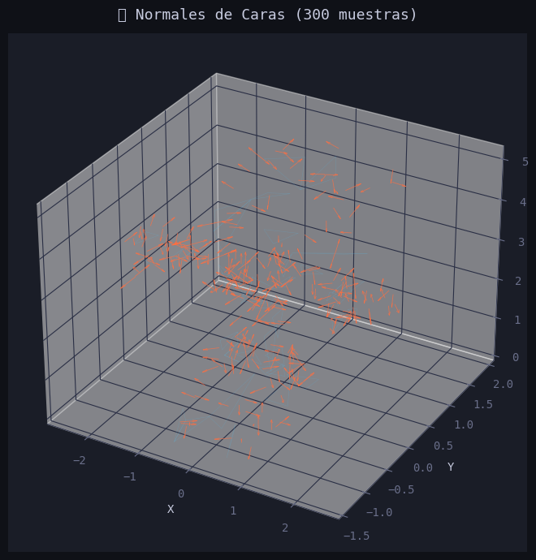
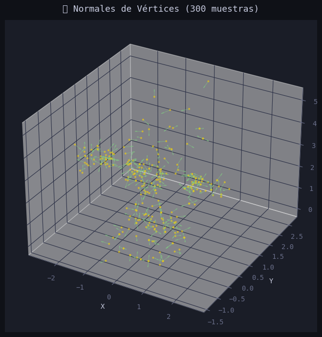
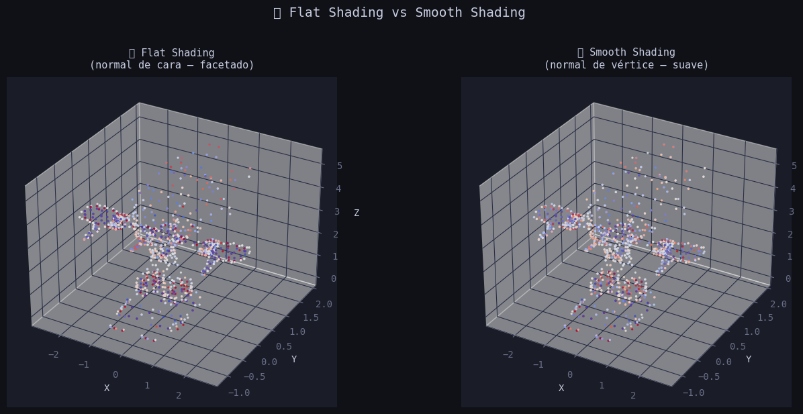
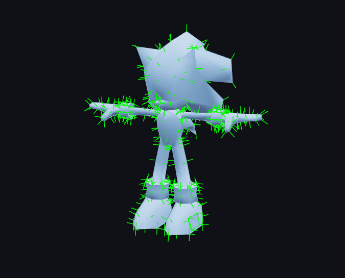
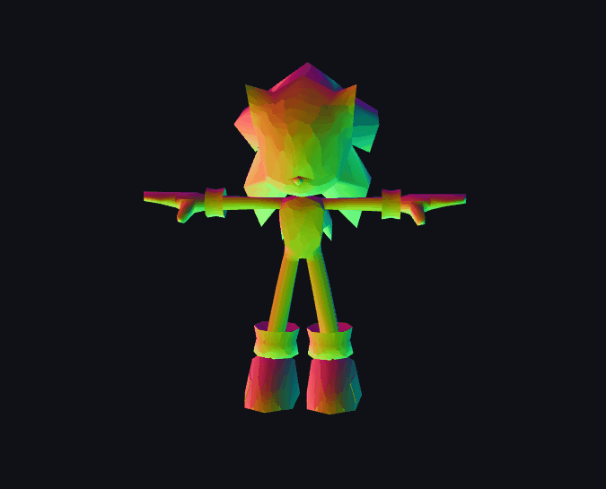
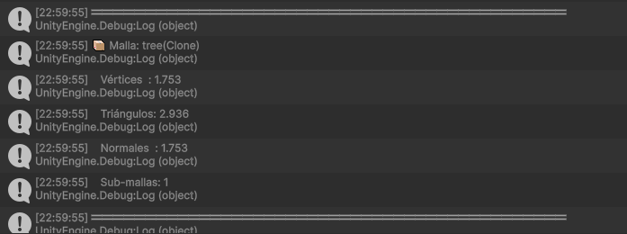

# Taller Calculo Visualizacion Normales

**Nombre del estudiante:** Diego Alberto Romero Olmos
**Fecha de entrega:** 21 de febrero de 2026  
**Repositorio:** semana_3_3_calculo_visualizacion_normales

---

## Descripción breve

El objetivo de este taller fue calcular vectores normales de superficies 3D y utilizarlos para iluminación correcta, comprendiendo la diferencia entre normales de vértices y caras, smooth shading vs flat shading, y visualizando normales para debugging. Se implementó en tres entornos distintos: Python con trimesh y numpy para el análisis matemático, Unity para la visualización y manipulación en tiempo real sobre un modelo importado, y Three.js con React Three Fiber para la visualización interactiva en el navegador con shaders personalizados.

---

## Implementaciones

### 🐍 Python — Google Colab

Implementado en un notebook de Google Colab usando `trimesh`, `numpy`, `matplotlib` y `vedo`. Se trabajó sobre un modelo GLB propio cargado en Colab.

- **Carga del modelo:** el archivo GLB se carga con `trimesh.load()`. Si contiene múltiples geometrías (escena GLTF), se concatenan en una sola malla para análisis uniforme.
- **Normales de caras (manual):** se calcularon mediante producto cruz de las dos aristas de cada triángulo. Los vértices A, B, C se extraen vectorizando con numpy sobre `mesh.faces`, luego `np.cross(B-A, C-A)` produce la normal de cada cara, que se normaliza dividiendo por su magnitud. Se comparó con `mesh.face_normals` de trimesh obteniendo diferencia máxima del orden de `1e-15` (precisión numérica).
- **Normales de vértices (manual):** se acumulan las normales de todas las caras adyacentes a cada vértice y se normaliza el resultado. Se comparó con `mesh.vertex_normals` de trimesh.
- **Flat vs Smooth Shading:** se simularon coloreando los centroides de cada cara según la componente Z de la normal de cara (flat) o la normal interpolada de los tres vértices (smooth), visualizados lado a lado con matplotlib.
- **Validación:** se verificó magnitud unitaria, se detectaron normales invertidas mediante producto punto con el vector centroide→cara, se aplicó corrección automática y se analizó consistencia entre caras adyacentes con tabla resumen en pandas.
- **Vedo:** visualización 3D offscreen con flat y smooth shading renderizados con iluminación real, y flechas de normales sobre la malla semitransparente.

**Herramientas:** `trimesh`, `numpy`, `matplotlib`, `vedo`, `pandas`, `pygltflib`

---

### 🎮 Unity — Unity 3D (LTS)

Escena Unity con un modelo FBX (árbol) y un script C# `NormalesController` adjunto directamente al objeto con `MeshFilter`.

- **Acceso a normales:** `mesh.normals` devuelve el array de normales de vértice de Unity. Se imprimieron las primeras 5 en consola con su magnitud para verificar que son unitarias.
- **Cálculo manual:** se recorrieron los triángulos de `mesh.triangles` en grupos de 3, calculando el producto cruz de las aristas `(B-A)` y `(C-A)` con `Vector3.Cross()`, acumulando la normal en cada vértice adyacente y normalizando al final — el mismo algoritmo que Python.
- **RecalculateNormals:** `mesh.RecalculateNormals()` recalcula las normales usando el algoritmo interno de Unity, imprimiendo la matriz resultante en consola.
- **Gizmos:** `OnDrawGizmosSelected()` dibuja líneas desde cada vértice en la dirección de su normal, con longitud y color configurables desde el Inspector. Visibles en la vista Scene con el objeto seleccionado y Gizmos activado.
- **Flat vs Smooth:** comparación visual lado a lado con dos instancias del modelo — `Tree` (smooth, material verde) y `Tree_Flat` (flat, material azul) — demostrando la diferencia de iluminación entre ambos modos.
- **Controles de teclado:** N (toggle normales), M (normales manuales), R (recalcular), F (flat/smooth), O (restaurar).

**Herramientas:** `Unity 3D`, `C#`, `MeshFilter`, `Gizmos`, `Input System`

---

### 🌐 Three.js — React Three Fiber

Aplicación web con Vite + React + React Three Fiber que carga el modelo GLB y permite explorar las normales en tiempo real con controles Leva.

- **Carga del modelo:** `useGLTF('/modelo.glb')` carga la escena GLTF. Se recorre con `scene.traverse()` para encontrar la primera malla y acceder a `geometry.attributes.normal` y `geometry.attributes.position`.
- **Tipos de normales:** cuatro modos controlados desde Leva:
  - `Originales`: normales del archivo GLB sin modificar.
  - `Smooth`: `geometry.computeVertexNormals()` promedia normales entre caras adyacentes.
  - `Flat`: se calcula la normal de cada cara con producto cruz y se asigna a los tres vértices del triángulo — sin interpolar entre caras.
  - `Manuales`: implementación propia del producto cruz usando `THREE.Vector3`, acumulando y normalizando por vértice, equivalente al cálculo Python.
- **VertexNormalsHelper:** `VertexNormalsHelper` de `three/examples/jsm` dibuja líneas verdes desde cada vértice en la dirección de su normal. Tamaño configurable con slider.
- **Normal Map Shader:** material `ShaderMaterial` personalizado que colorea la malla según la dirección de cada normal: X→Rojo, Y→Verde, Z→Azul. La conversión `normal * 0.5 + 0.5` mapea el rango `[-1,1]` a `[0,1]` para visualizarlo como color RGB.
- **Panel de info:** muestra en tiempo real el conteo de vértices, triángulos y normales de la malla cargada.

**Herramientas:** `three`, `@react-three/fiber`, `@react-three/drei`, `leva`, `VertexNormalsHelper`, `ShaderMaterial`

---

## Resultados visuales

### Python

**Normales de caras — flechas naranjas sobre la malla**



**Normales de vértices — flechas verdes por vértice**



**Flat Shading vs Smooth Shading lado a lado**



---

### Three.js

**VertexNormalsHelper — líneas de normales sobre el modelo**



**Normal Map Shader — modelo coloreado según dirección de normales**



---

### Unity

**Modelo con datos de malla y Gizmos de normales**



**Comparación flat vs smooth y visualización de normales con Gizmos**


---

## Código relevante

### Python — Cálculo vectorizado de normales de caras con numpy

```python
# Extraemos los tres vértices de cada triángulo de forma vectorizada
A = vertices[caras[:, 0]]  # (M, 3)
B = vertices[caras[:, 1]]  # (M, 3)
C = vertices[caras[:, 2]]  # (M, 3)

v1 = B - A   # arista AB
v2 = C - A   # arista AC

# Producto cruz: perpendicular al plano del triángulo
normales_caras_raw = np.cross(v1, v2)   # (M, 3)

# Normalizamos dividiendo por la magnitud
magnitudes = np.linalg.norm(normales_caras_raw, axis=1, keepdims=True)
magnitudes = np.where(magnitudes == 0, 1, magnitudes)
normales_caras_manual = normales_caras_raw / magnitudes
```

### Python — Detección de normales invertidas

```python
# Una normal apunta hacia afuera si su producto punto con el
# vector (centroide_cara - centroide_modelo) es positivo
centroide_modelo = mesh.centroid
vectores_afuera  = centros_caras - centroide_modelo
dot_products = np.einsum('ij,ij->i', normales_caras_manual, vectores_afuera)
n_invertidas = np.sum(dot_products < 0)
```

### Unity — Cálculo manual de normales desde mesh.triangles

```csharp
for (int i = 0; i < triangulos.Length; i += 3)
{
    int idxA = triangulos[i];
    int idxB = triangulos[i + 1];
    int idxC = triangulos[i + 2];

    Vector3 v1 = vertices[idxB] - vertices[idxA];
    Vector3 v2 = vertices[idxC] - vertices[idxA];
    Vector3 normalCara = Vector3.Cross(v1, v2).normalized;

    // Acumulamos en los 3 vértices del triángulo
    normalesManuales[idxA] += normalCara;
    normalesManuales[idxB] += normalCara;
    normalesManuales[idxC] += normalCara;
}

// Normalizamos cada normal de vértice
for (int i = 0; i < normalesManuales.Length; i++)
    normalesManuales[i] = normalesManuales[i].normalized;
```

### Unity — Visualización de normales con Gizmos

```csharp
void OnDrawGizmosSelected()
{
    Mesh m = Application.isPlaying
        ? mesh
        : GetComponent<MeshFilter>()?.sharedMesh;

    if (m == null) return;

    int paso = Mathf.Max(1, m.vertices.Length / maxNormalesVisibles);

    for (int i = 0; i < m.vertices.Length; i += paso)
    {
        Vector3 posicionMundo = transform.TransformPoint(m.vertices[i]);
        Vector3 normalMundo   = transform.TransformDirection(m.normals[i]);
        Gizmos.color = colorNormalVertice;
        Gizmos.DrawLine(posicionMundo, posicionMundo + normalMundo * longitudNormal);
    }
}
```

### Three.js — Normal Map Shader

```glsl
// Vertex shader
varying vec3 vNormal;
void main() {
  vNormal = normalize(normalMatrix * normal);
  gl_Position = projectionMatrix * modelViewMatrix * vec4(position, 1.0);
}

// Fragment shader
varying vec3 vNormal;
void main() {
  // Convertimos normal de [-1,1] a [0,1] para visualizar como color
  // X → Rojo, Y → Verde, Z → Azul
  vec3 color = normalize(vNormal) * 0.5 + 0.5;
  gl_FragColor = vec4(color, 1.0);
}
```

### Three.js — Cálculo manual de normales con producto cruz

```javascript
const procesarTriangulo = (iA, iB, iC) => {
  vA.fromBufferAttribute(posiciones, iA)
  vB.fromBufferAttribute(posiciones, iB)
  vC.fromBufferAttribute(posiciones, iC)

  v1.subVectors(vB, vA)
  v2.subVectors(vC, vA)
  normalCara.crossVectors(v1, v2).normalize()

  // Acumulamos en los 3 vértices del triángulo
  for (const idx of [iA, iB, iC]) {
    normalesAcum[idx * 3]     += normalCara.x
    normalesAcum[idx * 3 + 1] += normalCara.y
    normalesAcum[idx * 3 + 2] += normalCara.z
  }
}
```

---

## Prompts utilizados

Este taller fue desarrollado con asistencia de IA generativa (Claude):

- *"Implementar cálculo de normales de caras y vértices con numpy, comparación flat vs smooth, validación de normales invertidas y visualización con vedo en Colab"* → generó el notebook completo con las 7 secciones.
- *"Crear script C# para acceder a mesh.normals, calcular normales manualmente desde mesh.triangles, recalcular con RecalculateNormals() y dibujar con Gizmos"* → generó `NormalesController.cs`.
- *"El script usa Input.GetKeyDown pero Unity tiene el nuevo Input System activado"* → llevó a reemplazar con `UnityEngine.InputSystem.Keyboard.current`.
- *"Not allowed to access triangles/indices on mesh — isReadable is false"* → llevó a activar Read/Write Enabled en la configuración de importación del FBX.
- *"Cargar modelo GLB en Three.js, acceder a geometry.attributes.normal, implementar VertexNormalsHelper, shader de normales y cuatro modos de cálculo de normales con controles Leva"* → generó el `App.jsx` completo.

---

## Aprendizajes y dificultades

**Aprendizajes principales:**

El aprendizaje más importante fue entender que una normal no es solo un dato decorativo sino el vector que determina completamente cómo se ilumina cada punto de una superficie. La diferencia entre flat y smooth shading es pura matemática: en flat shading todos los píxeles de un triángulo comparten la misma normal (la de la cara), produciendo un color uniforme y bordes visibles. En smooth shading las normales se interpolan entre vértices a lo largo de la superficie, produciendo transiciones continuas que hacen que una malla de triángulos planos parezca una superficie curva suave.

El normal map shader en Three.js fue especialmente revelador: ver el modelo coloreado en RGB según la dirección de sus normales (rojo=X, verde=Y, azul=Z) hace completamente visible la geometría de las normales de una forma que los números no transmiten. Es exactamente la misma técnica que usan los motores de videojuegos para depurar normales.

Otro aprendizaje fue la equivalencia matemática entre los tres entornos: el producto cruz `np.cross(v1, v2)` en Python, `Vector3.Cross(v1, v2)` en Unity y `normalCara.crossVectors(v1, v2)` en Three.js producen exactamente el mismo resultado. El algoritmo es el mismo, solo cambia la sintaxis.

**Dificultades encontradas:**

En Unity la principal dificultad fue el error `isReadable is false` al intentar acceder a `mesh.triangles` y `mesh.normals` desde código. Unity por defecto no permite acceso en runtime a los datos internos de una malla importada — hay que activar explícitamente **Read/Write Enabled** en las opciones de importación del FBX. Sin este flag, el script compila sin errores pero falla en ejecución.

La segunda dificultad fue el nuevo **Input System** de Unity que reemplaza `Input.GetKeyDown` por `UnityEngine.InputSystem.Keyboard.current.xKey.wasPressedThisFrame`. El error solo aparece en runtime y no en compilación, lo que lo hace difícil de detectar sin conocer el sistema.

En Three.js la dificultad fue manejar el `VertexNormalsHelper` correctamente en el ciclo de vida de React — al cambiar el modo de normales había que eliminar el helper anterior y crear uno nuevo, lo que requirió limpiar la escena con `threeScene.remove()` en el `useEffect` de cleanup.