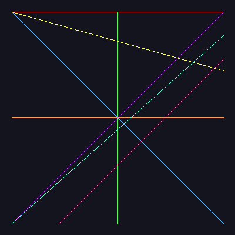
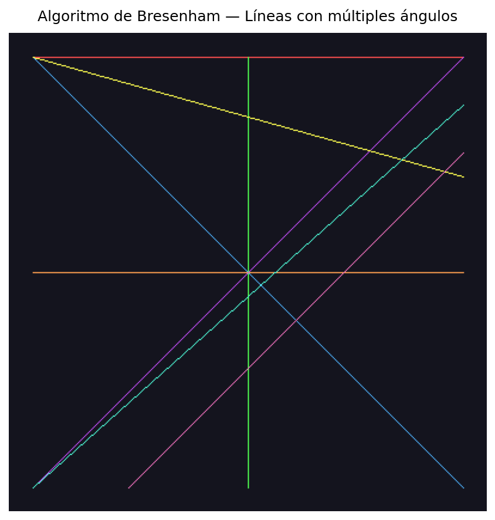
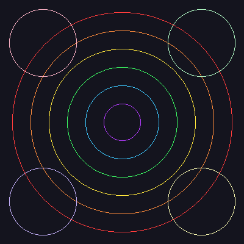
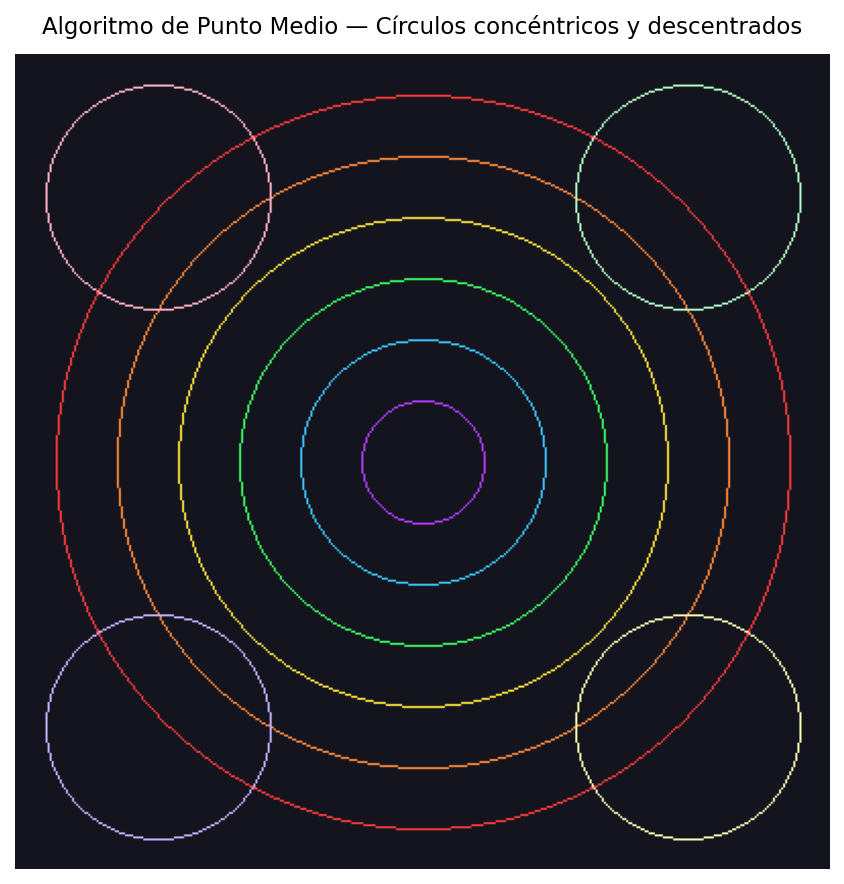
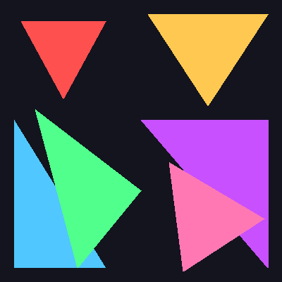
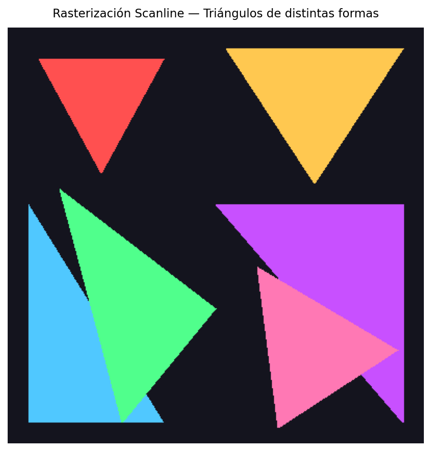
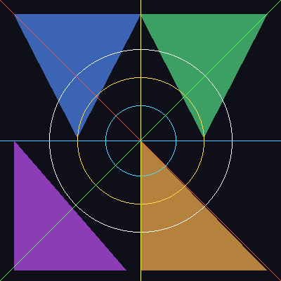
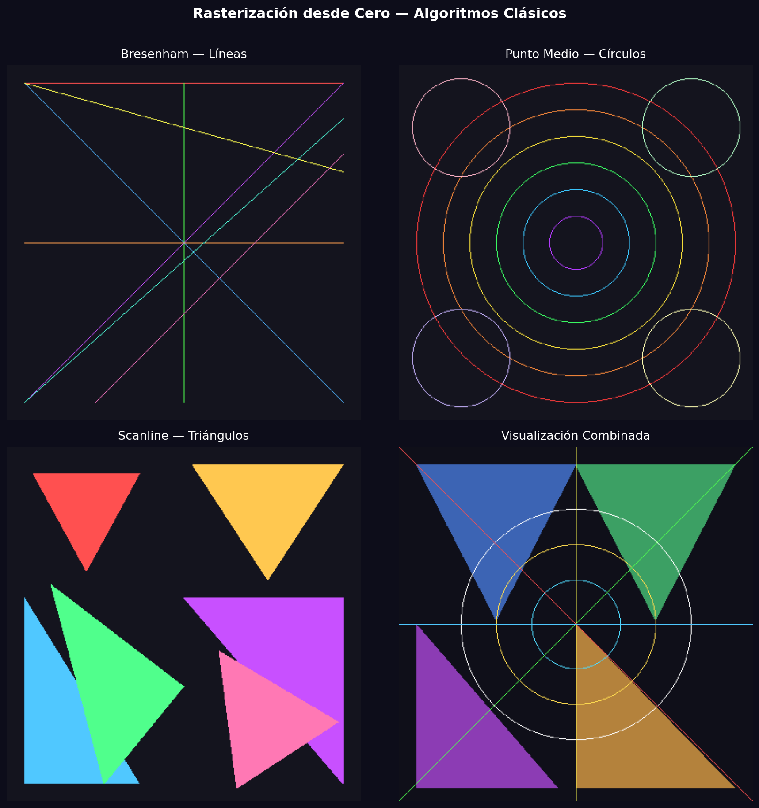

# Taller Algoritmos Rasterizacion Basica

**Estudiante:** 
- Joan Sebastian Roberto Puerto
- Baruj Vladimir Ramírez Escalante
- Diego Alberto Romero Olmos
- Maicol Sebastian Olarte Ramirez
- Jorge Isaac Alandete Díaz
**Fecha de entrega:** 9 de marzo, 2026

---

## 📋 Descripción breve

En este taller se implementaron los **algoritmos clásicos de rasterización** para primitivas gráficas fundamentales: líneas, círculos y triángulos, construyendo imágenes píxel a píxel **sin usar librerías de alto nivel** de dibujo.

El objetivo principal fue comprender cómo se generan formas geométricas básicas en una imagen digital, entendiendo la base matemática de cada método y su eficiencia computacional.

Herramientas utilizadas: **Python** con `Pillow`, `NumPy` y `Matplotlib`.

---

## 🛠️ Implementaciones

### Entorno Python (Jupyter Notebook)

**Archivo principal:** `python/dibujando_algoritmos_clasicos.ipynb`

**Herramientas:**
- `Pillow` — creación y escritura directa de píxeles
- `NumPy` — soporte para operaciones matriciales
- `Matplotlib` — visualización y exportación de resultados

---

#### 1. Algoritmo de Bresenham — Rasterización de Líneas

El **Algoritmo de Bresenham** (Jack Elton Bresenham, 1965) traza líneas usando exclusivamente aritmética entera.

**Fundamento:** Mantiene un error acumulado `err = dx - dy` y en cada paso decide si avanzar en X, en Y, o en ambos:
- Si `2·err > -dy` → avanza en X
- Si `2·err < dx`  → avanza en Y

**Complejidad:** O(max(dx, dy)) — un paso por píxel dominante.

**Demostración:** 8 líneas con diferentes pendientes (0°, 45°, 90°, baja, pronunciada, asimétrica) sobre canvas oscuro.

---

#### 2. Algoritmo de Punto Medio — Rasterización de Círculos

El **Algoritmo de Punto Medio** aprovecha la simetría de 8 octantes del círculo para calcular solo 1/8 de los puntos con aritmética entera.

**Fundamento:** Parte en `(r, 0)` y usa un parámetro de decisión `p = 1 - r`:
- `p ≤ 0`: el punto medio está dentro → solo incrementa Y
- `p > 0`: el punto medio está fuera → decrementa X y avanza Y

Cada punto `(x, y)` calculado se refleja en los 8 octantes: `(±x, ±y)` y `(±y, ±x)`.

**Complejidad:** O(r) — ~r/√2 iteraciones.

**Demostración:** 6 anillos concéntricos con gradiente de color + 4 círculos descentrados en las esquinas.

---

#### 3. Rasterización Scanline — Rellenado de Triángulos

La **Rasterización Scanline** rellena triángulos barriendo el interior fila a fila (*scan line*).

**Fundamento:**
1. Ordenar los 3 vértices de arriba hacia abajo por Y
2. Para cada fila, interpolar los bordes izquierdo y derecho: $x(y) = x_0 + (x_1 - x_0) \cdot \frac{y - y_0}{y_1 - y_0}$
3. Pintar todos los píxeles entre `x_izquierdo` y `x_derecho`

**Complejidad:** O(área) — rellena cada píxel exactamente una vez.

**Demostración:** 6 triángulos de distintas geometrías: isósceles, equilátero aproximado, rectángulos (ambas orientaciones) y escalenos.

---

## 📸 Resultados visuales

### Algoritmo de Bresenham — Líneas


*Canvas 400×400 con 8 líneas de diferentes pendientes trazadas con el algoritmo de Bresenham.*


*Visualización con título etiquetado del resultado de Bresenham.*

---

### Algoritmo de Punto Medio — Círculos


*Círculos concéntricos con gradiente de colores (radios 30–180) y 4 círculos descentrados en esquinas.*


*Visualización etiquetada del resultado del algoritmo de punto medio.*

---

### Rasterización Scanline — Triángulos


*6 triángulos rellenos de distintas geometrías: isósceles, equilátero, rectángulos y escalenos.*


*Visualización etiquetada del resultado scanline.*

---

### Visualización Combinada


*Canvas con triángulos de fondo, círculos concéntricos superpuestos y líneas de Bresenham cruzadas.*


*Grid 2×2 comparando los 3 algoritmos individuales más la visualización combinada.*

---

## 💻 Código relevante

### Algoritmo de Bresenham

```python
def bresenham(pixels, x0, y0, x1, y1, color=(255, 0, 0)):
    dx = abs(x1 - x0)
    dy = abs(y1 - y0)
    sx = 1 if x0 < x1 else -1
    sy = 1 if y0 < y1 else -1
    err = dx - dy

    while True:
        if 0 <= x0 < WIDTH and 0 <= y0 < HEIGHT:
            pixels[x0, y0] = color
        if x0 == x1 and y0 == y1:
            break
        e2 = 2 * err
        if e2 > -dy:
            err -= dy
            x0 += sx
        if e2 < dx:
            err += dx
            y0 += sy
```

### Algoritmo de Punto Medio

```python
def midpoint_circle(pixels, x0, y0, radius, color=(0, 100, 255)):
    x = radius
    y = 0
    p = 1 - radius

    while x >= y:
        for dx, dy in [(x, y), (y, x), (-x, y), (-y, x),
                       (-x, -y), (-y, -x), (x, -y), (y, -x)]:
            px, py = x0 + dx, y0 + dy
            if 0 <= px < WIDTH and 0 <= py < HEIGHT:
                pixels[px, py] = color
        y += 1
        if p <= 0:
            p = p + 2 * y + 1
        else:
            x -= 1
            p = p + 2 * y - 2 * x + 1
```

### Rasterización Scanline (Triángulos)

```python
def fill_triangle(pixels, p1, p2, p3, color=(0, 200, 80)):
    pts = sorted([p1, p2, p3], key=lambda p: p[1])
    (x1, y1), (x2, y2), (x3, y3) = pts

    def interpolate(ya, yb, xa, xb):
        if yb == ya:
            return []
        return [int(xa + (xb - xa) * (y - ya) / (yb - ya)) for y in range(ya, yb)]

    x12 = interpolate(y1, y2, x1, x2)
    x23 = interpolate(y2, y3, x2, x3)
    x13 = interpolate(y1, y3, x1, x3)
    x_combined = x12 + x23

    for y, xl, xr in zip(range(y1, y3), x13, x_combined):
        for x in range(min(xl, xr), max(xl, xr) + 1):
            if 0 <= x < WIDTH and 0 <= y < HEIGHT:
                pixels[x, y] = color
```

---

## 🤖 Prompts utilizados

Se utilizó IA generativa (GitHub Copilot) como apoyo en las siguientes tareas:

1. **Revisión de implementaciones:** "Revisa mi implementación del algoritmo de Bresenham y sugiere mejoras para hacerla más robusta y legible."
2. **Teoría algorítmica:** "Explica el fundamento matemático del algoritmo de punto medio para círculos y por qué aprovecha la simetría de 8 octantes."
3. **Estructura del notebook:** "Mejora la estructura del notebook añadiendo fundamentos teóricos, múltiples ejemplos de demostración y visualizaciones combinadas."
4. **Código de visualización:** "Genera código para crear un grid comparativo 2×2 de todas las primitivas implementadas con fondo oscuro."

---

## 📚 Aprendizajes y dificultades

### Aprendizajes

1. **Entender la imagen como grilla de píxeles** fue clave. Cada algoritmo opera en coordenadas enteras `(x, y)` dentro de un sistema discreto, lo que explica por qué la eficiencia en aritmética entera es tan importante.

2. **Elegancia del error acumulado (Bresenham):** convertir una decisión continua (¿dónde cae la línea ideal?) en una decisión discreta (¿qué píxel pintar?) usando solo una variable entera es matemáticamente brillante.

3. **La simetría es poder:** el algoritmo de punto medio calcula solo ~r/√2 puntos en lugar de los 2πr del círculo completo, reduciendo el trabajo al 12.5%. Este principio de explotar simetrías es fundamental en gráficos.

4. **Scanline como fundamento GPU:** la rasterización por scanline es la base directa de cómo las GPUs modernas procesan triángulos. Entender el caso de los bordes y la interpolación de atributos es el primer paso hacia shaders y texturas.

### Dificultades

- **Coordenadas PIL vs convención cartesiana:** en Pillow, el eje Y crece hacia abajo, lo que inicialmente confunde con la convención matemática habitual.
- **Caso `dy = 0` en scanline:** cuando dos vértices tienen la misma coordenada Y, `interpolate` debe retornar una lista vacía para evitar división por cero.
- **Bounds checking:** sin verificar `0 <= x < WIDTH`, los algoritmos generan `IndexError` cuando los puntos quedan fuera del canvas.

### Diferencias entre métodos

| Algoritmo    | Primitiva  | Aritmética   | Complejidad    | Fortaleza                        |
|:-------------|:----------:|:------------:|:--------------|:---------------------------------|
| Bresenham    | Línea      | Solo enteros | O(max(dx,dy)) | Máxima eficiencia por píxel      |
| Punto Medio  | Círculo    | Solo enteros | O(r)          | Simetría ×8 reduce el trabajo    |
| Scanline     | Triángulo  | Enteros+div  | O(área)       | Relleno completo sin huecos      |

---

## 📁 Estructura de carpetas

```
semana_3_1_algoritmos_rasterizacion_basica/
├── python/
│   └── dibujando_algoritmos_clasicos.ipynb
├── media/
│   ├── bresenham_lines.png
│   ├── bresenham_display.png
│   ├── midpoint_circles.png
│   ├── circles_display.png
│   ├── scanline_triangles.png
│   ├── triangles_display.png
│   ├── combined_rasterization.png
│   └── all_algorithms_grid.png
└── README.md
```
