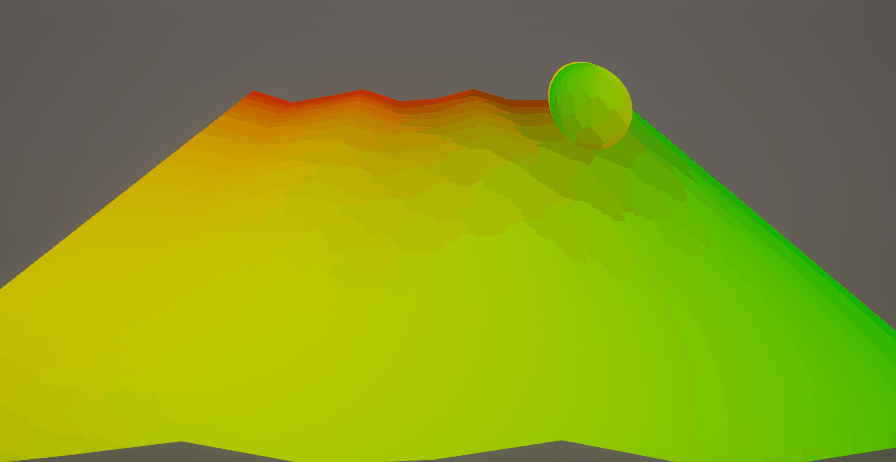
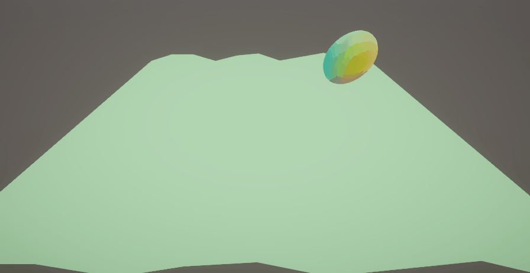
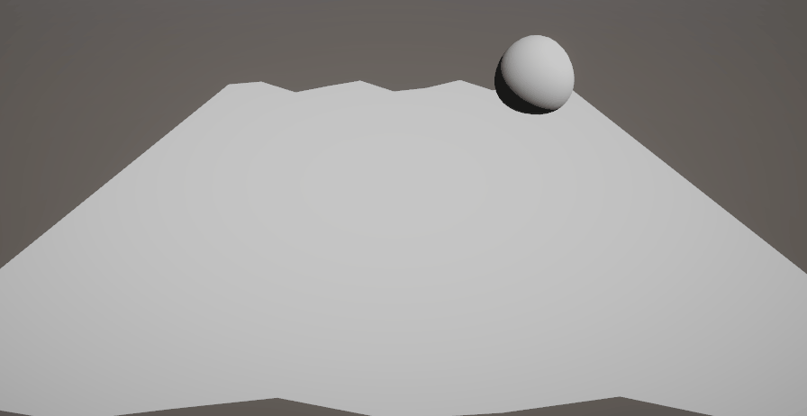

# Etapas del Pipeline Programable

Nombres:

- Joan Sebastian Roberto Puerto
- Baruj Vladimir Ramírez Escalante
- Diego Alberto Romero Olmos
- Maicol Sebastian Olarte Ramirez
- Jorge Isaac Alandete Díaz

Fecha de entrega: 9/03/2026

Descripción breve: Este taller explora las diferentes etapas del pipeline programable y sus integraciones. Se implementan en dos herramientas, una en Unity con un shader HLSL básico en URP y otra en React con Three.js con un shader en GLSL. Ambas implementan distintas deformaciones sobre la malla de un objeto con ayuda de una función sinusoidal.

**Implementaciones:**

- **Unity**: El shader programado de Unity en HLSL deforma una malla con una onda sinusoidal animada, también se combina con lambert lighting, textura y gradiente vertical. Es funcional con planos y esferas. Internamente se implementan las etapas usuales de Vertex shader (transformaciones y deformación sinusoidal), Geometry Shader(extrusión y wireframe/billboards) y Fragment shader (lambert,textura,gradiente y patterns).

- **Three.js**: El shader de React con Three.js en GLSL deforma una malla mientras va girando, integra las etapas ususales de vertex y fragment. También implementa algunos efectos avanzados como fresnel, rim lighting, procedural noise, animación con time y post-processing básico (Bloom).

**Resultados visuales:**

- **Unity**:

El shader de unity muestra una alteración a la malla en la forma de ondulaciones. En este caso el material tiene un tono rojizo. En la escena tambien se presenta una esfera con el material lit de Unity para comparar.


El shader cuenta con distintos modos de debuging para verificar valores por medio de colores en la malla. El primero muestra el mapeo de las UVs y si el pattern procedural funciona. Rojo determina la cordenada U y verde la V.



El segundo muestra la transformación de las normales, rojo para la dirección X, verde para la dirección Y y azul para la Z.



El tercero quita el color del material y muestra la iluminación lambert.



- **Three.js**:

El shader de three.js muestra la alteración ondulada de la malla, bordes brillantes cuando el objeto de lado respecto a a la cámara, halo luminoso alrededor del contorno, variaciones de color dinamicas y zonas brillantes con brillo suave.


Distintas formas de prueba.


Sliders modificando Rim, Speed y Fresnel.


**Código relevante:**

- **Unity**:

Etapa vertex shader de Unity

```hlsl
Varyings vert(Attributes IN)
{
    Varyings OUT;

    // Object -> World
    float3 positionWS = TransformObjectToWorld(IN.positionOS.xyz);

    // deformación sinusoidal
    positionWS.y += sin(positionWS.x * _WaveFrequency + _Time.y) * _WaveAmplitude;

    // normal world
    float3 normalWS = TransformObjectToWorldNormal(IN.normalOS);

    // World -> Clip
    float4 positionCS = TransformWorldToHClip(positionWS);

    OUT.positionCS = positionCS;
    OUT.positionWS = positionWS;
    OUT.normalWS = normalWS;
    OUT.uv = IN.uv;

    return OUT;
}
```

Etapa del geometry shader de Unity

```hlsl
Varyings vert(Attributes IN)
{
[maxvertexcount(3)]
void geom(triangle Varyings IN[3], inout TriangleStream<Varyings> triStream)
{
    for (int i = 0; i < 3; i++)
    {
        Varyings v = IN[i];

        // extrusión
        v.positionWS += normalize(v.normalWS) * 0.1;

        v.positionCS = TransformWorldToHClip(v.positionWS);

        triStream.Append(v);
    }
}
}
```

Etapa del fragment shader de Unity

```hlsl
float4 frag(Varyings IN) : SV_Target
{
    float3 normal = normalize(IN.normalWS);

    float3 lightDir = normalize(_MainLightPosition.xyz);

    // Lambert
    float NdotL = saturate(dot(normal, lightDir));

    // textura
    float4 tex = SAMPLE_TEXTURE2D(_MainTex, sampler_MainTex, IN.uv);

    // gradiente procedural
    float gradient = IN.positionWS.y * 0.5 + 0.5;

    // pattern procedural
    float pattern = sin(IN.uv.x * 20) * sin(IN.uv.y * 20);

    float3 color = tex.rgb * NdotL;

    color *= lerp(0.5, 1.5, gradient);

    color += pattern * 0.1;

    return float4(color * _Color.rgb, 1);
}
```

- **Three.js**:

Vertex shader de Three.js

```JavaScript
const vertexShader = `

uniform float time;

varying vec2 vUv;
varying vec3 vNormal;
varying vec3 vViewPosition;

void main(){

    vUv = uv;
    vNormal = normalize(normalMatrix * normal);

    vec3 pos = position;

    pos.z += sin(pos.x * 5.0 + time) * 0.1;

    vec4 mvPosition = modelViewMatrix * vec4(pos,1.0);

    vViewPosition = -mvPosition.xyz;

    gl_Position = projectionMatrix * mvPosition;

}
`;
```

Fragment shader de Three.js

```JavaScript
const fragmentShader = `

uniform float time;
uniform sampler2D texture1;

varying vec2 vUv;
varying vec3 vNormal;
varying vec3 vViewPosition;

void main(){

    vec3 normal = normalize(vNormal);
    vec3 viewDir = normalize(vViewPosition);

    float fresnel = pow(1.0 - dot(viewDir, normal), 3.0);

    vec3 color = vec3(vUv,0.5);

    color += fresnel * vec3(0.3,0.6,1.0);

    gl_FragColor = vec4(color,1.0);

}
`;
```

**Prompts utilizados:**

- **Unity**:

Se utilizó el siguiente prompt para ChatGPT:

*Hola, necesito crear un shader HLSL básico en el URP de Unity. Este debe pasar por los pasos usuales de un shader. Primero en la etapa de vertex shader, implementar transformaciones de vértices (model space a world view, world view a view space, view space a clip space), luego aplicar una deformación de una onda sinusoidal, y pasar los datos al fragment shader. Segundo en la etapa del fragment shader, necesito calcular color por pixel, implementar una iluminación básica lambert, aplicar texturas y crear efectos procedurales como gradientes y patterns. Tercero, en una etapa de geometry shader, generar geometría adicional desde vértices, crear un wireframe desde geometría solida, generar billboards desde puntos y extrusion de normales. Por ultimo, necesito hacer debug visualizando los valores intermedios como colores, usar el frame debugger de Unity y que quede optimizado evitando operaciones innecesarias. Me puedes ayudar?*

- **Three.js**:

Se utilizó el siguiente prompt para ChatGPT:

*Hola, necesito crear un script con three.js, en el que defina un vertex shader y fragment shader en GLSL para luego usar ShaderMaterial de Three.js, pasando uniforms (tiempo, resolución, textura) y atributos (posición, normal, UV). Aquí un código de como puede ser la estructura del Vertex shader: varying vec2 vUv; varying vec3 vNormal; void main() { vUv = uv; vNormal = normal; // Deformación con onda vec3 pos = position; pos.z += sin(pos.x * 5.0 + time) * 0.1; gl_Position = projectionMatrix * modelViewMatrix * vec4(pos, 1.0); } Y el fragment Shader: varying vec2 vUv; varying vec3 vNormal; uniform float time; void main() { vec3 color = vec3(vUv, 0.5); color *= dot(vNormal, vec3(0, 0, 1)) * 0.5 + 0.5; gl_FragColor = vec4(color, 1.0); } Para finalizar, necesito añadir efectos avanzados como Fresnel effect, Rim lightning, procedural noise, animaciones con uniforms y post processing básico. Me puedes ayudar?/*

**Aprendizajes y dificultades:**

Se aprendió sobre la integración de iluminacion con el pipeline regular de los shaders, adicionalmente, se pudieron aprender nuevas herramientas dentro de Unity como es el frame debugger.
