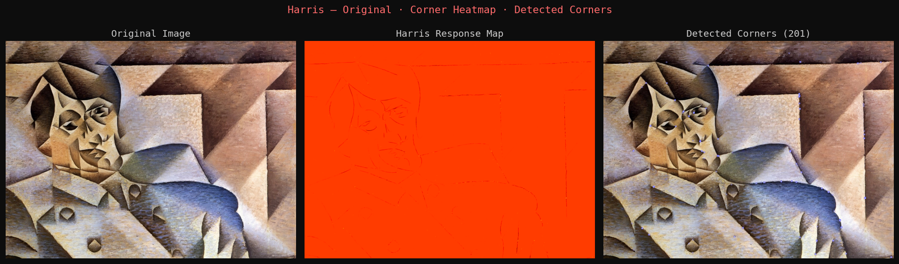
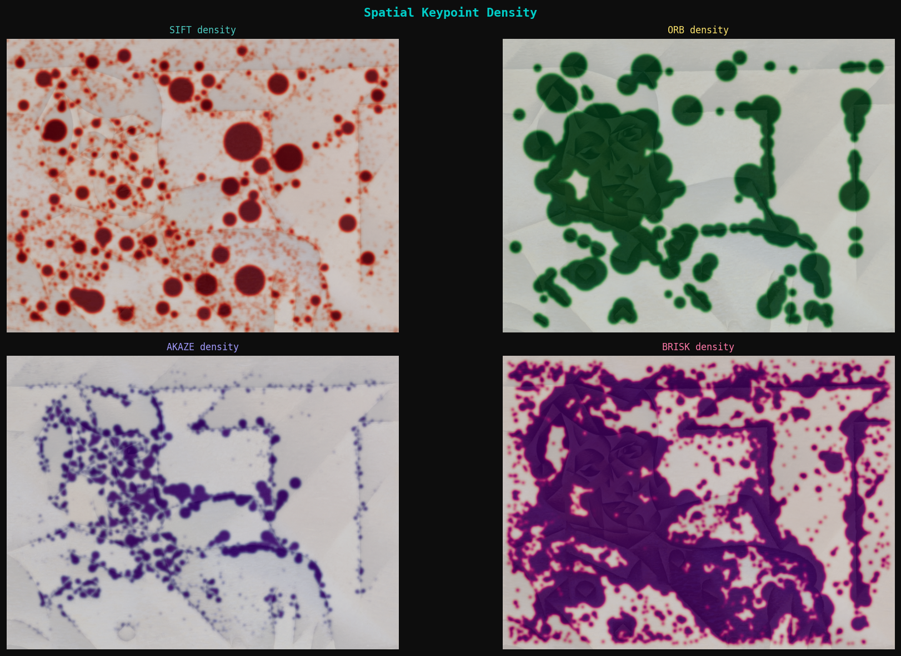
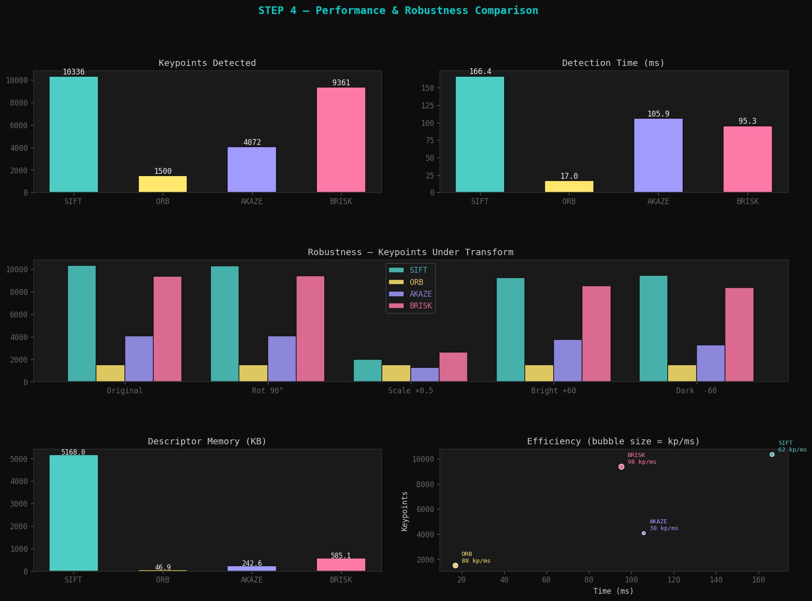

# Titulo

Nombres:

- Joan Sebastian Roberto Puerto
- Baruj Vladimir Ramírez Escalante
- Diego Alberto Romero Olmos
- Maicol Sebastian Olarte Ramirez
- Jorge Isaac Alandete Díaz

Fecha de entrega:
Descripción breve: Este taller se centra en implementar y comparar distintos detectores de *keypoints* y descriptores usando los algoritmos de SIFT y ORB en el análisis de imágenes.

## Implementaciones

### *Python*

El código en python se puede resumir en 3 funciones principales:

**1. Detección de esquinas con Harris**

- Se aplica `cv2.cornerHarris()` sobre la imagen en escala de grises convertida a `float32`.
- Se exploran 4 combinaciones de parámetros (`blockSize`, `ksize`, `k`) para observar su impacto en la sensibilidad del detector.
- Las esquinas se ubican donde la respuesta Harris supera el 15 % del valor máximo.

**2. SIFT: Detección de características con invarianza de escala**

- Descriptor denso de **128 dimensiones** (`float32`), robusto ante cambios de escala y rotación.
- Se analizan propiedades de los keypoints: escala, orientación, respuesta y octava.
- Es el detector más preciso del taller, pero también el más lento (~442 ms).

**3. ORB: Alternativa rápida y libre de patentes**

- Combina el detector **FAST** con el descriptor binario **BRIEF rotado**.
- Descriptor compacto de **32 bytes** por keypoint, lo que reduce memoria y tiempo de comparación.
- Detecta más keypoints que SIFT (~1 267 vs 611) en una fracción del tiempo (~7 ms).

### *Unity*

## Resultados visuales

### *Python*

Para el código de python se utilizó una obra de Picasso, pese a necesitar algo más de calibración en los parametros y el detector no es perfecto, se obtienen unos resulados utilies para comparar los algoritmos. Estas son algunas de las imágenes que resultan del código.

La siguiente imagen muestra donde se detectaron esquinas gracias a Harris



Mapas de calor de los *keypoints* usados por los 4 detectores para comparación



Resultados de comparación de los detectores



### *Unity*


## Código relevante

### *Python*

La siguiente linea es la que detecta keypoints y calcula descriptores al mismo tiempo. Aplica igual para SIFT, ORB, AKAZE y BRISK.

```Python
kp, des = detector.detectAndCompute(gray, None)
```

Se realiza una comparación de rendimiento con perf_counter

```Python
def timed(fn, *args, **kwargs):
    t0 = time.perf_counter()
    result = fn(*args, **kwargs)
    return result, (time.perf_counter() - t0) * 1000
```

Se tiene un umbral de sensibilidad para la detección de esquinas de Harris de modo que subirlo reduce falsas detecciones y bajarlo encuentra más esquinas con más ruido.


```Python
threshold = 0.15 * dst.max()
corners = np.argwhere(dst > threshold)
```

### *Unity*

```plaintext
    
```

## Prompts utilizados

### *Python*

El siguiente prompt puede generar el códigó en python:

```plaintext
Crea un script de Python para un taller de computación visual que implemente y compare detectores de características: Harris, SIFT, ORB, AKAZE y BRISK usando OpenCV. El código debe estar estructurado en 5 pasos: detección de esquinas con Harris explorando distintos parámetros, implementación y análisis de SIFT y ORB con visualización de propiedades (escala, orientación, octava), comparativa de rendimiento midiendo tiempo de ejecución y robustez ante rotación, cambio de escala e iluminación, y visualización avanzada con mapas de densidad y todos los flags de drawKeypoints. Incluye un bonus con una GUI interactiva usando matplotlib con sliders y botones para ajustar parámetros en tiempo real. Usa un estilo visual oscuro consistente con paleta de colores por detector, guarda todos los resultados como PNG en una carpeta de salida y genera una imagen sintética de prueba si no encuentra ninguna imagen local.
```

### *Unity*

## Aprendizajes y dificultades

Se puede inferir gracias al desarrollo del taller que no hay un solo detector que sea superior a los otros. SIFT es robusto, pero costoso computacionalmente; ORB no es tan potente pero más facil de implementar; y tanto AKAZE como BRISK son un punto intermedio.