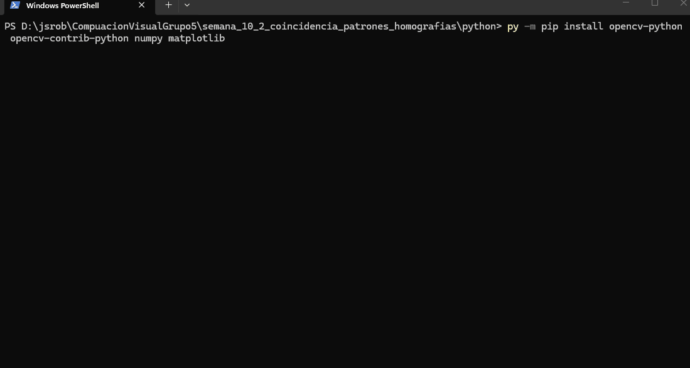

# Taller – Coincidencia de Patrones y Homografías

**Integrantes:**  
- Joan Sebastian Roberto Puerto  
- Baruj Vladimir Ramírez Escalante  
- Diego Alberto Romero Olmos  
- Maicol Sebastian Olarte Ramirez  
- Jorge Isaac Alandete Díaz  

**Fecha de entrega:**  19 de mayo de 2026  

---

## Descripción breve

En este taller se implementaron técnicas de **coincidencia de características** entre imágenes utilizando **BFMatcher** y **FLANN**, seguido del cálculo de **homografías** mediante **RANSAC** para alinear imágenes, detectar objetos y generar un panorama. El desarrollo se realizó íntegramente en **Python** con las librerías OpenCV, NumPy y Matplotlib.

---

## Implementaciones realizadas (Python)

### 1. Feature Matching con BFMatcher
- Se utilizó el detector **SIFT** para extraer keypoints y descriptores.
- Se compararon dos modos: matching directo (`bf.match()`) y matching con **Lowe’s ratio test** (kNN con k=2, umbral 0.75) para filtrar matches ambiguos.
- Resultados obtenidos:
  - Directo: 604 matches en 0.012 s.
  - Con ratio test: 80 matches en 0.012 s.

### 2. Feature Matching con FLANN
- Se configuró FLANN con **KD-Tree** (para SIFT) y se aplicó nuevamente el ratio test.
- Resultado: 82 matches en 0.062 s, ligeramente más lento que BFMatcher pero con mejor filtrado.

### 3. Cálculo de Homografía con RANSAC
- A partir de los buenos matches de FLANN, se estimó la matriz de homografía 3×3 usando `cv2.findHomography` con método RANSAC (umbral de reproyección = 3.0).
- Se visualizaron **inliers (verde)** y **outliers (rojo)**.
- **Resultados:** 76 inliers de 82 (92.7% de precisión). Matriz H obtenida:
  ```
  [[ 4.41698295e-01, -1.63501158e-01,  1.18884196e+02],
   [ 6.09704764e-04,  4.04370545e-01,  1.60965304e+02],
   [-2.45879740e-04, -3.53322129e-04,  1.00000000e+00]]
  ```

### 4. Detección de Objetos
- Se usó la homografía calculada entre la imagen del objeto (`box.png`) y la escena (`box_in_scene.png`) para proyectar las esquinas del objeto y dibujar un **bounding box** en la escena.
- Resultado: 73 inliers de 79 matches (92.4%), detección exitosa.

### 5. Image Stitching (Panorama)
- Se generaron tres imágenes sintéticas con texturas y figuras geométricas (círculos, rectángulos, gradientes) para simular solapamiento.
- Se intentó unir las imágenes mediante homografías consecutivas y blending lineal.
- **Problema:** El número de matches entre las imágenes sintéticas fue bajo (7 y 8, inferior al mínimo de 10), por lo que no se pudo construir el panorama. Esto evidencia la necesidad de imágenes con mayor contenido textural y solapamiento real para un stitching exitoso.

### 6. Comparativa de rendimiento con ORB
- Se repitió el matching utilizando el detector **ORB** (más rápido pero menos robusto que SIFT).
- Tiempos obtenidos:
  - BFMatcher + ORB: 0.0056 s, 25 matches.
  - FLANN + ORB: 0.0186 s, 50 matches.
- FLANN con ORB arrojó más matches pero mayor tiempo de cómputo.

---

## Resultados visuales

Todas las imágenes y GIFs se encuentran en la carpeta [`media/`](./media).

| Figura | Descripción |
|--------|-------------|
|  | **BFMatcher directo** – 604 matches sin filtrar. |
|  | **BFMatcher con ratio test** – 80 matches filtrados. |
|  | **FLANN con ratio test** – 82 matches. |
| %20Outliers%20(rojo).jpg) | Visualización de inliers (verde) y outliers (rojo) tras RANSAC. |
| .jpg) | Bounding box del objeto en la escena gracias a la homografía. |
|  | Intento de stitching – insuficientes matches, panorama no construido. |
|  | GIF del proceso de instalación de paquetes (`pip install`). |
|  | GIF de la ejecución completa del script mostrando todas las salidas. |

---

## Código relevante (snippets)

A continuación se muestran las partes más importantes del programa. El código completo está en [`python/coincidencia_homografias.py`](./python/coincidencia_homografias.py).

### Matching con BFMatcher y ratio test
```python
bf = cv2.BFMatcher(norm, crossCheck=False)
knn = bf.knnMatch(des1, des2, k=2)
good = []
for pair in knn:
    if len(pair) == 2:
        m, n = pair
        if m.distance < 0.75 * n.distance:
            good.append(m)
```

### Matching con FLANN (corrección para OpenCV 4.x)
```python
index_params = dict(algorithm=1, trees=5)   # para SIFT
flann = cv2.FlannBasedMatcher(index_params, search_params)
knn_matches = flann.knnMatch(des1, des2, k=2)
# ... mismo filtrado de ratio test
```

### Cálculo de homografía con RANSAC
```python
H, mask = cv2.findHomography(src_pts, dst_pts, cv2.RANSAC, reproj_thresh=3.0)
inliers = np.sum(mask)
```

### Detección de objeto mediante proyección de esquinas
```python
corners = np.float32([[0,0], [w,0], [w,h], [0,h]]).reshape(-1,1,2)
dst_corners = cv2.perspectiveTransform(corners, H)
cv2.polylines(scene, [np.int32(dst_corners)], True, (0,255,0), 3)
```

---

## Prompts utilizados (IA generativa)

Siguiendo la **Guía de Prompts para IA** del curso, se emplearon los siguientes prompts para resolver problemas específicos:

1. Como corregir el error de FLANN en OpenCV 4.x:  

2. Como manejar el desempaquetado de `knnMatch`:

3. Como evitar desbordamiento de `uint8` en imágenes sintéticas:

---

## Aprendizajes y dificultades

### Aprendizajes
- **Comparación BFMatcher vs FLANN:** FLANN es más rápido en conjuntos grandes de puntos, pero con pocos keypoints la diferencia es mínima. El ratio test de Lowe es crucial para eliminar falsos positivos.
- **RANSAC:** Permite obtener homografías robustas incluso con muchos outliers; el porcentaje de inliers obtenido (>92%) confirma la buena calidad del matching.
- **Detección de objetos:** La homografía no solo sirve para alinear, también para localizar instancias de un objeto en una escena, siempre que exista un plano predominante.
- **Limitaciones del stitching:** Para unir imágenes se requiere un solapamiento real con suficiente textura. Las imágenes sintéticas simples fallan porque SIFT no encuentra suficientes puntos repetibles.

### Dificultades superadas
1. **Constantes de FLANN en OpenCV 4:**  
   Las constantes `FLANN_INDEX_KDTREE` y `FLANN_INDEX_LSH` fueron movidas dentro de `cv2.flann`. Se solucionó usando los valores enteros (1 y 6) directamente.
2. **Manejo de `knnMatch`:**  
   Algunos puntos no tenían dos vecinos, causando excepción al desempaquetar. Se añadió un chequeo `if len(pair) == 2`.
3. **Desbordamiento de píxeles:**  
   Al crear imágenes sintéticas con gradiente, la suma de canales excedía 255. Se limitó cada canal con `min(255, valor)`.
4. **Panorama fallido:**  
   A pesar de no lograr el stitching, se comprendió la necesidad de imágenes reales con alto solapamiento y características distintivas. Queda como trabajo futuro probar con imágenes de una escena real.

---

## Checklist de entrega

- [x] Carpeta con formato `semana_10_2_coincidencia_patrones_homografias`
- [x] `README.md` explicando cada actividad
- [x] Carpeta `media/` con imágenes, GIFs y videos
- [x] `.gitignore` configurado para Python
- [x] Commits descriptivos en inglés
- [x] Repositorio público verificado