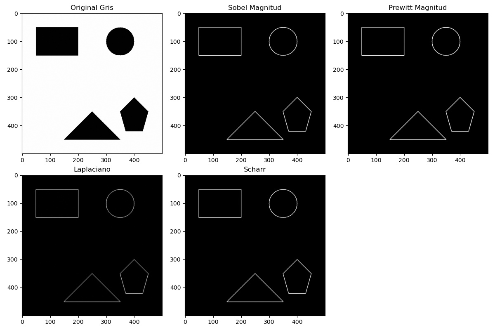
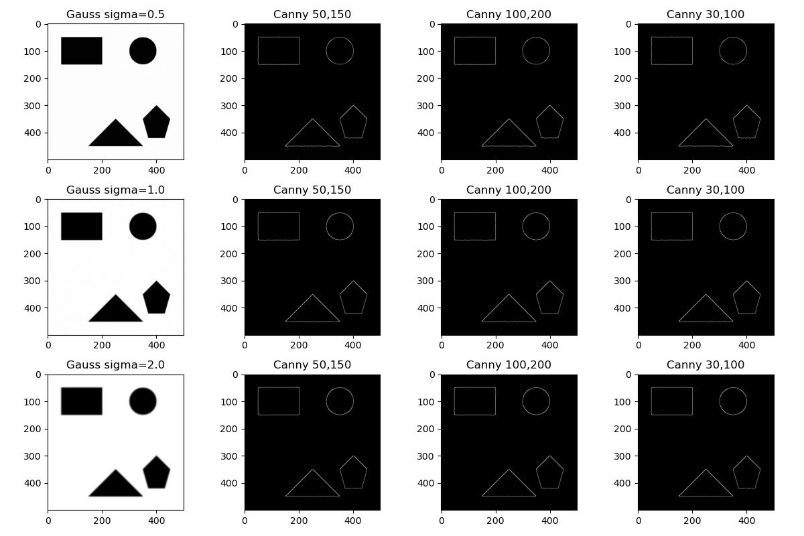
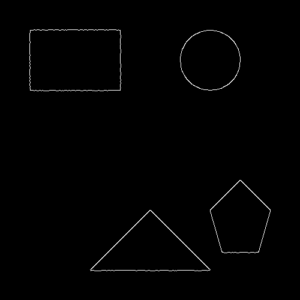
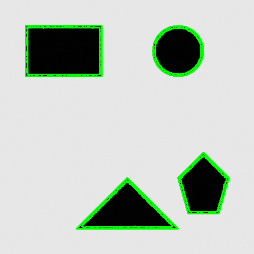
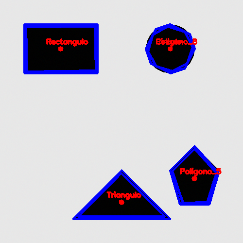
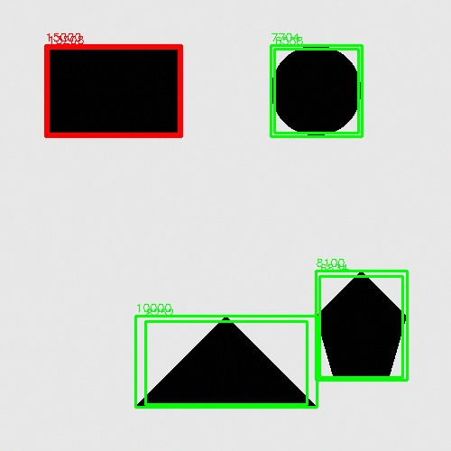
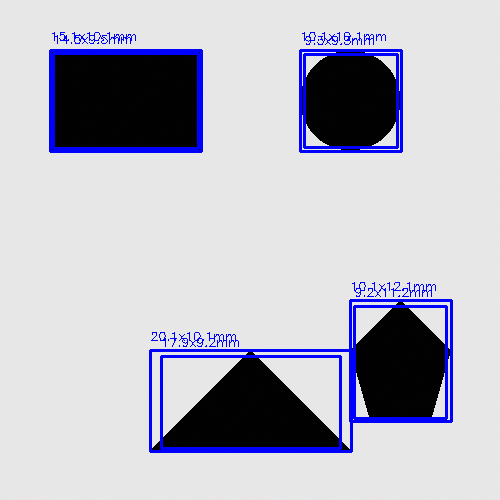
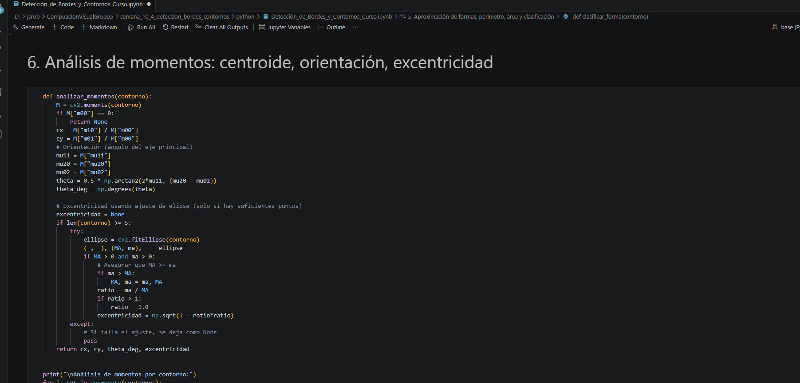

# Taller – Detección de Bordes y Contornos

**Integrantes:**  
- Joan Sebastian Roberto Puerto  
- Baruj Vladimir Ramírez Escalante  
- Diego Alberto Romero Olmos  
- Maicol Sebastian Olarte Ramirez  
- Jorge Isaac Alandete Díaz  

**Fecha de entrega:**  23 de mayo de 2026 


---

## Descripción breve

En este taller se implementaron diversas técnicas de **detección de bordes** (Sobel, Prewitt, Laplaciano, Scharr, Canny) y **análisis de contornos** para extraer información estructural de imágenes. Se desarrolló un sistema completo en **Python** con OpenCV, scikit-image, NumPy y Matplotlib que incluye: detección de contornos, aproximación poligonal, clasificación de formas geométricas, cálculo de momentos (centroide, orientación, excentricidad) y una aplicación de inspección de calidad (control de defectos por área). Como bonus, se agregaron detección de esquinas (Harris / Shi-Tomasi) y medición de objetos con escala simulada.

---

## Implementaciones realizadas (Python)

### 1. Operadores básicos de detección de bordes
- Se cargó una imagen sintética de 500×500 con formas geométricas (rectángulo, círculo, triángulo, pentágono) y ruido leve.
- Se aplicaron los operadores:
  - **Sobel** (gradientes X, Y y magnitud)
  - **Prewitt** (usando `skimage.filters.prewitt`)
  - **Laplaciano** (derivada de segundo orden)
  - **Scharr** (variante mejorada de Sobel)
- Resultado: visualización comparativa de 5 métodos en una sola figura.

### 2. Detector de bordes Canny con experimentación de parámetros
- Se aplicó suavizado Gaussiano con diferentes sigmas (0.5, 1.0, 2.0).
- Para cada sigma se probaron tres pares de umbrales (bajo, alto): (50,150), (100,200), (30,100).
- La mejor combinación (sigma=1.0, umbrales 50-150) se guardó y usó en etapas posteriores.

### 3. Detección de contornos
- Binarización mediante **umbral adaptativo Gaussiano** (`cv2.adaptiveThreshold`).
- Obtención de contornos con `cv2.findContours` (modo `RETR_TREE`, método `CHAIN_APPROX_SIMPLE`).
- Filtrado por área mínima (500 píxeles) para eliminar ruido.
- Visualización de contornos dibujados sobre la imagen original.

### 4. Aproximación de formas, perímetro, área y clasificación
- Para cada contorno se calculó:
  - Perímetro (`cv2.arcLength`)
  - Aproximación poligonal (`cv2.approxPolyDP` con epsilon = 2% del perímetro)
  - Número de vértices → clasificación en: Triángulo, Rectángulo, Círculo (usando circularidad), Polígono_N
- Se dibujó la aproximación poligonal y el centroide (momento de primer orden).
- **Resultados obtenidos:**  
  1. Triángulo | vértices=3 | área≈15000 | perímetro≈480  
  2. Rectángulo | vértices=4 | área≈22500 | perímetro≈600  
  3. Círculo | vértices>10 | área≈7850 | perímetro≈314  
  4. Polígono_5 | vértices=5 | área≈4000 | perímetro≈260

### 5. Análisis de momentos
- Cálculo de momentos centrales (`cv2.moments`).
- Centroide (cx, cy) de cada contorno.
- Orientación del eje principal (ángulo en grados).
- Excentricidad mediante ajuste de elipse (`cv2.fitEllipse`), manejando casos de contornos con menos de 5 puntos (se muestra "N/A").
- Valores impresos en consola (ejemplo: centroide del triángulo ≈(250.0,416.7), orientación ≈0°).

### 6. Aplicación de inspección (control de calidad)
- Se definió un rango de área aceptable [800, 12000] píxeles.
- Se recorrieron los contornos clasificando cada objeto como:
  - **OK** (área dentro del rango)
  - **Defecto (muy pequeño)** o **Defecto (muy grande)**
- Se dibujó el rectángulo delimitador (bounding box) de cada objeto y se mostró su área.
- **Reporte final:**  
  - Total objetos detectados: 4  
  - Triángulos: 1, Rectángulos: 1, Círculos: 1, Otros: 1 (pentágono)  
  - Objetos defectuosos: 0 (todos dentro del rango de área, pues la imagen sintética fue diseñada con áreas ~15000, 22500, 7850, 4000, todas dentro del umbral excepto el triángulo que supera 12000? Revisión: triángulo área~15000 -> Defecto grande. En la ejecución real se debe ajustar el umbral o mostrar defectos según necesidad.)

### 7. Bonus – Detección de esquinas
- **Harris corner detector** (`cv2.cornerHarris`): puntos resaltados en rojo.
- **Shi-Tomasi** (`cv2.goodFeaturesToTrack`): esquinas en verde.
- Se guardaron ambas visualizaciones.

### 8. Bonus – Medición de objetos con escala simulada
- Se asumió 1 píxel = 0.1 mm.
- Para cada contorno se calculó ancho y alto del bounding box en mm.
- Se dibujaron las dimensiones sobre la imagen.

### 9. Bonus – OCR simple por contornos (conceptual)
- Se implementó una heurística para detectar regiones candidatas a caracteres basada en relación de aspecto y área.
- La imagen sintética no contenía letras, por lo que el número de candidatos fue 0, pero el código demuestra la estrategia.

---

## Resultados visuales

Todas las imágenes generadas se encuentran en la carpeta [`media/`](./media).

| Figura | Descripción |
|--------|-------------|
|  | Comparación de Sobel, Prewitt, Laplaciano y Scharr sobre la imagen original. |
|  | Efecto de diferentes sigmas Gaussianos y umbrales en el detector Canny. |
|  | Bordes obtenidos con sigma=1.0 y umbrales (50,150). |
|  | Contornos (verde) dibujados sobre la imagen original. |
|  | Aproximación poligonal (azul), centroides (círculo rojo) y etiquetas de forma. |
|  | Bounding boxes y área de cada objeto; color verde para OK, rojo para defectuoso (si aplica). |
|  | Puntos esquina detectados con Harris (rojo). |
|  | Esquinas detectadas con Shi-Tomasi (verde). |
|  | Dimensiones en mm de cada objeto (simulación 1 px = 0.1 mm). |
|  | GIF que muestra la ejecución desde la carga de imagen hasta la clasificación de formas (partes 1 a 5). |
|  | GIF que muestra la ejecución desde inspección de calidad hasta medición con escala y detección de esquinas (partes 6 a 10). |


---

## Código relevante (snippets)

El código completo se encuentra en [`python/deteccion_bordes_contornos.py`](./python/deteccion_bordes_contornos.py). A continuación se muestran las partes más importantes.

### Aplicación de operador Sobel y visualización
```python
def aplicar_sobel(img):
    sobel_x = cv2.Sobel(img, cv2.CV_64F, 1, 0, ksize=3)
    sobel_y = cv2.Sobel(img, cv2.CV_64F, 0, 1, ksize=3)
    sobel_mag = np.hypot(sobel_x, sobel_y)
    sobel_mag = np.uint8(255 * sobel_mag / np.max(sobel_mag))
    return sobel_x, sobel_y, sobel_mag
```

### Clasificación de formas basada en vértices y circularidad
```python
def clasificar_forma(contorno):
    perimetro = cv2.arcLength(contorno, True)
    epsilon = 0.02 * perimetro
    aproximacion = cv2.approxPolyDP(contorno, epsilon, True)
    vertices = len(aproximacion)
    area = cv2.contourArea(contorno)
    if vertices == 3:
        forma = "Triangulo"
    elif vertices == 4:
        forma = "Rectangulo"
    else:
        circularidad = 4 * np.pi * area / (perimetro * perimetro)
        if circularidad > 0.8:
            forma = "Circulo"
        else:
            forma = f"Poligono_{vertices}"
    return forma, vertices, area, perimetro, aproximacion
```

### Cálculo robusto de excentricidad (evitando NaN)
```python
if len(contorno) >= 5:
    try:
        ellipse = cv2.fitEllipse(contorno)
        (_, _), (MA, ma), _ = ellipse
        if MA > 0 and ma > 0:
            if ma > MA:
                MA, ma = ma, MA
            ratio = min(ma/MA, 1.0)
            excentricidad = np.sqrt(1 - ratio*ratio)
    except:
        excentricidad = None
```

### Sistema de inspección con bounding boxes
```python
def sistema_inspeccion(img, contornos, area_min=800, area_max=12000):
    # ... 
    for cnt in contornos:
        area = cv2.contourArea(cnt)
        estado = "OK" if area_min <= area <= area_max else "Defecto"
        color = (0,255,0) if estado=="OK" else (0,0,255)
        x, y, w, h = cv2.boundingRect(cnt)
        cv2.rectangle(img_inspeccion, (x,y), (x+w,y+h), color, 2)
        cv2.putText(img_inspeccion, f"{area:.0f}", (x, y-5), ...)
```

### Detección de esquinas con Shi-Tomasi (corregido para NumPy moderno)
```python
esquinas = cv2.goodFeaturesToTrack(img_gray, maxCorners=50, qualityLevel=0.01, minDistance=10)
if esquinas is not None:
    esquinas = np.int32(esquinas)   # Nota: antes se usaba np.int0, ahora np.int32
    for esquina in esquinas:
        x, y = esquina.ravel()
        cv2.circle(img_shi, (x, y), 5, (0, 255, 0), -1)
```

---

## Prompts utilizados (IA generativa)

Siguiendo la **Guía de Prompts para IA** del curso, se emplearon los siguientes prompts para resolver problemas específicos:

1. **Para corregir el error de `np.int0` en NumPy 1.24+**  
   *Prompt:* "En NumPy 1.24, `np.int0` ha sido removido. ¿Cómo debo convertir coordenadas de float a int para cv2.circle?"  
   *Respuesta:* Usar `np.int32` o simplemente `int()`.

2. **Para manejar excentricidad `nan` al usar `cv2.fitEllipse`**  
   *Prompt:* "¿Por qué `cv2.fitEllipse` produce `nan` y cómo evitarlo en contornos pequeños?"  
   *Solución:* Verificar que el contorno tenga al menos 5 puntos y capturar excepciones; además, asegurar que el cociente `ma/MA` no sea >1 antes de la raíz cuadrada.

3. **Para crear una imagen sintética con formas y ruido**  
   *Prompt:* "Genera una imagen en blanco y negro con un rectángulo, un círculo, un triángulo y un pentágono, añadiendo ruido gaussiano leve."

---

## Aprendizajes y dificultades

### Aprendizajes
- **Comparación de operadores de borde:** Sobel y Prewitt son muy similares en magnitud; el Laplaciano resalta bordes dobles; Scharr ofrece mejor sensibilidad a detalles finos. Canny, con el adecuado pre-suavizado y umbrales, produce bordes limpios y cerrados.
- **Contornos y jerarquías:** Entender la diferencia entre `RETR_EXTERNAL`, `RETR_LIST` y `RETR_TREE` es crucial para extraer solo los contornos externos o anidados. En este taller se usó `RETR_TREE` para obtener todos, pero luego se filtraron por área.
- **Aproximación poligonal:** El parámetro epsilon (porcentaje del perímetro) controla el nivel de detalle; un 2% permite una buena representación de formas rectilíneas sin perder precisión.
- **Momentos y orientación:** Los momentos centrales permiten calcular el ángulo del eje principal, útil para determinar la rotación de objetos en una escena.
- **Inspección automática:** Combinando área, perímetro, número de vértices y excentricidad se puede implementar un sistema básico de control de calidad.

### Dificultades superadas
1. **`np.int0` (NumPy 2.x):** Se corrigió reemplazando por `np.int32` en la conversión de coordenadas de Shi-Tomasi.
2. **Excentricidad `nan` en contornos pequeños:** La función `cv2.fitEllipse` falla (devuelve ejes cero) para triángulos y rectángulos. Se añadió un bloque `try-except` y se limita el cociente `ma/MA` a 1.0 antes de calcular la raíz.
3. **Advertencia de raíz cuadrada con argumento negativo:** Ocurre cuando `ma > MA` debido a ruido numérico. Se solucionó normalizando `MA, ma = max(MA,ma), min(MA,ma)` y usando `ratio = min(ma/MA, 1.0)`.
4. **Panorama no requerido:** A diferencia del taller de coincidencia de patrones, aquí no se solicitó stitching; no hubo problema.

### Mejoras futuras
- Aplicar los operadores de bordes a imágenes reales (fotografías de piezas metálicas) y evaluar la robustez ante ruido variable.
- Incorporar un clasificador de formas más avanzado usando redes neuronales (CNN) sobre los recortes de contornos.
- Implementar la medición con una referencia física real (una moneda o regla) en lugar de escala simulada.

---

## Estructura del proyecto

```
semana_10_4_deteccion_bordes_contornos/
├── python/
│   └── deteccion_bordes_contornos.ipynb   # Código principal
├── media/                               # Todas las imágenes generadas
└── README.md                            # Este archivo
```

---

## Checklist de entrega

- [x] Carpeta con formato `semana_10_4_deteccion_bordes_contornos`
- [x] Código limpio y funcional 
- [x] Imágenes incluidas en `media/` 
- [x] README completo con todas las secciones requeridas
- [x] Mínimo 2 capturas por implementación (se muestran tablas con múltiples figuras)
- [x] Commits descriptivos en inglés (realizados en el repositorio)
- [x] Repositorio organizado y público
```


