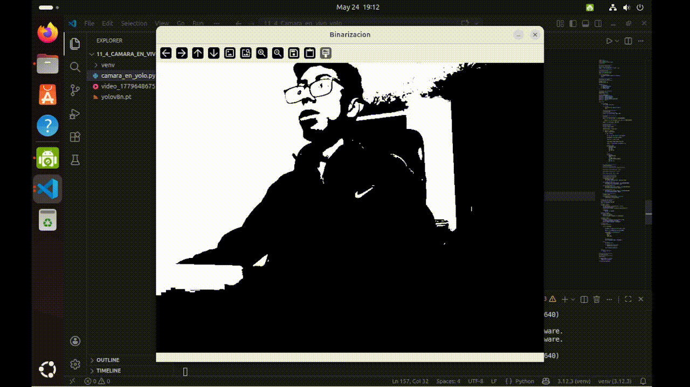
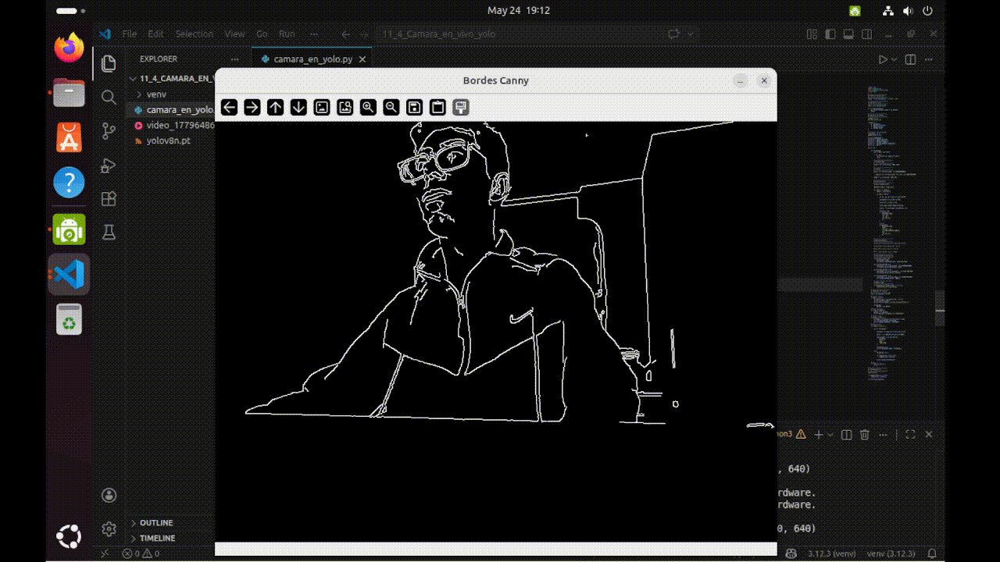

# Taller 11_1 – Cámara en Vivo: Captura y Procesamiento de Video en Tiempo Real con YOLO

**Integrantes:**  
- Joan Sebastian Roberto Puerto  
- Baruj Vladimir Ramírez Escalante  
- Diego Alberto Romero Olmos  
- Maicol Sebastian Olarte Ramirez  
- Jorge Isaac Alandete Díaz  

**Fecha de entrega:** 24 de Marzo de 2026  

---

## Descripción breve

### Python

Se desarrolla una aplicación en Python capaz de capturar video en tiempo real desde una webcam, aplicar distintos filtros de procesamiento de imágenes y realizar detección de objetos utilizando el modelo YOLO.

Se aplican los siguientes filtros:

- Escala de grises
- Binarización
- Detección de bordes


## Implementaciones

### Python

1. Como primer paso general se importan las librerias, para el analisis de imagenes se usa la libreria **opencv**, para el manejo de las imagenes **numpy** y para la utilizacion del modelo YOLO se usa **ultralytics**

2. Si implemento la captura de video desde una webcam utilizando OpenCV. Esto permitió obtener una secuencia continua de frames para procesarlos en tiempo real con el codigo.
  
```Python
cap=cv2.VideoCapture(0)
```

3. Se aplicaron filtrosde Escala de grises, Binarización y Detección de bordes: 

- Escala de grises:

```Python
gray = cv2.cvtColor(frame, cv2.COLOR_BGR2GRAY)
```

- Binarización

```Python
_, binary = cv2.threshold(gray, 127, 255, cv2.THRESH_BINARY)
```

- Detección de bordes

```Python
edges = cv2.Canny(gray, 100, 200)
```

4. Se utilizó YOLOv8 mediante la librería ultralytics
Cargando el modelo:


```Python
model = YOLO("yolov8n.pt")
```

Y aplicando el modelos sobre los frames

```Python
results = model(frame)
```

Obteniendo la bounding box sobre cada objeto detectado, con la clase del objeto y  la confianza de que el objeto pertenezca a la clase.


## Resultados visuales

- Se muestra el filtro de grises aplicado sobre la camara.

  

- Se muestra el filtro de Binarizacion aplicado sobre la camara.

  

- Se muestra el filtro de Contornos aplicado sobre la camara.

  

- Se muestra la deteccion de objetos con YOLO, donde se prueba el modelo con una nbotella pequeña, un cuchillo de cocina, un control remoto, un libro, un humano y una silla.

  

- Se muestra el cambio entre los distintos filtros.

  

- Se muestra la pausa en la deteccion de la imagen.

  


## Código relevante

Codigo para la de deteccion en el modelo YOLO.

```python
results = model(frame)

detected_frame = frame.copy()

for result in results:
        boxes = result.boxes

        for box in boxes:

        x1, y1, x2, y2 = map(int, box.xyxy[0])

        confidence = float(box.conf[0])

        class_id = int(box.cls[0])

        class_name = model.names[class_id]

        label = f"{class_name} {confidence:.2f}"

        # Dibujar caja
        cv2.rectangle(
                detected_frame,
                (x1, y1),
                (x2, y2),
                (0, 255, 0),
                2
        )

        # Texto
        cv2.putText(
                detected_frame,
                label,
                (x1, y1 - 10),
                cv2.FONT_HERSHEY_SIMPLEX,
                0.5,
                (0, 255, 0),
                2
        )

```


## Prompts de IA utilizados (Chatgpt)


1. Dame una guia de instalación para el modelo de deteccion de objetos YOLO en una maquina con linux Ubuntu.


## Aprendizajes y dificultades

### Aprendizajes

Durante el desarrollo se logró comprender:

- El funcionamiento básico del procesamiento digital de imágenes con OpenCV.
- La integración de modelos de inteligencia artificial para visión computacional.
- El uso de YOLO para detección de objetos.
- El manejo de eventos de teclado para interacción en aplicaciones multimedia.

### Dificultades

Las principales dificultades encontradas fueron:

- Configuración inicial de dependencias y modelos YOLO.
- Sincronización entre captura, procesamiento y visualización.
- Compatibilidad de la webcam en algunos sistemas.

### Instalación

Para la ejecucion del codigo se deben tener las librerias de opencv-contrib-python, numpy y ultralytics

Estas librerias se descargan en un entorno virtual en python, el paso a paso para la creacion del entorno virtual y la instalacion de las librerias se describe a continuacion:

1. Se verifica la instalacion de python con
```bash
python3 --version
```
   Si no esta instalado se instala, en Ubuntu es:
```bash
sudo apt update
sudo apt install python3 python3-pip
```
2. Se crea el entorno viertual
```bash
python3 -m venv entorno_cv
```
3. Se activa el entorno virtual
```bash
source entorno_cv/bin/activate
```
4. Se instalan las librerias en el entorno virtual
```bash
pip install opencv-python
pip install opencv-contrib-python
pip install ultralytics
```
5. Ejecutar el codigo :D
