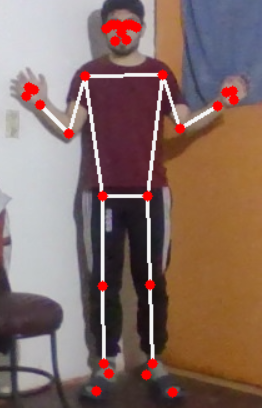

# Taller Reconocimiento Postura Mediapipe

**Estudiantes:** 

- Joan Sebastian Roberto Puerto
- Baruj Vladimir Ramírez Escalante
- Diego Alberto Romero Olmos
- Maicol Sebastian Olarte Ramirez
- Jorge Isaac Alandete Díaz

**Fecha de entrega:** 

25 de mayo, 2026

## Descripción

El taller consistió en armar un sistema que reconoce acciones del cuerpo en tiempo real a partir de la webcam. La idea es que el programa detecte la postura de la persona, calcule algunas medidas geométricas sobre ella y, según esas medidas, decida qué está haciendo: si tiene los brazos arriba, si está sentada o si está caminando.

Para la detección de postura se usó MediaPipe, que ubica 33 puntos clave del cuerpo (hombros, codos, muñecas, caderas, rodillas, tobillos, etc.). A partir de esos puntos el programa hace los cálculos —sobre todo ángulos de rodilla y comparaciones de altura entre puntos— y aplica reglas condicionales para clasificar la acción. La acción detectada se muestra en pantalla sobre el video y, cuando cambia, se reproduce un sonido como retroalimentación.

## Implementaciones

### Python — Jupyter Notebook (ejecución local)

Todo se desarrolló en un notebook de Jupyter (`Taller_Reconocimiento_Acciones.ipynb`) corriendo localmente sobre un entorno de Anaconda con Python 3.11. Se eligió ejecución local en lugar de Colab porque el taller pide tiempo real con webcam, y la captura con `cv2.VideoCapture(0)` funciona de forma fluida solo en la máquina propia. El notebook permite además separar el trabajo por celdas y documentar cada parte.

El notebook quedó organizado así:

- **Captura de video** con OpenCV. Cada frame se voltea en espejo para que la visualización sea más natural.
- **Detección de postura** con el `PoseLandmarker` de MediaPipe. Cada frame se convierte a un objeto `mp.Image` y se procesa con `detect_for_video`, que devuelve los 33 landmarks.
- **Cálculo de geometría.** Una función calcula el ángulo entre tres puntos (por ejemplo cadera–rodilla–tobillo para medir la flexión de la rodilla) y otra calcula distancias entre puntos.
- **Clasificación de acciones** mediante reglas condicionales:
  - *Brazos levantados:* ambas muñecas quedan por encima de la nariz.
  - *Sentado:* las dos rodillas están flexionadas (ángulo menor a 120°) y las caderas quedan cerca de la altura de las rodillas.
  - *Caminando:* se detecta alternancia en la altura de los tobillos a lo largo de varios frames.
- **Visualización.** Se dibuja el esqueleto con sus conexiones, una barra superior con el nombre de la acción y un panel con los ángulos de rodilla calculados.
- **Retroalimentación.** Visual mediante la barra de color y las etiquetas; sonora mediante un `ding.wav` que suena al cambiar de acción (usando `pygame`, opcional).

## Resultados visuales

Las capturas y GIFs están en la carpeta `media/`.

### Detección de los 33 puntos



Se ve el esqueleto completo dibujado sobre la persona, con los 33 landmarks ubicados y las conexiones entre ellos.

### Acción: brazos levantados


Al subir las dos muñecas por encima de la cabeza, la etiqueta de la ventana cambia a "Brazos levantados".

### Acción: sentarse


Cuando la persona se sienta, las rodillas se flexionan y el sistema cambia la etiqueta a "Sentado".

## Código relevante

El código completo está en el notebook `Taller_Reconocimiento_Acciones.ipynb`. Estos son los fragmentos centrales.

Cálculo del ángulo entre tres puntos, que es la base para medir la flexión de las rodillas:

```python
def calcular_angulo(a, b, c):
    """Angulo en grados en el vertice b, formado por los puntos a-b-c."""
    a, b, c = np.array(a), np.array(b), np.array(c)
    radianes = np.arctan2(c[1] - b[1], c[0] - b[0]) - \
               np.arctan2(a[1] - b[1], a[0] - b[0])
    angulo = np.abs(np.degrees(radianes))
    if angulo > 180.0:
        angulo = 360.0 - angulo
    return angulo
```

Reglas de clasificación de las dos primeras acciones. Hay que tener en cuenta que en la coordenada `y` un valor menor significa más arriba en la imagen:

```python
# Brazos levantados: ambas munecas por encima de la nariz
if muneca_izq[1] < nariz[1] and muneca_der[1] < nariz[1]:
    return "Brazos levantados"

# Sentado: rodillas flexionadas y caderas cerca de la altura de las rodillas
ang_rodilla_izq = calcular_angulo(cadera_izq, rodilla_izq, tobillo_izq)
ang_rodilla_der = calcular_angulo(cadera_der, rodilla_der, tobillo_der)
rodillas_flexionadas = ang_rodilla_izq < 120 and ang_rodilla_der < 120
caderas_bajas = (cadera_izq[1] > rodilla_izq[1] - 0.10 and
                 cadera_der[1] > rodilla_der[1] - 0.10)
if rodillas_flexionadas and caderas_bajas:
    return "Sentado"
```

Procesamiento de cada frame dentro del bucle principal, usando la Tasks API:

```python
frame_rgb = cv2.cvtColor(frame, cv2.COLOR_BGR2RGB)
mp_image = mp.Image(image_format=mp.ImageFormat.SRGB, data=frame_rgb)
timestamp_ms = int((time.time() - t_inicio) * 1000)
resultado = landmarker.detect_for_video(mp_image, timestamp_ms)

if resultado.pose_landmarks:
    landmarks = resultado.pose_landmarks[0]
    frame = dibujar_esqueleto(frame, landmarks)
    accion = clasificar_accion(landmarks)
```

## Prompts utilizados

Sí se usó IA generativa (Claude) como apoyo durante el desarrollo. Los prompts fueron, en orden:

1. Se pidió ayuda para decidir el entorno de desarrollo adecuado antes de escribir código, pasando el enunciado del taller para que recomendara entorno y cómo prepararlo.
2. Se pidió adaptar la preparación del entorno para usar Jupyter Notebook con Anaconda, teniendo en cuenta la versión de Python compatible con MediaPipe.
3. Se pidió orientación para generar el archivo `.ipynb` con lo que pedía el taller.
4. Tras encontrar el error `module 'mediapipe' has no attribute 'solutions'`, se pidió investigar la nueva Tasks API de MediaPipe y reescribir el notebook acorde, ya que la Legacy Solutions API fue removida.

La IA se usó para acelerar la configuración y resolver el cambio de API; las reglas de clasificación y la calibración de umbrales se revisaron y ajustaron probando con la webcam.

## Aprendizajes y dificultades

La parte que más me costó no fue programar las reglas, sino el entorno. Al principio instalé MediaPipe y el código fallaba con `module 'mediapipe' has no attribute 'solutions'`. Pensé que era una instalación corrupta y reinstalé varias veces sin éxito. Buscando en la documentación me di cuenta de que el problema era otro: a partir de la versión 0.10.31 MediaPipe eliminó la antigua Solutions API (`mp.solutions.pose`), que es justo la que aparece en casi todos los tutoriales y ejemplos viejos de internet. Tocó migrar todo a la nueva Tasks API.

Ese cambio implicó reescribir buena parte del notebook. Lo más distinto es que ahora el modelo no viene incluido en la librería: hay que descargar un archivo `.task` aparte. También cambia la forma de procesar los frames, porque hay que convertirlos a un objeto `mp.Image`, y el resultado ahora es una lista de poses en vez de un solo objeto. De aquí me llevo una lección concreta: cuando una librería cambia de versión, los ejemplos antiguos dejan de servir y hay que ir a la documentación oficial.

Otra cosa que aprendí fue la importancia de usar un entorno virtual con la versión correcta de Python. MediaPipe no soporta las versiones más nuevas, así que crear el entorno de Anaconda fijando Python 3.11 evitó problemas de compatibilidad.

En cuanto a la lógica, lo más complicado fue detectar "caminar". Las otras dos acciones se resuelven con una sola comparación sobre el frame actual, pero caminar es un movimiento, no una postura fija: hay que mirar cómo cambian los pies a lo largo de varios frames. Tuve que guardar estado entre frames y contar la alternancia de altura de los tobillos, y aun así los umbrales hubo que ajustarlos a prueba y error según la distancia a la cámara.

También noté que la detección de "sentado" depende mucho del ángulo de la cámara: si la persona está muy de frente, las rodillas no se ven bien y el ángulo sale mal calculado. Funciona mejor con la cámara captando el cuerpo de lado o de cuerpo entero.

Si tuviera más tiempo, intentaría reemplazar las reglas fijas por algo más robusto, porque los umbrales que funcionan en mi cuarto con mi cámara probablemente fallen en otra ubicación.