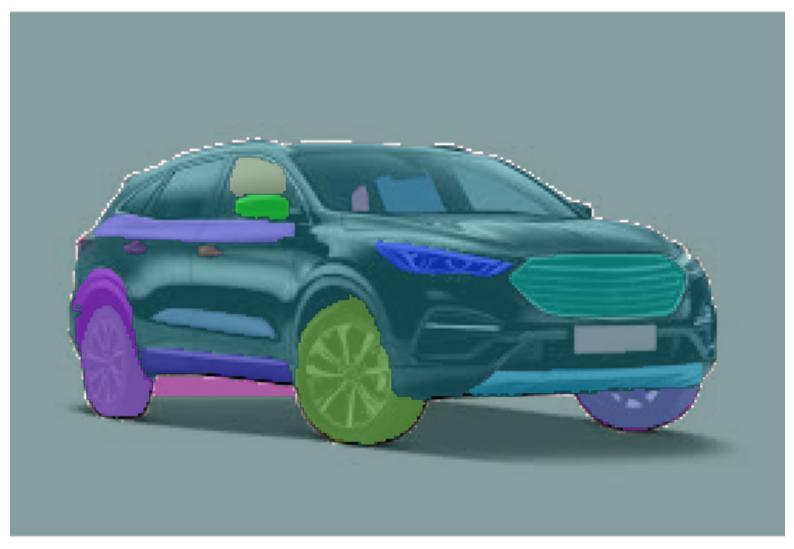
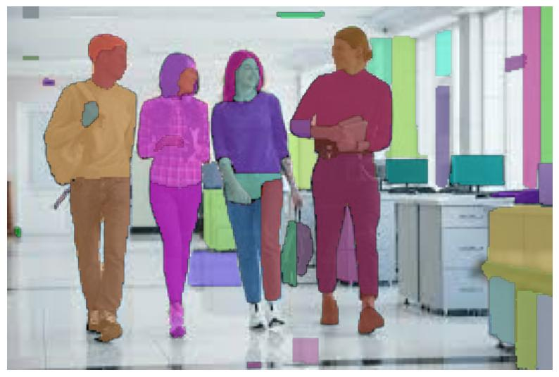
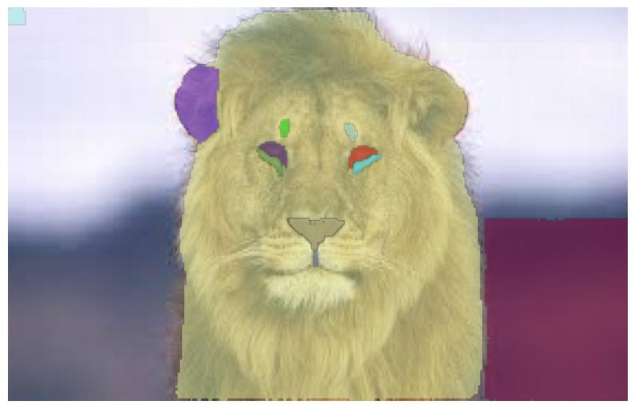
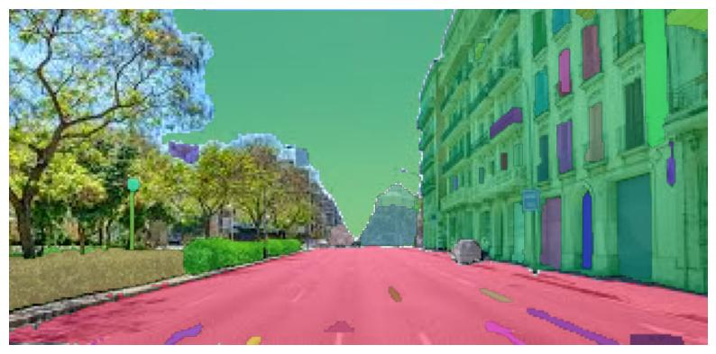
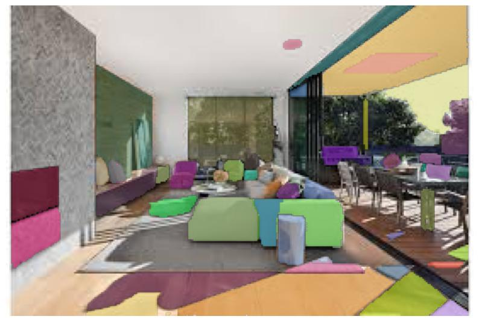
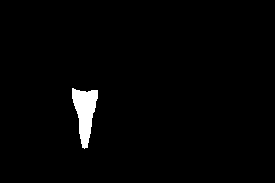
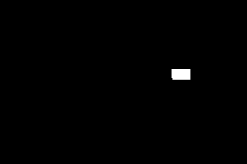
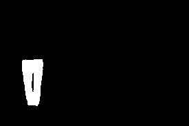

# Taller – Segmentación Semántica Multimodal: Qué hay en la Imagen

**Integrantes:**  
- Joan Sebastian Roberto Puerto  
- Baruj Vladimir Ramírez Escalante  
- Diego Alberto Romero Olmos  
- Maicol Sebastian Olarte Ramirez  
- Jorge Isaac Alandete Díaz  

**Fecha de entrega:**  23 de mayo de 2026 


---

## Descripción breve

En este taller se implementó un sistema de **segmentación semántica multimodal** utilizando el modelo **Segment Anything Model (SAM)** de Meta AI. El objetivo principal fue detectar y segmentar regiones de interés dentro de diferentes imágenes, generando máscaras binarias y visualizaciones coloreadas para múltiples objetos presentes en la escena.

La implementación fue desarrollada en **Python** usando Google Colab y librerías como OpenCV, PyTorch, NumPy y Matplotlib. El sistema permite:

* Procesar múltiples imágenes automáticamente.
* Generar máscaras de segmentación de alta precisión.
* Realizar segmentación interactiva mediante puntos seleccionados por el usuario.
* Exportar máscaras binarias y visualizaciones coloreadas.
* Calcular métricas geométricas de cada región segmentada como área, perímetro y centroide.

Se trabajó con un conjunto de 10 imágenes diferentes para evaluar el comportamiento del modelo en distintos escenarios visuales.

---

## Implementaciones realizadas (Python)

### 1. Instalación y configuración de SAM

Se instaló el modelo Segment Anything utilizando el repositorio oficial de Meta AI junto con las librerías necesarias para procesamiento de imágenes y visualización:

* `segment-anything`
* `torch`
* `opencv-python`
* `matplotlib`
* `numpy`
* `supervision`

Posteriormente se descargó el checkpoint preentrenado `sam_vit_b_01ec64.pth` y se configuró el dispositivo de ejecución (`cuda` o `cpu`).

---

### 2. Carga y procesamiento automático de imágenes

Se cargaron automáticamente las 10 imágenes almacenadas en la carpeta:

```text
media/input_images/
```

El sistema:

* recorrió todas las imágenes,
* verificó formatos válidos (`jpg`, `jpeg`, `png`),
* redimensionó imágenes grandes para mejorar rendimiento,
* aplicó segmentación automática usando `SamAutomaticMaskGenerator`.

---

### 3. Generación de máscaras semánticas

Para cada imagen se generaron múltiples máscaras binarias correspondientes a diferentes regiones detectadas por SAM.

Cada máscara:

* representa un objeto o región específica,
* se almacenó individualmente en formato `.png`,
* fue exportada a la carpeta:

```text
media/output_masks/
```

En total se generaron 65 máscaras segmentadas.

---

### 4. Visualización de regiones segmentadas

Las regiones segmentadas fueron visualizadas usando máscaras coloreadas superpuestas sobre la imagen original.

Cada segmento:

* recibe un color aleatorio,
* se mezcla parcialmente con la imagen original usando transparencia (`alpha`),
* facilita distinguir diferentes objetos presentes en la escena.

Las visualizaciones generadas fueron almacenadas en:

```text
media/output_visualizations/
```

---

### 5. Segmentación interactiva mediante puntos

Se implementó una versión interactiva utilizando `SamPredictor`.

El usuario puede seleccionar coordenadas manuales sobre la imagen:

```python
input_point = np.array([[300, 300]])
```

A partir de dicho punto:

* SAM identifica automáticamente el objeto correspondiente,
* genera múltiples propuestas de segmentación,
* retorna la máscara más adecuada según el puntaje de confianza.

Además:

* el punto seleccionado se dibuja sobre la imagen,
* la máscara se superpone visualmente para analizar el resultado.

---

### 6. Extracción de métricas geométricas

Para cada región segmentada se calcularon:

* Área
* Perímetro
* Centroide X
* Centroide Y

Estas métricas fueron obtenidas usando:

* `cv2.findContours`
* `cv2.arcLength`
* `cv2.moments`

Los resultados fueron exportados a:

```text
media/metrics/segmentation_metrics.csv
```

---

## Resultados visuales

Todos los resultados generados se encuentran en la carpeta [`media/`](./media).


### Imágenes originales utilizadas

| Imagen                                        | Descripción                                              |
| --------------------------------------------- | -------------------------------------------------------- |
|  | Imagen original utilizada para segmentación automática.  |
|  | Escena utilizada para pruebas de múltiples objetos.      |
|  | Imagen utilizada para validación de máscaras semánticas. |

---

### Resultados de segmentación automática

| Resultado                                                        | Descripción                                           |
| ---------------------------------------------------------------- | ----------------------------------------------------- |
|  | Máscaras generadas automáticamente sobre la imagen 1. |
|  | Visualización coloreada de regiones detectadas.       |
|  | Segmentación semántica de múltiples regiones.         |
|  | Resultado de SAM sobre objetos complejos.             |
|  | Máscaras superpuestas con transparencia.              |
|  | Identificación automática de regiones de interés.     |


### Resultados de segmentación automática

| Resultado                                                        | Descripción                                           |
| ---------------------------------------------------------------- | ----------------------------------------------------- |
|  | Ejecución en colab del codigo |
---

### Máscaras binarias generadas

| Máscara                                    | Descripción                                             |
| ------------------------------------------ | ------------------------------------------------------- |
|  | Máscara binaria correspondiente a una región detectada. |
|  | Segmentación individual exportada como PNG.             |
|  | Resultado binario de una región segmentada.             |
|  | Máscara utilizada para cálculo de métricas geométricas. |

---

## Código relevante (snippets)

El código principal se encuentra en:

```text
python/segmentacion_sam.ipynb
```

A continuación se muestran los fragmentos más importantes.

---

### Configuración del modelo SAM

```python
DEVICE = "cuda" if torch.cuda.is_available() else "cpu"

sam = sam_model_registry["vit_b"](
    checkpoint="sam_vit_b_01ec64.pth"
)

sam.to(device=DEVICE)

mask_generator = SamAutomaticMaskGenerator(sam)
predictor = SamPredictor(sam)
```

---

### Procesamiento automático de imágenes

```python
for file in image_files:

    image_path = os.path.join(input_folder, file)

    image = cv2.imread(image_path)

    image = cv2.cvtColor(image, cv2.COLOR_BGR2RGB)

    masks = mask_generator.generate(image)
```

---

### Visualización de máscaras coloreadas

```python
for mask in masks:

    color = np.random.random(3)

    segmentation = mask['segmentation']

    colored_mask = np.zeros(
        (segmentation.shape[0], segmentation.shape[1], 3)
    )

    for i in range(3):
        colored_mask[:, :, i] = segmentation * color[i]

    plt.imshow(
        np.dstack((colored_mask, segmentation * 0.5))
    )
```

---

### Segmentación interactiva por puntos

```python
input_point = np.array([[300, 300]])

input_label = np.array([1])

masks, scores, logits = predictor.predict(
    point_coords=input_point,
    point_labels=input_label,
    multimask_output=True
)
```

---

### Cálculo de métricas geométricas

```python
area = np.sum(binary)

perimeter = 0

for cnt in contours:
    perimeter += cv2.arcLength(cnt, True)

M = cv2.moments(binary)

if M["m00"] != 0:
    cx = int(M["m10"] / M["m00"])
    cy = int(M["m01"] / M["m00"])
```

---

## Prompts utilizados (IA generativa)

Siguiendo la guía de prompts del curso, se utilizaron herramientas de IA generativa para resolver problemas técnicos y optimizar el desarrollo.

### 1. Corrección de rutas de imágenes en Google Colab

**Prompt utilizado:**
“Estoy usando OpenCV en Google Colab y `cv2.imread()` devuelve `None`. ¿Cómo verifico correctamente la ruta de mis imágenes?”

**Resultado:**
Se identificó que las imágenes estaban dentro de:

```text
input_images/input_images/
```

y se corrigió la ruta del proyecto.

---

### 2. Optimización de rendimiento con SAM

**Prompt utilizado:**
“¿Por qué SAM tarda demasiado procesando imágenes en Colab y cómo puedo optimizarlo?”

**Resultado:**
Se implementó:

* reducción de resolución,
* uso de GPU (`cuda`),
* pruebas iniciales con una sola imagen.

---

### 3. Segmentación interactiva con coordenadas

**Prompt utilizado:**
“¿Cómo puedo mover el punto de segmentación interactiva en SAM?”

**Resultado:**
Se comprendió el uso de coordenadas:

```python
input_point = np.array([[x, y]])
```

permitiendo segmentar distintos objetos manualmente.

---

### 4. Exportación de métricas

**Prompt utilizado:**
“¿Cómo guardar un DataFrame de pandas en una carpeta creada dinámicamente?”

**Resultado:**
Se solucionó el error usando:

```python
os.makedirs("metrics", exist_ok=True)
```

---

## Aprendizajes y dificultades

### Aprendizajes

* SAM permite realizar segmentación semántica de alta precisión sin necesidad de entrenamiento adicional.
* La segmentación interactiva mediante puntos facilita seleccionar objetos específicos dentro de escenas complejas.
* Las máscaras binarias permiten realizar análisis geométricos avanzados como área, perímetro y centroides.
* El uso de GPU mejora significativamente el rendimiento del procesamiento de imágenes.
* La superposición de máscaras coloreadas facilita la interpretación visual de regiones segmentadas.

---

### Dificultades superadas

#### 1. Problemas con rutas de imágenes en Colab

Inicialmente OpenCV no encontraba las imágenes debido a una estructura incorrecta del ZIP. Se corrigió ajustando:

```python
input_folder = "input_images/input_images"
```

---

#### 2. Tiempo excesivo de procesamiento

El modelo SAM puede tardar varios minutos por imagen en CPU. Se solucionó:

* activando GPU,
* reduciendo resolución,
* realizando pruebas con menos imágenes inicialmente.

---

#### 3. Carpeta inexistente para exportar métricas

Pandas generaba:

```text
OSError: Cannot save file into a non-existent directory
```

La solución fue crear previamente la carpeta `metrics`.

---

#### 4. Selección manual de puntos

Al principio no era claro cómo seleccionar coordenadas para la segmentación interactiva. Se solucionó visualizando los ejes de la imagen y ajustando manualmente las coordenadas `(x,y)`.

---

## Reflexión sobre los métodos

SAM mostró una gran capacidad para segmentar objetos complejos incluso en escenas con múltiples elementos y fondos variados.

Las principales ventajas observadas fueron:

* Segmentación precisa a nivel de píxel.
* Excelente separación entre objetos y fondo.
* Capacidad interactiva mediante puntos.
* No requiere entrenamiento personalizado.

Sin embargo:

* el modelo es computacionalmente pesado,
* consume bastante memoria,
* y requiere GPU para un rendimiento óptimo.

Las imágenes con:

* objetos claramente definidos,
* buen contraste,
* y menor ruido visual

obtuvieron mejores resultados de segmentación.

---

## Estructura del proyecto

```text
semana_11_3_segmentacion_semantica_sam_deeplab/
├── python/
│   └── segmentacion_sam.ipynb
├── media/
│   ├── input_images/
│   ├── output_masks/
│   ├── output_visualizations/
│   └── metrics/
└── README.md
```

---

## Checklist de entrega

* [x] Carpeta con formato `semana_11_3_segmentacion_semantica_sam_deeplab`
* [x] Código limpio y funcional
* [x] Segmentación semántica implementada
* [x] Segmentación interactiva implementada
* [x] Métricas geométricas calculadas
* [x] Imágenes y máscaras exportadas
* [x] Resultados visuales incluidos en `media/`
* [x] README completo con documentación
* [x] Commits descriptivos en inglés
* [x] Repositorio organizado y público
