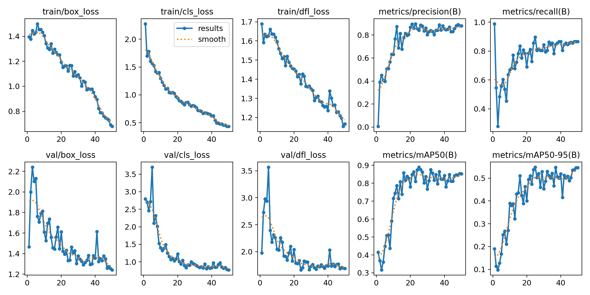
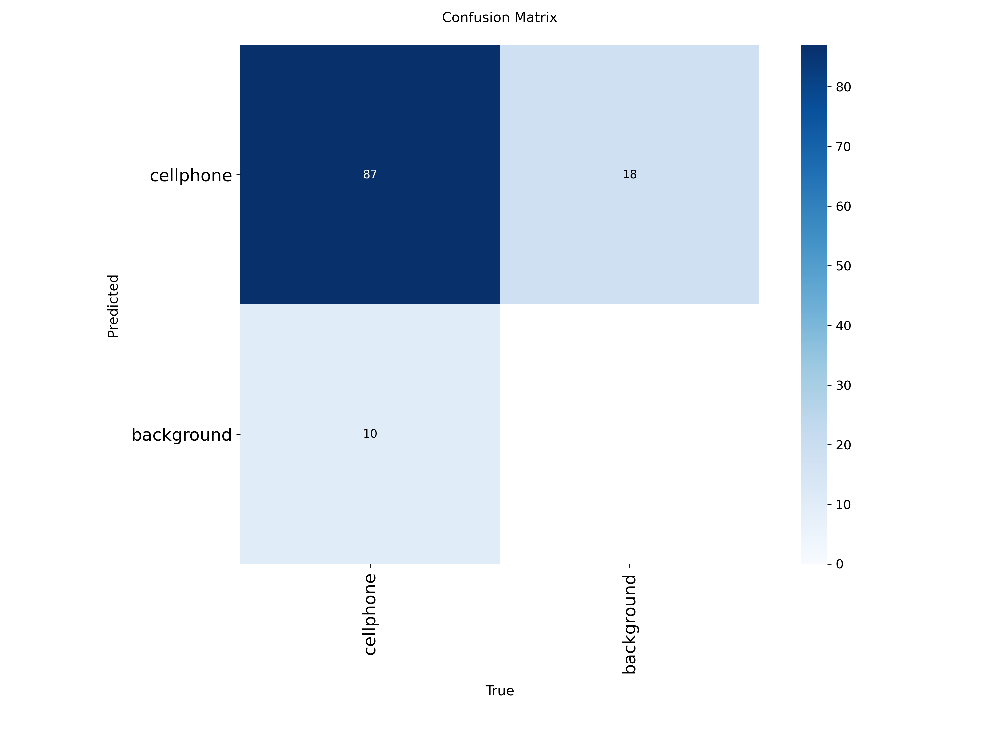
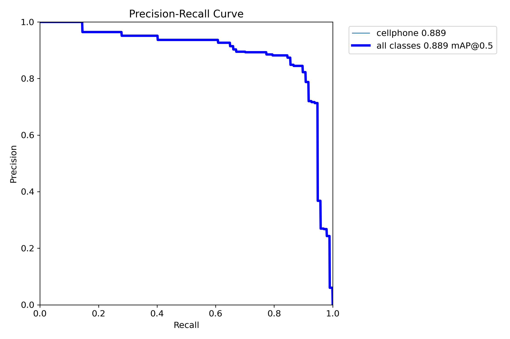
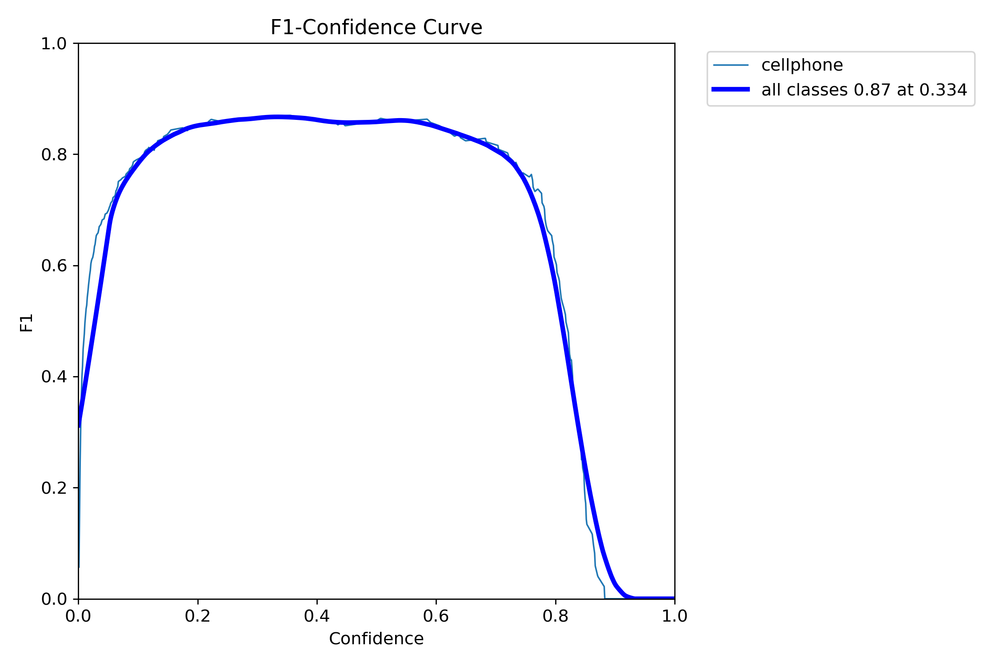
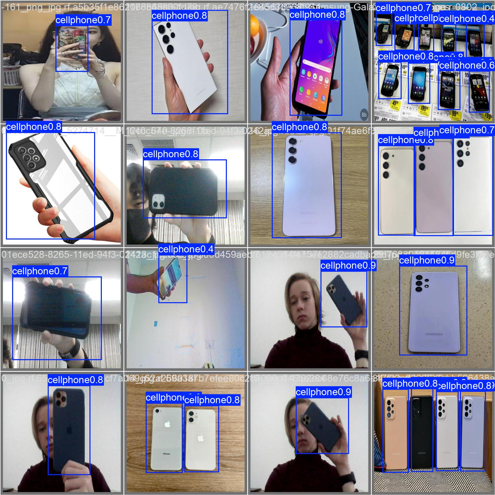
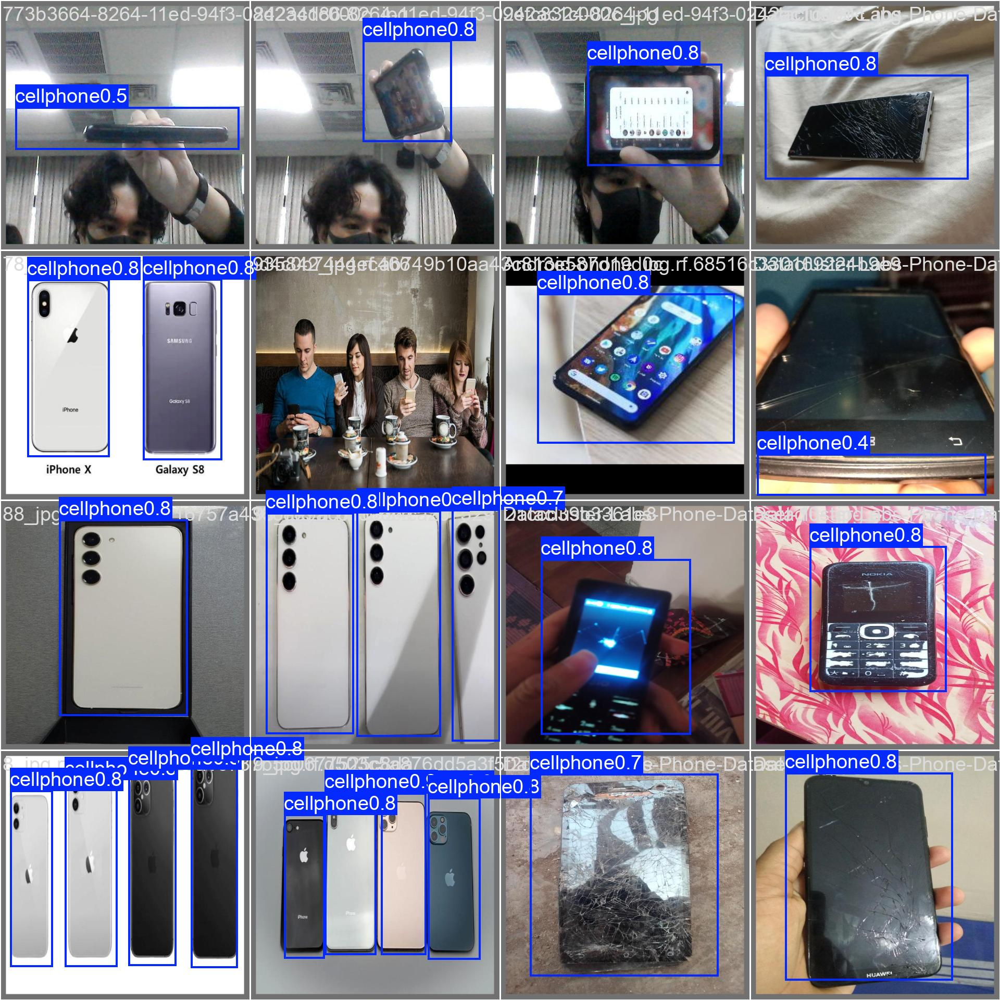
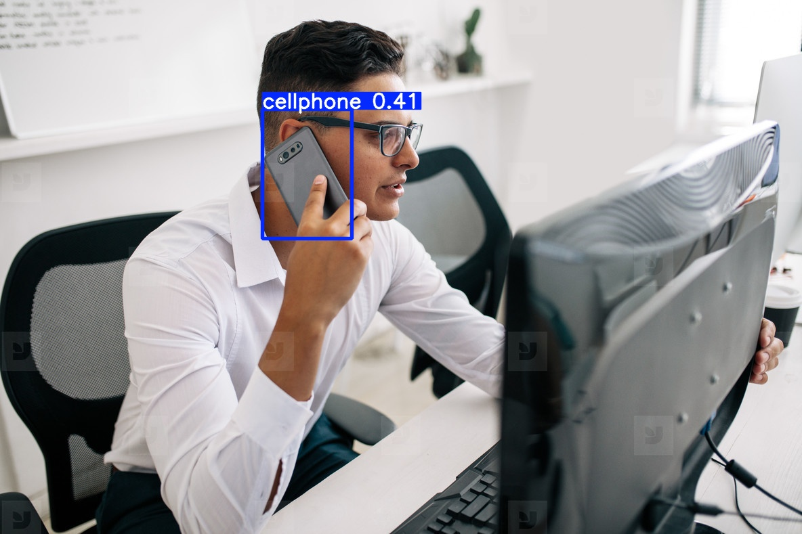
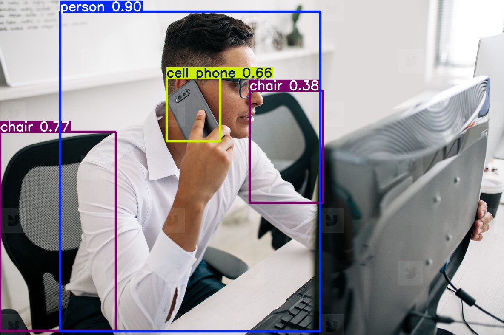

# 🎯 Taller — Transfer Learning con YOLOv8: Detección Personalizada

**Nombre del estudiante:** 
- Joan Sebastian Roberto Puerto  
- Baruj Vladimir Ramírez Escalante  
- Diego Alberto Romero Olmos  
- Maicol Sebastian Olarte Ramirez  
- Jorge Isaac Alandete Díaz 

**Fecha de entrega:** Junio 2026

---

## 📋 Descripción

Este taller tiene como objetivo entrenar un modelo de detección de objetos personalizado utilizando **YOLOv8** y la técnica de **Transfer Learning**. Se utilizó un dataset de detección de teléfonos celulares en formato YOLOv8, compuesto por 475 imágenes anotadas. El modelo fue entrenado durante 50 épocas y posteriormente evaluado mediante métricas estándar de visión por computador como Precision, Recall, mAP@0.5 y matriz de confusión.

---

## 🛠️ Implementación

| Elemento       | Detalle                                      |
|----------------|----------------------------------------------|
| Lenguaje       | Python                                       |
| Framework      | YOLOv8 + PyTorch + Ultralytics               |
| Herramientas   | `ultralytics`, `PyTorch`, `OpenCV`, `matplotlib` |
| Entorno        | Google Colab con GPU NVIDIA                  |

---

## 📂 Estructura del Repositorio

```
semana_11_4_transfer_learning_yolo_deteccion_personalizada/
├── python/
│   └── transfer_learning_yolo.ipynb
├── media/
│   ├── results.png
│   ├── confusion_matrix.png
│   ├── BoxPR_curve.png
│   ├── BoxF1_curve.png
│   ├── prediction_custom.jpg
│   ├── prediction_base.jpg
│   ├── val_batch0_pred.jpg
│   └── val_batch1_pred.jpg
└── README.md
```

---

## 📊 Dataset

**Cell Phone Detection Dataset**

| Conjunto      | Imágenes |
|---------------|----------|
| Entrenamiento | 381      |
| Validación    | 63       |
| Prueba        | 31       |
| **Total**     | **475**  |

- **Número de clases:** 1  
- **Clase detectada:** `Cell Phone`  
- **Formato de anotación:** Bounding boxes en formato YOLO

---

## 🔄 Flujo del Notebook

| Paso | Descripción |
|------|-------------|
| 1 | Instalación de dependencias (`ultralytics`) |
| 2 | Verificación de GPU disponible |
| 3 | Carga y descompresión del dataset |
| 4 | Verificación del archivo `data.yaml` |
| 5 | Carga del modelo preentrenado YOLOv8n |
| 6 | Entrenamiento mediante Transfer Learning (50 épocas) |
| 7 | Evaluación con métricas de detección |
| 8 | Visualización de curvas y matriz de confusión |
| 9 | Inferencia sobre imágenes nuevas |
| 10 | Comparación entre modelo base y modelo ajustado |
| 11 | Exportación del modelo a formato ONNX |

---

## 💻 Código Relevante

### Instalación
```bash
pip install -q ultralytics
```

### Verificación de GPU
```python
import torch
print("GPU disponible:", torch.cuda.is_available())
if torch.cuda.is_available():
    print("GPU:", torch.cuda.get_device_name(0))
```

### Carga del modelo preentrenado
```python
from ultralytics import YOLO
model = YOLO("yolov8n.pt")
```

### Entrenamiento
```python
results = model.train(
    data=yaml_path,
    epochs=50,
    imgsz=640,
    batch=16,
    project="cell_phone_training",
    name="transfer_learning_yolov8n"
)
```

### Evaluación
```python
metrics = model.val()
print(metrics)
```

### Inferencia con modelo personalizado
```python
best_model.predict(
    source=test_image,
    conf=0.25,
    save=True,
    project="predictions",
    name="custom_model"
)
```

### Comparación con modelo base
```python
base_model = YOLO("yolov8n.pt")
base_model.predict(
    source=test_image,
    conf=0.25,
    save=True,
    project="predictions",
    name="base_model"
)
```

### Exportación del modelo
```python
best_model.export(format="onnx")
```

---

## 📈 Resultados Visuales

### Curvas de Entrenamiento


### Matriz de Confusión


### Curva Precision-Recall


### Curva F1


### Predicciones en lote (validación)
  


### Predicción con modelo personalizado vs. modelo base
| Modelo Personalizado | Modelo Base |
|----------------------|-------------|
|  |  |

---

## 💡 Prompts Utilizados con IA Generativa

Se utilizó IA generativa (Claude) para apoyar las siguientes tareas:

- Estructurar el notebook de entrenamiento.
- Explicar el flujo de Transfer Learning con YOLOv8.
- Organizar el README siguiendo las especificaciones del taller.
- Documentar el proceso de entrenamiento y evaluación.

---

## 🎓 Aprendizajes y Dificultades

### Aprendizajes
- **Transfer Learning** permite reutilizar características aprendidas previamente por modelos entrenados sobre grandes datasets, reduciendo tiempo y datos necesarios.
- **YOLOv8** simplifica significativamente el entrenamiento y evaluación de detectores de objetos mediante su API de alto nivel.
- Las métricas **Precision**, **Recall** y **mAP** permiten evaluar el desempeño de un detector de manera objetiva.
- La **matriz de confusión** ayuda a identificar errores de clasificación y detección.

### Dificultades
- Configurar correctamente la estructura del dataset y el archivo `data.yaml`.
- Ajustar los parámetros de entrenamiento para obtener una buena convergencia.
- Comparar objetivamente el rendimiento del modelo personalizado frente al modelo base.

---

## 🔍 Reflexión

La clase `Cell Phone` presentó buenos resultados debido a la cantidad de ejemplos disponibles y la consistencia de las anotaciones. Para mejorar aún más la precisión sería recomendable:

- Aumentar el dataset a más de **1000 imágenes**.
- Incorporar diferentes **condiciones de iluminación**.
- Variar los **ángulos de captura** y escenarios de fondo.