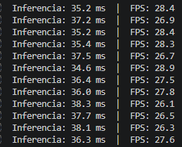

# Detección de Objetos en Tiempo Real con YOLO y Webcam

Nombres:

- Joan Sebastian Roberto Puerto  
- Baruj Vladimir Ramírez Escalante  
- Diego Alberto Romero Olmos  
- Maicol Sebastian Olarte Ramirez  
- Jorge Isaac Alandete Díaz  

Descripción breve: Este taller se centra en implementar detección de objetos en tiempo real usando el modelo *YOLO* (You Only Look Once) sobre video capturado directamente desde la cámara, midiendo el rendimiento de inferencia frame a frame como metricas de desempeño.


## Implementaciones

### *Python*

El código en Python se puede resumir en 4 bloques principales:

**1. Carga del modelo YOLO**

- Se importan `cv2`, `time` y `YOLO` de la librería `ultralytics`.
- Se carga el modelo preentrenado `yolov8n.pt` (variante *nano*), que se descarga automáticamente la primera vez.
- La variante *nano* es la más liviana de la familia YOLOv8, ideal para inferencia en tiempo real sin GPU dedicada.

**2. Captura de video en tiempo real**

- `cv2.VideoCapture(0)` abre la cámara principal del dispositivo.
- Se verifica que la cámara esté disponible antes de iniciar el bucle; en caso contrario el programa termina con un mensaje de error.

**3. Detección y visualización por frame**

- En cada iteración se mide el tiempo de inicio con `time.time()`.
- Se llama a `model.predict(source=frame, stream=True, verbose=False)`: el parámetro `stream=True` devuelve un generador que optimiza el uso de memoria al no acumular todos los resultados.
- Para cada caja detectada se extraen coordenadas `xyxy`, ID de clase (`model.names`), y confianza; se descartan detecciones por debajo del 40 %.
- Se dibujan: rectángulo de color único por clase, fondo sólido para la etiqueta y texto blanco con nombre de clase + porcentaje de confianza.
- Al finalizar cada frame se calculan el tiempo de inferencia y los FPS, que se imprimen en consola y se superponen sobre el video.

**4. Salida del programa**

- La tecla `q` rompe el bucle principal.
- `cap.release()` y `cv2.destroyAllWindows()` liberan la cámara y cierran todas las ventanas correctamente.


## Resultados visuales

### *Python*

El siguiente es una muestra del funcionamiento del algoritmo de yolo. Se puede observar como el algoritmo se encuentra identificando una taza, una copa de vidrio y una botellita. Tambíen hay un momento que se perturba al algoritmo con una mano, lo que hace que identifique la mano, pero empiece a tener errores con la identificación de la copa de vino.


Además del *feedback* presente en la pantalla de la aplicación, también se puede monitorear desde la consola de ejecución. 



## Código relevante

### *Python*

La siguiente línea ejecuta la inferencia sobre un frame y devuelve los resultados como generador:

```python
resultados = model.predict(source=frame, stream=True, verbose=False)
```

Extracción de datos de cada bounding box detectado:

```python
x1, y1, x2, y2 = map(int, caja.xyxy[0])
clase_id  = int(caja.cls[0])
clase_nom = model.names[clase_id]
confianza = float(caja.conf[0])
```

Cálculo del tiempo de inferencia y FPS por frame:

```python
t_inicio     = time.time()
# ... inferencia ...
t_inferencia = time.time() - t_inicio
fps          = 1.0 / t_inferencia if t_inferencia > 0 else 0
```

Umbral mínimo de confianza para filtrar detecciones con ruido:

```python
if confianza < 0.40:
    continue
```

## Prompts utilizados

### *Python*

El siguiente prompt puede generar el código en Python:

```plaintext
Implementa un script de Python para un taller de computación visual que realice detección de objetos en tiempo real usando YOLOv8 y OpenCV. El código debe seguir estos pasos: importar cv2, time y YOLO de ultralytics y cargar el modelo yolov8n.pt; capturar video desde la cámara con cv2.VideoCapture; y en cada frame medir el tiempo de inicio, realizar la detección con model.predict(source=frame, stream=True), dibujar bounding boxes con etiquetas de clase y porcentaje de confianza, calcular e imprimir el tiempo de inferencia en ms y los FPS, y mostrar el resultado con cv2.imshow(). Usar la tecla q para salir y liberar los recursos al final.
```


## Aprendizajes y dificultades

Se aprendió a usar el algoritmo de yolo en una implementación en tiempo real con python usando una webcam, a su vez que se utilizan metricas de rendimiento (en este caso la dmedición de los frames por segundo) para monitorear el funcionamiento de la implementación.
