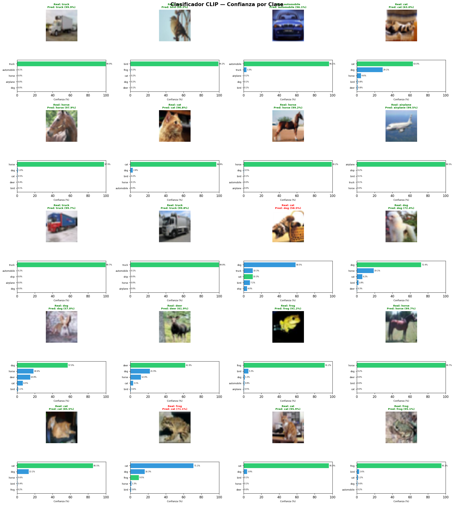
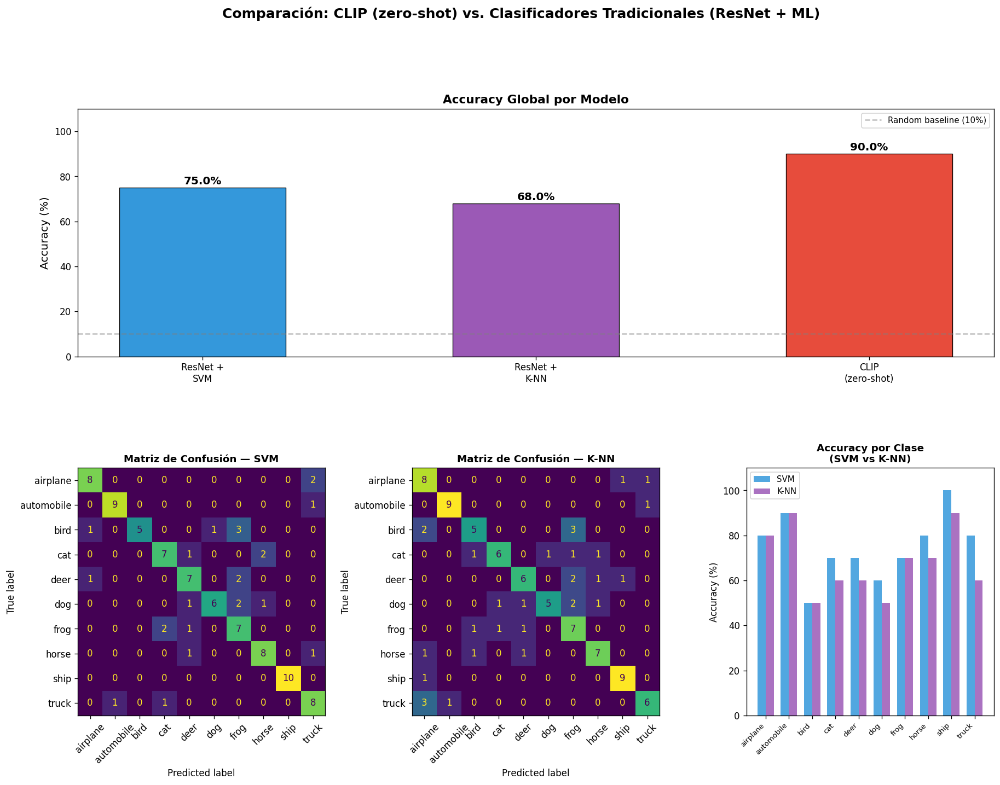
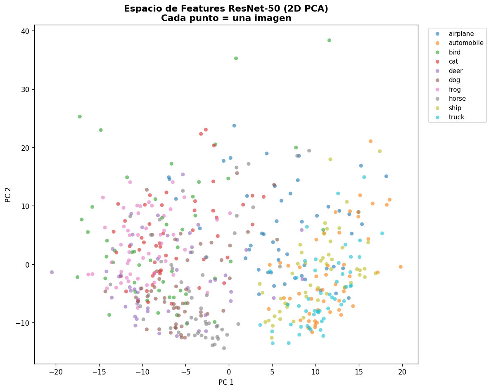

# Text + Imagen: Clasificación Asistida para Diagnóstico o Arte

Nombres: 
- Joan Sebastian Roberto Puerto  
- Baruj Vladimir Ramírez Escalante  
- Diego Alberto Romero Olmos  
- Maicol Sebastian Olarte Ramirez  
- Jorge Isaac Alandete Díaz  
Fecha de entrega: 1/6/2026

Descripción breve: Implementación de un sistema de clasificación de imágenes en Python con dos enfoques: un clasificador CLIP zero-shot y un clasificador tradicional basado en extracción de características con ResNet-50, seguido de SVM y K-NN para comparación de desempeño de un modelo manual con uno entrenado.

## Implementaciones

*Es necesario descargar el modelo para el funcionamiento de este código*

### *Python*

El código en Python se compone de dos scripts, uno para cada forma de clasificación, manual y ya entrenada con CLIP.

El script `clip_classifier.py` realiza el flujo completo de clasificación zero-shot:

1. Carga un modelo CLIP preentrenado.
2. Carga imágenes de CIFAR-10 o imágenes propias desde una carpeta.
3. Define descripciones textuales detalladas para cada clase.
4. Convierte textos e imágenes en embeddings comparables.
5. Calcula probabilidades por clase, muestra predicciones y guarda gráficas de confianza.

Este enfoque permite clasificar sin entrenar un modelo supervisado nuevo, usando únicamente descripciones de texto.

### *Clasificador tradicional*

El script `traditional_classifier.py` implementa una comparación clásica basada en aprendizaje supervisado:

1. Carga ResNet-50 como extractor de características.
2. Obtiene vectores visuales de cada imagen.
3. Aplica escalado y PCA para reducir dimensionalidad.
4. Entrena dos modelos: SVM con kernel RBF y K-NN.
5. Evalúa accuracy, matriz de confusión y comparación con CLIP.

Este enfoque sirve como línea base tradicional frente al comportamiento zero-shot de CLIP.

## Resultados visuales

### *Python*

Los resultados generados por los scripts se guardan como imágenes para facilitar el análisis visual, a continuación se da una breve explicación de las imagenes generadas por los scripts:

La siguiente imagen muestra cada imagen junto con su predicción y las barras de confianza de las clases más probables.



La siguiente es comparación del accuracy de CLIP contra SVM y K-NN, e incluye matrices de confusión.



Se visualiza el espacio de características extraídas por ResNet-50 mediante PCA en 2D.



## Código relevante

### *Python*

```python
def load_clip_model(model_name: str = "ViT-B/32"):
    print(f"\n[1] Cargando modelo CLIP ({model_name}) en {DEVICE}...")
    model, preprocess = clip.load(model_name, device=DEVICE)
    model.eval()
    return model, preprocess
```

```python
def encode_text_prompts(model, class_names: list[str]):
    text_features_list = []
    with torch.no_grad():
        for cls in class_names:
            prompts = CLASS_DESCRIPTIONS.get(
                cls,
                [f"a photo of a {cls}", f"an image of {cls}", f"a {cls}"],
            )
            tokens = clip.tokenize(prompts).to(DEVICE)
            feats = model.encode_text(tokens)
            feats = feats / feats.norm(dim=-1, keepdim=True)
            avg_feat = feats.mean(dim=0)
            avg_feat = avg_feat / avg_feat.norm()
            text_features_list.append(avg_feat)
    return torch.stack(text_features_list)
```

```python
def load_feature_extractor():
    backbone = models.resnet50(weights=models.ResNet50_Weights.IMAGENET1K_V2)
    extractor = nn.Sequential(*list(backbone.children())[:-1])
    extractor = extractor.to(DEVICE)
    extractor.eval()
    return extractor
```

```python
def build_and_train_classifiers(X_train, y_train):
    scaler = StandardScaler()
    X_scaled = scaler.fit_transform(X_train)

    pca = PCA(n_components=0.95, random_state=SEED)
    X_pca = pca.fit_transform(X_scaled)

    le = LabelEncoder()
    y_enc = le.fit_transform(y_train)

    svm = SVC(kernel="rbf", C=10.0, gamma="scale", probability=True, random_state=SEED)
    svm.fit(X_pca, y_enc)

    knn = KNeighborsClassifier(n_neighbors=7, metric="cosine")
    knn.fit(X_pca, y_enc)

    return scaler, pca, le, svm, knn, X_pca, y_enc
```

## Prompts utilizados

### *Python*

El siguiente prompt se utilizo como base inicial para la generación de los scripts:

```plaintext
Necesito implementar un taller académico para comparar clasificación de imágenes usando CLIP y un clasificador tradicional basado en extracción de características.

Genera código completo, modular y comentado en Python para ejecutarse localmente.

Requisitos generales:

* Utilizar PyTorch, torchvision, scikit-learn, matplotlib y PIL.
* Organizar la solución en varios archivos Python.
* Suponer que existe un dataset organizado por carpetas:

* Mostrar resultados por consola y mediante gráficas.

Parte 1: Clasificación Zero-Shot con CLIP
Parte 2: Clasificador Tradicional ocn ResNet
Parte 3: Comparación

```

## Aprendizajes y dificultades

Gracias a las graficas generadas se pudieron observar qué tan confiables son las predicciones, en qué clases se equivoca más cada modelo y cómo se separan las imágenes en el espacio de características.

Adicionalmente, gracias al taller se pudo observar que CLIP  puede ofrecer una solución flexible y rápida para clasificación zero-shot, pero su desempeño depende mucho de la calidad de los textos. Adicionalmente, su comparación con el método manual-entrenado permite entender la diferencia entre modelos semánticos modernos y métodos supervisados clásicos

