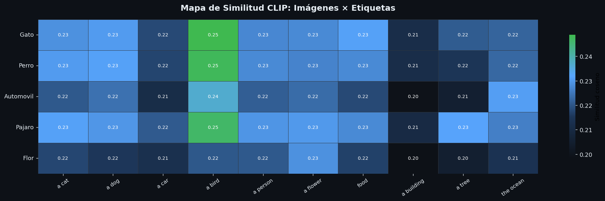
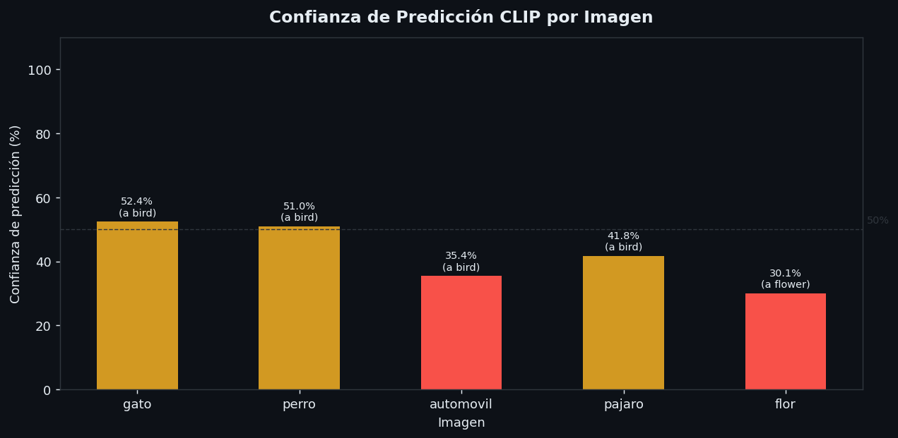
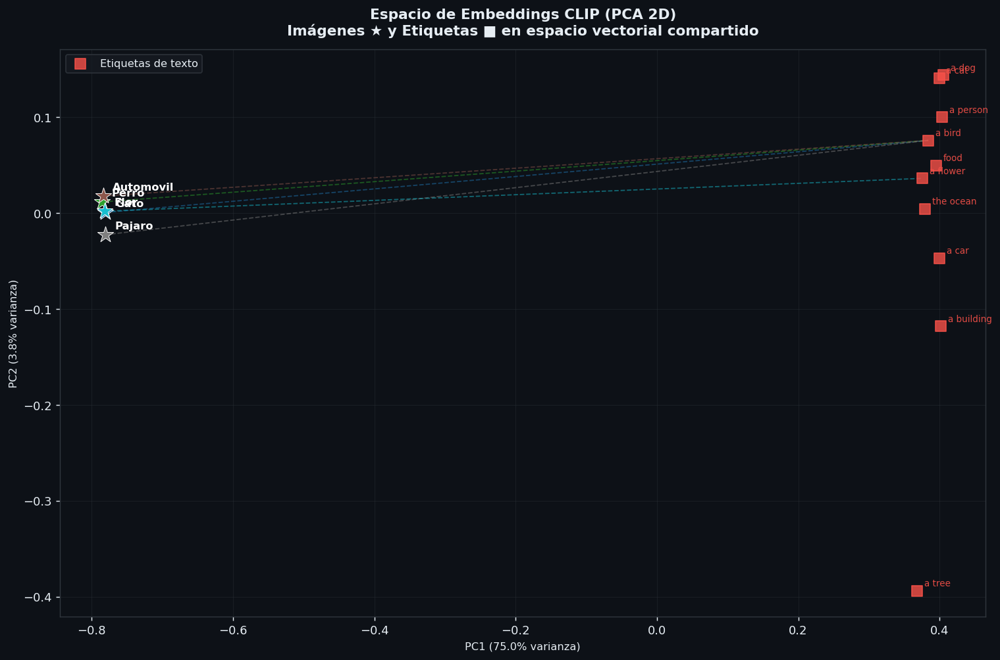

# Visual y Verbal: Clasificación de Imágenes con CLIP

Nombres: 
- Joan Sebastian Roberto Puerto  
- Baruj Vladimir Ramírez Escalante  
- Diego Alberto Romero Olmos  
- Maicol Sebastian Olarte Ramirez  
- Jorge Isaac Alandete Díaz  

Fecha de entrega: 1/6/2026

Descripción breve: Implementación paso a paso de clasificación de imágenes mediante lenguaje natural usando el modelo CLIP (Contrastive Language-Image Pretraining) de OpenAI, a través de la librería HuggingFace Transformers.

## Implementaciones

### *Python*

El código en Python se puede resumir en 5 módulos principales:

1. Carga del modelo CLIP (`paso1_cargar_modelo.py`)
- Descarga el modelo `openai/clip-vit-base-patch32` desde HuggingFace Hub
- Detecta automáticamente si hay GPU disponible (CUDA) o usa CPU
- Pone el modelo en modo evaluación (`model.eval()`) para desactivar gradientes

2. Carga de imágenes y etiquetas (`paso2_cargar_datos.py`)
- Descarga imágenes de ejemplo desde URLs públicas usando `requests` y `Pillow`
- Define un conjunto de etiquetas en lenguaje natural (ej. `"a photo of a cat"`)
- Incluye soporte para cargar imágenes desde carpeta local

3. Embeddings y similitud coseno (`paso3_embeddings_similitud.py`)**
- Extrae embeddings de imagen con `model.get_image_features()` y de texto con `model.get_text_features()`
- Normaliza los vectores con `F.normalize()` para calcular similitud coseno como producto punto
- Convierte similitudes en probabilidades con softmax escalado por temperatura

4. Anotación visual de imágenes (`paso4_anotar_imagenes.py`)
- Genera una figura con la imagen original y un panel lateral de barras horizontales
- Colorea las barras según nivel de confianza: verde (≥50%), amarillo (≥15%), rojo (<15%)
- Exporta cada imagen anotada como archivo `.png` independiente

5. Visualización de resultados (`paso5_visualizar.py`)
- Heatmap de similitudes: matriz imágenes × etiquetas con anotaciones numéricas
- Gráfico de barras con la confianza de predicción por imagen
- Proyección PCA 2D del espacio de embeddings, mostrando imágenes y etiquetas en el mismo espacio vectorial

## Resultados visuales

### *Python*
Heatmap de similitud coseno para todas las imágenes y etiquetas 

Confianza de predicción por imagen en gráfico de barras

Espacio latente 2D con imágenes (★) y etiquetas (■) proyectadas


## Código relevante

### *Python*

Extracción de embeddings y corrección de compatibilidad con distintas versiones de `transformers`:

```python
def _extraer_tensor(salida) -> torch.Tensor:
    """
    Extrae el tensor de embedding de la salida del modelo,
    sea un torch.Tensor directo o un objeto ModelOutput de HuggingFace.
    """
    if isinstance(salida, torch.Tensor):
        return salida
    for attr in ("image_embeds", "text_embeds", "pooler_output", "last_hidden_state"):
        valor = getattr(salida, attr, None)
        if valor is not None:
            if attr == "last_hidden_state":
                return valor[:, 0, :]
            return valor
    raise ValueError(f"No se pudo extraer tensor de: {type(salida)}")


def obtener_embedding_imagen(model, processor, imagen, device):
    with torch.no_grad():
        inputs = processor(images=imagen, return_tensors="pt").to(device)
        salida = model.get_image_features(**inputs)
        embedding = _extraer_tensor(salida)
        embedding = F.normalize(embedding, dim=-1)
    return embedding
```

Cálculo de similitud coseno y conversión a probabilidades:

```python
def calcular_similitud(emb_imagen, emb_textos):
    # Producto punto entre vectores normalizados = similitud coseno
    similitudes = (emb_imagen @ emb_textos.T).squeeze(0)
    return similitudes.cpu().numpy()

def calcular_probabilidades(similitudes, temperatura=0.01):
    # Softmax con temperatura: más baja = más confianza, más alta = más uniforme
    logits = similitudes / temperatura
    exp_logits = np.exp(logits - np.max(logits))  # estabilidad numérica
    return exp_logits / exp_logits.sum()
```

## Prompts utilizados

### *Python*

```plaintext
Necesito implementar un taller de computación visual con los siguientes pasos en Python 
para correr en un entorno local:
1. Cargar un modelo CLIP y tokenizador
2. Cargar una imagen y conjunto de etiquetas
3. Obtener embeddings y comparar similitud
4. Diseñar cada imagen con los textos
5. Visualizar resultados

Me puedes ayudar a generar los scripts necesarios para copiarlos y usarlos localmente?
```

## Aprendizajes y dificultades

Durante el proceso, los principales aprendizajes se centraron en comprender cómo CLIP opera en un espacio vectorial compartido entre imágenes y texto, lo que permite realizar una clasificación zero-shot sin necesidad de entrenamiento adicional. Asimismo, se observó que la proyección PCA es una herramienta fundamental para visualizar de forma intuitiva los aciertos o fallos del modelo, demostrando que las imágenes que se encuentran más cercanas a una etiqueta en el espacio 2D suelen ser clasificadas de manera correcta.

Por otro lado, surgieron ciertas dificultades técnicas, como la incompatibilidad entre las diferentes versiones de la librería transformers; específicamente, el método get_image_features() retorna un objeto BaseModelOutputWithPooling en lugar de un tensor directo en ciertas versiones, lo que obligó a implementar una función auxiliar llamada _extraer_tensor() para gestionar ambos casos. Adicionalmente, se identificó que la primera ejecución del sistema requiere la descarga completa del modelo, el cual pesa aproximadamente 340 MB, un factor que puede demorar el inicio del proceso por varios minutos dependiendo de la velocidad de la conexión a internet.
