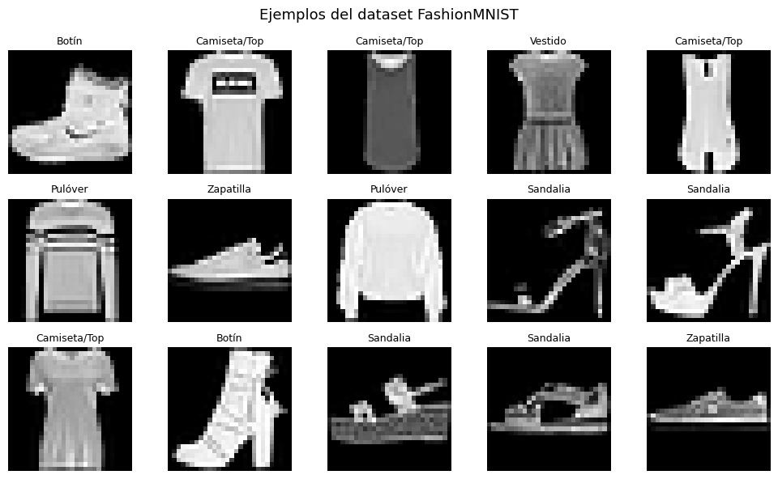
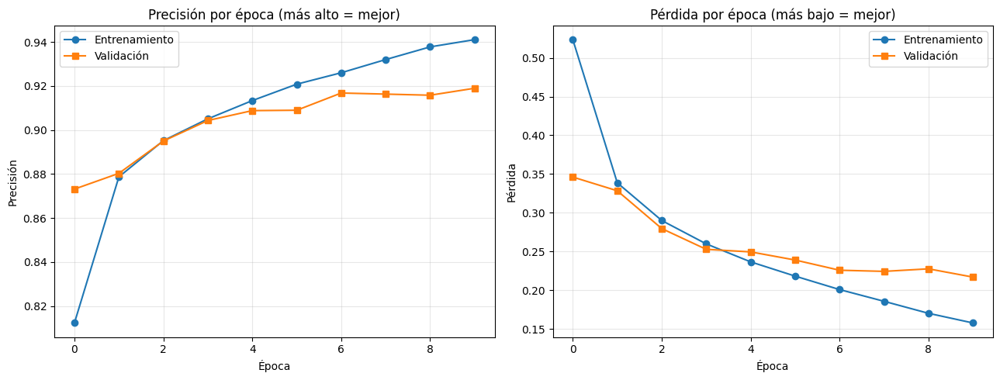
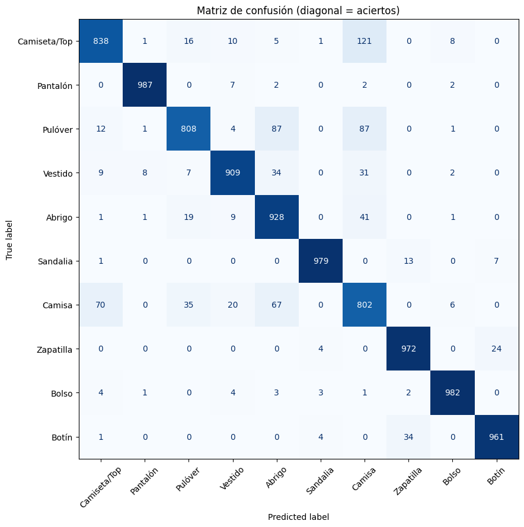
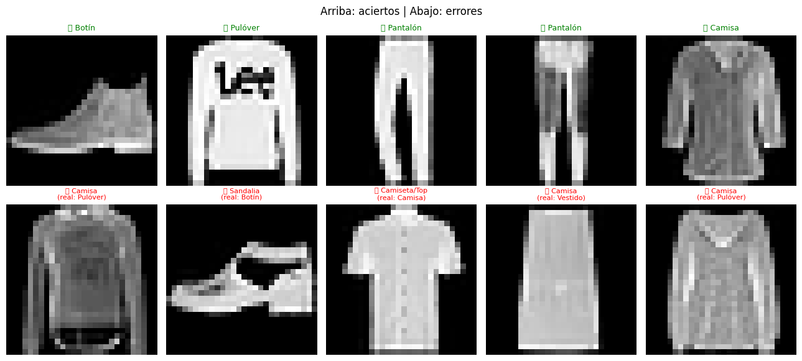

# Taller Cnn Basico Deep Learning Keras Pytorch

## Integrantes

- Joan Sebastian Roberto Puerto
- Baruj Vladimir Ramírez Escalante
- Diego Alberto Romero Olmos
- Maicol Sebastian Olarte Ramirez
- Jorge Isaac Alandete Díaz

**Fecha de entrega:** 1 de junio de 2026

---

## Descripción breve

La idea del taller era construir una red neuronal convolucional (CNN) desde cero para clasificar imágenes, sin partir de un modelo ya entrenado. Decidimos hacerlo con Keras (TensorFlow) sobre el dataset **FashionMNIST**, que son 70.000 imágenes de prendas de ropa en escala de grises de 28x28 píxeles, repartidas en 10 categorías.

Elegimos FashionMNIST en lugar del clásico MNIST de dígitos porque clasificar números a mano termina dando casi el 99% sin esfuerzo y no se ve mucho dónde falla el modelo. Con ropa el problema es más interesante: el modelo confunde prendas parecidas (una camisa con una camiseta, por ejemplo) y eso se ve clarísimo en la matriz de confusión, que al final fue lo que más nos sirvió para entender qué estaba pasando por dentro.

Todo el desarrollo se hizo en Google Colab usando la GPU gratuita (una Tesla T4), porque entrenar en el CPU del portátil de uno de nosotros se demoraba bastante más.

---

## Implementaciones

### Keras / TensorFlow (FashionMNIST)

Esta fue la implementación principal y la única que terminamos completa. El flujo quedó así:

**Carga y exploración de datos.** Keras ya trae FashionMNIST listo con `keras.datasets.fashion_mnist`, así que la descarga fue directa. Lo dividimos en 60.000 imágenes de entrenamiento y 10.000 de prueba (esta división ya viene hecha en el dataset). Antes de tocar el modelo graficamos varias imágenes con su etiqueta para ver con qué estábamos trabajando.

**Preprocesamiento.** Dos pasos. Primero normalizamos los píxeles dividiendo entre 255 para pasarlos del rango 0–255 a 0–1, que es con lo que la red entrena más estable. Segundo, agregamos la dimensión del canal con `np.expand_dims`, porque las capas `Conv2D` esperan que la imagen diga cuántos canales tiene (1 en grises, sería 3 si fuera a color).

**Arquitectura del modelo.** Seguimos la estructura sugerida en el enunciado:

```
Conv2D(32) → ReLU → MaxPooling → Conv2D(64) → ReLU → MaxPooling → Flatten → Dense(128) → Dropout → Dense(10) → Softmax
```

Cada parámetro lo entendimos así:
- **Filtros (32 y 64):** son la cantidad de "patrones" distintos que busca cada capa convolucional. Pusimos más filtros en la segunda capa (64) porque ahí ya se combinan detalles más complejos.
- **kernel_size (3x3):** el tamaño de la ventana que recorre la imagen. 3x3 es lo más común para empezar.
- **padding='same':** evita que la imagen se encoja en los bordes al aplicar la convolución.
- **ReLU:** la función de activación que deja pasar los valores positivos y vuelve cero los negativos. Es la que le permite a la red aprender cosas no lineales.
- **MaxPooling (2x2):** reduce el tamaño de la imagen quedándose con el valor más alto de cada zona, lo que hace el modelo más liviano.
- **Flatten:** aplana la imagen 2D a un vector para poder conectarla a las capas densas.
- **Dense:** capas completamente conectadas. La última tiene 10 neuronas, una por categoría.
- **Dropout(0.25):** apaga el 25% de las neuronas al azar en cada paso del entrenamiento para que el modelo no memorice.
- **Softmax:** convierte la salida en probabilidades que suman 1, para poder elegir la categoría más probable.

**Entrenamiento.** Usamos el optimizador **Adam** y la función de pérdida `sparse_categorical_crossentropy` (la versión "sparse" porque nuestras etiquetas son enteros del 0 al 9, no están en one-hot). Entrenamos 10 épocas con batches de 128 imágenes y apartamos un 10% para validación.

**Evaluación.** Medimos la precisión final sobre el set de prueba, generamos la matriz de confusión con `scikit-learn` y graficamos ejemplos de aciertos y errores.

**Bonus.** Agregamos el Dropout (mencionado arriba), guardamos el modelo en formato `.keras` y lo volvimos a cargar para confirmar que daba la misma precisión, y entrenamos un segundo modelo con kernel 5x5 y menos filtros para comparar el impacto del cambio.

> Nota: el enunciado permitía comparar con PyTorch. Al final nos quedamos solo con Keras por tiempo, pero dejamos la puerta abierta para portarlo más adelante.

---

## Resultados visuales

**1. Ejemplos del dataset.** Las primeras imágenes con sus etiquetas, para ver qué tipo de prendas maneja FashionMNIST.



**2. Curvas de entrenamiento.** Precisión y pérdida a lo largo de las épocas. Se ve cómo la precisión sube y la pérdida baja. Las líneas de entrenamiento y validación se mantienen cerca, lo que indica que el modelo no se sobreajustó demasiado (en buena parte gracias al Dropout).



**3. Matriz de confusión.** La diagonal son los aciertos. Lo interesante está fuera de la diagonal: se nota que las mayores confusiones se dan entre Camisa, Camiseta/Top, Pulóver y Abrigo, que son prendas de torso parecidas en una imagen pequeña en blanco y negro.



**4. Predicciones correctas e incorrectas.** Arriba aciertos (verde), abajo errores (rojo) con la etiqueta real entre paréntesis.



---

## Código relevante

La parte que más nos costó entender fue la construcción del modelo, así que dejamos ese snippet:

```python
model = keras.Sequential([
    keras.Input(shape=(28, 28, 1)),

    layers.Conv2D(32, kernel_size=(3, 3), padding='same', activation='relu'),
    layers.MaxPooling2D(pool_size=(2, 2)),

    layers.Conv2D(64, kernel_size=(3, 3), padding='same', activation='relu'),
    layers.MaxPooling2D(pool_size=(2, 2)),

    layers.Flatten(),
    layers.Dense(128, activation='relu'),
    layers.Dropout(0.25),
    layers.Dense(10, activation='softmax')
])

model.compile(
    optimizer='adam',
    loss='sparse_categorical_crossentropy',
    metrics=['accuracy']
)
```

Y la matriz de confusión, que fue la parte de evaluación más útil:

```python
from sklearn.metrics import confusion_matrix, ConfusionMatrixDisplay

predicciones = model.predict(x_test)
y_pred = np.argmax(predicciones, axis=1)

matriz = confusion_matrix(y_test, y_pred)
disp = ConfusionMatrixDisplay(confusion_matrix=matriz, display_labels=nombres_clases)
disp.plot(cmap='Blues', xticks_rotation=45)
```

El notebook completo con todas las celdas está en `src/`.

---

## Prompts utilizados

Sí usamos IA generativa (Claude) como apoyo, sobre todo para entender la teoría, porque ninguno del grupo había trabajado redes neuronales antes. Algunos de los prompts que usamos:

- Le pedimos que nos recomendara en qué entorno hacer el taller (Colab vs local) y por qué, y que nos explicara el paso a paso antes de escribir código.
- Le pedimos que nos orientara para generar el notebook con explicaciones para alguien sin conocimientos previos de machine learning, con analogías para cada capa de la CNN.
- Preguntas sueltas mientras avanzábamos: qué diferencia hay entre `categorical_crossentropy` y `sparse_categorical_crossentropy`, por qué normalizar dividiendo entre 255, qué es exactamente el overfitting y cómo se ve en las gráficas.

Lo que generó la IA lo revisamos y ejecutamos nosotros, y ajustamos cosas según lo que íbamos viendo en los resultados.

---

## Aprendizajes y dificultades

**Aprendizajes.**

Lo primero fue entender que una CNN no "ve" imágenes, ve números. Esa idea simple nos destrabó un montón porque entonces el preprocesamiento (normalizar, agregar el canal) dejó de ser un paso mágico y pasó a tener sentido.

La parte de las capas convolucionales fue la que más nos costó al principio, pero la analogía de "una lupa que recorre la imagen buscando patrones" terminó cuadrando. También nos quedó claro por qué se van apilando capas: las primeras detectan cosas simples como bordes y las siguientes combinan eso en formas más complejas.

La matriz de confusión fue probablemente lo más valioso del taller. Pasar de "el modelo acierta el 91%" a "el modelo confunde camisas con camisetas porque en 28x28 grises se parecen mucho" cambió completamente cómo entendíamos el resultado. Un número solo no dice nada; ver dónde se equivoca sí.

**Dificultades.**

- Al principio se nos olvidó activar la GPU en Colab y el entrenamiento iba lentísimo. Cuando la activamos (Entorno de ejecución → Cambiar tipo de entorno → GPU) bajó a un par de minutos.
- Tuvimos un error al armar el modelo porque no habíamos agregado la dimensión del canal a las imágenes, y `Conv2D` se quejaba del shape de entrada. Ahí entendimos para qué servía el `expand_dims`.
- Nos confundimos entre `categorical_crossentropy` y la versión `sparse`. La diferencia es que la "sparse" se usa cuando las etiquetas son números enteros (como las nuestras) y la otra cuando están en one-hot. Si uno elige mal, el entrenamiento falla o da resultados raros.
- La precisión se quedó alrededor del 91% y al principio nos frustramos pensando que estaba mal. Después leímos que para FashionMNIST con una CNN básica eso es un resultado normal y bueno; subir de ahí ya requiere técnicas como data augmentation, que se salían del alcance del taller.

En resumen, salimos del taller entendiendo de verdad cómo se arma y entrena una CNN, y sobre todo aprendimos a no quedarnos solo con el número de precisión sino a mirar dónde y por qué falla el modelo.