# Taller 12_4 – Control Visual: Manipulación Dirigida con ControlNet

**Integrantes:**  
- Joan Sebastian Roberto Puerto  
- Baruj Vladimir Ramírez Escalante  
- Diego Alberto Romero Olmos  
- Maicol Sebastian Olarte Ramirez  
- Jorge Isaac Alandete Díaz  

**Fecha de entrega:** 30 de Marzo de 2026  

---

## Descripción breve

### Python

En el entorno de ejecucion de Google collab usando GPUs como aceleradores de hardware se aplican varios modelos de generacion de imagenes mediante interligencia artificial (IA) en especifico los siguientes:
- stable-diffusion-v1-5: Usado para la generacion de imagenes por medio de un Prompt
- sd-controlnet-canny: Usado para la generación de imagenes por medio de un mapa de bordes y un prompt
- sd-controlnet-depth: Usado para la generación de imagenes por medio de un mapa de profundidad y un prompt
- sd-controlnet-openpose: Usado para la generación de imagenes por medio de un esqueleto de poses y un prompt.

## Implementaciones

### Python

1. Como primer paso se verifica el uso de los aceleradores GPUs mediante la linea

```Bash
!nvidia-smi
```

2. Una vez verificada lael uso de los aceledarores GPUs, se instalan e importan las librerias pertinentes :
- diffusers
- transformers
- accelerate
- safetensors
- controlnet_aux
- torch
- pillow
- opencv-python

3. Se definen para cada modelo un pipeline y se cargan a Cuda, crenado los siguientes pipelines:

- pipe_sd: Modelo stable-diffusion-v1-5
- pipe: Modelo sd-controlnet-canny
- pipe_depth: sd-controlnet-depth
- pipe_pose: sd-controlnet-openpose

Creandolo de la siguiente forma:

```Python
controlnet = ControlNetModel.from_pretrained(
    "lllyasviel/sd-controlnet-canny",
    torch_dtype=torch.float16
)

pipe = StableDiffusionControlNetPipeline.from_pretrained(
    "runwayml/stable-diffusion-v1-5",
    controlnet=controlnet,
    torch_dtype=torch.float16
)

pipe = pipe.to("cuda")
```

4. Se cargan las imagenes:

- Imagen ciudad:
  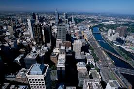

- Imagen pose:
  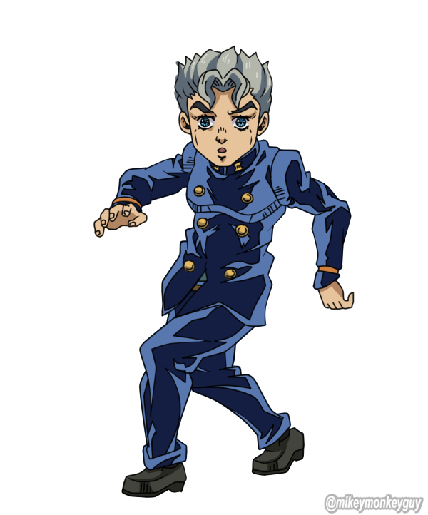

5. Se hacen procesamiento sobre las imagenes

- Imagen ciudad bordes: Mediante un *CannyDetector()* se extraen los bordes de la *Imagen Ciudad* 
  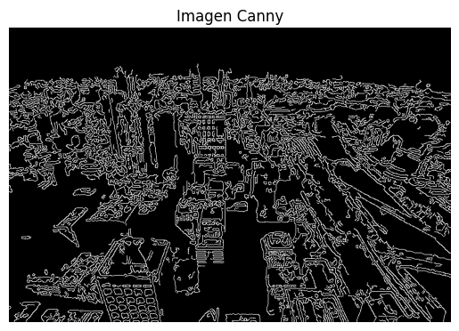

- Imagen ciudad profundidad: Mediante un *depth_estimator()* se extrae un mapa de profundidad de la *Imagen Ciudad* 
  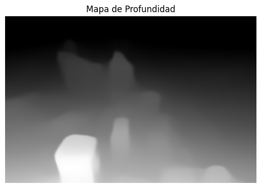  

- Imagen pose procesada: Mediante un *openpose()* se extrae la pose de la *Imagen pose* 
  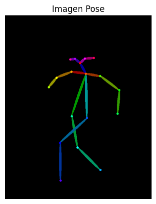  

6. Se generan las imagenes con los modelos, imagenes condicionales y prompts respectivos.

## Resultados visuales

- Se genera la imagen con el prompt "A cyberpunk city skyline at night" y con la imagen *Imagen ciudad bordes*

  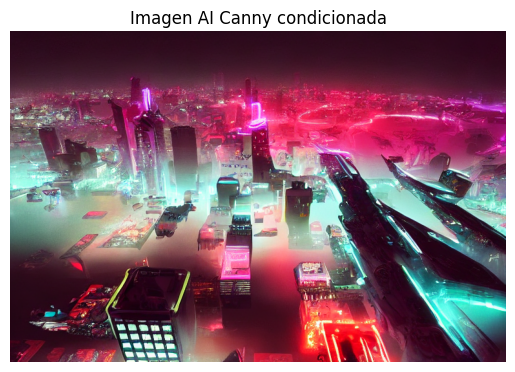

- Se generan las imagenes con el prompt "A cyberpunk city skyline at night".

  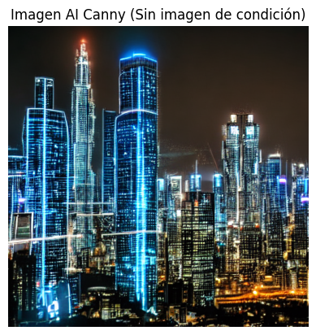

- Se genera la imagen con el prompt "A cyberpunk city skyline at night" y con la imagen *Imagen ciudad profundidad*

  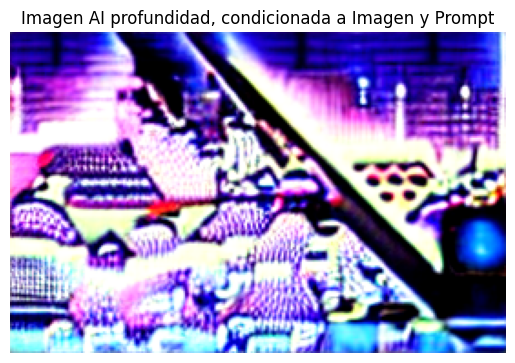

- Se genera la imagen con el prompt "A cyberpunk city skyline at night"

  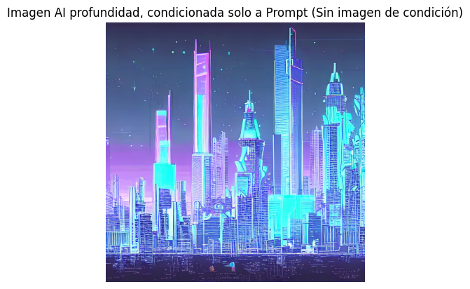

- Se genera la imagen con el prompt "A private detective standing in front of a dark alley in 1940" con la imagen condicional *Imagen pose procesada*

  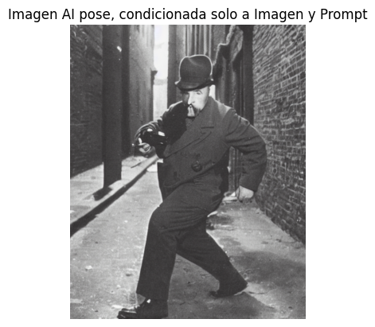

- Se genera la imagen con el prompt "A private detective standing in front of a dark alley in 1940"

  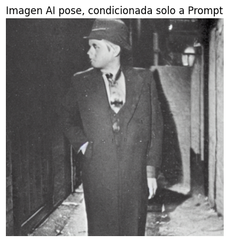


## Código relevante

Codigo para creacion de un pipeline para la generacion de imagenes con stable-diffusion-v1-5.

```python
pipe_sd = StableDiffusionPipeline.from_pretrained(
    "runwayml/stable-diffusion-v1-5",
    torch_dtype=torch.float16
)

pipe_sd.to("cuda")
```

## Prompts de IA utilizados (Chatgpt)


1. ¿Como verifico el uso de GPUs en Google Collab?

2. ¿Que modelos de *controlnet* son usados para imagenes condicionales de bordes, forfubndidad y poses?

## Aprendizajes y dificultades

### Aprendizajes

Durante el desarrollo se logró comprender:

- La integración de ControlNet con Stable Diffusion para controlar aspectos estructurales de la imagen generada.
- El uso de diferentes tipos de condicionamiento, como detección de bordes (Canny), mapas de profundidad (Depth) y poses corporales (OpenPose)..
- La utilización de la librería Diffusers para cargar y ejecutar modelos generativos en Python.
- El manejo de entornos acelerados por GPU en Google Colab para reducir los tiempos de inferencia.
- La comparación entre generación libre mediante prompts y generación guiada mediante condiciones visuales

### Dificultades

Las principales dificultades encontradas fueron:

- Instalación y compatibilidad de las dependencias necesarias para Stable Diffusion y ControlNet.
- Manejo del entorno de ejecucion Google Collab para el uso de modelos de IA.
- Gestión de la memoria GPU durante la ejecución de los modelos en una misma sesion de Google Collab.
