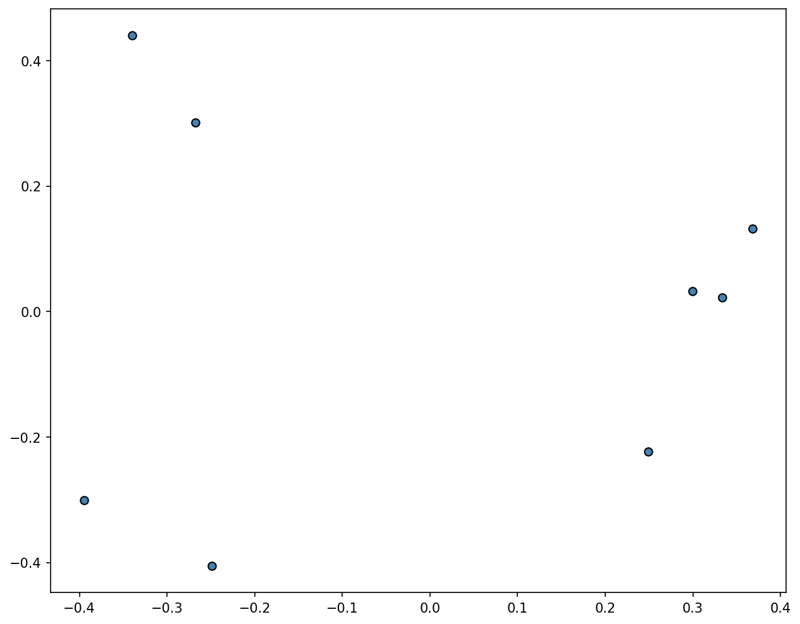
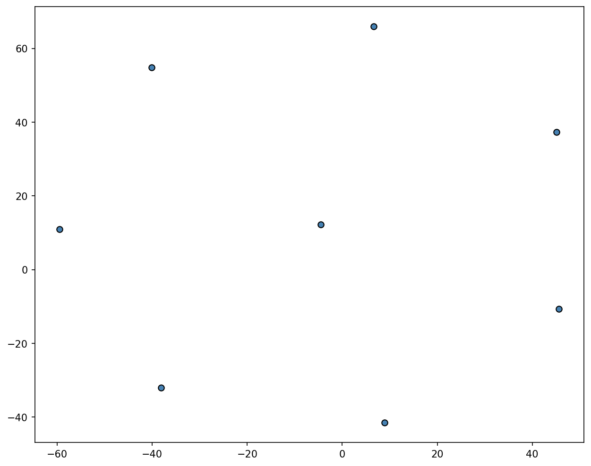
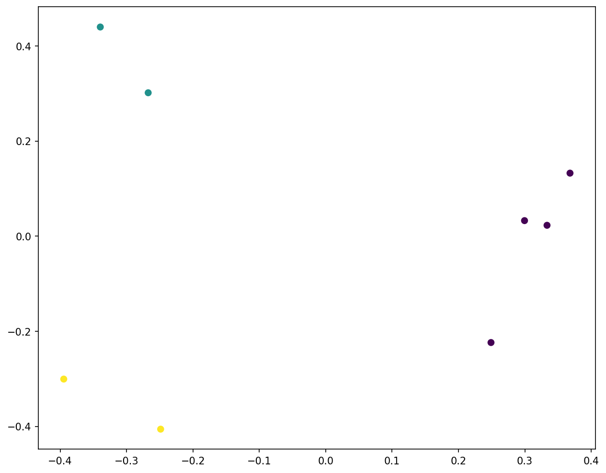
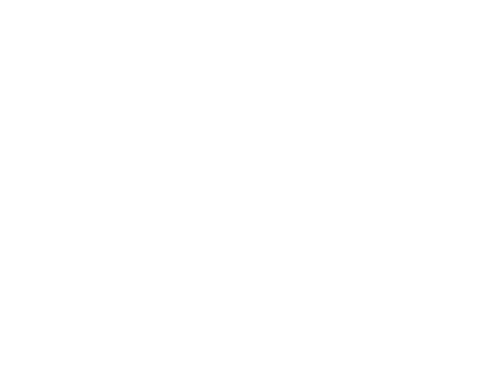

# Taller - Embeddings Visuales: Proyectando Significados con CLIP y PCA

**Integrantes:**  
- Joan Sebastian Roberto Puerto  
- Baruj Vladimir Ramírez Escalante  
- Diego Alberto Romero Olmos  
- Maicol Sebastian Olarte Ramirez  
- Jorge Isaac Alandete Díaz  

**Fecha de entrega:**  1 de junio de 2026 


---

## Descripción breve

En este taller se exploró la generación de **embeddings visuales** utilizando el modelo **CLIP (Contrastive Language-Image Pre-training)** de OpenAI. El objetivo fue extraer representaciones vectoriales de un conjunto de imágenes, reducir su dimensionalidad mediante **PCA** y **t‑SNE**, visualizar los agrupamientos semánticos y analizar la similitud entre imágenes y prompts textuales.

Se trabajó con 8 imágenes diversas (animales, objetos, escenas) y se aplicaron técnicas de aprendizaje no supervisado para observar cómo CLIP organiza las imágenes en un espacio latente. Además, se incluyó un análisis de clustering con **KMeans** y una proyección conjunta de imágenes y textos.

La implementación se realizó en **Python** dentro de **Google Colab**, utilizando las librerías:

- `clip` (OpenAI)
- `torch`
- `scikit-learn` (PCA, t‑SNE, KMeans)
- `matplotlib`
- `numpy`, `Pillow`

---

## Implementaciones realizadas (Python)

### 1. Instalación y carga del modelo CLIP

Se instaló CLIP directamente desde el repositorio oficial de OpenAI y se cargó el modelo `ViT-B/32`. Se configuró el dispositivo (`cuda` si está disponible, en caso contrario `cpu`).

```python
!pip install git+https://github.com/openai/CLIP.git
import clip
model, preprocess = clip.load("ViT-B/32", device=device)
```

### 2. Carga de imágenes y preprocesamiento

Las imágenes fueron subidas manualmente mediante `files.upload()` de Google Colab y posteriormente movidas a una carpeta `images`. Se listaron todas las imágenes con extensiones válidas y se aplicó el preprocesamiento requerido por CLIP.

```python
image_paths = [os.path.join("images", f) for f in os.listdir("images") if f.endswith(('.jpg','.png'))]
images_tensors = [preprocess(Image.open(p)).unsqueeze(0).to(device) for p in image_paths]
```

### 3. Generación de embeddings

Para cada imagen se obtuvo un vector de 512 dimensiones (embedding) mediante `model.encode_image()`. Los embeddings se normalizaron con `sklearn.preprocessing.normalize`.

```python
embeddings = []
with torch.no_grad():
    for img_tensor in images_tensors:
        emb = model.encode_image(img_tensor)
        embeddings.append(emb.cpu().numpy().flatten())
X = np.array(embeddings)
X_norm = normalize(X)
```

### 4. Reducción de dimensionalidad (PCA y t‑SNE)

Se aplicó PCA para reducir los embeddings a 2 componentes principales, explicando el 23.9% y 18.1% de la varianza respectivamente. También se utilizó t‑SNE con una perplejidad de 7 (ajustada al número de imágenes).

```python
pca = PCA(n_components=2)
X_pca = pca.fit_transform(X_norm)
tsne = TSNE(n_components=2, perplexity=min(30, len(X)-1))
X_tsne = tsne.fit_transform(X_norm)
```

### 5. Visualización de proyecciones

Se graficaron los puntos correspondientes a cada imagen en el espacio reducido, etiquetándolos con el nombre del archivo.

```python
plot_2d(X_pca, image_paths, "PCA - Embeddings CLIP", "pca_clip.png")
plot_2d(X_tsne, image_paths, "t‑SNE - Embeddings CLIP", "tsne_clip.png")
```

### 6. Clustering con KMeans

Se aplicó el método del codo para determinar un número adecuado de clusters (k=3). Luego se colorearon los puntos de la proyección PCA según el cluster asignado.

```python
kmeans = KMeans(n_clusters=3, random_state=42)
clusters = kmeans.fit_predict(X_norm)
plt.scatter(X_pca[:,0], X_pca[:,1], c=clusters, cmap='viridis')
```

### 7. Proyección de prompts textuales

Se definieron 7 prompts (cat, dog, car, city skyline, portrait, food, lion) y se generaron sus embeddings de texto con `model.encode_text()`. Luego se proyectaron sobre el mismo espacio PCA usado para las imágenes.

```python
text_tokens = clip.tokenize(text_prompts).to(device)
text_features = model.encode_text(text_tokens).cpu().numpy()
text_features_norm = normalize(text_features)
text_pca = pca.transform(text_features_norm)
```

### 8. Cálculo de similitud imagen‑texto

Se seleccionó la primera imagen (`imagen4.jpg`, que contenía un león) y se calculó la similitud coseno entre su embedding y los embeddings de los prompts. El prompt `"a photo of a lion"` obtuvo la similitud más alta (0.3114).

```python
similarities = np.dot(example_emb, text_features_norm.T).flatten()
best = np.argmax(similarities)
```

Además, se graficó un diagrama de barras con las similitudes, resaltando el prompt más parecido.

---

## Resultados visuales

Todos los resultados generados se encuentran en la carpeta [`media/`](./media).

### Proyecciones PCA y t‑SNE

| PCA | t‑SNE |
|-----|-------|
|  |  |

En ambas proyecciones se observa una separación razonable entre imágenes de diferentes categorías: los felinos (gato, león) aparecen relativamente cerca, mientras que objetos como el coche o la comida quedan más alejados.

### Clustering con KMeans (k=3)



Los tres clusters agrupan aproximadamente:  
- **Cluster 0** (morado): imágenes de personas/retratos y ciudad.  
- **Cluster 1** (verde): animales (perro, gato, león).  
- **Cluster 2** (amarillo): objetos (coche, comida).

### Proyección conjunta de imágenes y texto


Los prompts textuales se ubican cerca de las imágenes semanticamente relacionadas. Por ejemplo, `lion` aparece próximo a la imagen del león.

### Análisis de similitud imagen‑texto

| Imagen analizada | Gráfico de similitud |
|------------------|----------------------|
|  |  |

El modelo CLIP asigna la mayor similitud al prompt `"a photo of a lion"` (0.3114), seguido de `"cat"` (0.2328) y `"portrait"` (0.2160), lo que confirma la coherencia semántica.

### GIFs del proceso

- **Instalación de dependencias hasta visualización:**  
  

- **Desde visualización hasta resultados finales:**  
  

### Imágenes de entrada

Las 8 imágenes originales se encuentran en `media/input_images/`:

| imagen1.jpg | imagen2.jpg | imagen3.jpg | imagen4.jpg |
|-------------|-------------|-------------|-------------|
| (perro)     | (carro)     | (grupo personas) | (león) |

| imagen5.jpg | imagen6.jpg | imagen7.jpg | imagen8.jpg |
|-------------|-------------|-------------|-------------|
| (ciudad)    | (dormitorio) | (comida)    | (pizza)     |

---

## Código relevante

El notebook completo se encuentra en `python/Embeddings_Visuales_Proyectando_Significados_con_CLIP_y_PCA_.ipynb`.

Fragmentos clave:

```python
# Generación de embeddings
embeddings = []
with torch.no_grad():
    for img_tensor in images_tensors:
        emb = model.encode_image(img_tensor)
        embeddings.append(emb.cpu().numpy().flatten())
X = np.array(embeddings)

# PCA
pca = PCA(n_components=2)
X_pca = pca.fit_transform(X_norm)

# Proyección de texto
text_features = model.encode_text(clip.tokenize(text_prompts).to(device))
text_features = text_features.cpu().numpy()
text_pca = pca.transform(normalize(text_features))

# Similitud
similarities = np.dot(example_emb, text_features_norm.T).flatten()
```

---

## Prompts utilizados (IA generativa)

Siguiendo la guía de prompts del curso, se emplearon herramientas de IA para resolver dudas técnicas y mejorar la comprensión de los resultados.

### 1. Instalación de CLIP en Colab

**Prompt:**  
> `ModuleNotFoundError: No module named 'clip'` – ¿Cómo instalo CLIP en Google Colab?

**Solución:**  
Se instaló desde el repositorio oficial:  
`!pip install git+https://github.com/openai/CLIP.git`

### 2. Organización de imágenes subidas

**Prompt:**  
> Las imágenes se suben al directorio raíz pero el código busca una carpeta `images`. ¿Cómo las muevo?

**Solución:**  
Se creó la carpeta y se movieron los archivos con `os.rename()`.

### 3. Corrección de errores de variables

**Prompt:**  
> `NameError: name 'image_paths' is not defined` – ¿cómo defino correctamente las rutas?

**Solución:**  
Se definió `image_paths` después de mover los archivos, usando `os.listdir("images")`.

---

## Aprendizajes y dificultades

### Aprendizajes

- CLIP genera embeddings que capturan relaciones semánticas entre imágenes y texto sin necesidad de etiquetas explícitas.
- PCA y t‑SNE son herramientas eficaces para visualizar espacios de alta dimensionalidad.
- La similitud coseno permite cuantificar la cercanía entre un embedding de imagen y los embeddings de prompts.
- El clustering no supervisado (KMeans) puede agrupar imágenes según su contenido visual, aunque los resultados mejoran con un número adecuado de clusters.
- La proyección conjunta de imágenes y texto revela cómo CLIP alinea ambos dominios.

### Dificultades superadas

1. **Instalación de CLIP en Colab**  
   El paquete no estaba preinstalado; se solucionó instalando desde GitHub.

2. **Manejo de rutas después de subir imágenes**  
   Las imágenes se subían al directorio raíz y no a una carpeta específica. Se automatizó el movimiento con `os.rename()`.

3. **Interpretación de bajas similitudes**  
   Inicialmente las similitudes (~0.2) parecían bajas, pero se comprendió que CLIP produce valores en ese rango y que lo relevante es la comparación relativa entre prompts.

4. **Elección del número de clusters**  
   El método del codo ayudó a decidir k=3, que resultó razonable para los datos.

5. **Generación de gráficos de barras**  
   Fue necesario calcular `best_match_idx` con `np.argmax()` antes de usarlo para colorear la barra.

---

---

## Estructura del proyecto

```text
semana_12_5_embeddings_visuales_clip_pca/
├── python/
│   └── Embeddings_Visuales_Proyectando_Significados_con_CLIP_y_PCA_.ipynb
├── media/
│   ├── input_images/               # 8 imágenes originales
│   ├── instalaciondependencias_hasta_visualizacion.gif
│   ├── visualizacion_hasta_final.gif
│   ├── pca_clip.png
│   ├── tsne_clip.png
│   ├── kmeans_clusters.png
│   ├── images_text_pca.png
│   ├── leon_analizado.jpg
│   ├── similarity_bars.png
│   └── elbow.png
└── README.md
```

---

## Checklist de entrega

- [x] Carpeta con formato `semana_12_5_embeddings_visuales_clip_pca`
- [x] `README.md` explicando cada actividad
- [x] Carpeta `media/` con imágenes, GIFs y vídeos
- [x] `.gitignore` configurado (para entornos Python, incluyendo `__pycache__/`, `.ipynb_checkpoints/`)
- [x] Commits descriptivos en inglés
- [x] Repositorio público verificado
