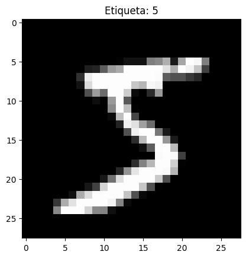

# Taller 12_6 – Entrenamiento de un Modelo de Deep Learning de Inicio a Fin

**Integrantes:**  
- Joan Sebastian Roberto Puerto  
- Baruj Vladimir Ramírez Escalante  
- Diego Alberto Romero Olmos  
- Maicol Sebastian Olarte Ramirez  
- Jorge Isaac Alandete Díaz  

**Fecha de entrega:** 30 de Marzo de 2026  

---

## Descripción breve

### Python

En el entorno de ejecucion de Google collab se desarrolló un flujo completo de entrenamiento y evaluación de modelos de Deep Learning para clasificación de imágenes utilizando PyTorch, fine-tuning y persistencia de modelos.


## Implementaciones

### Python


1. Una vez verificada lael uso de los aceledarores GPUs, se instalan e importan las librerias pertinentes :
- torch 
- torchvision 
- numpy 
- matplotlib 
- scikit-learn


2. Se cargó el conjunto de datos MNIST utilizando PyTorch y se la siguiente imagen de ejemplo para comprender la estructura de los datos.




3. Se dividió el dataset en entrenamiento y validación, creando lotes para optimizar el proceso de aprendizaje, mediante la instruccion *random_split()* y *DataLoader*.

4. Se construyó una red neuronal multicapa de arquitectura secuencial con capas *Linear*, funciones de activación *ReLU* y regularización mediante *Dropout* para clasificar imágenes de dígitos manuscritos.

```python
model = nn.Sequential(
 nn.Flatten(),
 nn.Linear(28*28, 128),
 nn.ReLU(),
 nn.Dropout(0.2),
 nn.Linear(128, 64),
 nn.ReLU(),
 nn.Linear(64, 10)
)
```

5. Mediante *CrossEntropyLoss()* se configuro el componente para el calculo del error, y se uso el optimizador *adam* con tasa de aprendizaje de 0.001.

6. Se ejecutó el proceso iterativo de aprendizaje mediante , cálculo de pérdida, backpropagation, actualización de parámetros y múltiples épocas sobre los datos de entrenamiento.

7. Se evaluó el desempeño del modelo mediante la validación cruzada K-Fold, generación de métricas y matriz de confusión

8. Se reutilizó una red preentrenada (ResNet18) para adaptar su conocimiento a una nueva tarea de clasificación, mediante el congelamiento de capas, reemplazo de la capa final, entrenamiento parcial y posterior ajuste completo del modelo.

9. Por ultimo se almacenó el modelo entrenado con *torch.save()* para guardar pesos y el posterior uso del modelo sin necesidad de reentrenarlo.


## Resultados visuales

Se muestran los resultados de evaluacion de desempeño

- Metricas de evaluacion


- Matriz de confusion


## Código relevante

Codigo para el entrenamiento del modelo.

```python
epochs = 10
train_losses, val_losses = [], []

for epoch in range(epochs):
    model.train()
    running_loss = 0

    for images, labels in train_loader:
        images, labels = images.to(device), labels.to(device)

        optimizer.zero_grad()
        output = model(images)
        loss = criterion(output, labels)
        loss.backward()
        optimizer.step()

        running_loss += loss.item()

    train_losses.append(running_loss / len(train_loader))
```

## Aprendizajes y dificultades

### Aprendizajes

Durante el desarrollo se logró comprender:

- Manejo integral de datasets en PyTorch.
- Diseño y entrenamiento de redes neuronales.
- Evaluación objetiva del rendimiento de modelos.
- Uso de técnicas de validación para mejorar la robustez.
- Aplicación de Transfer Learning para aprovechar modelos preentrenados.
- Persistencia y reutilización de modelos en entornos productivos.

### Dificultades

Las principales dificultades encontradas fueron:

- Ajuste de hiperparámetros para lograr una convergencia adecuada.
- Prevención del sobreajuste durante el entrenamiento.
- Gestión de recursos computacionales (CPU/GPU).
- Interpretación de métricas para identificar oportunidades de mejora.
