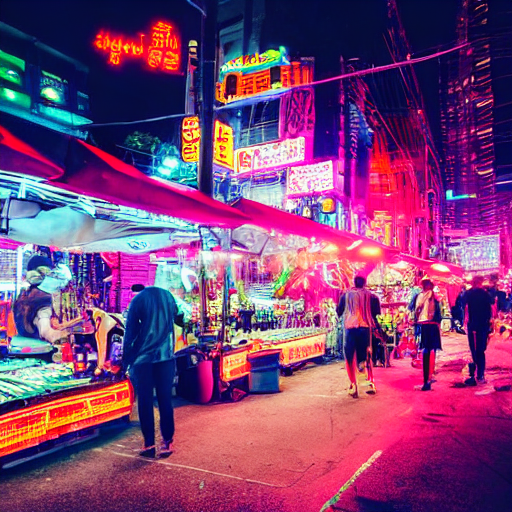
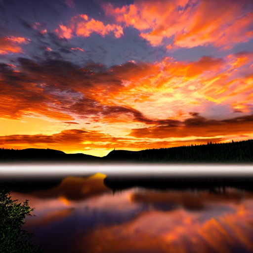

# 🎨 Taller — Explorando el Universo Latente: Introducción a Stable Diffusion

**Nombre del estudiante:** 
- Joan Sebastian Roberto Puerto  
- Baruj Vladimir Ramírez Escalante  
- Diego Alberto Romero Olmos  
- Maicol Sebastian Olarte Ramirez  
- Jorge Isaac Alandete Díaz 
**Fecha de entrega:** Junio 2026

---

## 📋 Descripción

Este taller tiene como objetivo comprender cómo funcionan los modelos de difusión generativa y aprender a generar imágenes detalladas a partir de descripciones textuales (**prompts**) usando **Stable Diffusion** con la librería `diffusers` de Hugging Face. La implementación se desarrolla en Python sobre Google Colab con GPU habilitada, explorando desde la generación básica de imágenes hasta técnicas de **prompt engineering**, generación por lotes y comparación de estilos visuales.

> Notebook principal: [`python/stable_diffusion_diffusers.ipynb`](python/stable_diffusion_diffusers.ipynb)

---

## 🛠️ Implementación

| Elemento       | Detalle                                              |
|----------------|------------------------------------------------------|
| Lenguaje       | Python                                               |
| Modelo         | Stable Diffusion v1.5 (`runwayml/stable-diffusion-v1-5`) |
| Librería       | `diffusers`, `transformers`, `accelerate`            |
| Herramientas   | PyTorch, matplotlib, PIL                             |
| Entorno        | Google Colab con GPU NVIDIA                          |

---

## 📂 Estructura del Repositorio

```
semana_12_7_stable_diffusion_diffusers_colab/
├── python/
│   └── stable_diffusion_diffusers.ipynb
├── media/
│   ├── output_futuristic_city.png
│   ├── output_oil_painting.png
│   ├── output_cyberpunk.png
│   ├── output_photorealistic.png
│   ├── gallery_styles.png
│   ├── batch_results.png
│   ├── prompt_comparison_1.png
│   └── prompt_comparison_2.png
└── README.md
```

---

## 🧩 Actividades Realizadas

### Actividad 1 — Carga del modelo preentrenado

Se carga el pipeline de Stable Diffusion v1.5 desde Hugging Face usando `float16` para optimizar el uso de memoria en GPU.

| Parámetro        | Valor                              |
|------------------|------------------------------------|
| Modelo base      | `runwayml/stable-diffusion-v1-5`   |
| Tipo de dato     | `torch.float16`                    |
| Dispositivo      | `cuda`                             |

---

### Actividad 2 — Generación de imagen a partir de prompt textual

Se genera una imagen a partir de un prompt descriptivo ajustando los parámetros principales del proceso de difusión.

| Parámetro             | Valor | Descripción                              |
|-----------------------|-------|------------------------------------------|
| `num_inference_steps` | 50    | Pasos de difusión (más = más calidad)    |
| `guidance_scale`      | 7.5   | Fidelidad al prompt (más = más fiel)     |
| `height` / `width`    | 512   | Resolución de salida en píxeles          |
| `seed`                | fijo  | Reproducibilidad del resultado           |

---

### Actividad 3 — Exploración de estilos con múltiples prompts

Se probaron distintos estilos artísticos modificando el prompt manteniendo la misma escena base. Se compararon los resultados visualmente para analizar la influencia del estilo en la salida del modelo.

| Estilo             | Fragmento del prompt                                 |
|--------------------|------------------------------------------------------|
| Arte digital       | `"...futuristic city in the clouds, digital art"`    |
| Pintura al óleo    | `"...ancient forest at dawn, oil painting"`          |
| Cyberpunk          | `"...neon-lit street market, cyberpunk style"`       |
| Fotorrealista      | `"...mountain lake at sunset, photorealistic"`       |

---

### Actividad 4 — Galería de resultados con Matplotlib

Se construyó una grilla de imágenes generadas usando `matplotlib` para visualizar en una sola figura todas las variantes producidas, con sus respectivos prompts como títulos.

---

### Bonus — Generación por lotes y Prompt Engineering

Se generaron imágenes en lote pasando múltiples prompts simultáneamente al pipeline. Adicionalmente se aplicaron técnicas de **prompt engineering** para comparar la influencia de:

- Prompts positivos detallados vs. simples.
- Uso de **prompts negativos** para excluir elementos indeseados.
- Variaciones de `guidance_scale` sobre el mismo prompt.

---

## 📈 Resultados Visuales

### Actividad 1 & 2 — Generación básica (Stable Diffusion)

| Captura 1 | Captura 2 |
|-----------|-----------|
|  |  |

### Actividad 3 — Exploración de estilos

| Cyberpunk | Fotorrealista |
|-----------|---------------|
|  |  |

### Actividad 4 — Galería de estilos

| Galería completa |
|------------------|
|  |

### Bonus — Generación por lotes y comparación de prompts

| Batch results | Prompt comparison |
|---------------|-------------------|
|  |  |

> Mínimo requerido: 2 capturas por implementación.

---

## 💻 Código Relevante

### Instalación de dependencias

```bash
pip install diffusers transformers accelerate --upgrade
```

### Carga del modelo preentrenado

```python
from diffusers import StableDiffusionPipeline
import torch

pipe = StableDiffusionPipeline.from_pretrained(
    "runwayml/stable-diffusion-v1-5",
    torch_dtype=torch.float16
).to("cuda")
```

### Generación básica desde prompt

```python
prompt = "A surreal futuristic city in the clouds, digital art"
image = pipe(prompt, num_inference_steps=50, guidance_scale=7.5).images[0]
image.save("media/output_futuristic_city.png")
```

### Generación con seed fija (reproducible)

```python
generator = torch.Generator("cuda").manual_seed(42)
image = pipe(
    prompt,
    num_inference_steps=50,
    guidance_scale=7.5,
    height=512,
    width=512,
    generator=generator
).images[0]
```

### Exploración de estilos con múltiples prompts

```python
prompts = [
    "An ancient forest at dawn, oil painting",
    "A neon-lit street market, cyberpunk style",
    "A mountain lake at sunset, photorealistic",
    "A futuristic city in the clouds, digital art",
]

images = [pipe(p, num_inference_steps=50, guidance_scale=7.5).images[0] for p in prompts]
```

### Galería con Matplotlib

```python
import matplotlib.pyplot as plt

fig, axes = plt.subplots(2, 2, figsize=(12, 12))
for ax, img, prompt in zip(axes.flatten(), images, prompts):
    ax.imshow(img)
    ax.set_title(prompt[:50], fontsize=9)
    ax.axis("off")
plt.tight_layout()
plt.savefig("media/gallery_styles.png", dpi=150, bbox_inches="tight")
plt.show()
```

### Generación por lotes (Bonus)

```python
batch_prompts = [
    "A lone astronaut on Mars, cinematic lighting",
    "A samurai in the rain, ink wash painting",
    "An underwater cathedral, concept art",
]

batch_images = pipe(batch_prompts, num_inference_steps=40, guidance_scale=7.5).images
for i, img in enumerate(batch_images):
    img.save(f"media/batch_result_{i}.png")
```

### Uso de prompt negativo (Bonus)

```python
negative_prompt = "blurry, low quality, distorted, watermark, text"
image = pipe(
    prompt="A forest fairy in a magical glade, highly detailed",
    negative_prompt=negative_prompt,
    num_inference_steps=50,
    guidance_scale=8.5
).images[0]
```

---

## 💬 Prompts Utilizados

Prompts empleados durante el desarrollo del taller:

1. *`"A surreal futuristic city in the clouds, digital art"`* — generación base de la Actividad 2.
2. *`"An ancient forest at dawn, oil painting"`* — exploración de estilo pictórico.
3. *`"A neon-lit street market, cyberpunk style"`* — exploración de estilo cyberpunk.
4. *`"A mountain lake at sunset, photorealistic, 8k, sharp focus"`* — prompt fotorrealista detallado.
5. *`"A lone astronaut on Mars, cinematic lighting, concept art"`* — generación en lote (Bonus).
6. *`"A samurai in the rain, ink wash painting, high contrast"`* — generación en lote (Bonus).
7. *`"A forest fairy in a magical glade, highly detailed"`* con negative prompt — comparación de calidad.

---

## 🎓 Aprendizajes y Dificultades

### Aprendizajes
- **Stable Diffusion** genera imágenes denoising iterativamente desde ruido gaussiano puro hacia una imagen coherente con el prompt, guiado por CLIP.
- El parámetro `guidance_scale` controla el balance entre creatividad y fidelidad al texto: valores bajos (~3–5) producen resultados más libres; valores altos (~10–15) se ciñen más al prompt pero pueden saturar la imagen.
- Fijar un `seed` es fundamental para la **reproducibilidad**: permite comparar los efectos de cambiar únicamente un parámetro manteniendo la composición base.
- Los **prompts negativos** mejoran notablemente la calidad eliminando artefactos comunes sin necesidad de reentrenar el modelo.
- La estructura del prompt importa: `"objeto, estilo, calidad, iluminación"` produce resultados más consistentes que una descripción en prosa.

### Dificultades
- Gestionar la memoria de GPU en Colab: cargar el modelo en `float16` y usar `pipe.enable_attention_slicing()` fue necesario para evitar errores `CUDA out of memory`.
- La generación con `num_inference_steps` altos (≥ 75) aumenta significativamente el tiempo por imagen en las GPUs gratuitas de Colab (T4).
- Encontrar el balance correcto de `guidance_scale` por estilo requirió varias iteraciones, ya que el valor óptimo varía según el tipo de prompt.

### Soluciones aplicadas
- Activar `pipe.enable_attention_slicing()` y `pipe.enable_xformers_memory_efficient_attention()` para reducir el uso de VRAM.
- Trabajar con resolución 512×512 como estándar y solo escalar a 768×768 en las imágenes finales elegidas.
- Crear una función auxiliar `generate(prompt, steps, scale, seed)` para estandarizar y reproducir experimentos fácilmente.

---

## ✅ Checklist de entrega

- [ ] README completo con todas las secciones solicitadas.
- [ ] Notebook `python/stable_diffusion_diffusers.ipynb` ejecutado correctamente.
- [ ] Carpeta `media/` con mínimo 2 evidencias por implementación.
- [ ] Galería exportada: `media/gallery_styles.png`.
- [ ] Resultados de lote exportados: `media/batch_results.png`.
- [ ] Comparación de prompts documentada visualmente.