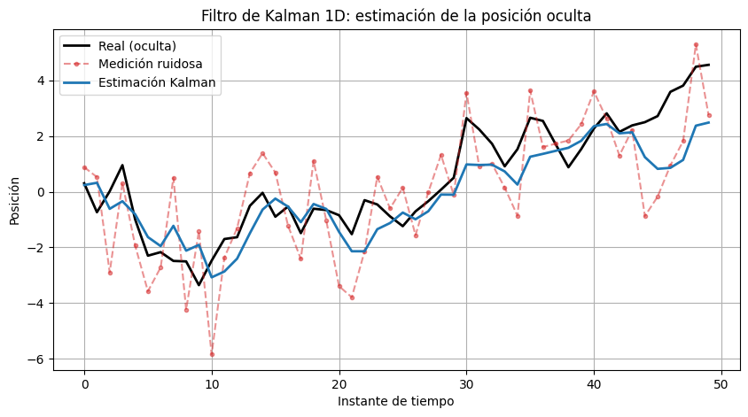
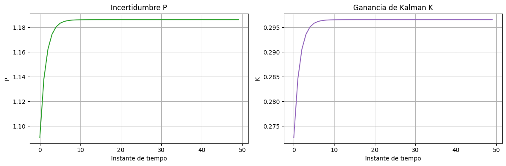
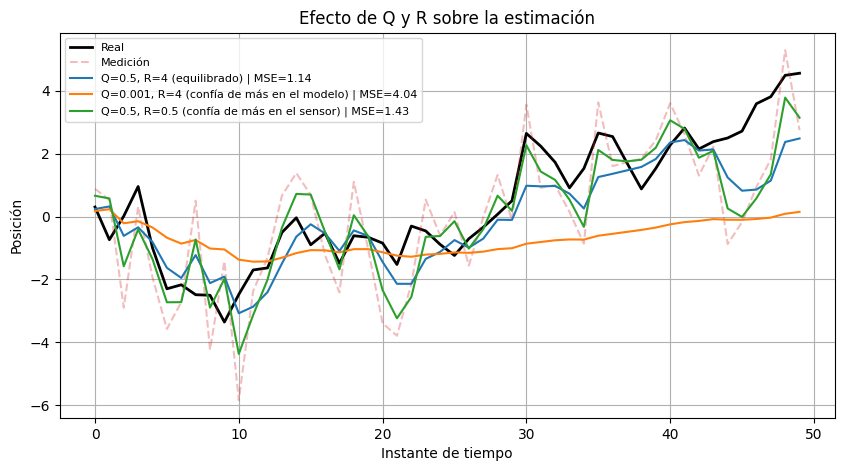
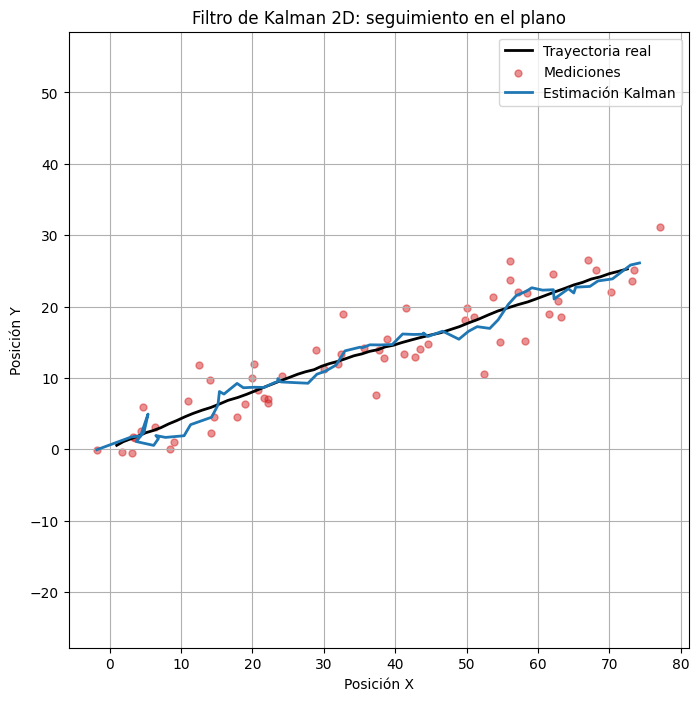
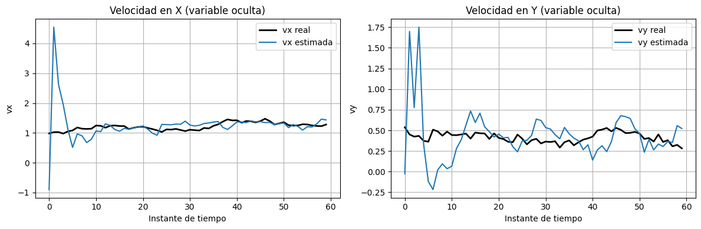

# Taller Filtro Kalman Inferencia Variables Ocultas

## Integrantes

- Joan Sebastian Roberto Puerto
- Baruj Vladimir Ramírez Escalante
- Diego Alberto Romero Olmos
- Maicol Sebastian Olarte Ramirez
- Jorge Isaac Alandete Díaz

**Fecha de entrega:** 8 de junio de 2026

---

## Descripción

El objetivo del taller es aprender a usar el filtro de Kalman para estimar una variable que no se puede medir directamente —la llamada *variable oculta*— a partir de observaciones ruidosas. El filtro combina en cada instante de tiempo lo que el modelo predice con lo que el sensor reporta, ponderando ambas fuentes según su confiabilidad relativa.

Se desarrollaron dos implementaciones en Python:

- **Kalman 1D**: estimación de la posición real de un objeto que se desplaza sobre una recta. El sensor entrega posiciones contaminadas con ruido gaussiano.
- **Kalman 2D**: seguimiento de un objeto en movimiento en el plano XY. En este caso el estado incluye también la velocidad en ambos ejes, que **nunca se mide directamente** y es el ejemplo central de inferencia de variable oculta.

Adicionalmente se realizó un análisis cuantitativo del error y un experimento de sensibilidad para entender cómo afectan los parámetros de ruido Q y R al comportamiento del filtro.

---

## Implementaciones

### Kalman 1D — Estimación de posición en una dimensión

Se genera una trayectoria sintética como un camino aleatorio acumulado (`np.cumsum`) de 50 pasos, y se agregan observaciones con ruido gaussiano de desviación estándar 2. El filtro se implementa desde cero sin librerías externas, recorriendo las mediciones una a una y aplicando los pasos de predicción y corrección en cada iteración.

Un aspecto importante fue la elección de `Q`: el código de ejemplo del enunciado usaba `Q=0.001`, que asume que la posición casi no cambia entre pasos. Para un camino aleatorio con varianza de paso ≈1, eso deja al filtro demasiado rígido y produce estimaciones que se quedan atrás de la señal real. Se utilizó `Q=0.5` para que el filtro pueda seguir la dinámica real del proceso, lo que redujo el error cuadrático medio en un **53.5%** frente a la medición directa (MSE de 2.45 → 1.14).

**Librerías:** `numpy 2.x` (generador `default_rng`), `matplotlib 3.x`.

### Kalman 2D — Seguimiento con variable oculta (velocidad)

Se simula un objeto que se mueve con velocidad aproximadamente constante en el plano. El estado tiene cuatro componentes: posición `(x, y)` y velocidad `(vx, vy)`. El sensor solo reporta posición; la velocidad es la variable oculta que el filtro infiere.

La implementación usa matrices: la transición de estado `F` aplica el modelo de velocidad constante, `H` proyecta el estado al espacio de medición, y la ganancia de Kalman se calcula invirtiendo la covarianza de la innovación. Se inicializa con incertidumbre alta (`P₀ = 500·I`) porque al arrancar no se tiene ninguna información sobre la posición ni la velocidad.

---

## Resultados visuales

> Las imágenes se encuentran en la carpeta `media/`. Para reproducirlas, ejecutar el notebook en orden desde el inicio.

### Implementación 1D

**Figura 1 — Comparación de las tres señales (posición real, medición ruidosa y estimación)**



La línea azul (Kalman) sigue la trayectoria real (negra) de forma notablemente más cercana que la medición ruidosa (rojo punteado), que oscila con amplitud mucho mayor. La estimación no es perfecta —especialmente en los primeros pasos, donde el filtro aún está calibrando su incertidumbre— pero suprime eficazmente las oscilaciones espurias del sensor.

---

**Figura 2 — Evolución de la incertidumbre P y la ganancia de Kalman K**



Ambas curvas arrancan en un valor bajo (el filtro parte con `P₀=1`) y se estabilizan rápidamente en un régimen de estado estable alrededor del paso 10. En ese punto el filtro ya encontró el balance óptimo entre confiar en el modelo y confiar en el sensor, y la ganancia `K ≈ 0.297` permanece prácticamente constante el resto de la secuencia.

---

**Figura 5 — Sensibilidad a los parámetros Q y R**



Se comparan tres configuraciones sobre los mismos datos. La configuración equilibrada (azul, MSE=1.14) supera claramente a las otras dos. Con `Q=0.001` (naranja) el filtro asume que la posición no cambia, queda rezagado y produce el peor resultado (MSE=4.04), incluso peor que la medición ruidosa original. Con `R=0.5` (verde) el filtro le cree demasiado al sensor y amplifica parte del ruido (MSE=1.43).

---

### Implementación 2D

**Figura 3 — Trayectoria en el plano XY**



La estimación del filtro (azul) sigue de cerca la trayectoria real (negra) a pesar de que las mediciones (puntos rojos) presentan dispersión considerable. En los primeros instantes hay una oscilación visible mientras la incertidumbre inicial alta (`P₀=500·I`) se reduce, pero el filtro converge rápidamente.

---

**Figura 4 — Estimación de la velocidad (variable oculta)**



Esta gráfica muestra el núcleo del concepto de variable oculta. El filtro estima `vx` y `vy` sin haber recibido ninguna medición de velocidad, deduciéndola del cambio entre posiciones consecutivas. La velocidad estimada en X converge a la real en pocos pasos. En Y la convergencia es más lenta porque la velocidad real es más pequeña y el ruido de posición la cubre proporcionalmente más, pero la tendencia general se captura.

---

## Código relevante

### Filtro de Kalman 1D

```python
def filtro_kalman_1d(mediciones, Q=0.5, R=4.0, x_inicial=0.0, P_inicial=1.0):
    x_hat, P = x_inicial, P_inicial
    estimacion    = np.empty(len(mediciones))
    incertidumbre = np.empty(len(mediciones))
    ganancia      = np.empty(len(mediciones))

    for i, z in enumerate(mediciones):
        # Predicción
        x_prior = x_hat
        P_prior = P + Q

        # Corrección
        K       = P_prior / (P_prior + R)
        x_hat   = x_prior + K * (z - x_prior)
        P       = (1 - K) * P_prior

        estimacion[i]    = x_hat
        incertidumbre[i] = P
        ganancia[i]      = K

    return estimacion, incertidumbre, ganancia
```

### Filtro de Kalman 2D (matricial)

```python
def filtro_kalman_2d(mediciones, F, H, Q, R, x0, P0):
    x, P = x0.copy(), P0.copy()
    I = np.eye(F.shape[0])
    estimaciones = np.zeros((len(mediciones), F.shape[0]))

    for t, z in enumerate(mediciones):
        # Predicción
        x = F @ x
        P = F @ P @ F.T + Q

        # Corrección
        y = z - H @ x                   # innovación
        S = H @ P @ H.T + R             # covarianza de la innovación
        K = P @ H.T @ np.linalg.inv(S)  # ganancia de Kalman
        x = x + K @ y
        P = (I - K @ H) @ P

        estimaciones[t] = x
    return estimaciones
```

El notebook completo está en: [`semana_13_1_filtro_kalman_inferencia_variables_ocultas.ipynb`](semana_13_1_filtro_kalman_inferencia_variables_ocultas.ipynb)

---

## Prompts utilizados

Para este taller se utilizó IA generativa (Claude, Anthropic) como apoyo en las siguientes etapas:

1. **Estructura del notebook**: se solicitó generar un notebook explicativo en Colab con implementación 1D y 2D del filtro de Kalman usando librerías actualizadas (NumPy 2.x con `default_rng`).

2. **Revisión de parámetros**: se detectó que el valor `Q=0.001` del código de ejemplo del enunciado producía resultados incorrectos para un camino aleatorio (el filtro empeoraba la señal). El análisis y la corrección a `Q=0.5` se discutió con la IA, que explicó la relación entre la varianza del proceso y el valor adecuado de Q.

3. **Generación del README**: se usó IA para la estructura y redacción base del presente documento, con ajuste y revisión del estudiante.

---

## Aprendizajes y dificultades

**Lo que quedó claro:**

El filtro de Kalman no es magia: es simplemente un promedio ponderado entre lo que predice el modelo y lo que mide el sensor, donde el peso depende de cuánto se confía en cada uno. Entender que `K` pequeña significa "creerle al modelo" y `K` grande significa "creerle al sensor" hizo que todo lo demás tuviera sentido.

El caso 2D fue el más interesante porque puso en práctica el concepto de variable oculta de forma concreta. Ver que el filtro logra reconstruir la velocidad a partir únicamente de las posiciones —y que esa estimación converge a la real en pocos pasos— fue lo que más dejó claro por qué este filtro es tan usado en robótica y visión por computador.

**Lo que costó más:**

La elección de los parámetros Q y R no es intuitiva al principio. El código de ejemplo del enunciado usaba `Q=0.001`, que parece un número razonable, pero en la práctica hacía que el filtro quedara rígido y produjera peor resultado que simplemente usar la medición directa. Entender que Q debe estar en el mismo orden de magnitud que la varianza real del proceso fue el aprendizaje más importante del taller.

El caso 2D también requirió entender por qué se inicializa `P₀` con un valor alto: si se parte con poca incertidumbre, el filtro demora mucho más en corregirse cuando las primeras mediciones llegan muy dispersas.