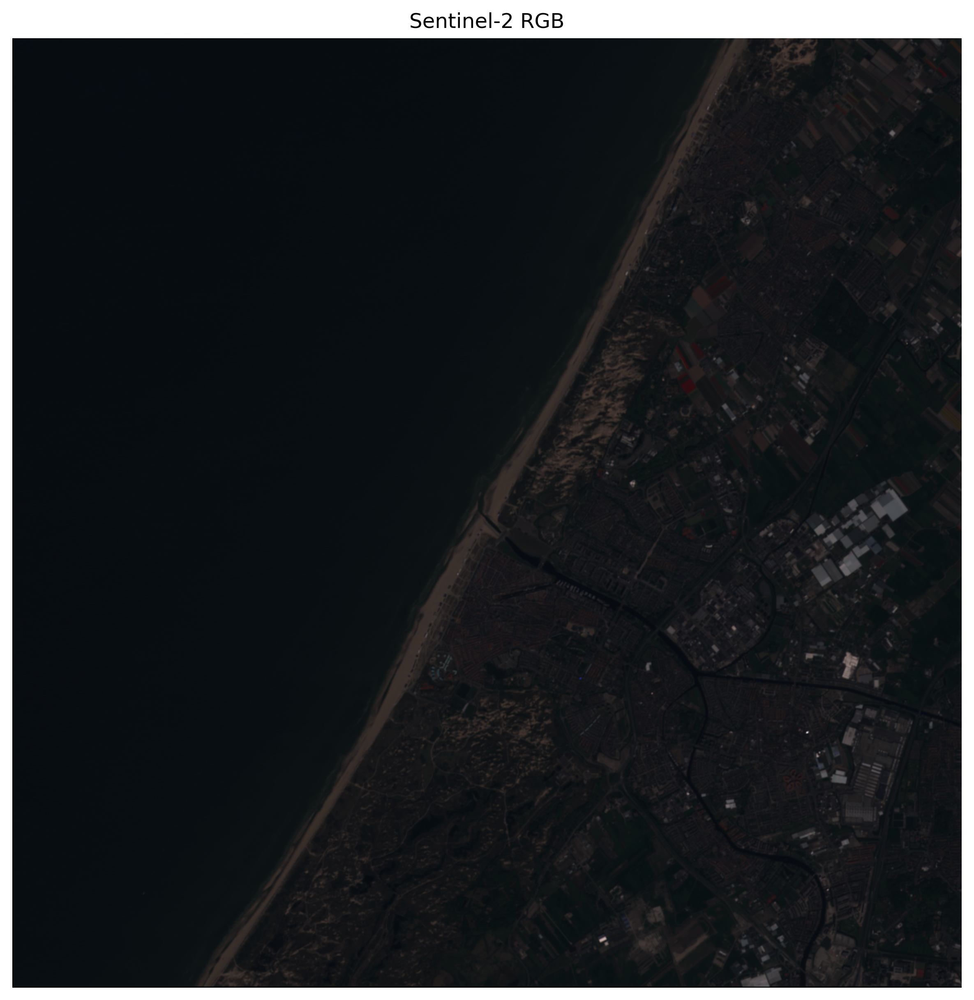

# Taller - Mapas Interactivos con Datos Satelitales

**Integrantes:**  
- Joan Sebastian Roberto Puerto  
- Baruj Vladimir Ramírez Escalante  
- Diego Alberto Romero Olmos  
- Maicol Sebastian Olarte Ramirez  
- Jorge Isaac Alandete Díaz  

**Fecha de entrega:**  4 de junio de 2026 


---

## Descripción breve

En este taller se exploró la visualización y manipulación de datos geoespaciales abiertos mediante herramientas del ecosistema Python. Se trabajó con una imagen satelital en formato GeoTIFF derivada de datos Sentinel-2 y se desarrollaron mapas interactivos utilizando Folium.

El objetivo fue comprender cómo cargar información satelital, visualizarla, integrarla con mapas base y agregar elementos interactivos como controles de capas, marcadores y capas vectoriales. Además, se utilizó GeoPandas para incorporar información geográfica en formato GeoJSON.

La implementación fue realizada en Google Colab utilizando las librerías:

* rasterio
* folium
* geopandas
* matplotlib
* numpy

---

## Implementaciones realizadas (Python)

### 1. Instalación de librerías geoespaciales

Se instalaron las dependencias necesarias para trabajar con datos satelitales y mapas interactivos.

```python
!pip install rasterio folium geopandas branca -q
```

Las librerías permitieron:

* Leer archivos GeoTIFF.
* Manipular información geográfica vectorial.
* Crear mapas interactivos.
* Visualizar imágenes satelitales.

---

### 2. Descarga y lectura de una imagen satelital GeoTIFF

Se utilizó un archivo de ejemplo derivado de Sentinel-2 (`sample.tif`), descargado desde un repositorio abierto.

```python
import rasterio

src = rasterio.open("sample.tif")

print(src.meta)
print(src.bounds)
print(src.crs)
```

Con Rasterio se inspeccionaron los metadatos geoespaciales del archivo:

* Sistema de coordenadas (CRS)
* Resolución espacial
* Dimensiones de la imagen
* Extensión geográfica

---

### 3. Visualización de la imagen satelital

Se cargaron las bandas RGB y se construyó una representación visual de la escena satelital.

```python
with rasterio.open("sample.tif") as src:
    img = src.read()

rgb = np.dstack([
    img[2],
    img[1],
    img[0]
])

plt.imshow(rgb / rgb.max())
plt.axis("off")
```

La visualización permitió observar directamente la información contenida en el GeoTIFF.

---

### 4. Creación de mapas interactivos con Folium

Se creó un mapa centrado en Bogotá utilizando OpenStreetMap como capa base.

```python
import folium

m = folium.Map(
    location=[4.7110, -74.0721],
    zoom_start=10
)
```

El mapa permite:

* Zoom dinámico.
* Desplazamiento libre.
* Navegación interactiva.

---

### 5. Inclusión de múltiples capas base

Se añadieron diferentes proveedores cartográficos para comparar visualizaciones.

```python
folium.TileLayer("OpenStreetMap").add_to(m)
folium.TileLayer("CartoDB positron").add_to(m)
folium.TileLayer("CartoDB dark_matter").add_to(m)

folium.LayerControl().add_to(m)
```

El usuario puede activar y desactivar capas desde el panel de control.

---

### 6. Interacción mediante marcadores y clics

Se incorporó un marcador sobre Bogotá y una herramienta para mostrar coordenadas al hacer clic sobre el mapa.

```python
folium.Marker(
    [4.7110, -74.0721],
    popup="Bogotá"
).add_to(m)

m.add_child(folium.LatLngPopup())
```

Esta funcionalidad permite explorar ubicaciones específicas de manera interactiva.

---

### 7. Integración de capas vectoriales con GeoPandas

Se cargó un archivo GeoJSON de Colombia utilizando GeoPandas y posteriormente se incorporó al mapa mediante Folium.

```python
import geopandas as gpd

gdf = gpd.read_file("colombia.geojson")

folium.GeoJson(
    gdf,
    name="Colombia"
).add_to(m)
```

Esto permitió superponer información vectorial sobre el mapa base.

---

### 8. Exportación del mapa interactivo

Finalmente, los mapas fueron exportados como archivos HTML para su visualización fuera del entorno de desarrollo.

```python
m.save("mapa_interactivo.html")
```

Los archivos generados pueden abrirse directamente desde cualquier navegador web.

---

## Resultados visuales

Todos los resultados generados se encuentran en la carpeta [`media/`](./media).

### Imagen satelital RGB



La imagen corresponde a una visualización RGB construida a partir de las bandas contenidas en el archivo GeoTIFF utilizado durante la práctica.

---

### GIF del proceso de instalación y configuración


Se muestra el proceso desde la instalación de dependencias hasta la creación inicial del mapa interactivo.

---

### GIF del desarrollo completo


Se observa la construcción completa de la solución, incluyendo la integración de capas, visualización geográfica e interacción.

---

### Archivos HTML generados

Se exportaron los siguientes mapas interactivos:

* `media/mapa_interactivo.html`
* `media/mapa_geojson.html`

Estos archivos permiten explorar los resultados directamente desde un navegador web.

---

## Código relevante

El notebook completo se encuentra en:

```text
python/taller_mapas_interactivos_datos_satelitales.ipynb
```

Fragmentos principales:

```python
# Lectura GeoTIFF
src = rasterio.open("sample.tif")

# Visualización RGB
rgb = np.dstack([
    img[2],
    img[1],
    img[0]
])

# Creación del mapa
m = folium.Map(
    location=[4.7110, -74.0721],
    zoom_start=10
)

# Control de capas
folium.LayerControl().add_to(m)

# Capa GeoJSON
folium.GeoJson(gdf).add_to(m)

# Exportación
m.save("mapa_interactivo.html")
```

---

## Datos utilizados

### Imagen satelital

* Fuente: Sentinel-2 (GeoTIFF de ejemplo)
* Formato: GeoTIFF (.tif)

### Mapa base

* OpenStreetMap

### Información vectorial

* GeoJSON de Colombia

---

## Prompts utilizados (IA generativa)

Durante el desarrollo se utilizaron herramientas de IA para resolver dudas técnicas y corregir errores.

### 1. Obtención de datos satelitales

**Prompt:**

> Necesito un archivo GeoTIFF pequeño para trabajar con Rasterio en Google Colab.

**Resultado:**

Se identificó un archivo de ejemplo derivado de Sentinel-2 (`sample.tif`) adecuado para prácticas académicas.

---

### 2. Visualización RGB del GeoTIFF

**Prompt:**

> ¿Cómo visualizar correctamente un archivo GeoTIFF RGB usando Rasterio y Matplotlib?

**Resultado:**

Se reorganizaron las bandas para generar una representación RGB adecuada.

---

### 3. Integración de GeoJSON

**Prompt:**

> ¿Cómo agregar una capa GeoJSON a un mapa Folium usando GeoPandas?

**Resultado:**

Se utilizó `gpd.read_file()` y posteriormente `folium.GeoJson()` para la visualización.

---
---

## Aprendizajes y dificultades

### Aprendizajes

* Comprender la estructura y utilidad de los archivos GeoTIFF.
* Utilizar Rasterio para leer información satelital.
* Crear mapas interactivos con Folium.
* Integrar capas vectoriales mediante GeoPandas.
* Exportar visualizaciones geográficas como archivos HTML reutilizables.
* Combinar datos raster y vectoriales dentro de una misma aplicación geoespacial.

### Dificultades superadas

#### 1. Lectura de archivos geoespaciales

Inicialmente fue necesario comprender la estructura interna de un GeoTIFF y cómo acceder a sus bandas mediante Rasterio.

#### 2. Visualización correcta de bandas RGB

Fue necesario reorganizar las bandas para obtener una representación visual adecuada de la imagen satelital.

#### 3. Manejo de archivos GeoJSON

Se presentó un error debido a la ausencia del archivo GeoJSON requerido. El problema se solucionó descargando un archivo válido y verificando su ruta.

#### 4. Exportación de resultados

Se aprendió a generar archivos HTML interactivos para compartir y visualizar los resultados fuera de Google Colab.

---

## Estructura del proyecto

```text
semana_13_2_mapas_interactivos_datos_satelitales/
├── python/
│   └── taller_mapas_interactivos_datos_satelitales.ipynb
│
├── media/
│   ├── sentinel_rgb.png
│   ├── instalarlibrerias_hasta_crearmapainteractivoconfolium.gif
│   ├── crearmapainteractivoconfolium_hasta_final.gif
│   ├── mapa_interactivo.html
│   └── mapa_geojson.html
│
└── README.md
```

---

## Checklist de entrega

* [x] Carpeta con nombre correcto: `semana_13_2_mapas_interactivos_datos_satelitales`
* [x] Implementación realizada en Python
* [x] Uso de Rasterio para lectura de GeoTIFF
* [x] Uso de Folium para mapas interactivos
* [x] Uso de GeoPandas para capas vectoriales
* [x] README documentado
* [x] Evidencias visuales en la carpeta `media`
* [x] Exportación de mapas HTML
* [x] Commits descriptivos en inglés
* [x] Repositorio organizado según la estructura solicitada


