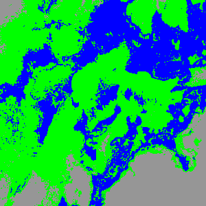
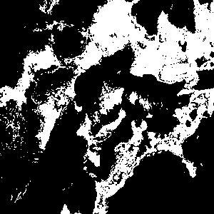
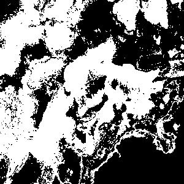
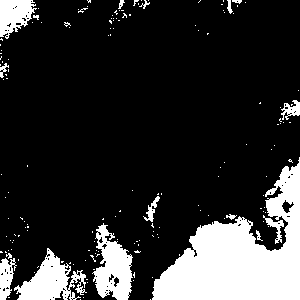

# Taller - Mini Radar Satelital: Áreas de Interés

**Integrantes:**  
- Joan Sebastian Roberto Puerto  
- Baruj Vladimir Ramírez Escalante  
- Diego Alberto Romero Olmos  
- Maicol Sebastian Olarte Ramirez  
- Jorge Isaac Alandete Díaz  

**Fecha de entrega:**  4 de junio de 2026 


---

## Descripción breve

En este taller se desarrolló una herramienta básica de análisis geovisual utilizando imágenes satelitales y técnicas de segmentación por color. El objetivo fue identificar y clasificar diferentes coberturas presentes en una imagen satelital, como cuerpos de agua, vegetación y zonas urbanas, mediante algoritmos de agrupamiento no supervisado.

La implementación se realizó en Google Colab utilizando Python y bibliotecas especializadas en procesamiento de imágenes y aprendizaje automático. Se empleó el algoritmo K-Means para segmentar una región de interés (ROI) de una imagen satelital del Archipiélago de San Bernardo, Colombia, obteniendo máscaras independientes para cada clase detectada.

Las librerías utilizadas fueron:

* OpenCV
* NumPy
* Matplotlib
* Scikit-Learn
* Pillow

---

## Implementaciones realizadas (Python)

### 1. Instalación de dependencias

Se instalaron las librerías necesarias para el procesamiento de imágenes, visualización y segmentación.

```python
!pip install opencv-python
!pip install numpy
!pip install matplotlib
!pip install scikit-learn
!pip install pillow
```

Estas librerías permitieron:

* Leer imágenes satelitales.
* Procesar matrices de píxeles.
* Aplicar algoritmos de clustering.
* Generar visualizaciones y máscaras de segmentación.

---

### 2. Carga de imagen satelital

Se utilizó una imagen RGB satelital del Archipiélago de San Bernardo obtenida a partir de datos del programa Copernicus.

```python
import cv2

image = cv2.imread("imagen_satelital.jpg")

image_rgb = cv2.cvtColor(
    image,
    cv2.COLOR_BGR2RGB
)
```

La imagen contiene diferentes coberturas geográficas como:

* Océano y cuerpos de agua.
* Vegetación insular.
* Zonas costeras.
* Áreas intervenidas por actividades humanas.

---

### 3. Selección de una región de interés (ROI)

Para concentrar el análisis en una zona específica, se definieron coordenadas manuales sobre la imagen.

```python
x = 200
y = 150
w = 300
h = 300

roi = image_rgb[y:y+h, x:x+w]
```

La ROI permitió reducir la cantidad de información procesada y enfocarse en una región con características visuales diferenciadas.

---

### 4. Segmentación mediante K-Means

Se aplicó el algoritmo K-Means para agrupar los píxeles según similitudes en sus valores RGB.

```python
from sklearn.cluster import KMeans

pixels = roi.reshape((-1,3))

kmeans = KMeans(
    n_clusters=3,
    random_state=42
)

kmeans.fit(pixels)
```

El algoritmo identificó automáticamente tres grupos principales de color presentes en la región analizada.

---

### 5. Clasificación visual de las clases

Las clases generadas por K-Means fueron representadas mediante colores temáticos para facilitar la interpretación visual.

```python
class_colors = np.array([
    [0,0,255],
    [0,255,0],
    [150,150,150]
])
```

Asignación utilizada:

* Azul → Agua.
* Verde → Vegetación.
* Gris → Zona urbana o suelo expuesto.

---

### 6. Generación de máscaras binarias

Se construyeron máscaras independientes para cada clase identificada.

```python
water_mask = (
    segmented == 0
).astype(np.uint8) * 255

forest_mask = (
    segmented == 1
).astype(np.uint8) * 255

urban_mask = (
    segmented == 2
).astype(np.uint8) * 255
```

Estas máscaras permiten aislar visualmente cada categoría detectada por el algoritmo.

---

### 7. Exportación de resultados

Finalmente se exportaron las máscaras y la imagen segmentada para su posterior análisis.

```python
cv2.imwrite(
    "segmentacion_coloreada.png",
    colored_segmentation
)
```

Archivos generados:

* agua.png
* bosque.png
* urbano.png
* segmentacion_coloreada.png

---

## Resultados visuales

Todos los resultados generados se encuentran en la carpeta [`media/`](./media).

### Imagen satelital utilizada

.jpg)

Imagen satelital RGB utilizada como fuente para el análisis y segmentación.

---

### GIF del proceso de instalación y preparación


Se observa el proceso desde la instalación de dependencias hasta la clasificación inicial mediante colores temáticos.

---

### GIF del desarrollo completo


Se muestra la ejecución completa del algoritmo de segmentación, generación de máscaras y visualización final de resultados.

---

### Segmentación coloreada



Visualización final de las clases detectadas mediante K-Means utilizando colores temáticos.

---

### Máscara de agua



Regiones clasificadas como cuerpos de agua.

---

### Máscara de vegetación



Regiones clasificadas como vegetación o cobertura natural.

---

### Máscara urbana



Regiones clasificadas como zonas urbanas o superficies expuestas.

---

## Código relevante

El notebook completo se encuentra en:

```text
python/mini_radar_satelital.ipynb
```

Fragmentos principales:

```python
# Conversión de imagen
image_rgb = cv2.cvtColor(
    image,
    cv2.COLOR_BGR2RGB
)

# Segmentación
kmeans = KMeans(
    n_clusters=3,
    random_state=42
)

kmeans.fit(pixels)

# Máscaras
water_mask = (
    segmented == 0
).astype(np.uint8)*255

forest_mask = (
    segmented == 1
).astype(np.uint8)*255

urban_mask = (
    segmented == 2
).astype(np.uint8)*255
```

---

## Datos utilizados

### Imagen satelital

**Fuente:**

Programa Copernicus (Sentinel)

**Ubicación observada:**

Archipiélago de San Bernardo, Mar Caribe, Colombia.

**Formato:**

JPG (.jpg)

**Resolución utilizada:**

1280 × 823 píxeles.

---

## Prompts utilizados (IA generativa)

Durante el desarrollo se utilizaron herramientas de IA para resolver dudas técnicas y apoyar la implementación.

### 1. Obtención de imágenes satelitales

**Prompt:**

> ¿Dónde puedo descargar imágenes satelitales gratuitas para realizar segmentación con Python?

**Resultado:**

Se identificaron repositorios y colecciones de imágenes satelitales abiertas compatibles con OpenCV y Google Colab.

---

### 2. Adaptación del código para Google Colab

**Prompt:**

> Convierte este ejercicio de OpenCV para que funcione correctamente en Google Colab.

**Resultado:**

Se reemplazó la selección interactiva de ROI por coordenadas manuales compatibles con Colab.

---


## Aprendizajes y dificultades

### Aprendizajes

* Comprender el funcionamiento básico de la segmentación por color.
* Aplicar algoritmos de clustering a imágenes satelitales.
* Utilizar K-Means para clasificación no supervisada.
* Generar máscaras binarias para análisis geoespacial.
* Procesar imágenes utilizando OpenCV y NumPy.
* Visualizar resultados mediante Matplotlib.

### Dificultades superadas

#### 1. Compatibilidad con Google Colab

La función `cv2.selectROI()` no es compatible con Colab, por lo que fue necesario utilizar coordenadas manuales para definir la región de interés.

#### 2. Carga correcta de imágenes

Inicialmente se presentaron errores relacionados con la lectura del archivo debido al nombre de la imagen cargada en Colab. El problema se solucionó verificando la ruta y el nombre del archivo.

#### 3. Interpretación de las clases

K-Means agrupa colores automáticamente, por lo que fue necesario analizar visualmente cada grupo para asociarlo correctamente con agua, vegetación o zonas urbanas.

#### 4. Selección de parámetros

Fue necesario experimentar con el número de clases para obtener una segmentación clara y representativa de la escena satelital.

---

## Estructura del proyecto

```text
semana_13_3_mini_radar_satelital_areas_interes/
├── python/
│   └── mini_radar_satelital.ipynb
│
├── media/
│   ├── 1280px-The_San_Bernardo_Archipelago_in_the_Caribbean_Sea_(Copernicus_2024-01-13).jpg
│   ├── agua.png
│   ├── bosque.png
│   ├── urbano.png
│   ├── segmentacion_coloreada.png
│   ├── instalardependencias_hasta_asignarcolorestematicos.gif
│   └── asignarcolorestematicos_hasta_final.gif
│
└── README.md
```

---

## Checklist de entrega

* [x] Carpeta con nombre correcto: `semana_13_3_mini_radar_satelital_areas_interes`
* [x] Implementación realizada en Python
* [x] Selección de región de interés (ROI)
* [x] Segmentación mediante K-Means
* [x] Clasificación visual por color
* [x] Generación de máscaras binarias
* [x] Exportación de resultados
* [x] README documentado
* [x] Evidencias visuales en la carpeta `media`
* [x] Commits descriptivos en inglés
* [x] Repositorio organizado según la estructura solicitada
