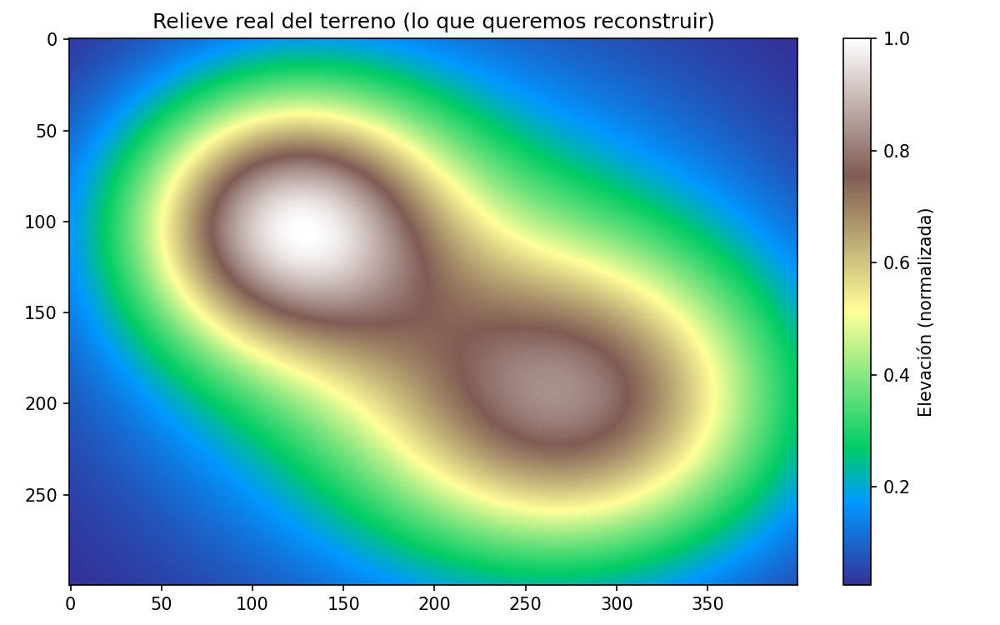
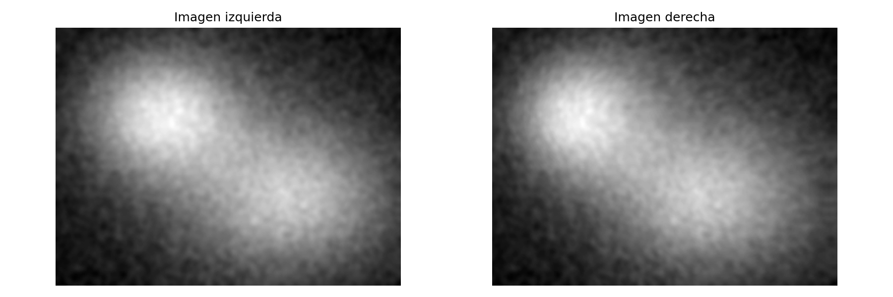
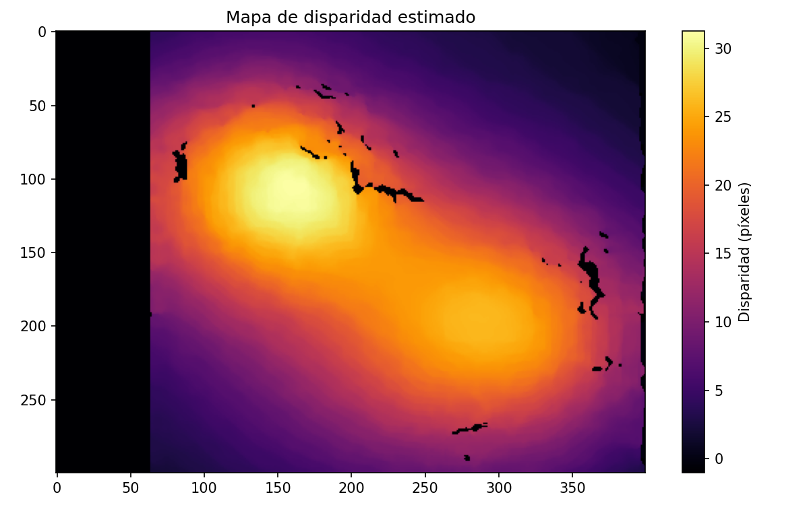
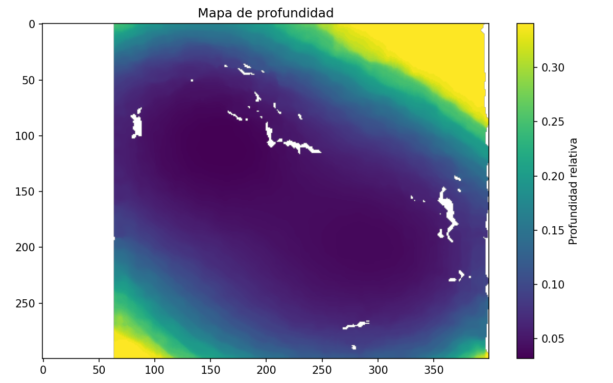
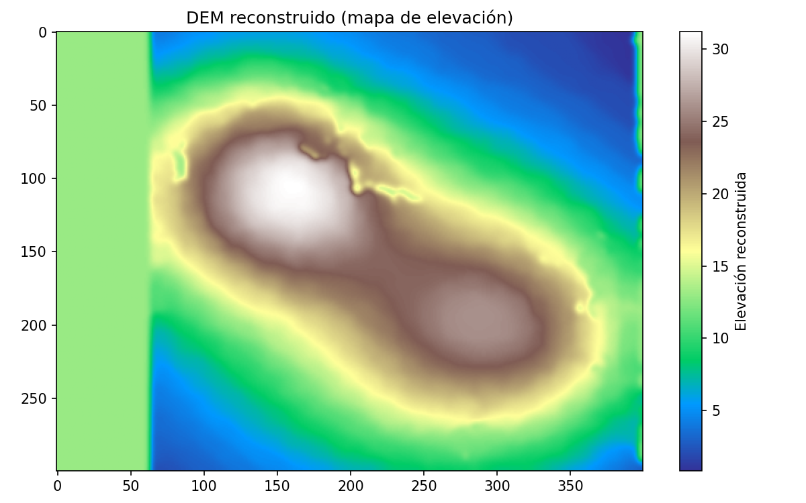
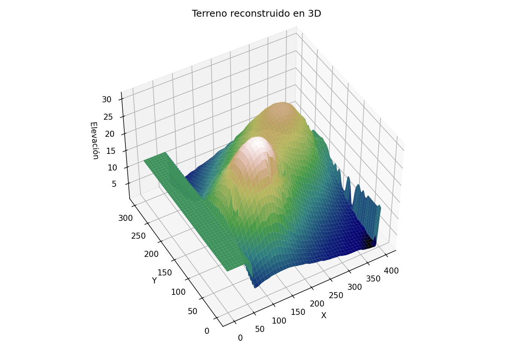
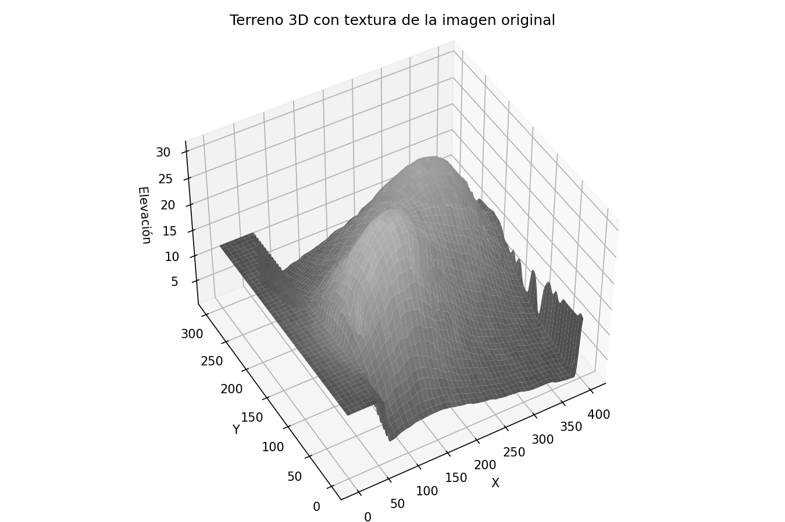
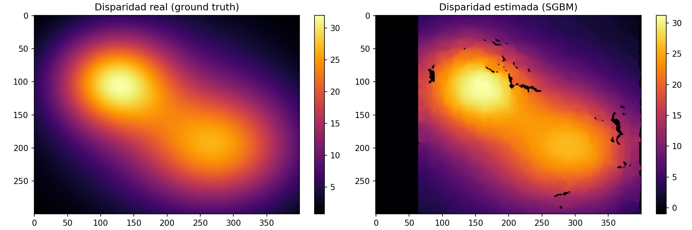

# Taller Visión desde el Cielo: Reconstrucción 3D con Fotos Satelitales

- Joan Sebastian Roberto Puerto
- Baruj Vladimir Ramírez Escalante
- Diego Alberto Romero Olmos
- Maicol Sebastian Olarte Ramirez
- Jorge Isaac Alandete Díaz

**Fecha de entrega:** 8 de junio de 2026

---

## Descripción

El objetivo del taller es reconstruir el relieve 3D de un terreno a partir de dos vistas del mismo lugar tomadas desde posiciones ligeramente distintas, como haría un par de cámaras satelitales o dos fotos aéreas con solape. El principio es el de la visión estéreo: un mismo punto se desplaza entre la imagen izquierda y la derecha, y ese desplazamiento —la **disparidad**— está relacionado con la profundidad. A partir de la disparidad se genera un mapa de elevación (DEM) y, con él, una malla 3D del terreno.

El flujo completo desarrollado es: par de imágenes → cálculo de disparidad con OpenCV → mapa de profundidad → mapa de elevación (DEM) → malla 3D, con una etapa final de validación cuantitativa.

Una decisión de diseño importante: en lugar de partir de dos archivos `left_image.jpg` / `right_image.jpg` externos, se generó un **par estéreo sintético** a partir de un terreno con relieve conocido. Esto hace que el notebook sea autocontenido y reproducible, y —sobre todo— permite comparar la reconstrucción contra el relieve real (*ground truth*), algo imposible con imágenes cualesquiera. El mismo código funciona con imágenes reales reemplazando el bloque de generación por `cv2.imread(...)`.

---

## Implementaciones

### Generación del par estéreo y cálculo de disparidad

Se construye el relieve del terreno como una suma de gaussianas (tres colinas de distinto tamaño) y una textura de superficie a partir de ruido suavizado. La imagen izquierda es la textura tal cual; la derecha se obtiene desplazando cada píxel horizontalmente una cantidad proporcional a la elevación, usando `cv2.remap` de forma vectorizada. Ahí queda codificada la disparidad real.

La correspondencia estéreo se calcula con `StereoSGBM` (Semi-Global Block Matching) en lugar de `StereoBM`. Se eligió SGBM porque entrega mapas de disparidad más limpios y con menos huecos, gracias a que impone suavidad considerando varias direcciones, lo cual es apropiado para terrenos cuya elevación cambia de forma gradual. Los parámetros más relevantes son `numDisparities` (rango de búsqueda, múltiplo de 16) y `blockSize` (tamaño de la ventana de comparación), junto con las penalizaciones `P1` y `P2` que controlan la suavidad.

**Librerías:** `opencv-python 4.x`, `numpy 2.x` (`default_rng`), `matplotlib 3.x`.

### Reconstrucción 3D y validación

La disparidad se convierte en profundidad mediante la relación inversa, y en elevación (DEM) considerando que, para un terreno visto desde arriba, lo más alto es lo más cercano a la cámara. Tras rellenar huecos y suavizar, el DEM se levanta como una malla 3D interactiva con `Plotly` (rotable y con zoom en Colab), incluyendo una variante coloreada con la textura de la imagen original.

Finalmente, dado que el relieve real es conocido, se valida la reconstrucción comparando la disparidad estimada con la real mediante el coeficiente de correlación.

**Librerías:** `plotly 6.x` para la visualización 3D.

---

## Resultados visuales

> Las imágenes se encuentran en la carpeta `media/`. Las mallas 3D se muestran aquí como capturas estáticas; en el notebook son interactivas (se pueden rotar y hacer zoom).

### Generación del par estéreo y disparidad

**Figura 1 — Relieve real del terreno (ground truth)**



Este es el terreno que se busca reconstruir: tres colinas de distinta altura, con la más alta arriba a la izquierda. El algoritmo estéreo nunca ve esta matriz directamente; solo verá las dos imágenes que se derivan de ella.

---

**Figura 2 — Par estéreo (imagen izquierda y derecha)**



Las dos vistas parecen casi idénticas a simple vista, pero los puntos de las zonas más altas están desplazados horizontalmente entre una y otra. Ese desplazamiento sutil es justamente la información de la que el filtro extrae la profundidad.

---

**Figura 3 — Mapa de disparidad estimado**



Las zonas claras (amarillas) corresponden a mayor disparidad, es decir, a las partes más altas del terreno; coinciden con la posición de las dos colinas. La franja negra a la izquierda es la región sin solape entre ambas vistas, donde no hay correspondencia posible. También aparecen algunos huecos puntuales donde el emparejamiento falló.

---

**Figura 4 — Mapa de profundidad**



La profundidad es la inversa de la disparidad: las zonas altas (colinas) aparecen como las más cercanas. Se recortaron los valores extremos al percentil 95 para que la escala de color no quede dominada por unos pocos píxeles de disparidad muy baja.

---

### Reconstrucción 3D y validación

**Figura 5 — DEM reconstruido (mapa de elevación)**



El mapa de elevación reconstruido reproduce con claridad las dos colinas del terreno original (comparar con la Figura 1). Tras el relleno de huecos y el suavizado, el resultado es continuo y limpio salvo en la franja izquierda sin solape.

---

**Figura 6 — Malla 3D del terreno**



La malla 3D muestra el relieve levantado a partir del DEM. Se distinguen las dos elevaciones, con la colina principal más prominente. Los artefactos del borde derecho corresponden a las zonas con menos solape entre vistas, donde la reconstrucción es menos confiable.

---

**Figura 7 — Malla 3D con textura de la imagen original**



En esta variante la superficie se colorea con la intensidad de la imagen izquierda en lugar de la altura, de modo que se ve el aspecto real del terreno proyectado sobre el relieve reconstruido. Es la representación más cercana a una reconstrucción fotogramétrica real.

---

**Figura 8 — Validación: disparidad real vs. estimada**



Comparación lado a lado entre la disparidad real (izquierda) y la estimada por SGBM (derecha). La forma general coincide muy bien; las diferencias se concentran en la franja sin solape y en algunos huecos. **El coeficiente de correlación entre ambas fue de 0.977**, lo que confirma que la reconstrucción reproduce fielmente la forma del terreno.

---

## Código relevante

### Generación de la vista derecha (codificación de la disparidad)

```python
# La disparidad real es proporcional a la elevación
DISPARIDAD_MAX = 32
disparidad_real = (elevacion_real * DISPARIDAD_MAX).astype(np.float32)

imgL = imagen.copy()
# imgR(x) contiene lo que en imgL está en (x + d): se muestrea con remap
map_x = (xx + disparidad_real).astype(np.float32)
map_y = yy.astype(np.float32)
imgR = cv2.remap(imgL, map_x, map_y,
                 interpolation=cv2.INTER_LINEAR, borderMode=cv2.BORDER_REFLECT)
```

### Correspondencia estéreo con StereoSGBM

```python
block = 7
num_disp = 64   # múltiplo de 16, cubre la disparidad máxima con margen

stereo = cv2.StereoSGBM_create(
    minDisparity=0,
    numDisparities=num_disp,
    blockSize=block,
    P1=8 * block * block,
    P2=32 * block * block,
    disp12MaxDiff=1,
    uniquenessRatio=10,
    speckleWindowSize=100,
    speckleRange=32,
)

# compute() devuelve la disparidad en punto fijo escalada por 16
disparidad = stereo.compute(imgL, imgR).astype(np.float32) / 16.0
```

### Malla 3D con Plotly

```python
import plotly.graph_objects as go

paso = 2   # submuestreo para aligerar la malla
z = dem_suave[::paso, ::paso]
x = np.arange(0, W, paso)
y = np.arange(0, H, paso)

fig = go.Figure(data=[go.Surface(z=z, x=x, y=y, colorscale="earth")])
fig.update_layout(title="Terreno reconstruido en 3D",
                  scene=dict(aspectratio=dict(x=1, y=H / W, z=0.4)))
fig.show()
```

El notebook completo está en: [`semana_13_4_reconstruccion_3d_estereo_satelital_opencv.ipynb`](semana_13_4_reconstruccion_3d_estereo_satelital_opencv.ipynb)

---

## Prompts utilizados

Para este taller se utilizó IA generativa (Claude, Anthropic) como apoyo en las siguientes etapas:

1. **Estructura del notebook**: se solicitó un notebook explicativo en Colab para reconstrucción 3D estéreo con OpenCV, usando librerías actualizadas (OpenCV 4.x, Plotly 6.x, NumPy 2.x).

2. **Estrategia de las imágenes de entrada**: el enunciado asumía dos archivos de imagen que no se tenían disponibles. Se discutió con la IA la opción de generar un par estéreo sintético a partir de un relieve conocido, lo que además habilitó la validación cuantitativa contra el ground truth.

3. **Elección de SGBM sobre BM y ajuste de parámetros**: se consultó la diferencia entre `StereoBM` y `StereoSGBM` y el efecto de `numDisparities`, `blockSize`, `P1` y `P2` sobre la calidad del mapa de disparidad.

4. **Generación del README**: se usó IA para la estructura y redacción base del presente documento, con ajuste y revisión del estudiante.

---

## Aprendizajes y dificultades

**Lo que quedó claro:**

La idea central de la visión estéreo es sencilla una vez que se ve funcionando: la profundidad no se mide, se deduce del desplazamiento de los puntos entre dos vistas. Ver que a partir de dos imágenes casi idénticas se puede levantar un relieve 3D reconocible fue lo más satisfactorio del taller.

Generar el par estéreo de forma sintética resultó ser una decisión clave. Además de evitar la dependencia de archivos externos, permitió poner un número concreto a la calidad de la reconstrucción (correlación de 0.977 con el terreno real), en lugar de quedarse solo en una valoración visual. Tener un *ground truth* contra el cual comparar cambia por completo la forma de evaluar el resultado.

**Lo que costó más:**

El ajuste de los parámetros de SGBM no es trivial. `numDisparities` debe cubrir la disparidad máxima esperada o el algoritmo no encuentra las correspondencias de las zonas más altas, y `blockSize` implica un compromiso entre detalle y ruido. Encontrar una combinación que diera un mapa limpio requirió varias pruebas.

También costó entender el manejo de las zonas sin solape y los huecos. La franja izquierda sin datos y los puntos donde el emparejamiento falla son inevitables en estéreo, y hubo que rellenarlos e interpolarlos antes de construir la malla para que la visualización 3D no quedara con agujeros. En imágenes satelitales reales estos problemas se agravan por la necesidad de rectificar las vistas, las diferencias de iluminación entre tomas y las zonas sin textura (agua, nieve) que son difíciles de emparejar.