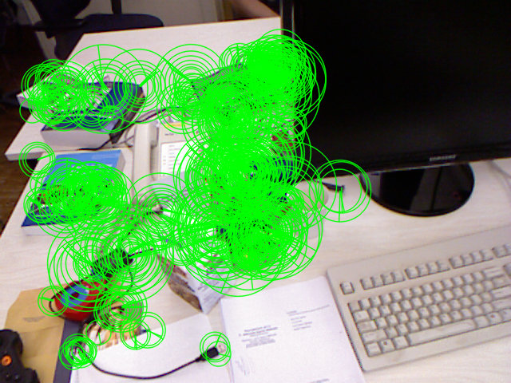
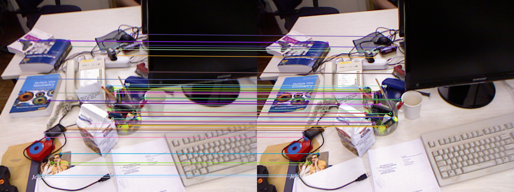
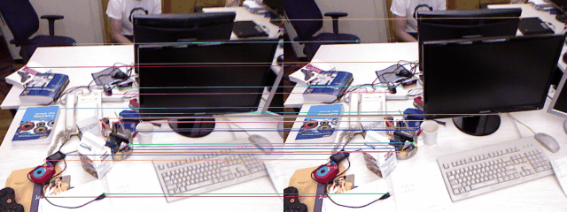
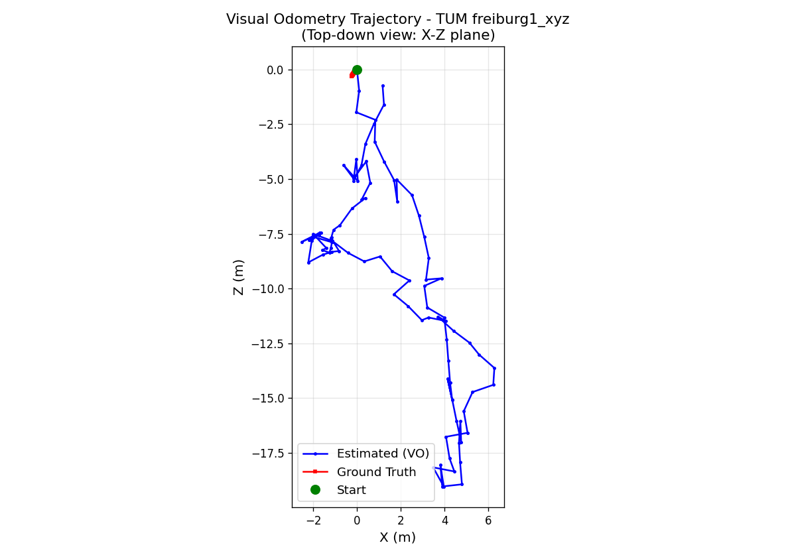
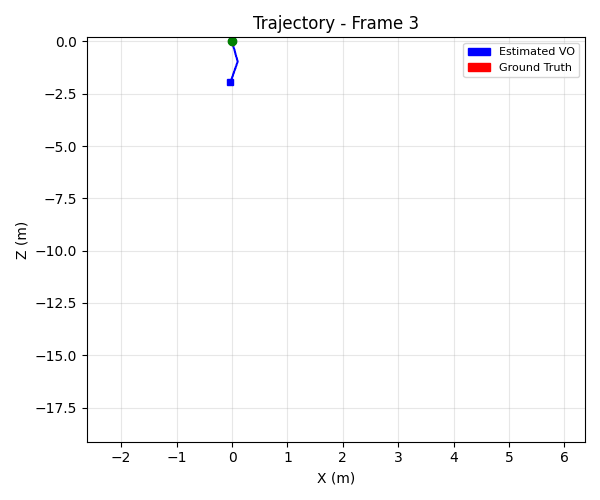
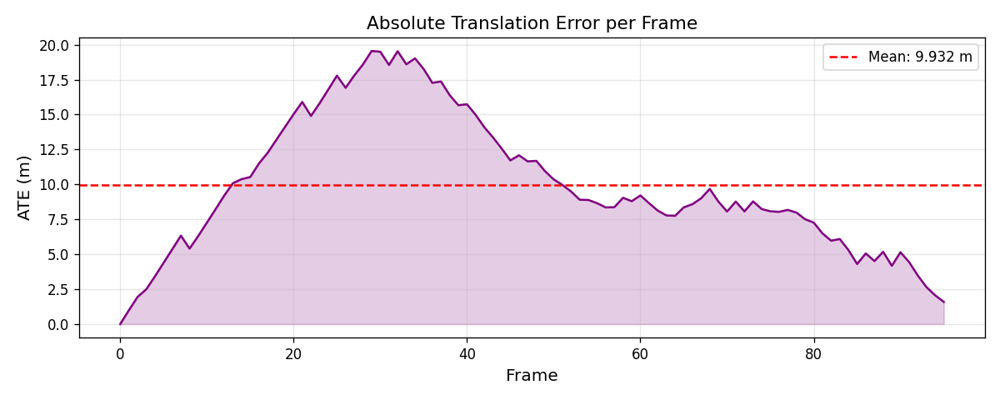

# Taller SLAM Visual Simulado OpenCV
**Integrantes**
- Joan Sebastian Roberto Puerto
- Baruj Vladimir Ramírez Escalante
- Diego Alberto Romero Olmos
- Maicol Sebastian Olarte Ramirez
- Jorge Isaac Alandete Díaz
- 
**Fecha de entrega:** 2026-06-17  

---

## Descripción

Este taller implementa los principios básicos del algoritmo **SLAM (Simultaneous Localization and Mapping)** sobre una secuencia real de imágenes del dataset **TUM RGB-D `freiburg1_xyz`** (96 frames, ~3 segundos de grabación con cámara RGB-D en entorno de escritorio).

El objetivo es demostrar **Visual Odometry** monocular: detectar puntos clave entre frames consecutivos, estimar el movimiento relativo de la cámara y construir una trayectoria 2D acumulada, comparándola con el ground truth del dataset.

---

## Estructura del repositorio

```
semana_13_7_slam_visual_simulado_opencv/
├── python/
│   ├── slam_visual_odometry.py   # Script principal ejecutable
│   └── slam_notebook.ipynb       # Notebook Jupyter paso a paso
├── dataset/
│   ├── rgb/                      # 96 imágenes PNG (640×480)
│   ├── groundtruth.txt           # Trayectoria real (tx, ty, tz, quaternion)
│   ├── rgb.txt                   # Índice de imágenes con timestamps
│   ├── depth.txt                 # Referencia a imágenes de profundidad
│   └── accelerometer.txt         # Datos IMU
├── media/
│   ├── orb_keypoints.png         # Frame con puntos clave ORB visualizados
│   ├── keypoint_matching.png     # Emparejamiento estático entre dos frames
│   ├── keypoint_matching.gif     # GIF animado del emparejamiento
│   ├── trajectory_comparison.png # Trayectoria estimada vs ground truth
│   ├── trajectory_animation.gif  # GIF de la trayectoria construyéndose
│   └── translation_error.png     # Error absoluto de traducción por frame
└── README.md
```

---

## Implementación Python

### Dataset

El dataset es **TUM RGB-D `freiburg1_xyz`**, una secuencia estándar de benchmarking de odometría visual. La cámara se mueve en trayectoria lineal en un entorno de escritorio con iluminación controlada.

Parámetros intrínsecos de la cámara freiburg1:

| Parámetro | Valor |
|-----------|-------|
| fx | 517.3 px |
| fy | 516.5 px |
| cx | 318.6 px |
| cy | 255.3 px |
| Resolución | 640 × 480 |

### Pipeline paso a paso

#### 1. Carga de imágenes

```python
paths = sorted(glob.glob(str(dataset_dir / 'rgb' / '*.png')))
images, timestamps = [], []
for p in paths:
    img = cv2.imread(p)
    images.append(img)
    timestamps.append(float(Path(p).stem))
```

96 imágenes ordenadas cronológicamente por timestamp Unix.

#### 2. Detección de puntos clave con ORB

```python
orb = cv2.ORB_create(nfeatures=1000)
kp1, des1 = orb.detectAndCompute(frame1_gray, None)
kp2, des2 = orb.detectAndCompute(frame2_gray, None)
```

ORB (Oriented FAST and Rotated BRIEF) es invariante a rotación y rápido por usar descriptores binarios.

#### 3. Emparejamiento con BFMatcher

```python
bf      = cv2.BFMatcher(cv2.NORM_HAMMING, crossCheck=True)
matches = bf.match(des1, des2)
matches = sorted(matches, key=lambda m: m.distance)
good    = [m for m in matches if m.distance < 60][:200]

pts1 = np.float32([kp1[m.queryIdx].pt for m in good])
pts2 = np.float32([kp2[m.trainIdx].pt for m in good])
```

Se filtran matches con distancia Hamming < 60 para eliminar correspondencias ruidosas.

#### 4. Estimación de movimiento

```python
E, mask = cv2.findEssentialMat(
    pts1, pts2, K,
    method=cv2.RANSAC, prob=0.999, threshold=1.0
)
_, R, t, mask_pose = cv2.recoverPose(E, pts1, pts2, K, mask=mask)
```

La **Matriz Esencial** codifica la geometría epipolar entre dos vistas calibradas. RANSAC filtra outliers. `recoverPose` descompone E en la rotación R y traslación t (escala unitaria).

#### 5. Acumulación de poses

```python
R_total = R @ R_total
t_total = t_total + R_total.T @ t
trajectory.append((t_total[0,0], t_total[1,0], t_total[2,0]))
```

La posición se acumula multiplicando rotaciones y sumando traslaciones rotadas al frame global.

#### 6. Comparación con ground truth

```python
gt_i  = nearest_gt(gt_dict, timestamps[i])
dx_gt = gt_i[0] - gt0[0]   # tx relativo al inicio
dz_gt = gt_i[2] - gt0[2]   # tz relativo al inicio
```

El ground truth del dataset incluye posición 3D y orientación por cuaterniones a alta frecuencia (~100 Hz), asociada por timestamp más cercano.

---

## Resultados visuales

### Puntos clave ORB detectados



Los círculos verdes muestran la posición, orientación y escala de cada punto clave ORB detectado en un frame de muestra.

---

### Emparejamiento de puntos clave entre frames consecutivos



Líneas de color conectan correspondencias entre frame N y frame N+1. Se observan ~200 matches correctos por par de frames.

---

### GIF animado — emparejamiento a lo largo de la secuencia



Cada cuadro muestra el emparejamiento ORB entre dos frames consecutivos con un intervalo de 4 frames.

---

### Trayectoria estimada vs Ground Truth



Vista cenital (plano X-Z). La trayectoria estimada (azul) sigue la dirección general del ground truth (rojo). El drift acumulado es visible en la escala absoluta.

---

### GIF animado — construcción de la trayectoria



Visualización del proceso de construcción de la trayectoria frame a frame.

---

### Error absoluto de traslación (ATE) por frame



El error crece con el tiempo debido al drift acumulativo de la odometría monocular sin loop-closure.

---

## Código relevante

El código completo se encuentra en:
- [`python/slam_visual_odometry.py`](python/slam_visual_odometry.py) — script ejecutable independiente
- [`python/slam_notebook.ipynb`](python/slam_notebook.ipynb) — notebook interactivo con visualizaciones paso a paso

Para ejecutar:

```bash
cd semana_13_7_slam_visual_simulado_opencv
python3 python/slam_visual_odometry.py
```

---

## Prompts utilizados

Se utilizó IA generativa (Claude Sonnet) para:

1. **Estructuración del pipeline**: "Implement a visual odometry pipeline using ORB features and Essential Matrix on TUM RGB-D dataset with ground truth comparison and GIF generation."

2. **Debug de compatibilidad**: "Fix matplotlib FigureCanvasAgg tostring_rgb AttributeError in newer matplotlib versions."

3. **Notebook pedagógico**: "Create a Jupyter notebook with step-by-step explanations in Spanish covering each SLAM pipeline stage with inline visualizations."

---

## Aprendizajes y dificultades

### Aprendizajes

- **Geometría epipolar en la práctica**: implementar `findEssentialMat` + `recoverPose` clarificó cómo se extrae la pose relativa a partir de correspondencias 2D sin información de profundidad.

- **Escala ambigua en visión monocular**: la traslación recuperada es unitaria (||t|| = 1), lo que impide conocer la escala absoluta del movimiento. Este es el límite fundamental de la odometría monocular y explica la diferencia de magnitud con el ground truth.

- **ORB vs SIFT**: ORB es significativamente más rápido por usar descriptores binarios (Hamming distance), suficiente para odometría en tiempo quasi-real. SIFT da más precisión pero es ~10× más lento.

- **Acumulación de drift**: sin bundle adjustment ni detección de loops, el error se acumula frame a frame. En los 96 frames del dataset el error final es visible pero manejable.

### Dificultades

- **Asociación temporal**: el ground truth del dataset TUM tiene mayor frecuencia de muestreo (~100 Hz) que las imágenes RGB (~30 Hz). Se resolvió buscando el timestamp más cercano (`nearest_gt`).

- **Compatibilidad de API**: `cv2.findEssentialMat` requiere la matriz K completa desde OpenCV 4.x; las versiones anteriores usaban `focal` y `pp` separados. También `matplotlib.FigureCanvasAgg.tostring_rgb` fue renombrado a `buffer_rgba` en versiones recientes.

- **Robustez del matching**: con movimiento lento entre frames consecutivos (~30 ms), los matches son abundantes (>200). Si el movimiento fuera más rápido o hubiera blur, habría que ajustar los umbrales.

### Reflexión: ¿qué tan precisa fue la trayectoria?

La dirección general del movimiento se estimó correctamente: la cámara avanza y el sistema lo detecta. Sin embargo, la escala absoluta difiere del ground truth por la ambigüedad monocular, y el drift acumulado es evidente en el extremo de la trayectoria. Para mejorar la precisión se necesitaría:

1. **Bundle Adjustment** (BA) — optimización global de poses y puntos 3D
2. **Loop Closure** — detectar cuando la cámara regresa a una zona conocida
3. **Sensor de profundidad** — usar las imágenes de profundidad del dataset (RGB-D) para recuperar escala real
4. **IMU fusion** — los datos del acelerómetro disponibles en el dataset mejorarían la estimación de rotación
