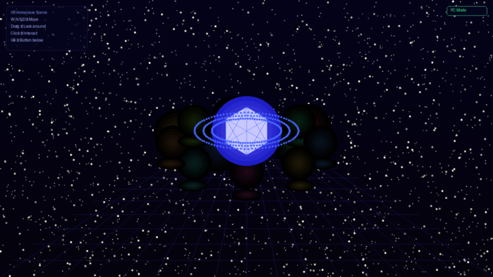
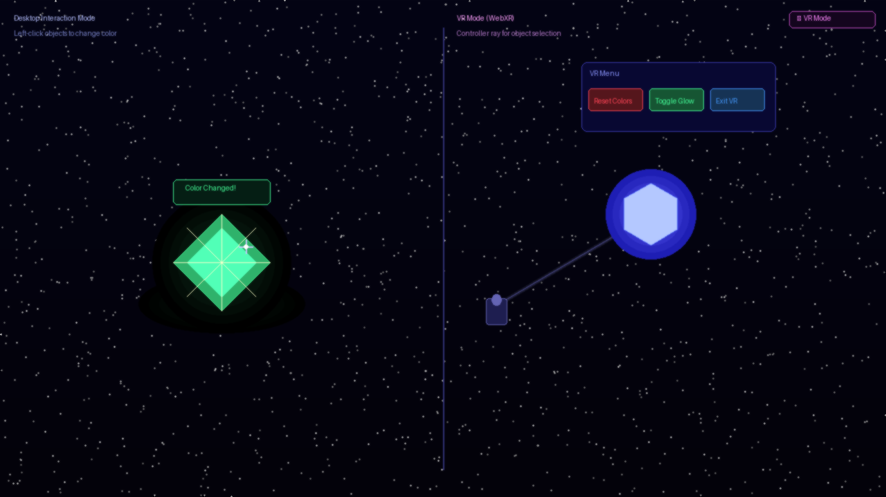

# Taller XR Multidispositivo Simulacion Inmersiva
|**Estudiante** 
- Joan Sebastian Roberto Puerto
- Baruj Vladimir Ramírez Escalante
- Diego Alberto Romero Olmos
- Maicol Sebastian Olarte Ramirez
- Jorge Isaac Alandete Díaz|


| Campo | Detalle |
|---|---|
| **Fecha de entrega** | 17 de junio de 2026 |
| **Entorno implementado** | Three.js con WebXR (Entorno A) |
| **Build tool** | Vite 8 + npm |
---

## Descripción

El objetivo de este taller fue construir una escena 3D inmersiva compatible con **WebXR** usando **Three.js**, explorable tanto desde un visor de realidad virtual como desde un navegador convencional mediante controles tipo **FlyControls** (teclado y ratón). La escena incluye geometrías interactivas, iluminación dinámica, detección de proximidad y soporte completo para controladores XR.

El proyecto usa **Vite** como herramienta de build: gestión de dependencias con npm, HMR durante el desarrollo y servidor HTTPS local (necesario para las APIs WebXR). Se integra además **webxr-polyfill** para garantizar que `navigator.xr` esté disponible en navegadores sin soporte nativo, y un botón VR personalizado que reemplaza el mensaje genérico de Three.js por información contextual clara.

Dado que no se cuenta con Unity en este entorno, únicamente se implementó el **Entorno A (Three.js + WebXR)**.

---

## Setup y ejecución

```bash
# Instalar dependencias
cd threejs
npm install

# Servidor de desarrollo (HTTPS, HMR, abre el navegador automáticamente)
npm run dev

# Build de producción en threejs/dist/
npm run build

# Previsualizar el build de producción localmente
npm run preview
```

> **HTTPS es obligatorio** para las APIs WebXR. El plugin `@vitejs/plugin-basic-ssl` genera un certificado autofirmado para `localhost`; el navegador mostrará una advertencia que se acepta una sola vez.

---

## Implementación – Three.js + WebXR

### Arquitectura y estructura del proyecto

El proyecto adopta una estructura **Vite + ES Modules** con código dividido en módulos por responsabilidad:

```
threejs/
├── index.html              # Punto de entrada Vite (HTML puro, sin scripts inline)
├── package.json            # three, webxr-polyfill, vite ^8, @vitejs/plugin-basic-ssl
├── vite.config.js          # HTTPS, host LAN, manualChunks (three + polyfill separados)
├── .gitignore              # node_modules/, dist/
└── src/
    ├── main.js             # init polyfill → bootstrap módulos → setAnimationLoop
    ├── style.css           # HUD, crosshair, mode indicator, hint badge
    └── modules/
        ├── scene.js        # Scene, Camera, WebGLRenderer (sin VRButton nativo)
        ├── vrButton.js     # Botón VR personalizado con degradación elegante
        ├── environment.js  # Starfield, floor, grid, nebula sphere
        ├── lighting.js     # Ambient, Hemisphere, DirectionalLight, orbit PointLights
        ├── objects.js      # 8 ring objects, central gem, per-frame animation
        ├── interaction.js  # Raycaster, mousedown/mouseup click, hover hint
        ├── controls.js     # FlyControls, XRControllerModelFactory, mode indicator
        └── vrMenu.js       # Floating VR billboard menu
```

**Grafo de dependencias** (sin ciclos):

```
scene.js  ←── environment.js
          ←── lighting.js
          ←── objects.js ←── interaction.js ←── controls.js
          ←── vrMenu.js
main.js   ←── todos los módulos anteriores
```

### Vite config

```js
// vite.config.js
import { defineConfig } from 'vite';
import basicSsl from '@vitejs/plugin-basic-ssl';

export default defineConfig({
  plugins: [basicSsl()],          // HTTPS para WebXR en localhost
  server: { https: true, host: true, open: true },
  build: {
    rollupOptions: {
      output: {
        manualChunks(id) {
          if (id.includes('node_modules/three')) return 'three';
        },
      },
    },
  },
});
```

El flag `host: true` expone el servidor en la LAN para que un headset conectado a la misma red pueda acceder.

### webxr-polyfill

La especificación del taller incluye `webxr-polyfill` como librería requerida. El polyfill parchea `navigator.xr` en navegadores que no tienen soporte nativo de WebXR, maximizando la compatibilidad (especialmente en móvil con Cardboard).

**Debe inicializarse antes de que cualquier otro módulo toque `navigator.xr`:**

```js
// src/main.js  — primera línea, antes de cualquier otro import
import WebXRPolyfill from 'webxr-polyfill';
new WebXRPolyfill();
```

### Botón VR personalizado (`vrButton.js`)

El `VRButton` nativo de Three.js muestra **"VR NOT SUPPORTED"** cuando el dispositivo no tiene un headset conectado — un mensaje alarmante que sugiere un error en lugar de un estado normal. Se reemplazó por un botón propio en `src/modules/vrButton.js` que tiene tres estados:

| Estado | Mensaje | Cuándo |
|---|---|---|
| `enter` | `ENTER VR` | `isSessionSupported('immersive-vr')` → `true` |
| `unavailable` | `No VR Device · PC Mode Active` | Headset no conectado (estado normal en escritorio) |
| `unavailable` | `WebXR Not Available · PC Mode` | `navigator.xr` no existe (sin HTTPS o navegador antiguo) |

```js
// src/modules/vrButton.js  — lógica principal
export function createVRButton() {
  const btn = document.createElement('button');
  applyBaseStyles(btn);
  document.body.appendChild(btn);

  if (!('xr' in navigator)) {
    applyState(btn, 'unavailable', 'WebXR Not Available · PC Mode');
    return btn;
  }

  navigator.xr
    .isSessionSupported('immersive-vr')
    .then(supported => {
      if (supported) {
        applyState(btn, 'enter');
        bindSession(btn);          // gestiona ENTER / EXIT + renderer.xr.setSession()
      } else {
        applyState(btn, 'unavailable', 'No VR Device · PC Mode Active');
      }
    })
    .catch(err => applyState(btn, 'unavailable', 'VR Not Allowed · PC Mode'));
}
```

El botón en estado `unavailable` tiene `opacity: 0.5`, `cursor: default` y un `title` con instrucciones, sin bloquear ni alarmar al usuario que trabaja en PC.

### Inicialización del renderer WebXR

```js
// src/modules/scene.js
import * as THREE from 'three';

export const renderer = new THREE.WebGLRenderer({ antialias: true });
renderer.xr.enabled         = true;
renderer.shadowMap.enabled  = true;
renderer.toneMapping        = THREE.ACESFilmicToneMapping;
document.body.appendChild(renderer.domElement);
// El VRButton ya NO se importa aquí; lo crea createVRButton() desde main.js
```

### Entorno 3D

- **Fondo**: color profundo `#03030e` con niebla exponencial (`FogExp2`, densidad 0.018).
- **Starfield**: 4 000 partículas (`THREE.Points`) en `environment.js`.
- **Suelo**: `PlaneGeometry` 100×100 con `GridHelper` semitransparente superpuesto.
- **Nebulosa de fondo**: esfera con `MeshBasicMaterial({ side: THREE.BackSide })`.

```js
// src/modules/environment.js
export function initEnvironment() {
  scene.add(buildStarfield());
  scene.add(buildFloor());
  scene.add(buildGrid());
  scene.add(buildNebula());
}
```

### Iluminación dinámica

| Luz | Tipo | Descripción |
|---|---|---|
| Ambiente | `AmbientLight` | Tono azul-violeta (0.7) |
| Hemisférica | `HemisphereLight` | Cielo azul / suelo negro |
| Direccional | `DirectionalLight` | Sombras PCF soft 2048² |
| 5× puntuales | `PointLight` | Orbitan, actualizadas en `updateLighting(delta)` |

```js
// src/modules/lighting.js
export function updateLighting(delta) {
  orbitLights.forEach(light => {
    light.userData.angle += delta * light.userData.speed;
    const { angle, radius, height } = light.userData;
    light.position.set(Math.cos(angle) * radius, height, Math.sin(angle) * radius);
  });
}
```

### Objetos interactivos

Ocho geometrías en `objects.js` (Box, Sphere, Torus, Cone, Octahedron, Dodecahedron, Icosahedron, Tetrahedron) en anillo a radio 9. Cada una expone:

- `MeshStandardMaterial` con `emissive` activo.
- Flotación sinusoidal + rotación idle.
- Círculo de zona en el suelo que aumenta opacidad por proximidad.

Objeto central: `IcosahedronGeometry` con shell wireframe y tres anillos orbitantes.

```js
// src/modules/objects.js  – builder de objeto del anillo
function buildRingObject(geo, color, index) {
  const angle = (index / GEOMETRIES.length) * Math.PI * 2;
  const mesh  = new THREE.Mesh(geo, new THREE.MeshStandardMaterial({
    color, emissive: color, emissiveIntensity: 0.12,
    metalness: 0.45, roughness: 0.28,
  }));
  mesh.position.set(Math.cos(angle) * ORBIT_DIST, 1.6, Math.sin(angle) * ORBIT_DIST);
  mesh.userData = { interactive: true, baseY: 1.6, floatOffset: index * 0.9, clickTimer: -1 };
  // ...
  return mesh;
}
```

### Controles de escritorio (FlyControls)

```js
// src/modules/controls.js
import { FlyControls } from 'three/addons/controls/FlyControls.js';

flyControls = new FlyControls(camera, renderer.domElement);
flyControls.movementSpeed = 5;
flyControls.dragToLook    = true;   // arrastar para mirar; click libre para interacción
```

| Tecla | Acción |
|---|---|
| W / A / S / D | Avanzar / izquierda / retroceder / derecha |
| R / F | Subir / bajar |
| Arrastrar mouse | Rotar vista |
| Click izquierdo | Interactuar con objeto |

### Interacción con objetos

```js
// src/modules/interaction.js
export function interact(obj) {
  const color = new THREE.Color().setHSL(Math.random(), 0.95, 0.62);
  obj.material.color.set(color);
  obj.material.emissive.set(color);
  if (obj.userData.zone) obj.userData.zone.material.color.set(color);
  obj.userData.clickTimer = 0;   // dispara animación de rebote en objects.js
}
```

Separar la lógica en `interaction.js` permite que tanto el mouse (escritorio) como el gatillo del controlador XR llamen exactamente la misma función `interact()`.

### Detección de zonas interactivas (proximidad)

```js
// src/modules/objects.js – dentro de _updateRingObjects()
const near  = camera.position.distanceTo(obj.position) < 3.8;
obj.material.emissiveIntensity =
  THREE.MathUtils.lerp(obj.material.emissiveIntensity, near ? 0.65 : 0.12, delta * 5);
obj.userData.zone.material.opacity =
  THREE.MathUtils.lerp(obj.userData.zone.material.opacity, near ? 0.55 : 0.12, delta * 5);
```

### Controladores XR

```js
// src/modules/controls.js
ctrl.addEventListener('selectstart', () => {
  const ray = new THREE.Raycaster();
  ray.ray.origin.setFromMatrixPosition(ctrl.matrixWorld);
  ray.ray.direction.set(0, 0, -1).applyMatrix4(
    new THREE.Matrix4().identity().extractRotation(ctrl.matrixWorld)
  );
  const hits = ray.intersectObjects(interactiveObjects, true);
  if (hits.length) interact(findInteractiveParent(hits[0].object));
});
```

### Menú flotante VR (bonus)

```js
// src/modules/vrMenu.js – billboard en el render loop
export function updateVRMenu() {
  if (!vrMenu.visible) return;
  vrMenu.quaternion.copy(camera.quaternion);
  const forward = new THREE.Vector3(0, 0, -1.6).applyQuaternion(camera.quaternion);
  vrMenu.position.copy(camera.position).add(forward);
  vrMenu.position.y = camera.position.y - 0.15;
}
```

### Detección automática PC vs VR (bonus)

```js
// src/main.js
renderer.setAnimationLoop(time => {
  // ...
  updateControls(delta);   // internamente: if (!renderer.xr.isPresenting) flyControls.update(delta)
  // ...
});
```

El indicador de modo en la esquina superior derecha cambia entre `PC Mode` y `🥽 VR Mode` vía los eventos `sessionstart` / `sessionend` del renderer XR.

---

## Resultados visuales

### Vista general de la escena (modo PC)



> Escena completa: starfield, piso con grid, 8 objetos geométricos en anillo con zonas de suelo, gema central con anillos orbitantes y luces de punto de colores. HUD de controles en la esquina superior izquierda e indicador de modo en la superior derecha.

### Interacción y modo VR



> Izquierda: close-up del modo de interacción en escritorio — objeto seleccionado con color cambiado, halo de brillo y cursor. Derecha: vista del modo VR con rayo del controlador apuntando a la gema central y menú flotante con botones de color.


> Una demostración de la interfaz de la aplicacion y sus principales controles mediante mouse y teclado.
---

## Código relevante

| Módulo | Responsabilidad |
|---|---|
| [`src/main.js`](threejs/src/main.js) | Init polyfill → bootstrap → `setAnimationLoop` |
| [`src/modules/scene.js`](threejs/src/modules/scene.js) | Renderer, Camera, resize (sin VRButton nativo) |
| [`src/modules/vrButton.js`](threejs/src/modules/vrButton.js) | Botón VR con 3 estados: ENTER VR / EXIT VR / No VR Device |
| [`src/modules/environment.js`](threejs/src/modules/environment.js) | Starfield, piso, grid, nebula |
| [`src/modules/lighting.js`](threejs/src/modules/lighting.js) | Luces estáticas + órbita de PointLights |
| [`src/modules/objects.js`](threejs/src/modules/objects.js) | 8 objetos del anillo + gema central + animaciones |
| [`src/modules/interaction.js`](threejs/src/modules/interaction.js) | Raycaster, click detection, `interact()` |
| [`src/modules/controls.js`](threejs/src/modules/controls.js) | FlyControls, XR controllers, mode HUD |
| [`src/modules/vrMenu.js`](threejs/src/modules/vrMenu.js) | Billboard VR menu |

---

## Prompts utilizados

Para el diseño y estructura se utilizó IA generativa (Claude) con los siguientes tipos de prompts:

1. **Arquitectura Vite + Three.js**: _"Refactorizar escena Three.js WebXR de un HTML monolítico a Vite con módulos ES en src/modules/. Incluir package.json, vite.config.js con @vitejs/plugin-basic-ssl para HTTPS, manualChunks para separar three.js del bundle de la app."_

2. **webxr-polyfill + orden de imports**: _"Integrar webxr-polyfill en un proyecto Vite para que parchee navigator.xr antes de que los demás módulos lo usen."_ → El polyfill debe ser el primer import en `main.js`, antes de cualquier módulo que acceda a `navigator.xr`.

3. **Botón VR "VR NOT SUPPORTED" → mensaje contextual**: _"Reemplazar el VRButton nativo de Three.js para mostrar 'No VR Device · PC Mode Active' en lugar de 'VR NOT SUPPORTED' cuando no hay headset, sin romper la sesión XR cuando sí lo hay."_ → Módulo `vrButton.js` con `isSessionSupported` + tres estados de UI.

4. **Compatibilidad Vite 8 / Rolldown**: _"El build falla con 'manualChunks is not a function' en Vite 8."_ → `manualChunks(id) { ... }` como función.

5. **Interacción click vs drag con FlyControls**: _"Distinguir click de arrastre cuando FlyControls captura el mouse."_ → `mousedown/mouseup` con umbral de 8px.

6. **XR controller raycasting**: _"Implementar selectstart con raycasting desde la posición y orientación del controlador en Three.js r167."_

7. **Menú VR billboard**: _"THREE.Group que siempre quede frente a la cámara XR, usando quaternion y proyección de vector forward."_

---

## Aprendizajes y dificultades

### ¿Cómo se siente la navegación XR vs sin visor?

Con **FlyControls** en escritorio la exploración es libre y cómoda, pero la inmersión es superficial: el usuario siempre sabe que está frente a un monitor. La escala no es real y la sensación de "estar dentro" no existe.

En un visor **WebXR** la transformación es radical: los objetos tienen tamaño 1:1, acercarse a uno para activar su zona de proximidad es un gesto instintivo, y el menú flotante que sigue a la cámara solo tiene sentido en ese contexto. La tecnología deja de ser evidente.

### Dificultades encontradas

| Dificultad | Solución |
|---|---|
| Three.js `VRButton` mostraba "VR NOT SUPPORTED" en escritorio sin headset | Botón personalizado `vrButton.js` con `isSessionSupported` y mensaje contextual |
| `webxr-polyfill` no encontraba `navigator.xr` al iniciar | El polyfill debe ser el **primer** import en `main.js`, antes de `scene.js` |
| FlyControls capturaba todos los clicks, bloqueando la interacción | `dragToLook: true` + delta mousedown/mouseup con umbral de 8px |
| Anillos del objeto central interferían en el raycasting | `while (!o.userData.interactive) o = o.parent` para subir al padre correcto |
| Menú VR flotante no seguía correctamente al headset | `quaternion.copy` + proyección `(0,0,-1.6)` por el quaternion de la cámara |
| `manualChunks` como objeto roto en Vite 8 (Rolldown) | Cambiar a función `manualChunks(id) { ... }` |
| WebXR requiere HTTPS; Vite en HTTP daba `navigator.xr` undefined | `@vitejs/plugin-basic-ssl` + `server.https: true` en vite.config |

### ¿Qué adaptaría para una mejor experiencia?

- **Locomotion en VR**: teleportación con `XRControllerModelFactory` en lugar de FlyControls.
- **Audio espacial**: `THREE.PositionalAudio` + `AudioListener` en la cámara; cada objeto emite sonido al activarse.
- **Modelos GLTF**: sustituir las geometrías procedurales por modelos con `GLTFLoader`.
- **Haptic feedback**: `controller.gamepad.hapticActuators[0].pulse(0.5, 100)` al seleccionar objetos en VR.

---

## Estructura del repositorio

```
semana_14_4_xr_multidispositivo_simulacion_inmersiva/
├── threejs/
│   ├── index.html              # Punto de entrada Vite (HTML mínimo)
│   ├── package.json            # three, webxr-polyfill, vite ^8, basic-ssl
│   ├── vite.config.js          # HTTPS, host LAN, manualChunks (three + polyfill)
│   ├── .gitignore              # node_modules/, dist/
│   └── src/
│       ├── main.js             # [1º] polyfill → bootstrap → setAnimationLoop
│       ├── style.css           # HUD, crosshair, mode indicator, hint
│       └── modules/
│           ├── scene.js        # Renderer, Camera, resize
│           ├── vrButton.js     # Botón VR: ENTER VR / EXIT VR / No VR Device
│           ├── environment.js  # Starfield, suelo, grid, nebula
│           ├── lighting.js     # Luces + updateLighting()
│           ├── objects.js      # Objetos + updateObjects()
│           ├── interaction.js  # Raycaster + interact()
│           ├── controls.js     # FlyControls + XR controllers
│           └── vrMenu.js       # Floating VR billboard
├── unity/                      # (vacío – sin Unity disponible)
├── media/
│   ├── screenshot_scene.png
│   └── screenshot_interaction.png
└── README.md
```
