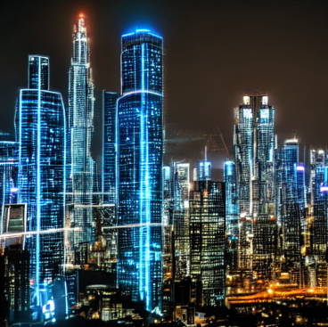
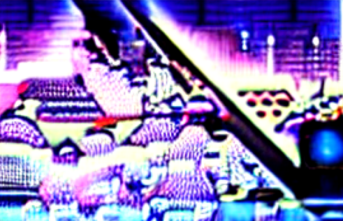
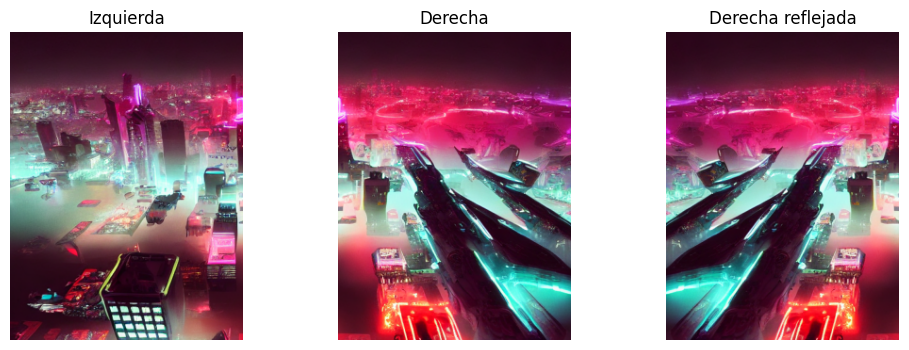
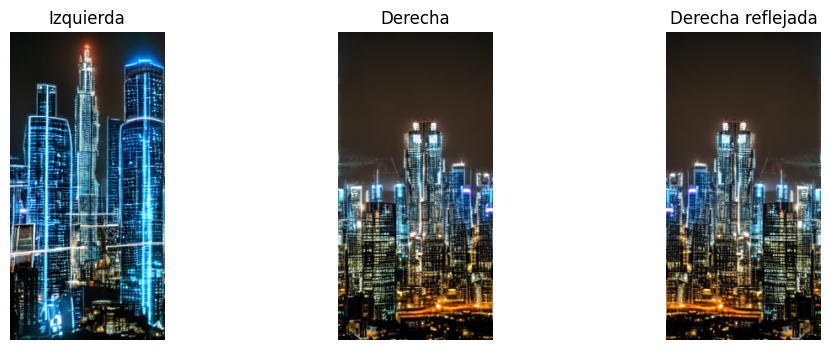
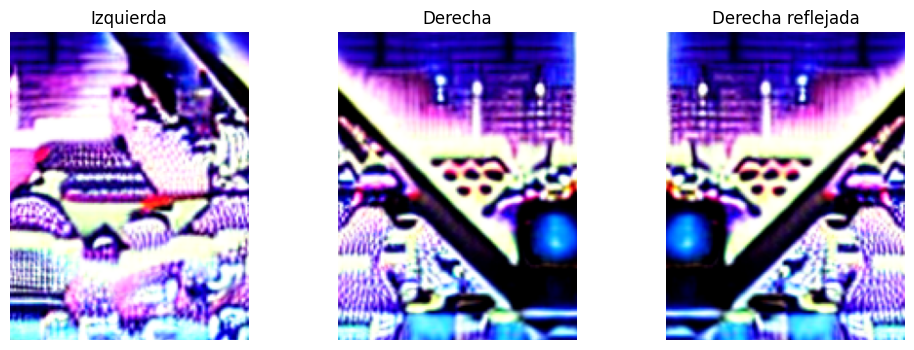
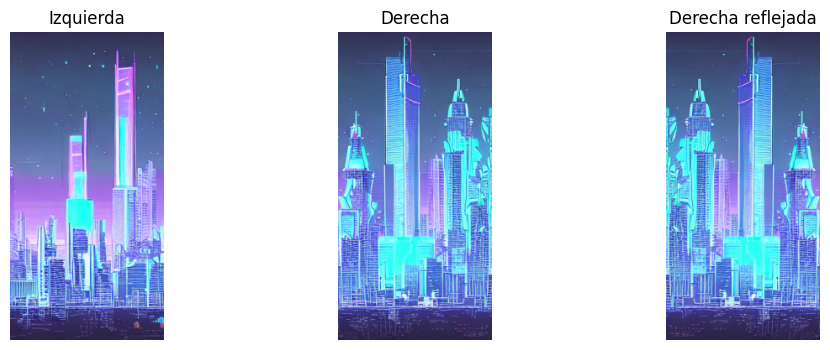

# Taller 15_3 – Evaluando la Creatividad Artificial: Métricas y Reflexión

**Integrantes:**  
- Joan Sebastian Roberto Puerto  
- Baruj Vladimir Ramírez Escalante  
- Diego Alberto Romero Olmos  
- Maicol Sebastian Olarte Ramirez  
- Jorge Isaac Alandete Díaz  

**Fecha de entrega:** 14 de Junio de 2026  

---

## Descripción breve

### Python

En el entorno de ejecucion de Google collab se desarrollo un aplicativo para analizar imágenes generadas por modelos generativos, utilizando herramientas de visión por computador y aprendizaje profundo. La evaluación combina métricas automáticas de similitud semántica con respeto al Prompt y balance visual con una inspección cualitativa de los resultados obtenidos.

## Implementacion en Python - Google Collab

### 1. Evaluación semántica mediante CLIPScore

Se utilizó el modelo **CLIP (Contrastive Language–Image Pretraining)** de OpenAI para medir el grado de alineación semantica entre una imagen generada y el prompt textual utilizado para producirla.

El procedimiento consiste en:

1. Convertir la imagen y el texto en embeddings utilizando CLIP.
2. Calcular la similitud coseno entre ambos vectores.
3. Utilizar dicha similitud como indicador de coherencia semántica.

### 2. Evaluación de balance visual mediante SSIM

Se implementó una métrica de simetría visual utilizando el índice **SSIM (Structural Similarity Index)**.

El proceso consiste en:

1. Dividir la imagen en dos mitades verticales.
2. Reflejar horizontalmente la mitad derecha.
3. Comparar ambas regiones utilizando SSIM.

### 3. Comparación de múltiples generaciones

Para un mismo prompt se analizaron varias imágenes generadas por IA.

Cada imagen fue evaluada utilizando:

* CLIPScore.
* Simetría visual (SSIM).
* Inspección visual manual.

## Descripción del proceso de evaluación

El flujo de evaluación seguido fue el siguiente:

1. Generar o recopilar varias imágenes para un mismo prompt.
2. Cargar cada imagen.
3. Obtener la puntuación CLIPScore para medir coherencia semántica.
4. Calcular la simetría visual mediante SSIM.
5. Comparar los resultados cuantitativos entre imágenes.
6. Realizar una evaluación subjetiva considerando:

   * Coherencia.
   * Creatividad.
   * Presencia de elementos absurdos o inesperados.

---


## Resultados 

Como imagenes se tomaron las anteriormente gfeneradoas en IA en el Taller 12-4 Control Visual: Manipulación Dirigida con ControlNet, que fueron generadoas usando como Prompt "A cyberpunk city skyline at night", se geenraron 4 imagenes, 2 imagenes restringidas a distintos filtros aplicados a una imagen (imagenes img1 y img3) y 2 libres de restriccion fuera de su prompt (Imagenes img2 y img4).

Sobre estas generaciones subjetivamente, **img1** es la mas cercana al Prompt usado, principalemnte por los colores neones fuertes que usa, representativos en la estetica cyberpunk, las **img2** y **img4** pese a reprcentar ciudades futuristas usan luces azules y moradas, dando una estetica mas similar al synthwave futurista que al cyberpunk, ademas de ser la mas creativa (pese a tener que restringir su generacion a una imagen de entrada) pues reinterpreta los elemntos de manera ingeniose añadiendo un difuminado como una niebla de color (color dado por los neones) que complementa la atmosfera.

Ahora hablar del elefante en la habitación, **img3** sobre la cual es evidente la cantidad de ruido que posee (aunque admito que con varios iteraciones mas se podria conducir a una imagen interesante) no distinguiendo claramente los elementos de una ciudad, aunque se acerca, usando unos colores neones que recuerdan a los niveles casino/carnival de los juegos de Sonic.

### Clip Score

- El valor de Clip de **img1** fue: *0.29638671875*


- El valor de Clip de **img2** fue: *0.315185546875*



- El valor de Clip de **img3** fue: *0.249267578125*



- El valor de Clip de **img4** fue: *0.32861328125*


### SSIM Score

Al comparar la parte derecha de la imagen con la parte izquierda de la imagen se obtuvo:

- El valor de SSIM de **img1** fue: *0.26997011601809723*



- El valor de SSIM de **img2** fue: *0.17240199803217657*



- El valor de SSIM de **img3** fue: *0.06596182087194076*



- El valor de SSIM de **img4** fue: *0.2333763738837042*



## Comparacion de resultados

| Imagen | Valor CLIP | Valor SSIM |
| :---: | :--- | :--- |
| img1 | 0.29638671875 | 0.26997011601809723 |
| img2 | 0.315185546875 | 0.17240199803217657 |
| img3 | 0.249267578125 | 0.06596182087194076 |
| img4 | 0.32861328125 | 0.2333763738837042 |

## Analisis de resultados

El analisis de resuktados arrojo que **img2** fue la mas generación acercada al Prompt utilizado, sin embargo difiriendo mucho con respecto al resultado ideal de *1*, teniendo ubn resultado de *0.31*.

Con respeto a la simetria y carga visual, la imagen **img1** es la mas simetrica de las estudiadas, cuya carga visual se distribuye por ambos lados de la imagen.

---

## Código relevante
Cálculo de SSIM

```python
score = ssim(
    left_gray,
    right_gray,
    data_range=1.0
)
```

---

# Preguntas

- ¿Qué significa que algo sea “creativo”?

La palabra cretividad por si misma tiene un amplio significado y debido a la subjetividad de ma misma es dificil dar una descripcion de la misma, pero personalmente la asocio a dos conceptos algo contrarios, la capacidad de ser disruptivo dentro de un contenedor, sobre un conjunto de reglas establecidad poder retorcerlas (sin romperlas) hasta crear algo nuevo y unico (disruptivo), asi como el encontrar una solución ingeniosa a un problema.

Descripcion que me parece acertada hasta que llegamos al campo del arte, donde existe infinida de formas para representar nuestra mente (mente sin contenedor o barrera alguna), pues aqui se vuelve en un "Lo que se es capaz de imaginar y representar" por lo que se tiene la limitación del medio de representación a una mente sin barreras.

- ¿Qué parte de la imagen fue decidida por el humano?

En la generacion de imagenes se tiende a tener una idea vaga de lo que se desea hacer, idea que uno trata de plasmar y representar en texto, representandolas en forma mas de sugerencias a que se debe orientar/convertir un conjunto de ruido generado, por que, si una IA genera algo que no era nuestro objetivo en el prompt ¿realmente decidimos algo?.

- ¿Podemos medir arte o creatividad con métricas?

Creo que el arte o la creatividad se pueden medir con metricas, pero no que esas metricas sean conrrectas para sus mediciones, por que es facil decir "La Monalisa es mas hermosa que el garabato que hize en 30 segundos" pero la pregunta del ¿porque? es la que es dificil de descripbir de forma acetada, y es principalmente por un aspecto, el humano jusga el arte y la creatividad por aquello que le hace sentir, si es agradeble a la vista nos parece hermoso, pero a la vez como un Rothko entre una habitacion de trajeados que puede mirar el nombre de su autor y aplaudir o mirar con admiranción, cuando el objetivo del Rothko era el de incomodarlos, se vuelve algo inherentemente subjetivo pues depende de las vivencias de cada individuo.

---

## Aprendizajes y dificultades

### Aprendizajes

- Comprender cómo CLIP puede utilizarse para evaluar automáticamente la relación entre texto e imagen.
- Combinar análisis cuantitativos y cualitativos para obtener una evaluación más completa de contenido visual generado por IA.
- Utilizar herramientas de visión por computador para extraer información estructural de imágenes.

### Dificultades encontradas

- Interpretar correctamente los valores de CLIPScore, ya que no existe un umbral universal o punto para determinar calidad, solo existe una diferencia absoluta (*0*) y una cerncania absoluta (*1*).
- Gestionar diferencias de formato y tamaño entre imágenes generadas por distintos modelos.

### Reflexión final

Los modelos al igual que uno como ser humano, aprenden de los que procesan y inhebitablemente generan sesgos, considero que estos modelos de evaluación (principalmente CLIP) que trata de buscar objetividad en base al consenso de miles de millones se sesgos, que en ocaciones (probablemente siguiendo una normal) puede coincidir con un individuo pero en otras no, sirve como un segundo juez que puede dar una vision general (de una mayoria estadistica).

