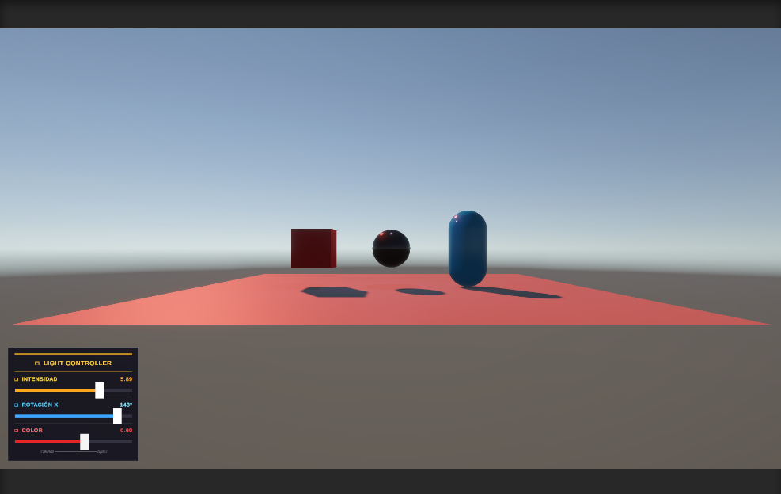
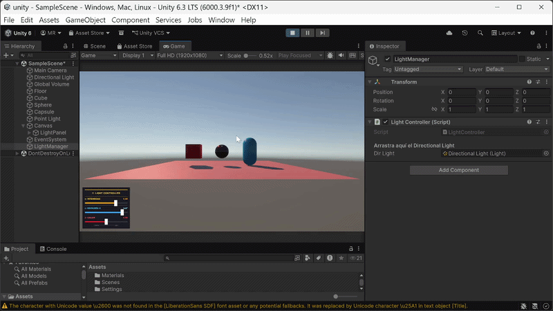
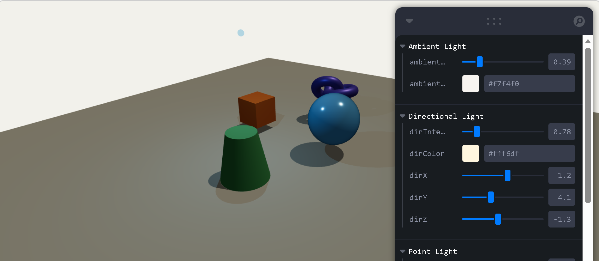
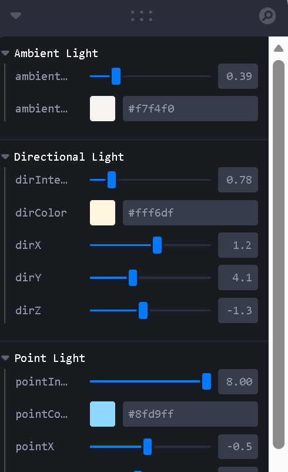

# Taller Luces Sombras Radiometría

**Estudiantes:**  
- Joan Sebastian Roberto Puerto
- Baruj Vladimir Ramírez Escalante
- Diego Alberto Romero Olmos
- Maicol Sebastian Olarte Ramirez
- Jorge Isaac Alandete Díaz

**Fecha de entrega:** 16 de marzo, 2026

---

## 📋 Descripción breve

Este taller explora la simulación de radiometría en motores gráficos 3D, analizando cómo la luz interactúa con materiales y objetos para generar escenas visualmente realistas. Se implementaron escenarios en Unity y Three.js (React Three Fiber), configurando diferentes tipos de luces, materiales y sombras, y experimentando con parámetros físicos y controles interactivos.

---

## 🛠️ Implementaciones

### Unity

- **Escenario:**  
	Se creó una escena con luz direccional, luz puntual y luz ambiental.  
	Se usaron objetos con materiales mate, metálico y semitransparente.  
	Se implementó un controlador de luz (UI) para modificar intensidad, color y rotación en tiempo real (`Assets/LightController.cs`).

- **Parámetros configurables:**  
	- Intensidad, color y dirección de las luces  
	- Materiales: smoothness, metallic, albedo  
	- Sombras proyectadas activadas

- **Bonus:**  
	Control de luz desde UI interactiva.

### Three.js (React Three Fiber)

- **Escenario:**  
	Se creó una escena con un plano y varios objetos (`App.jsx`, `Scene.jsx`, `components/Objects.jsx`).  
	Se añadieron `<ambientLight>`, `<directionalLight>` y `<pointLight>` con sombras habilitadas (`components/Lights.jsx`).  
	Materiales usados: `MeshStandardMaterial` y parámetros físicos.

- **Parámetros configurables:**  
	- Intensidad, color y posición de las luces  
	- Materiales: roughness, metalness  
	- Sombras activadas  
	- Objetos animados y controles interactivos con Leva

- **Bonus:**  
	Controles interactivos para modificar luz en tiempo real.

---

## 🖼️ Resultados visuales

Agrega aquí mínimo 2 imágenes/GIFs por implementación mostrando el funcionamiento.  
Las imágenes deben estar en la carpeta `media/` y referenciadas así:


### Unity




### Three.js


```

---

## 💻 Código relevante

- Unity:  
	- Controlador de luz: [`Assets/LightController.cs`](unity/Assets/LightController.cs)
- Three.js:  
	- Configuración de luces: [`src/components/Lights.jsx`](threejs/src/components/Lights.jsx)
	- Objetos y materiales: [`src/components/Objects.jsx`](threejs/src/components/Objects.jsx)

---

## 🤖 Prompts utilizados


"Genera un README.md para un taller de simulación de radiometría en Unity y Three.js, incluyendo estructura de carpetas, descripción de implementaciones, resultados visuales, código relevante."

"Ayudame a construir la base para un proyecto realizado con react + vite y con treefiber y leva."

---

## 🧠 Aprendizajes y dificultades

Durante el taller aprendimos a configurar y manipular diferentes tipos de luces y materiales en motores gráficos 3D, comprendiendo cómo afectan la visualización y realismo de una escena. Experimentar con parámetros físicos y controles interactivos nos permitió entender mejor la radiometría y la importancia de la simulación visual.

Entre las dificultades destacaron la correcta configuración de sombras en Unity y Three.js, y el ajuste de materiales para lograr efectos realistas. El uso de UI para controlar la luz en tiempo real fue un reto interesante que enriqueció la experiencia.

---

## 📂 Estructura de carpetas

```
semana_4_1_luces_sombras_radiometria/
├── unity/
├── threejs/
├── media/
└── README.md
```

---
