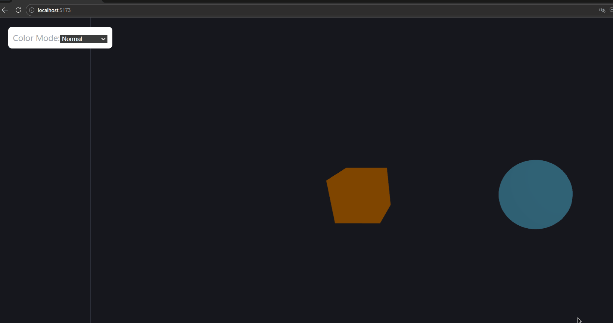
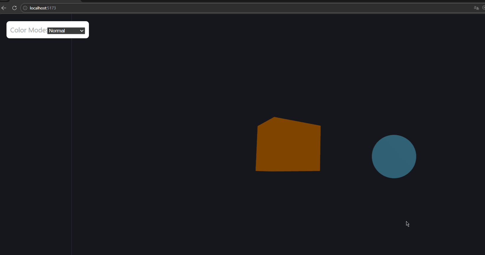
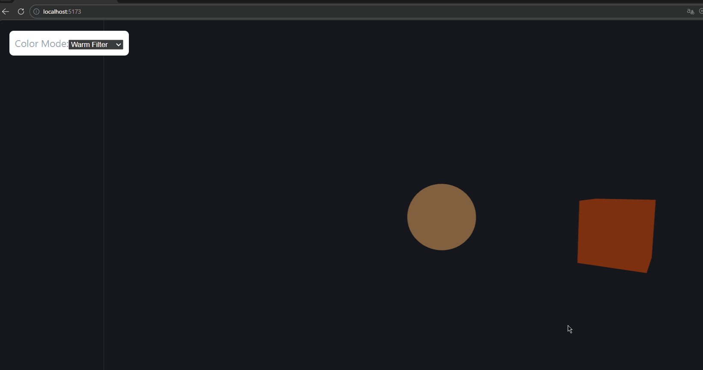

# Taller Modelos Color Percepcion

## Nombre del estudiante

- Joan Sebastian Roberto Puerto
- Baruj Vladimir Ramírez Escalante
- Diego Alberto Romero Olmos
- Maicol Sebastian Olarte Ramirez
- Jorge Isaac Alandete Díaz

## Fecha de entrega

`2026-03-16`

---

## Descripción breve

Este taller explora la percepción del color desde dos perspectivas: la humana y la computacional. Se investigaron diferentes espacios de color (RGB, HSV, CIE Lab) y se implementaron simulaciones de daltonismo (protanopía y deuteranopía) y filtros de temperatura en Python. Adicionalmente, se desarrolló una escena interactiva en **Three.js** que permite visualizar objetos 3D bajo distintos modos de color (normal, simulaciones de daltonismo, monocromático, cálido y frío). El objetivo principal fue comprender cómo los modelos de color afectan la interpretación visual y cómo pueden aplicarse transformaciones para simular condiciones específicas de visión.

---

## Implementaciones

### Python

Se desarrolló un notebook en Jupyter utilizando las librerías `opencv-python`, `matplotlib`, `numpy` y `scikit-image`. Las principales funcionalidades incluyen:

- Carga y visualización de una imagen en RGB.
- Conversión a los espacios **HSV** y **CIE Lab**, mostrando cada canal por separado.
- Simulación de protanopía y deuteranopía mediante matrices de transformación de color.
- Reducción del brillo para simular baja iluminación (modificando el canal `Value` en HSV).
- Se generaron gráficas comparativas de cada transformación.

### Three.js / React Three Fiber

Se construyó una escena 3D interactiva con:

- Dos objetos primitivos (un cubo y una esfera) con colores base naranja y azul.
- Un menú desplegable que permite cambiar el modo de color en tiempo real.
- Modos implementados: **normal**, **protanopia**, **deuteranopia**, **monochrome**, **warm filter** y **cool filter**.
- Los colores se actualizan mediante JavaScript, modificando directamente las propiedades de los materiales.
- Se incluyó iluminación ambiental y puntual para una mejor visualización.

---

## Resultados visuales

### Python - Implementación

  
*Ejecución del notebook mostrando las conversiones de color y las simulaciones de daltonismo.*

  
*Resultado de la conversión de RGB a CIE Lab, con los canales L, a y b visualizados por separado.*

### Three.js - Implementación

  
*Escena Three.js en modo normal, con colores originales (naranja y azul).*

  
*Visualización de los modos protanopia, deuteranopia y monocromático en la misma escena.*

  
*Efecto de los filtros de temperatura cálida y fría sobre los objetos 3D.*

---

## Código relevante

### Python – Simulación de protanopía

```python
def protanopia_simulation(img):
    matrix = np.array([
        [0.56667, 0.43333, 0],
        [0.55833, 0.44167, 0],
        [0,       0.24167, 0.75833]
    ])
    img = img / 255.0
    sim = img @ matrix.T
    sim = np.clip(sim, 0, 1)
    return (sim * 255).astype(np.uint8)
```

### Python – Reducción de brillo usando HSV

```python
def reduce_brightness(img, factor=0.4):
    hsv = cv2.cvtColor(img, cv2.COLOR_RGB2HSV)
    h, s, v = cv2.split(hsv)
    v = (v * factor).astype(np.uint8)
    hsv_dark = cv2.merge([h, s, v])
    return cv2.cvtColor(hsv_dark, cv2.COLOR_HSV2RGB)
```

### Three.js – Cambio de color según modo

```jsx
function Objects({ mode }) {
  let color1 = "orange";
  let color2 = "skyblue";

  if (mode === "protanopia") {
    color1 = "#bfae6a";
    color2 = "#6a7fbf";
  }
  if (mode === "deuteranopia") {
    color1 = "#c9b458";
    color2 = "#587ac9";
  }
  // ... otros modos

  return (
    <>
      <mesh position={[-2, 0, 0]}>
        <boxGeometry args={[1, 1, 1]} />
        <meshStandardMaterial color={color1} />
      </mesh>
      <mesh position={[2, 0, 0]}>
        <sphereGeometry args={[0.8, 32, 32]} />
        <meshStandardMaterial color={color2} />
      </mesh>
    </>
  );
}
```

---
## Prompts utilizados

Durante el desarrollo del taller se utilizaron los siguientes prompts con herramientas de IA generativa para agilizar ciertas tareas de implementación y documentación:

- **"Escribe una función en Python usando OpenCV que convierta una imagen de RGB a HSV y modifique el canal de brillo (Value) para simular baja iluminación."**  
  Se utilizó para implementar la reducción de brillo.

- **"Crea un componente en React Three Fiber que cambie el color de dos objetos 3D según un modo seleccionado (normal, protanopia, deuteranopia, monocromo, cálido, frío)."**  
  Sirvió como base para la escena interactiva en Three.js.

- **"Escribe una función que convierta una imagen RGB a CIE Lab y devuelva sus componentes por separado."**  
  Se empleó para la sección de conversión de espacios de color.

- **"Genera código CSS para posicionar un menú desplegable superpuesto en una escena Three.js."**  
  Se utilizó para el diseño de la interfaz en el frontend.

---

## Aprendizajes y dificultades

### Aprendizajes

Este taller permitió afianzar conceptos clave sobre los espacios de color (RGB, HSV, CIE Lab) y cómo estos afectan la percepción visual. Se comprendió la utilidad de transformar entre espacios para aplicar filtros como la simulación de daltonismo o la modificación de brillo. Además, se reforzó el trabajo con matrices de transformación lineal y la manipulación de píxeles con OpenCV.

### Dificultades

La parte más desafiante fue calcular las matrices de simulación de daltonismo, ya que requirió investigar los coeficientes adecuados y entender cómo afectan la mezcla de canales. En Three.js, el principal reto fue asegurar que los cambios de color se aplicaran correctamente en tiempo real sin afectar el rendimiento. Se solucionó actualizando directamente las propiedades del material en cada renderizado.

### Mejoras futuras

Se podría ampliar el proyecto agregando un control deslizante para ajustar el grado de simulación de daltonismo (deficiencia parcial). También sería interesante incorporar texturas y evaluar cómo se comportan bajo los diferentes modos de color.


## Estructura del proyecto

```
semana_4_2_modelos_color_percepcion/
├── python/                 # Código del notebook (modelos_color_percepcion.ipynb)
├── threejs/                # Código de la escena Three.js (App.jsx)
├── media/                  # GIFs e imágenes de resultados
│   ├── notebook_Python.gif
│   ├── Convertir RGB a CIE lab.jpg
│   ├── Color_Normal_Threejs.gif
│   ├── Color_Monochrome_Deuteranopia_Protanopia_Threejs.gif
│   └── Color_WarmFilter_CoolFilter_Threejs.gif
└── README.md               # Este archivo
```

---

## Referencias

- Documentación oficial de OpenCV: https://docs.opencv.org/
- Documentación de scikit‑image: https://scikit-image.org/
- Guía de React Three Fiber: https://docs.pmnd.rs/react-three-fiber/
- “A Physiologically‑based Model for Simulation of Color Vision Deficiency” – Viénot, Brettel, Mollon (1999)

---

## Checklist de entrega

- [x] Carpeta con nombre `semana_4_2_modelos_color_percepcion`
- [x] Código limpio y funcional en carpetas por entorno
- [x] GIFs/imágenes incluidos con nombres descriptivos en carpeta `media/`
- [x] README completo con todas las secciones requeridas
- [x] Mínimo 2 capturas/GIFs por implementación
- [x] Commits descriptivos en inglés (en el repositorio)
- [x] Repositorio organizado y público (según corresponda)