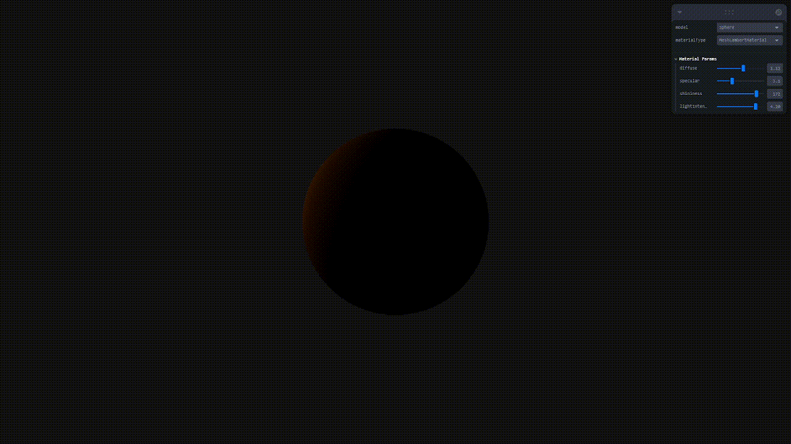
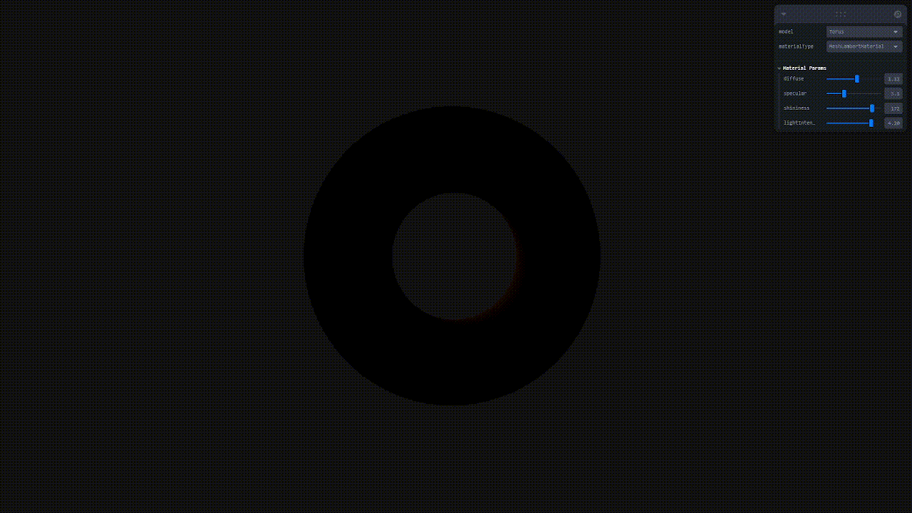
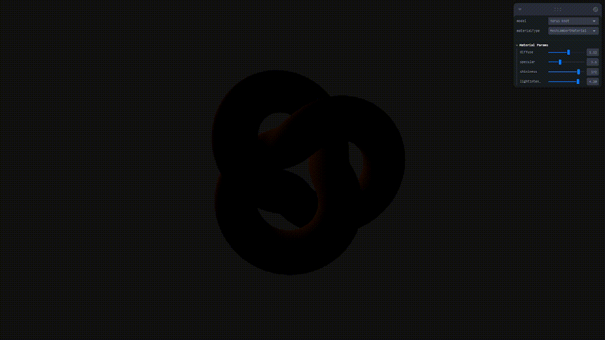

# Modelos Reflexion pbr

### Nombres:

- Joan Sebastian Roberto Puerto
- Baruj Vladimir Ramírez Escalante
- Diego Alberto Romero Olmos
- Maicol Sebastian Olarte Ramirez
- Jorge Isaac Alandete Díaz

### Fecha de entrega: 14/03/2026

### Descripción del tema:
Implementar y comparar diferentes modelos de reflexión de luz: Lambertiano (difuso), Phong (especular), Blinn-Phong, y fundamentos de PBR (Physically Based Rendering). Comprender las diferencias matemáticas y visuales entre cada modelo.

### Descripción de la implementación: 

#### Threejs:

En Threejs se aplican diferentes modelos de reflexion de luz, aplicandolos como tod componentes diferentes, como Material y como Shaders

#### Material

Se aplican mediante tipos de materiales ya preestablecidos de Threejs 3 diferentes materiales, MeshLambertMaterial que repecenta el modelo de reflexion Lambertiano aplicado al material, MeshPhongMaterial que sigue el modelo Blinn-Phong de la reflexion y por ultimo el modelo de reflexion de luz PBR con meshStandardMaterial.

#### Shaders

Sobre un material sobre el cual se deciden sus parametros de difucion, especular y brillo se aplican tres diferentes algoritmos de Shaders para la reflexion de luz en forma de Shaders Lambert, Phong y PBR. 

#### Processing:

En la aplicacion Processing se crea una esfera mediante el metodo renderSphere() el cual mediante triangulos construye las esfera y asigna un indice de iluminación a cada triangulo que conforma la esfera mediante la ecuacion de Lambert (producto punto entre la normal del triangulo y la direccion de la luz) y aplicando el gradiente de iluminación a cada triangulo multiplicando el indice de iluminación a 255, esto mientras con el metodo rotateY( se hace girar la esfera).

### Resultados visuales: 

#### Threejs:

Se muestran los resultados visuales usando tres figuras diferentes, una esfera, un toro y un nudo.

Sobre la figura de la esfera se cambian los materiales MeshLambertMaterial, MeshPhongMaterial y meshStandardMaterial.

Sobre la figura del Toro se cambian los materiales MeshLambertMaterial, MeshPhongMaterial y meshStandardMaterial.

Sobre la figura del Nudo se cambian los materiales MeshLambertMaterial, MeshPhongMaterial y meshStandardMaterial.

Sobre la figura de la esfera con material de personalizado se cambian entre tres algoritmos de Shaders: Lambert, Phong y PBR.

Sobre la figura del Toro con material de personalizado se cambian entre tres algoritmos de Shaders: Lambert, Phong y PBR.

Sobre la figura del Nudo con material de personalizado se cambian entre tres algoritmos de Shaders: Lambert, Phong y PBR.

#### Processing:

Se muestra el resultado de la esfera mostrandose la iluminacion por pixel mientras gira para la visualizacion del resultado. 

