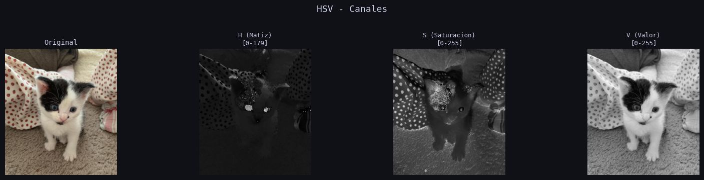
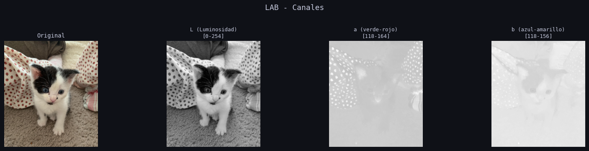
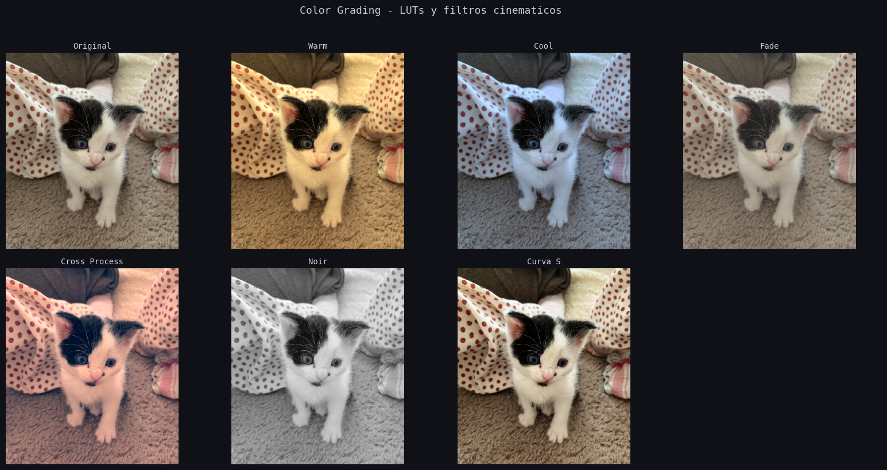
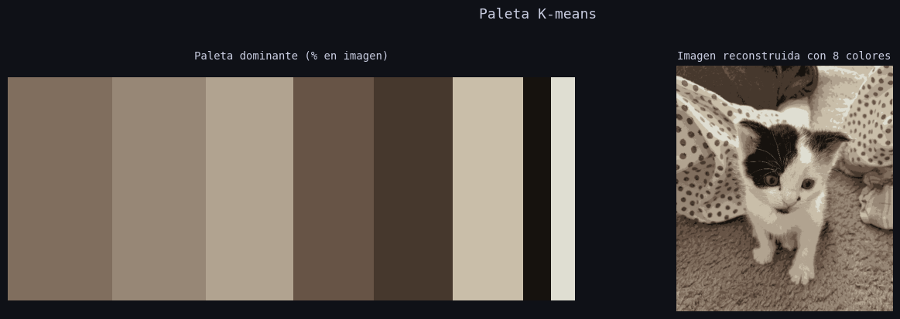
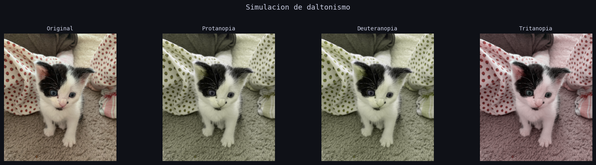
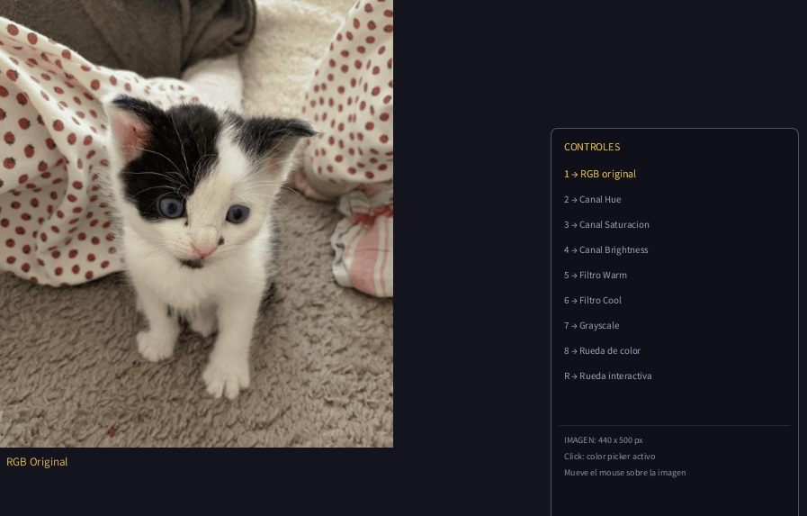
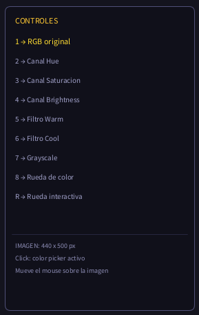

# Taller Conversion Espacios Color

**Estudiantes:** 

- Joan Sebastian Roberto Puerto
- Baruj Vladimir Ramírez Escalante
- Diego Alberto Romero Olmos
- Maicol Sebastian Olarte Ramirez
- Jorge Isaac Alandete Díaz

**Fecha de entrega:** 

15 de marzo, 2026

---

## Descripción breve

El objetivo de este taller fue trabajar con diferentes espacios de color (RGB, HSV, HLS, LAB, YCrCb, CIE XYZ), realizar conversiones entre ellos y aplicarlos en tareas prácticas de manipulación de imágenes. Se implementó en dos entornos: un notebook en Google Colab con Python para análisis completo incluyendo color grading, paletas K-means, histogramas y efectos bonus, y un sketch en Processing para exploración interactiva en tiempo real con color picker y rueda de color HSB.

---

## Implementaciones

### 🐍 Python — Google Colab

Implementado en un notebook de Google Colab usando `opencv-python`, `scikit-image`, `numpy`, `matplotlib` y `sklearn`.

**Conversión entre espacios de color:** la imagen se carga con OpenCV en BGR y se convierte inmediatamente a RGB. Desde ahí se generan las conversiones a HSV, HLS, LAB, YCrCb y XYZ usando `cv2.cvtColor()` y `skcolor.rgb2xyz()`. Para cada espacio se documentan los rangos mínimos, máximos y medios de cada canal, y se visualizan los tres canales separados como imágenes en escala de grises.

**Visualización 3D:** se submuestrean 3000 píxeles aleatorios de la imagen y se grafican en el espacio RGB 3D y en el espacio HSV cilíndrico (coordenadas polares S·cos(H), S·sin(H), V), coloreando cada punto con su color real.

**Segmentación por color en HSV:** se definen rangos para rojo, azul, verde y amarillo usando `cv2.inRange()`. Las máscaras binarias se limpian con morfología (erosión + dilatación con kernel elíptico) y se aplican sobre la imagen original para extraer cada color segmentado.

**Manipulación de color:** ajuste de saturación (canal S en HSV), rotación de matiz (canal H en HSV), ajuste de luminosidad (canal L en LAB) y balance de blancos automático por el método gray world.

**Color Grading con LUTs:** 6 filtros cinemáticos mediante Look-Up Tables: Warm, Cool, Fade, Cross Process, Noir y Curva S.

**Paletas con K-means:** `KMeans` con 8 clusters extrae los colores dominantes, reconstruye la imagen y genera las cuatro armonías cromáticas desde el color más dominante.

**Análisis de histogramas:** histogramas RGB y HSV, comparación entre ecualización global y CLAHE adaptativa.

**Bonus:** corrección automática con CLAHE en LAB, simulación de daltonismo (protanopia, deuteranopia, tritanopia) con matrices de Machado, y transfer de color con el algoritmo de Reinhard en espacio LAB.

**Herramientas:** `opencv-python`, `scikit-image`, `numpy`, `matplotlib`, `sklearn`

---

### 🎨 Processing

Implementado en un sketch de Processing (`.pde`) que carga una imagen JPG y permite explorar distintos modos de visualización de espacios de color en tiempo real mediante el teclado.

- **Carga de imagen:** `loadImage()` desde la carpeta `data/` del sketch, redimensionada automáticamente a la ventana de 900x600px.
- **Acceso a píxeles individuales:** cada filtro recorre `imagen.pixels[]` accediendo a los canales R, G, B con `red()`, `green()` y `blue()` de Processing.
- **Conversión RGB → HSB manual:** implementación del algoritmo estándar sin `colorMode(HSB)`, calculando Hue desde el canal dominante, Saturation como `delta/cmax` y Brightness como `cmax`, normalizados a `[0,1]`.
- **Visualización de canales HSB:** teclas 2, 3 y 4 muestran Hue, Saturation y Brightness como imágenes en escala de grises.
- **Filtros en tiempo real:** Warm y Cool (teclas 5 y 6) multiplicando canales R y B por factores distintos. Grayscale (tecla 7) con pesos de luminancia perceptual ITU-R BT.601.
- **Color picker:** al mover el mouse sobre la imagen se muestra el color del píxel bajo el cursor con sus valores RGB, HSB y código HEX en tiempo real.
- **Rueda de color HSB:** tecla 8 genera una rueda estática donde el ángulo representa Hue y la distancia al centro la Saturación. Tecla R activa la versión interactiva con valores H, S, B y HEX del punto señalado.

**Herramientas:** `Processing 4`, Java, `loadImage()`, `pixels[]`, `colorMode()`

---

## Resultados visuales

### Python

**Canales del espacio HSV separados — Matiz, Saturación y Valor**



**Canales del espacio LAB — Luminosidad, eje verde-rojo y eje azul-amarillo**



**Color Grading — LUTs y filtros cinemáticos aplicados**



**Paleta K-means — colores dominantes y reconstrucción de imagen**



**Simulación de daltonismo — Protanopia, Deuteranopia y Tritanopia**



### Processing

**Color picker en tiempo real — RGB, HSB y HEX del píxel bajo el cursor**



**Panel de controles y modos de visualización**



---

## Código relevante

### Python — Conversión y segmentación por color en HSV

```python
img_hsv = cv2.cvtColor(img_rgb, cv2.COLOR_RGB2HSV)

lower_blue = np.array([100, 50, 50])
upper_blue = np.array([130, 255, 255])
mascara    = cv2.inRange(img_hsv, lower_blue, upper_blue)

kernel  = cv2.getStructuringElement(cv2.MORPH_ELLIPSE, (5, 5))
mascara = cv2.morphologyEx(mascara, cv2.MORPH_OPEN,  kernel)
mascara = cv2.morphologyEx(mascara, cv2.MORPH_CLOSE, kernel)
objeto  = cv2.bitwise_and(img_rgb, img_rgb, mask=mascara)
```

### Python — Extracción de colores dominantes con K-means

```python
pixels_flat = img_rgb.reshape(-1, 3).astype(np.float32)
kmeans      = KMeans(n_clusters=8, random_state=42, n_init=10)
kmeans.fit(pixels_flat)
colores_dominantes = kmeans.cluster_centers_.astype(np.uint8)
img_reconstruida   = colores_dominantes[kmeans.labels_].reshape(img_rgb.shape)
```

### Python — Transfer de color (Reinhard et al.)

```python
def transfer_color(fuente_rgb, destino_rgb):
    fuente_lab  = skcolor.rgb2lab(fuente_rgb  / 255.0)
    destino_lab = skcolor.rgb2lab(destino_rgb / 255.0)
    resultado_lab = destino_lab.copy()
    for canal in range(3):
        mf, sf = fuente_lab[:,:,canal].mean(),  fuente_lab[:,:,canal].std()
        md, sd = destino_lab[:,:,canal].mean(), destino_lab[:,:,canal].std()
        if sd > 0:
            resultado_lab[:,:,canal] = (destino_lab[:,:,canal] - md) * (sf/sd) + mf
    return np.clip(skcolor.lab2rgb(resultado_lab)*255, 0, 255).astype(np.uint8)
```

### Processing — Conversión RGB → HSB manual

```java
float[] rgbAhsb(float r, float g, float b) {
  float rn = r/255.0, gn = g/255.0, bn = b/255.0;
  float cmax = max(rn, max(gn, bn));
  float cmin = min(rn, min(gn, bn));
  float delta = cmax - cmin;

  float brightness  = cmax;
  float saturation  = (cmax == 0) ? 0 : delta / cmax;
  float hue = 0;
  if (delta != 0) {
    if      (cmax == rn) hue = ((gn - bn) / delta) % 6;
    else if (cmax == gn) hue = (bn - rn) / delta + 2;
    else                 hue = (rn - gn) / delta + 4;
    hue = hue / 6.0;
    if (hue < 0) hue += 1.0;
  }
  return new float[]{hue, saturation, brightness};
}
```

### Processing — Color picker sobre píxeles individuales

```java
void actualizarColorPicker() {
  imgOriginal.loadPixels();
  int px = constrain(mouseX, 0, imgOriginal.width - 1);
  int py = constrain(mouseY, 0, imgOriginal.height - 1);
  colorSeleccionado = imgOriginal.pixels[py * imgOriginal.width + px];

  picker_r     = (int)red(colorSeleccionado);
  picker_g     = (int)green(colorSeleccionado);
  picker_b_val = (int)blue(colorSeleccionado);

  float[] hsb = rgbAhsb(picker_r, picker_g, picker_b_val);
  picker_h = hsb[0] * 360;
  picker_s = hsb[1] * 100;
  picker_b = hsb[2] * 100;
}
```

---

## Prompts utilizados

Este taller fue desarrollado con asistencia de IA generativa (Claude):

- *"Implementar conversión entre espacios RGB, HSV, HLS, LAB, YCrCb y XYZ con visualización de canales, segmentación, color grading con LUTs, paletas K-means, histogramas y bonus de daltonismo y transfer de color en Colab"* → generó el notebook completo.
- *"El notebook generó un error de JSON al cargarse en Colab"* → llevó a regenerar con `json.dump()` para garantizar JSON válido.
- *"Crear sketch en Processing para cargar imagen, convertir RGB a HSB manualmente, color picker, filtros en tiempo real y rueda de color interactiva"* → generó el sketch `.pde` completo.

---

## Aprendizajes y dificultades

**Aprendizajes principales:**

El aprendizaje más importante fue entender que los espacios de color no son simplemente formas distintas de representar el mismo dato, sino que cada uno expone dimensiones diferentes de la información visual. El espacio HSV es el más intuitivo para manipulación porque separa el color (H), su intensidad (S) y su brillo (V) en canales independientes. El espacio LAB es el más útil para ajustes de iluminación porque su canal L corresponde a la luminosidad percibida por el ojo humano, independiente del color.

La segmentación por color en HSV fue especialmente reveladora: definir un rango de matiz es más robusto que intentarlo en RGB, porque en RGB un mismo color puede tener valores muy distintos según la iluminación, mientras que en HSV el matiz es relativamente estable.

Processing resultó sorprendentemente accesible para visualización interactiva — su loop `draw()` y el acceso directo a `pixels[]` permiten aplicar transformaciones en tiempo real con muy poco código. La equivalencia entre el `draw()` de Processing y el `useFrame()` de React Three Fiber o el `Update()` de Unity hace que el concepto sea inmediatamente familiar.

**Dificultades encontradas:**

La principal dificultad fue un error de JSON en el notebook al intentar cargarlo en Colab, causado por caracteres de escape mal formados dentro de los strings. La solución fue regenerar el notebook directamente con `json.dump()` desde Python.

En Processing, la dificultad inicial fue entender que la imagen debe estar en la carpeta `data/` del sketch — Processing no busca archivos en rutas absolutas sino relativas a esa carpeta. Una vez entendida esa convención el flujo es muy directo.