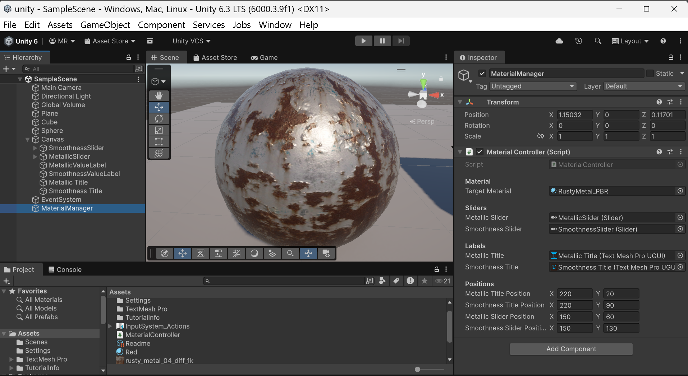
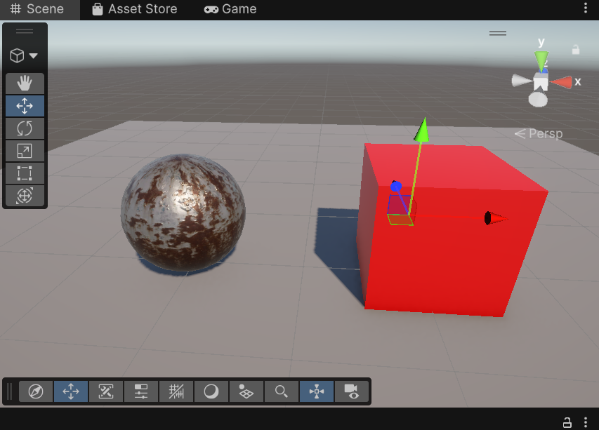
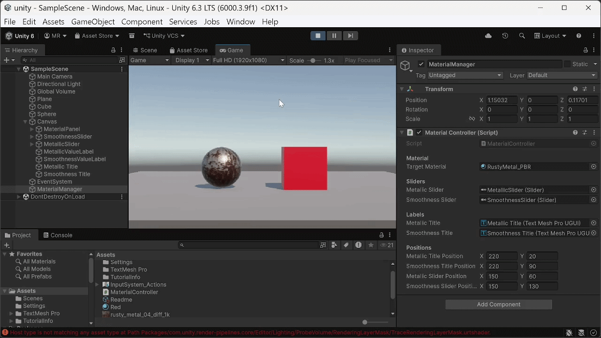
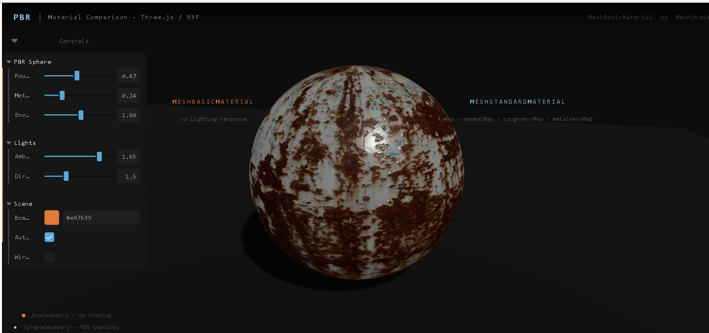
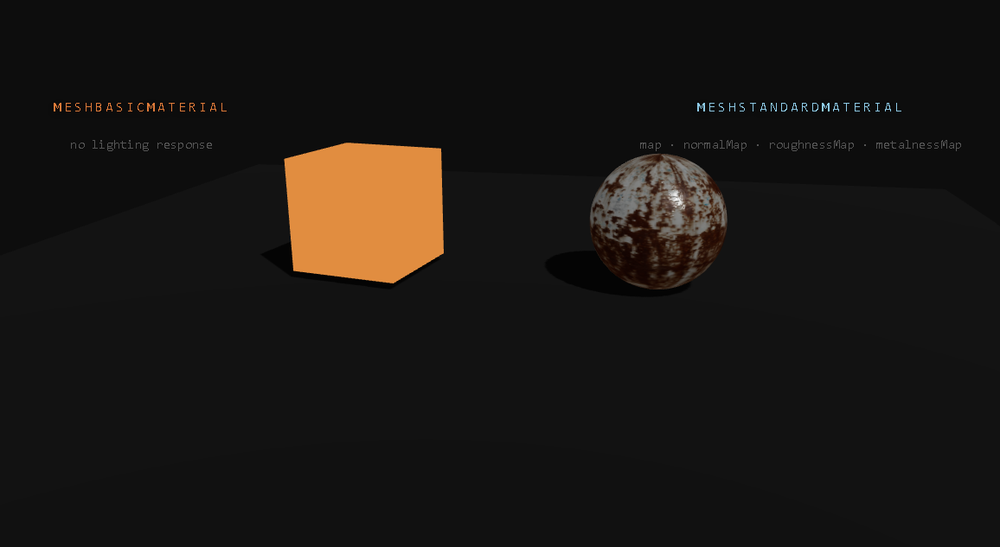
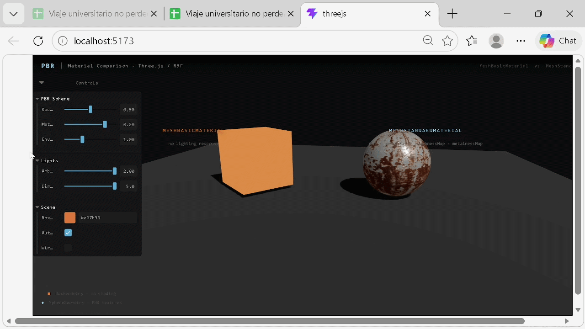

# Taller Materiales PBR — Unity & Three.js

**Estudiantes:**
- Joan Sebastian Roberto Puerto
- Baruj Vladimir Ramírez Escalante
- Diego Alberto Romero Olmos
- Maicol Sebastian Olarte Ramirez
- Jorge Isaac Alandete Díaz

**Fecha de entrega:** 28 de marzo, 2026

---

## 📋 Descripción breve

Este taller explora los principios del **renderizado basado en física (PBR)** y su aplicación en Unity y Three.js para lograr materiales realistas en modelos 3D. Se implementan y comparan materiales con y sin mapas PBR, permitiendo observar el impacto visual de texturas como albedo, rugosidad, metalicidad y normales. El objetivo es comprender cómo la luz interactúa con diferentes materiales y cómo las texturas afectan el resultado visual final.

---

## 🛠️ Implementaciones

### Unity

**Escenario:**
- Escena 3D con luz direccional, plano y objetos (cubo, esfera).
- Importación de texturas PBR: Albedo, Roughness, Metalness, Normal Map.
- Creación de material PBR y asignación de mapas en el shader Standard.
- Comparación con material básico (solo color).
- UI con sliders para modificar `_Metallic` y `_Smoothness` en tiempo real.

**Código relevante:**
```csharp
// MaterialController.cs
public class MaterialController : MonoBehaviour
{
    public Material targetMaterial;
    public Slider metallicSlider;
    public Slider smoothnessSlider;

    void Start()
    {
        metallicSlider.onValueChanged.AddListener(UpdateMaterial);
        smoothnessSlider.onValueChanged.AddListener(UpdateMaterial);
    }

    void UpdateMaterial(float _)
    {
        targetMaterial.SetFloat("_Metallic",   metallicSlider.value);
        targetMaterial.SetFloat("_Smoothness", smoothnessSlider.value);
    }
}
```

**Estructura de la UI:**
- Panel con sliders y etiquetas para valores de `_Metallic` y `_Smoothness`.
- Panel visual con materiales aplicados a los objetos de la escena.

**Resultados visuales:**

<p align="center">
  
  
  
</p>

---

### Three.js (React Three Fiber)

**Escenario:**
- Escena con luz ambiental y direccional, plano y dos objetos (box y esfera).
- Uso de `MeshStandardMaterial` con mapas: `map`, `roughnessMap`, `metalnessMap`, `normalMap`.
- Comparación con `MeshBasicMaterial` (sin respuesta a la luz).
- Panel interactivo (Leva) para modificar roughness, metalness, color y wireframe.

**Código relevante:**
```jsx
// Scene.jsx
function PBRSphere({ roughness, metalness, envMapIntensity, rotate, wireframe }) {
  const [colorMap, normalMap, roughnessMap, metalnessMap] = useTexture([
    '/rusty_metal_04_diff_1k.png',
    '/rusty_metal_04_nor_gl_1k.png',
    '/rusty_metal_04_rough_1k.png',
    '/rusty_metal_04_metal_1k.png',
  ], ([diff]) => { diff.colorSpace = THREE.SRGBColorSpace })

  return (
    <mesh>
      <sphereGeometry args={[0.8, 32, 32]} />
      <meshStandardMaterial
        map={colorMap}
        normalMap={normalMap}
        roughnessMap={roughnessMap}
        metalnessMap={metalnessMap}
        roughness={roughness}
        metalness={metalness}
        envMapIntensity={envMapIntensity}
        wireframe={wireframe}
      />
    </mesh>
  )
}
```

**Panel interactivo:**
- Control de roughness, metalness, color y wireframe en tiempo real.

**Resultados visuales:**

<p align="center">
  
  
  
</p>

---

## 📷 Resultados visuales

Las imágenes y GIFs de los resultados se encuentran en la carpeta `media/`. Se incluyen mínimo 2 capturas por entorno (Unity y Three.js), usando los nombres sugeridos en las secciones anteriores.

---

## 📄 Prompts utilizados

- "Genera un script en Unity para controlar los valores de metallic y smoothness de un material PBR usando sliders en la UI."
- "¿Cómo aplico mapas de texturas PBR (albedo, roughness, metalness, normal) en el Standard Shader de Unity?"
- "Dame un ejemplo de escena en React Three Fiber con MeshStandardMaterial y controles interactivos para roughness y metalness."
- "¿Cómo cargo y aplico texturas PBR en Three.js usando React Three Fiber?"
- "Explica la diferencia visual entre MeshBasicMaterial y MeshStandardMaterial en Three.js."

---

## 🧠 Aprendizajes y dificultades

- Aprendimos a configurar materiales PBR en Unity y Three.js, comprendiendo la importancia de cada mapa (albedo, roughness, metalness, normal) para el realismo visual.
- La integración de controles interactivos (sliders en Unity, Leva en Three.js) facilitó la experimentación en tiempo real con los parámetros de los materiales.
- La principal dificultad fue ajustar correctamente los mapas de texturas y entender cómo afectan la apariencia bajo diferentes condiciones de luz.
- Comparar el resultado visual entre materiales básicos y PBR permitió apreciar el impacto de la física en el renderizado.

---

## 📁 Estructura de carpetas
```
semana_5_1_materiales_pbr_unity_threejs/
├── unity/
├── threejs/
├── media/
└── README.md
```

---

## ✅ Criterios de evaluación

- Cumplimiento de los objetivos del taller.
- Código limpio, comentado y bien estructurado.
- README.md completo con toda la información requerida.
- Evidencias visuales claras (imágenes/GIFs/videos en carpeta `media/`).
- Repositorio organizado siguiendo la estructura especificada.
- Commits descriptivos en inglés.
- Nombre de carpeta correcto: `semana_5_1_materiales_pbr_unity_threejs`.