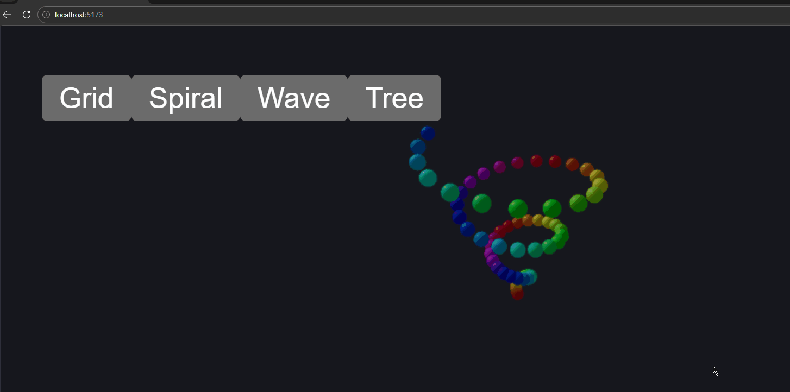
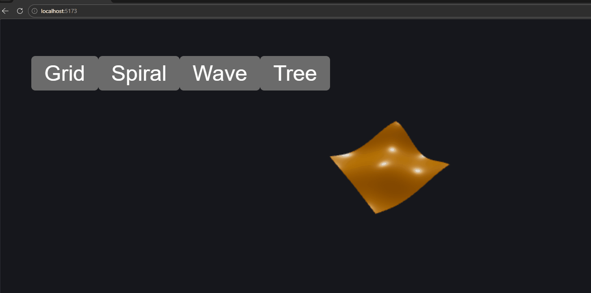
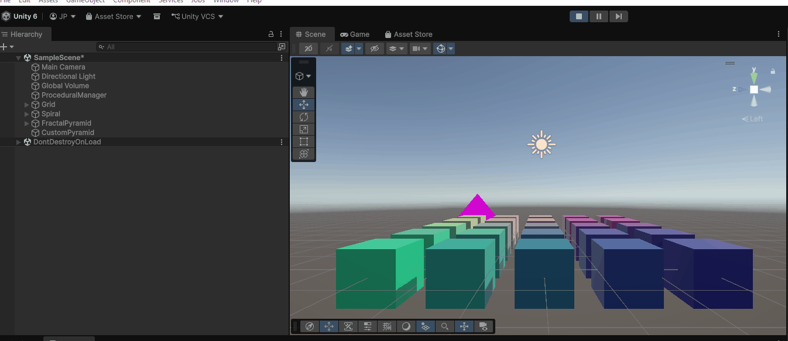
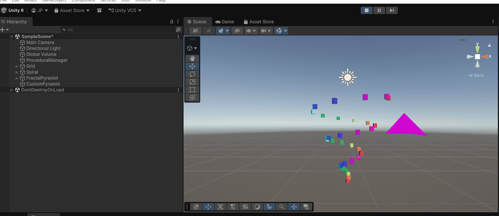
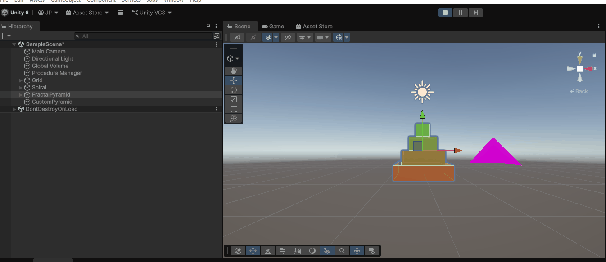

# Taller Modelado Procedural Basico

## Nombres de estudiantes:

- Joan Sebastian Roberto Puerto
- Baruj Vladimir Ramírez Escalante
- Diego Alberto Romero Olmos
- Maicol Sebastian Olarte Ramirez
- Jorge Isaac Alandete Díaz

## Fecha de entrega

`2026-03-28`

---

## Descripción breve

Este taller explora la generación procedural de geometría 3D utilizando **Three.js** y **React Three Fiber** (parte web) y **Unity** (parte de motores de juego). Se implementaron cuatro escenas interactivas en la web (cuadrícula instanciada, espiral animada, superficie ondulante y árbol fractal) y cuatro generaciones procedurales en Unity (rejilla de cubos, espiral de cilindros, pirámide fractal y malla personalizada). El objetivo es comprender cómo generar y manipular geometría directamente desde código sin modelado manual.

---

## Implementaciones (Three.js)

Todas las implementaciones se encuentran en la carpeta `threejs/src/components/`. La escena principal (`App.jsx`) permite alternar entre las cuatro demostraciones mediante botones.

### 1. Grid – Cuadrícula de cubos instanciados

Se genera una cuadrícula de 11×11 cubos utilizando `instancedMesh`, lo que optimiza el rendimiento al compartir la misma geometría y material. Cada cubo se posiciona mediante una matriz de transformación.

- **Archivo:** `Grid.jsx`
- **Técnica:** Instancing con `Object3D` dummy y actualización de la matriz de instancias.

### 2. Spiral – Espiral de esferas animada

Se crea una espiral 3D con 61 esferas cuyos colores varían según el ángulo (`hsl`). El conjunto completo rota lentamente sobre el eje Y usando `useFrame`.

- **Archivo:** `Spiral.jsx`
- **Técnica:** Cálculo paramétrico de posiciones en coordenadas cilíndricas; animación con `useFrame`.

### 3. Wave – Superficie ondulante por vértices

Un plano de 64×64 segmentos se deforma en tiempo real: cada vértice modifica su altura según una función seno-coseno que depende de la posición y del tiempo. Se actualizan las normales para una iluminación correcta.

- **Archivo:** `AnimatedVertex.jsx`
- **Técnica:** Manipulación directa del arreglo `position.array` y actualización de normales.

### 4. Tree – Árbol fractal recursivo con viento

Se implementa un árbol binario en 3D usando recursión: cada rama genera cuatro hijas con orientaciones diferentes. Cada segmento es un cilindro con geometría calculada dinámicamente. Además, las ramas tienen una pequeña oscilación (efecto de viento) gracias a `useFrame`.

- **Archivo:** `FractalTree.jsx`
- **Técnica:** Recursión, transformaciones de geometría (traslación y rotación) y animación en `group`.

---

## Implementaciones (Unity)

Se desarrolló un único script en C# (`ProceduralGenerator.cs`) que, al ejecutar la escena, genera cuatro estructuras diferentes. El script utiliza `GameObject.CreatePrimitive` para crear primitivas, bucles `for` para posicionarlas y también construye una malla personalizada desde cero con `Mesh`, `Vector3[]` e `int[]`.

### 1. Rejilla de cubos (Grid)

Se genera una cuadrícula de tamaño configurable (por defecto 5×5) de cubos con colores degradados según su posición. Los cubos se crean con `CreatePrimitive(PrimitiveType.Cube)` y se organizan bajo un GameObject padre para mantener la jerarquía limpia.

### 2. Espiral de cilindros (Spiral)

Se crea una espiral 3D formada por cilindros. La posición de cada cilindro se calcula mediante coordenadas cilíndricas: el radio crece linealmente con el paso, la altura varía entre -altura/2 y +altura/2, y el ángulo da varias vueltas completas. Cada cilindro recibe un color basado en el ángulo (HSV). El grupo completo se rota ligeramente en la animación (opcional).

### 3. Pirámide fractal (Fractal Pyramid – opcional)

Se construye una pirámide escalonada apilando cubos de tamaño decreciente. Cada nivel es un cubo cuyo tamaño se reduce en un paso fijo y su altura se incrementa. Los colores varían de marrón (base) a verde (punta). Esta estructura cumple con la parte opcional del taller.

### 4. Malla personalizada (Custom Mesh)

Se crea una pirámide de base cuadrada definiendo manualmente los vértices (5 vértices: 4 de la base y 1 superior) y los triángulos (6 caras: 4 laterales y 2 para la base). La malla se asigna a un `MeshFilter` y se calculan las normales para una correcta iluminación. Esta parte demuestra la construcción de geometría desde cero sin usar primitivas.

---

## Resultados visuales

### Three.js

| Demostración | GIF |
|--------------|-----|
| **Grid** – Cuadrícula de cubos instanciados |  |
| **Spiral** – Espiral rotatoria de esferas |  |
| **Wave** – Plano ondulante en movimiento |  |
| **Tree** – Árbol fractal con efecto de viento |  |

### Unity

| Implementación | GIF |
|----------------|-----|
| **Rejilla de cubos (Grid)** |  |
| **Espiral de cilindros (Spiral)** |  |
| **Pirámide fractal (Fractal Pyramid)** |  |

*Nota: En los GIFs de Unity se puede apreciar también la pirámide fractal (estructura opcional) junto con los demás elementos.*  

---

## Código relevante

### Three.js (fragmentos)

#### Instanciado en Grid
```jsx
useEffect(() => {
  let index = 0;
  const dummy = new THREE.Object3D();
  for (let i = -5; i <= 5; i++) {
    for (let j = -5; j <= 5; j++) {
      dummy.position.set(i * spacing, 0, j * spacing);
      dummy.updateMatrix();
      meshRef.current.setMatrixAt(index, dummy.matrix);
      index++;
    }
  }
  meshRef.current.instanceMatrix.needsUpdate = true;
}, []);
```

#### Animación de vértices en Wave
```jsx
useFrame(({ clock }) => {
  const positions = geometry.attributes.position.array;
  const time = clock.getElapsedTime();
  for (let i = 0; i < positions.length; i += 3) {
    const x = originalPositions[i];
    const z = originalPositions[i + 2];
    const y = Math.sin(x * 2 + time) * 0.3 * Math.cos(z * 1.5 + time * 0.7);
    positions[i + 1] = y;
  }
  geometry.attributes.position.needsUpdate = true;
  geometry.computeVertexNormals();
});
```

### Unity (fragmentos del script `ProceduralGenerator.cs`)

#### Generación de la espiral
```csharp
for (int i = 0; i <= spiralSteps; i++)
{
    float t = (float)i / spiralSteps;
    float angle = t * Mathf.PI * 2 * spiralTurns;
    float x = Mathf.Cos(angle) * spiralRadius * t;
    float z = Mathf.Sin(angle) * spiralRadius * t;
    float y = (t - 0.5f) * spiralHeight;
    GameObject cylinder = GameObject.CreatePrimitive(PrimitiveType.Cylinder);
    cylinder.transform.position = new Vector3(x, y, z);
    cylinder.transform.localScale = new Vector3(0.2f, 0.1f, 0.2f);
    // Color basado en ángulo
    Renderer rend = cylinder.GetComponent<Renderer>();
    rend.material.color = Color.HSVToRGB((angle % (Mathf.PI*2)) / (Mathf.PI*2), 1f, 1f);
}
```

#### Creación de malla personalizada (pirámide)
```csharp
Vector3[] vertices = new Vector3[5];
vertices[0] = new Vector3(-1, 0, -1);
vertices[1] = new Vector3( 1, 0, -1);
vertices[2] = new Vector3( 1, 0,  1);
vertices[3] = new Vector3(-1, 0,  1);
vertices[4] = new Vector3(0, 1.5f, 0);

int[] triangles = new int[18];
// Caras laterales (4 caras, 2 triángulos cada una)
triangles[0] = 0; triangles[1] = 1; triangles[2] = 4;
triangles[3] = 1; triangles[4] = 2; triangles[5] = 4;
triangles[6] = 2; triangles[7] = 3; triangles[8] = 4;
triangles[9] = 3; triangles[10] = 0; triangles[11] = 4;
// Base
triangles[12] = 0; triangles[13] = 1; triangles[14] = 2;
triangles[15] = 0; triangles[16] = 2; triangles[17] = 3;

Mesh mesh = new Mesh();
mesh.vertices = vertices;
mesh.triangles = triangles;
mesh.RecalculateNormals();
```

---

## Prompts utilizados

Para el desarrollo de este taller se emplearon los siguientes prompts con herramientas de IA (ChatGPT, Gemini, etc.):

- *“Modifica los vértices de un plano en Three.js para generar una superficie ondulante animada en tiempo real.”*
- *“Implementa un árbol fractal recursivo con cilindros en Three.js, con animación de viento en las ramas.”*
- *“Construye una malla personalizada en Unity para una pirámide de base cuadrada, definiendo vértices y triángulos.”*

---

## Aprendizajes y dificultades

### Aprendizajes
- **Instancing (Three.js):** Comprender cómo `instancedMesh` reduce drásticamente el número de llamadas de dibujo, manteniendo alto rendimiento en escenas con muchos objetos idénticos.
- **Geometría dinámica (Three.js):** Manipular directamente los arreglos de vértices permite crear efectos visuales complejos como ondas o deformaciones.
- **Recursión en 3D (Three.js):** Aplicar recursión para generar estructuras fractales y entender cómo transformar coordenadas y orientaciones de objetos.
- **Unity primitives vs custom mesh:** Aprender a usar `GameObject.CreatePrimitive` para prototipado rápido y también construir mallas desde cero para un control total sobre la geometría.
- **Coordenadas paramétricas:** Reforzar el uso de coordenadas cilíndricas para generar espirales y el apilamiento para pirámides escalonadas.

### Dificultades
- **Actualización de normales (Three.js):** Inicialmente las ondas no se iluminaban correctamente; la llamada a `geometry.computeVertexNormals()` fue esencial para que la luz interactuara con la superficie deformada.
- **Orientación de cilindros (Three.js):** Al rotar los cilindros para que apunten en una dirección arbitraria, fue necesario calcular quaternions correctamente, lo que requirió varios intentos.
- **Rendimiento en árbol fractal (Three.js):** Con 4 niveles de profundidad y 4 ramas por nodo, se generan muchos objetos; se optimizó usando `useMemo` para evitar recrear geometrías en cada render.
- **Malla personalizada en Unity:** Calcular el orden correcto de los triángulos para que las caras se vieran por fuera (orientación) fue desafiante; se resolvió revisando el orden de los vértices en sentido antihorario y usando `RecalculateNormals`.

---

## Estructura del proyecto

```
semana_5_2_modelado_procedural_basico/
├── unity/
│   └── Scripts/
│       └── ProceduralGenerator.cs
├── threejs/
│   ├── src/
│   │   ├── components/
│   │   │   ├── Grid.jsx
│   │   │   ├── Spiral.jsx
│   │   │   ├── AnimatedVertex.jsx
│   │   │   └── FractalTree.jsx
│   │   └── App.jsx
│   └── package.json
├── media/
│   ├── Grid_Threejs.gif
│   ├── Spiral_Threejs.gif
│   ├── Wave_Threejs.gif
│   ├── Tree_Threejs.gif
│   ├── unity_grid_pyramid.gif
│   ├── unity_spiral_pyramid.gif
│   └── unity_factalpyramid_pyramid.gif
└── README.md
```

---

## Referencias

- Documentación de React Three Fiber: https://docs.pmnd.rs/react-three-fiber/
- Drei helpers: https://github.com/pmndrs/drei
- Documentación de Unity Scripting API: https://docs.unity3d.com/ScriptReference/
- AmbientCG para texturas (opcional): https://ambientcg.com
