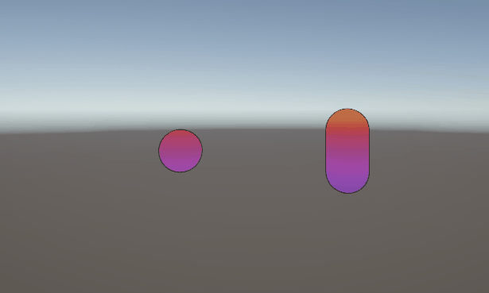
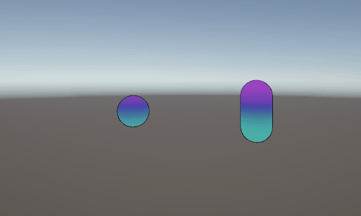
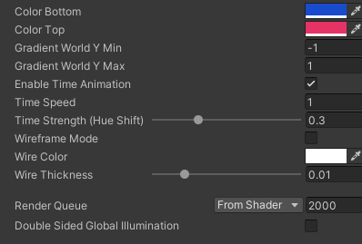
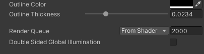
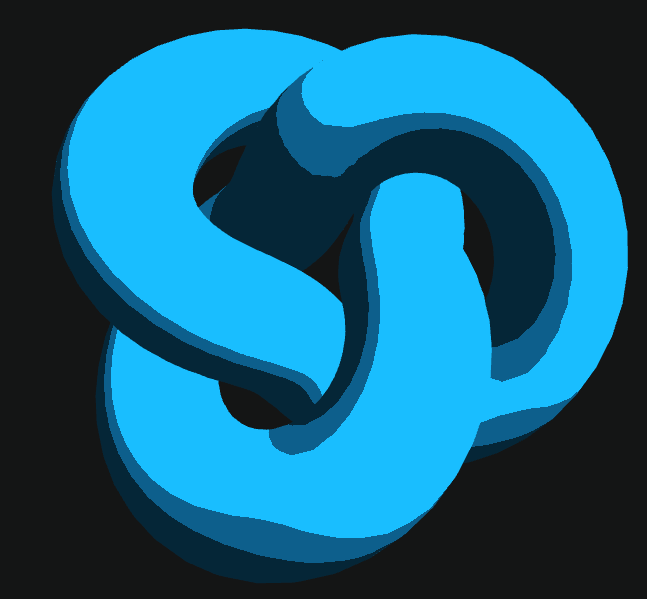
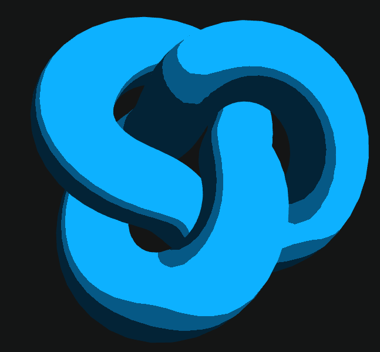

# Sombras Personalizadas: Primeros Shaders en Unity y Three.js

Nombres:

- Joan Sebastian Roberto Puerto
- Baruj Vladimir Ramírez Escalante
- Diego Alberto Romero Olmos
- Maicol Sebastian Olarte Ramirez
- Jorge Isaac Alandete Díaz

Fecha de entrega:
Descripción breve: Este taller se enfoca en la creación de shader personalizados en threejs y Unity, ambos shaders presentan cambios en el color a medida que pasa el tiempo o se modifican otros valores.

**Implementaciones:**

- **Unity**:
La implementación de Unity implica dos shaders creados en URP, el primero "gradient shader" se encarga de cambiar de color el material dependiendo de la ubicación del pixel en su posición vertical, a su vez que va cambiando de color con el tiempo. El segundo crea un delineado alrededor de la malla, dando un efecto de "cartoon". Ambos shaders se prueban en una escena con una capsula y una esfera, implementandose ambos al mismo tiempo sobre ambas mallas. Los materiales generados tienen la posibilidad de modificar ciertos parametros en el editor.

- **Three.js**:
La implementación de Three.js aplica un shader el cual va cambiando entre un azul claro y un azul oscuro, así mismo le aplica un "Toon shading" a la figura, el cual conserva su orientación dependiendo de las partes expuestas de la figura.

**Resultados visuales:**

- **Unity**:

Gif del cambio de color con el tiempo de los objetos:



Gif del cambio de color con respecto a la posición vertical



Parametros del material de gradiente como pueden ser los colores entre los que se alterna, la velociadad con la que se alterna, entre otros.



Parametros del material de outline, se destaca el color del controno y el grosor del mismo.



- **Three.js**:

Aqui se presenta como el material de la figura va cambiando de color con respecto al tiempo entre un azul oscuro y uno más claro:



La rotación de la figura muestra como hace efecto el "toon shading" de modo que siempre se queda el sobreado en la parte "inferior" de la figura.



**Código relevante:**

- **Unity**:

Muestra del fragment shader en cual se realiza el cambio de color tanto en tiempo como en posición vertical:

```hlsl
            ...
            half4 frag(GeoOut IN) : SV_Target
            {
                // 1. Vertical gradient
                float t = saturate((_GradientMax == _GradientMin) ? 0.5 :
                          (IN.worldY - _GradientMin) / (_GradientMax - _GradientMin));
                float4 col = lerp(_ColorBottom, _ColorTop, t);

                // 2. Time-based hue shift
                #if defined(_ENABLETIMEANIM_ON)
                {
                    float3 hsv  = RGBtoHSV(col.rgb);
                    hsv.x       = frac(hsv.x + _Time.y * _TimeSpeed * 0.1 * _TimeStrength);
                    col.rgb     = HSVtoRGB(hsv);
                }
                #endif
            ...
```

- **Three.js**:

Fragment shader encargado del "toon shading" y cambio de color con el tiempo

```JavaScript
`
  uniform float uTime;
  uniform vec3 uColor;
  uniform vec3 uLightPos;
  varying vec3 vNormal;

  void main() {
    // Dirección de la luz (estática o basada en tiempo)
    vec3 lightDir = normalize(uLightPos);
    
    // Producto punto para intensidad (Lambert)
    float intensity = dot(vNormal, lightDir);
    
    // --- CUANTIZACIÓN (Toon Shading) ---
    // En lugar de un degradado, creamos 4 niveles de sombra
    float steps = 4.0;
    intensity = ceil(intensity * steps) / steps;
    intensity = clamp(intensity, 0.2, 1.0); // Evitamos negro total

    // Color cambiante con el tiempo (hue shift simple)
    vec3 animatedColor = uColor * (0.8 + 0.2 * sin(uTime + vNormal.y));
    
    gl_FragColor = vec4(animatedColor * intensity, 1.0);
  }
  `
```

**Prompts utilizados:**

- **Unity**: Se utilizó el siguiente prompt en claude para la generación de los shader de Unity:

```plaintext
    hi, I need to create a Unity unlit shader in URP that changes color according to the position of the vertex (for example a vertical gradient), then I need to change the color according to the time component, also I need to implement a wireframe using wireframe mode in the inspector or with shader lines. Lastly, I would like to implement a "toon shading" effect (for example using an outline for the shader) could you assist me in this task?
```

- **Three.js**: Se utilizó el siguiente prompt en Gemini para la creación del códico en three.js:

```plaintext
    hola, necesito ayuda para crear un proyecto con react three fiber en el que haya un escenario con las siguientes tareas:

    - Crear una escena con un objeto central.

    - Utilizar shaderMaterial de @react-three/drei o extender THREE.ShaderMaterial.

    - Escribir un shader sencillo en GLSL.

    - Crear un componente vertex shader que transforme posiciones y pase datos a un fragment shader.

    - Crear un fragment shader que calcule el color, el cual va cambiando con el tiempo.

    - Implementar "toon shading" usando cuantización de la luz con step o smoothstep.

    - Asignar este material al objeto de la escena.

    Me podrías instruir en la creación del shader?
```

**Aprendizajes y dificultades:**

Se logró comprender como son las implementaciones de shaders en distintos entornos y como lograr distintos efectos como pudieron ser el *toon outline* o el *toon shading*, así como generar cambios en el tiempo por medio del fragment shader y el uso de varyings.
