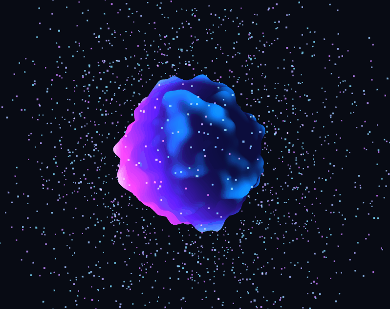

# Taller Texturizado Dinamico Shaders Particulas

**Estudiantes:** 

- Joan Sebastian Roberto Puerto
- Baruj Vladimir Ramírez Escalante
- Diego Alberto Romero Olmos
- Maicol Sebastian Olarte Ramirez
- Jorge Isaac Alandete Díaz

**Fecha de entrega:** 

28 de marzo, 2026

---

## Descripción breve

El objetivo de este taller fue crear materiales que cambian en tiempo real en respuesta al paso del tiempo y a la entrada del usuario, combinando shaders personalizados con sistemas de partículas visuales. Se implementó en **Unity URP** una esfera con un shader de energía construido en Shader Graph que pulsa, distorsiona sus UVs y varía su emisión con el tiempo, acompañada de un sistema de partículas de chispas eléctricas controlable desde una UI con sliders. Adicionalmente, se replicó la escena en **Three.js con React Three Fiber**, implementando la misma lógica de shaders y partículas directamente en GLSL y JavaScript.

---

## Implementaciones

### 🎮 Unity — Shader Graph + Particle System

**Entorno:** Unity 6 con Universal Render Pipeline (URP), requerido para el uso de Shader Graph.

**Shader de energía (Shader Graph):**
Se construyó un shader visual en Shader Graph de tipo URP Lit con las siguientes características:

- **Pulso temporal:** un nodo `Time` multiplicado por la propiedad `VelocidadPulso` pasa por un nodo `Sine` y se normaliza con `Remap` de `[-1,1]` a `[0,1]`. Esto produce una onda continua que conduce la interpolación entre `ColorBase` (azul) y `ColorEmision` (cyan) mediante un nodo `Lerp`, haciendo que la esfera pulse entre los dos colores.
- **Patrón Voronoi:** los UVs se distorsionan con un nodo `Tiling And Offset` cuyo offset se desplaza con el tiempo, y pasan por un nodo `Voronoi` con Cell Density 5. El resultado se multiplica por `ColorEmision` e `IntensidadEmision` y se conecta al canal `Emission` del Fragment, produciendo el patrón de energía brillante sobre la superficie.
- **Distorsión UV dinámica:** la propiedad `DistorsionUV` controla la magnitud del desplazamiento de coordenadas UV, simulando fluidez y movimiento en la superficie del material.
- **Propiedades expuestas:** `ColorBase`, `ColorEmision`, `VelocidadPulso`, `IntensidadEmision` y `DistorsionUV` — todas accesibles desde el Inspector y desde código C#.

**Sistema de partículas (Particle System):**
Se configuró un sistema de chispas eléctricas con las siguientes características:

- Shape `Sphere` con radio 1 para emitir desde la superficie de la esfera.
- `Velocity over Lifetime` con valores random entre `-2` y `2` en los tres ejes para movimiento errático.
- `Size over Lifetime` con curva decreciente y `Color over Lifetime` con fade de cyan a transparente.
- Módulo `Noise` con Strength 1.5 y Frequency 2 para simular el comportamiento irregular de la electricidad.
- Material `MatChispas` con shader `URP/Particles/Unlit` y emisión cyan activada para máximo brillo.

**Script C# — ControladorEnergia:**
Adjunto a un `GameController` vacío, conecta la UI con el shader y las partículas:

- Modifica las propiedades del shader en tiempo real usando `material.SetFloat()` con IDs precalculados con `Shader.PropertyToID()` para eficiencia.
- Modifica `emission.rateOverTime`, `main.startSpeed` y `main.startSize` del Particle System cada frame.
- Expone 6 sliders: velocidad de pulso, intensidad de emisión, distorsión UV, tasa de chispas, velocidad de partículas y tamaño.
- Botón de toggle para pausar/reanudar las chispas y botón de reinicio a valores por defecto.

**Herramientas:** `Unity 6 URP`, `Shader Graph`, `Particle System`, `C#`, `TextMeshPro`

---

### Resultados visuales — Unity

**Shader de energía en funcionamiento — pulso y patrón Voronoi en tiempo real**


**Panel de controles UI — sliders y botones**


---

### 🌐 Three.js — React Three Fiber + ShaderMaterial + Partículas

**Entorno:** Vite + React, con las librerías `@react-three/fiber`, `@react-three/drei` y `leva` para controles en tiempo real.

**Shader de energía (ShaderMaterial):**
Se escribió un `ShaderMaterial` personalizado en GLSL con vertex y fragment shader propios, replicando la lógica de Unity directamente en código:

- **Deformación procedural (vertex shader):** se implementó Simplex Noise 3D completo en GLSL. Cada vértice de la `SphereGeometry` (128×128 segmentos) se desplaza a lo largo de su normal usando la suma de dos capas de ruido animadas con `uTime`, produciendo una superficie orgánica que se deforma continuamente.
- **Efecto Fresnel (fragment shader):** se calcula el producto punto entre la normal del fragmento y la dirección de la cámara para producir un brillo en los bordes de la esfera, simulando materiales translúcidos o de energía.
- **Anillos de energía animados:** el fragment shader genera anillos concéntricos usando `sin(length(vPosition) * 8.0 - uTime * 2.0)`, que se desplazan hacia afuera con el tiempo.
- **Uniforms:** `uTime` (animación continua), `uHover` (intensidad suavizada del hover), `uColorA/B/C` (tres colores configurables desde Leva). El hover se suaviza interpolando `hoverSmooth` cada frame para evitar transiciones abruptas.

**Sistema de partículas (`Points` + `BufferGeometry`):**
Se construyó un sistema de partículas completamente desde código, sin librerías externas:

- Posiciones generadas proceduralmente en distribución esférica aleatoria (`phi`, `theta`, `radius`) usando `useMemo` para evitar recalcular en cada render.
- Cada partícula tiene velocidad radial, tamaño y delay de explosión propios, almacenados en `Float32Array`s separados.
- En `useFrame`, las posiciones se recalculan cada frame simulando órbita rotacional animada (ángulo incrementado con `uTime` por partícula), con un wobble sinusoidal sobre el radio.
- Colores interpolados entre `colorB` y `colorC` por partícula, con `AdditiveBlending` para el efecto de luz acumulada.

**Bonus — Explosión radial al hacer clic:**
Al hacer clic sobre la esfera se dispara una animación de explosión:

- La esfera se oculta y las partículas salen disparadas en dirección radial desde su posición orbital, multiplicadas por su velocidad individual y un `delay` aleatorio por partícula.
- El movimiento usa easing exponencial (`1 - exp(-p * 2)`) y caída gravitacional acumulada, produciendo una dispersión natural.
- Toda la animación corre con `requestAnimationFrame` durante 2.2 segundos y luego resetea automáticamente la escena.

**Anillos orbitales decorativos:**
Tres `TorusGeometry` con `MeshBasicMaterial` semi-transparente giran a velocidades y ángulos distintos alrededor de la esfera, visibles opcionalmente desde el panel Leva.

**Herramientas:** `Vite`, `React`, `@react-three/fiber`, `@react-three/drei`, `leva`, `GLSL`

---

### Resultados visuales — Three.js

**Orbe de energía con shader animado — deformación y anillos orbitales**


**Efecto hover — intensificación del Fresnel y deformación con uHover**


**Efecto de explosión al hacer clic — dispersión radial de partículas**



---

## Código relevante

### C# — Aplicar parámetros del shader en tiempo real

```csharp
// IDs precalculados para eficiencia (evita buscar el string cada frame)
private static readonly int ID_VelocidadPulso    = Shader.PropertyToID("_VelocidadPulso");
private static readonly int ID_IntensidadEmision = Shader.PropertyToID("_IntensidadEmision");
private static readonly int ID_DistorsionUV      = Shader.PropertyToID("_DistorsionUV");

void AplicarShader()
{
    if (materialEsfera == null) return;
    materialEsfera.SetFloat(ID_VelocidadPulso,    velocidadPulso);
    materialEsfera.SetFloat(ID_IntensidadEmision, intensidadEmision);
    materialEsfera.SetFloat(ID_DistorsionUV,      distorsionUV);
}
```

### C# — Modificar partículas en tiempo real

```csharp
void AplicarParticulas()
{
    if (chispas == null) return;

    var emission = chispas.emission;
    emission.rateOverTime = tasaParticulas;

    var main = chispas.main;
    main.startSpeed = new ParticleSystem.MinMaxCurve(
        velocidadParticulas * 0.5f,
        velocidadParticulas
    );
    main.startSize = new ParticleSystem.MinMaxCurve(
        tamanoParticulas * 0.5f,
        tamanoParticulas
    );
}
```

### Shader Graph — Lógica del pulso temporal (descripción de nodos)

```
Time → Multiply(VelocidadPulso) → Sine → Remap[-1,1 → 0,1]
                                              ↓
                              Lerp(ColorBase, ColorEmision, T)
                                              ↓
                                        Base Color
```

```
UV → Tiling And Offset(Offset: Time*0.5) → Voronoi(Density:5)
                                                 ↓
                              Multiply(ColorEmision) → Multiply(IntensidadEmision)
                                                                ↓
                                                           Emission
```

### GLSL — Deformación procedural del vertex shader (Three.js)

```glsl
// Dos capas de Simplex Noise 3D animadas con uTime
float n1 = snoise(position * 1.5 + uTime * 0.4);
float n2 = snoise(position * 3.0 - uTime * 0.6);
float displace = (n1 * 0.15 + n2 * 0.08) * (1.0 + uHover * 0.8);

// Desplazamiento a lo largo de la normal del vértice
vec3 displaced = position + normal * displace;
gl_Position = projectionMatrix * modelViewMatrix * vec4(displaced, 1.0);
```

### GLSL — Efecto Fresnel + anillos de energía (Three.js)

```glsl
// Fresnel: brillo en bordes según ángulo cámara-normal
vec3 viewDir = normalize(cameraPosition - vPosition);
float fresnel = pow(1.0 - dot(vNormal, viewDir), 2.5);

// Anillos concéntricos animados
float rings = sin(length(vPosition) * 8.0 - uTime * 2.0) * 0.5 + 0.5;
col += rings * 0.12 * uColorC;

// Glow intensificado por hover
col += fresnel * uColorC * (0.6 + uHover * 0.8);
```

### JavaScript — Sistema de partículas y explosión (Three.js)

```javascript
// Generación procedural de posiciones en esfera
const theta  = Math.random() * Math.PI * 2
const phi    = Math.acos(2 * Math.random() - 1)
const radius = 1.3 + Math.random() * 1.5
positions[i*3]   = radius * Math.sin(phi) * Math.cos(theta)
positions[i*3+1] = radius * Math.sin(phi) * Math.sin(theta)
positions[i*3+2] = radius * Math.cos(phi)

// Explosión: easing exponencial + caída gravitacional
const ease = 1 - Math.exp(-p * 2)
posAttr.current.array[i*3]   = bx + velocities[i*3]   * ease
posAttr.current.array[i*3+1] = by + velocities[i*3+1] * ease - p * p * 0.5
posAttr.current.array[i*3+2] = bz + velocities[i*3+2] * ease
```

---

## Prompts utilizados

Este taller fue desarrollado con asistencia de IA generativa (Claude):

**Unity:**
- *"Crear proyecto Unity URP con shader de energía en Shader Graph que pulse con el tiempo usando nodos Time, Sine, Voronoi y distorsión UV, con sistema de partículas de chispas eléctricas"* → guió la construcción paso a paso del shader y las partículas.
- *"Las partículas se ven tenues"* → llevó a crear un material dedicado con shader `URP/Particles/Unlit` y emisión activada, más el módulo Noise para movimiento errático.
- *"Crear script C# para controlar parámetros del shader y partículas desde sliders UI"* → generó `ControladorEnergia.cs` con `Shader.PropertyToID()` para eficiencia.

**Three.js:**
- *"Crear escena Three.js con React Three Fiber: esfera con ShaderMaterial animado con uTime y hover, sistema de partículas con BufferGeometry, y efecto de explosión al hacer clic"* → generó la arquitectura completa de componentes y los shaders GLSL.
- *"Adaptar App.jsx de proyecto anterior de visualización de normales a la nueva escena de energía"* → guió la migración de la estructura de componentes, conservando el panel Leva y el estilo visual.

---

## Aprendizajes y dificultades

**Aprendizajes principales:**

El aprendizaje más importante fue entender cómo Shader Graph traduce matemática de shaders a nodos visuales. El pulso temporal es simplemente una función seno aplicada al tiempo — `sin(t * velocidad)` — y el resultado normalizado conduce la interpolación de color. Esta misma lógica en HLSL sería una sola línea, pero verla como nodos conectados hace muy explícito el flujo de datos: de dónde viene cada valor y cómo se transforma antes de llegar al output.

El nodo Voronoi fue especialmente interesante: genera un patrón de celdas basado en distancias a puntos aleatorios, y al desplazar sus UVs con el tiempo produce la ilusión de energía fluyendo sobre la superficie. La combinación de distorsión UV + Voronoi + emisión es la base de la mayoría de efectos de energía y fuego en videojuegos modernos.

Implementar la misma escena en Three.js dejó en evidencia la equivalencia directa entre las herramientas: el nodo `Time` de Shader Graph se convierte en el uniform `uTime` actualizado en `useFrame`; el nodo `Lerp` se convierte en `mix()` en GLSL; las propiedades expuestas del Inspector se vuelven controles de Leva. Escribir el shader en GLSL hizo más explícita la matemática subyacente que Shader Graph abstraía en nodos.

Otro aprendizaje fue la diferencia entre modificar un material asset directamente y trabajar sobre una instancia (`renderer.material` en lugar de `renderer.sharedMaterial`). Modificar el asset original afecta a todos los objetos que lo usan en la escena, mientras que la instancia es exclusiva del objeto — esencial cuando se quieren controles independientes por objeto.

**Dificultades encontradas:**

La principal dificultad en Unity fue que las partículas se veían tenues a pesar de tener emisión configurada en el Particle System. El problema era que el material por defecto de las partículas usa un shader estándar que no renderiza emisión correctamente en URP. La solución fue crear un material dedicado con el shader `Universal Render Pipeline/Particles/Unlit` que sí respeta la emisión en el pipeline URP.

La segunda dificultad en Unity fue entender que Shader Graph requiere URP — al intentar usar una plantilla 3D Core estándar el menú de Shader Graph no aparece. Esto obligó a crear el proyecto con la plantilla 3D (URP) específicamente.

En Three.js, la dificultad principal fue la gestión de `BufferAttribute` mutables para el sistema de partículas: modificar las posiciones cada frame en `useFrame` requiere establecer `needsUpdate = true` en el atributo después de cada modificación, y pasar las referencias correctamente entre el componente React y el loop de animación. El uso de `useRef` para los atributos del buffer fue clave para evitar recrear la geometría en cada render.