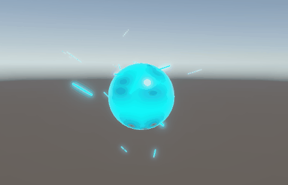
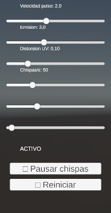

# Taller Texturizado Dinamico Shaders Particulas

**Estudiantes:** 

- Joan Sebastian Roberto Puerto
- Baruj Vladimir Ramírez Escalante
- Diego Alberto Romero Olmos
- Maicol Sebastian Olarte Ramirez
- Jorge Isaac Alandete Díaz

**Fecha de entrega:** 

28 de marzo, 2026

---

## Descripción breve

El objetivo de este taller fue crear materiales que cambian en tiempo real en respuesta al paso del tiempo y a la entrada del usuario, combinando shaders personalizados con sistemas de partículas visuales. Se implementó en Unity URP una esfera con un shader de energía construido en Shader Graph que pulsa, distorsiona sus UVs y varía su emisión con el tiempo, acompañada de un sistema de partículas de chispas eléctricas controlable desde una UI con sliders.

---

## Implementaciones

### 🎮 Unity — Shader Graph + Particle System

**Entorno:** Unity 6 con Universal Render Pipeline (URP), requerido para el uso de Shader Graph.

**Shader de energía (Shader Graph):**
Se construyó un shader visual en Shader Graph de tipo URP Lit con las siguientes características:

- **Pulso temporal:** un nodo `Time` multiplicado por la propiedad `VelocidadPulso` pasa por un nodo `Sine` y se normaliza con `Remap` de `[-1,1]` a `[0,1]`. Esto produce una onda continua que conduce la interpolación entre `ColorBase` (azul) y `ColorEmision` (cyan) mediante un nodo `Lerp`, haciendo que la esfera pulse entre los dos colores.
- **Patrón Voronoi:** los UVs se distorsionan con un nodo `Tiling And Offset` cuyo offset se desplaza con el tiempo, y pasan por un nodo `Voronoi` con Cell Density 5. El resultado se multiplica por `ColorEmision` e `IntensidadEmision` y se conecta al canal `Emission` del Fragment, produciendo el patrón de energía brillante sobre la superficie.
- **Distorsión UV dinámica:** la propiedad `DistorsionUV` controla la magnitud del desplazamiento de coordenadas UV, simulando fluidez y movimiento en la superficie del material.
- **Propiedades expuestas:** `ColorBase`, `ColorEmision`, `VelocidadPulso`, `IntensidadEmision` y `DistorsionUV` — todas accesibles desde el Inspector y desde código C#.

**Sistema de partículas (Particle System):**
Se configuró un sistema de chispas eléctricas con las siguientes características:

- Shape `Sphere` con radio 1 para emitir desde la superficie de la esfera.
- `Velocity over Lifetime` con valores random entre `-2` y `2` en los tres ejes para movimiento errático.
- `Size over Lifetime` con curva decreciente y `Color over Lifetime` con fade de cyan a transparente.
- Módulo `Noise` con Strength 1.5 y Frequency 2 para simular el comportamiento irregular de la electricidad.
- Material `MatChispas` con shader `URP/Particles/Unlit` y emisión cyan activada para máximo brillo.

**Script C# — ControladorEnergia:**
Adjunto a un `GameController` vacío, conecta la UI con el shader y las partículas:

- Modifica las propiedades del shader en tiempo real usando `material.SetFloat()` con IDs precalculados con `Shader.PropertyToID()` para eficiencia.
- Modifica `emission.rateOverTime`, `main.startSpeed` y `main.startSize` del Particle System cada frame.
- Expone 6 sliders: velocidad de pulso, intensidad de emisión, distorsión UV, tasa de chispas, velocidad de partículas y tamaño.
- Botón de toggle para pausar/reanudar las chispas y botón de reinicio a valores por defecto.

**Herramientas:** `Unity 6 URP`, `Shader Graph`, `Particle System`, `C#`, `TextMeshPro`

---

## Resultados visuales

**Shader de energía en funcionamiento — pulso y patrón Voronoi en tiempo real**



**Panel de controles UI — sliders y botones**



---

## Código relevante

### C# — Aplicar parámetros del shader en tiempo real

```csharp
// IDs precalculados para eficiencia (evita buscar el string cada frame)
private static readonly int ID_VelocidadPulso    = Shader.PropertyToID("_VelocidadPulso");
private static readonly int ID_IntensidadEmision = Shader.PropertyToID("_IntensidadEmision");
private static readonly int ID_DistorsionUV      = Shader.PropertyToID("_DistorsionUV");

void AplicarShader()
{
    if (materialEsfera == null) return;
    materialEsfera.SetFloat(ID_VelocidadPulso,    velocidadPulso);
    materialEsfera.SetFloat(ID_IntensidadEmision, intensidadEmision);
    materialEsfera.SetFloat(ID_DistorsionUV,      distorsionUV);
}
```

### C# — Modificar partículas en tiempo real

```csharp
void AplicarParticulas()
{
    if (chispas == null) return;

    var emission = chispas.emission;
    emission.rateOverTime = tasaParticulas;

    var main = chispas.main;
    main.startSpeed = new ParticleSystem.MinMaxCurve(
        velocidadParticulas * 0.5f,
        velocidadParticulas
    );
    main.startSize = new ParticleSystem.MinMaxCurve(
        tamanoParticulas * 0.5f,
        tamanoParticulas
    );
}
```

### Shader Graph — Lógica del pulso temporal (descripción de nodos)

```
Time → Multiply(VelocidadPulso) → Sine → Remap[-1,1 → 0,1]
                                              ↓
                              Lerp(ColorBase, ColorEmision, T)
                                              ↓
                                        Base Color
```

```
UV → Tiling And Offset(Offset: Time*0.5) → Voronoi(Density:5)
                                                 ↓
                              Multiply(ColorEmision) → Multiply(IntensidadEmision)
                                                                ↓
                                                           Emission
```

---

## Prompts utilizados

Este taller fue desarrollado con asistencia de IA generativa (Claude):

- *"Crear proyecto Unity URP con shader de energía en Shader Graph que pulse con el tiempo usando nodos Time, Sine, Voronoi y distorsión UV, con sistema de partículas de chispas eléctricas"* → guió la construcción paso a paso del shader y las partículas.
- *"Las partículas se ven tenues"* → llevó a crear un material dedicado con shader `URP/Particles/Unlit` y emisión activada, más el módulo Noise para movimiento errático.
- *"Crear script C# para controlar parámetros del shader y partículas desde sliders UI"* → generó `ControladorEnergia.cs` con `Shader.PropertyToID()` para eficiencia.

---

## Aprendizajes y dificultades

**Aprendizajes principales:**

El aprendizaje más importante fue entender cómo Shader Graph traduce matemática de shaders a nodos visuales. El pulso temporal es simplemente una función seno aplicada al tiempo — `sin(t * velocidad)` — y el resultado normalizado conduce la interpolación de color. Esta misma lógica en HLSL sería una sola línea, pero verla como nodos conectados hace muy explícito el flujo de datos: de dónde viene cada valor y cómo se transforma antes de llegar al output.

El nodo Voronoi fue especialmente interesante: genera un patrón de celdas basado en distancias a puntos aleatorios, y al desplazar sus UVs con el tiempo produce la ilusión de energía fluyendo sobre la superficie. La combinación de distorsión UV + Voronoi + emisión es la base de la mayoría de efectos de energía y fuego en videojuegos modernos.

Otro aprendizaje fue la diferencia entre modificar un material asset directamente y trabajar sobre una instancia (`renderer.material` en lugar de `renderer.sharedMaterial`). Modificar el asset original afecta a todos los objetos que lo usan en la escena, mientras que la instancia es exclusiva del objeto — esencial cuando se quieren controles independientes por objeto.

**Dificultades encontradas:**

La principal dificultad fue que las partículas se veían tenues a pesar de tener emisión configurada en el Particle System. El problema era que el material por defecto de las partículas usa un shader estándar que no renderiza emisión correctamente en URP. La solución fue crear un material dedicado con el shader `Universal Render Pipeline/Particles/Unlit` que sí respeta la emisión en el pipeline URP.

La segunda dificultad fue entender que Shader Graph requiere URP — al intentar usar una plantilla 3D Core estándar el menú de Shader Graph no aparece. Esto obligó a crear el proyecto con la plantilla 3D (URP) específicamente.