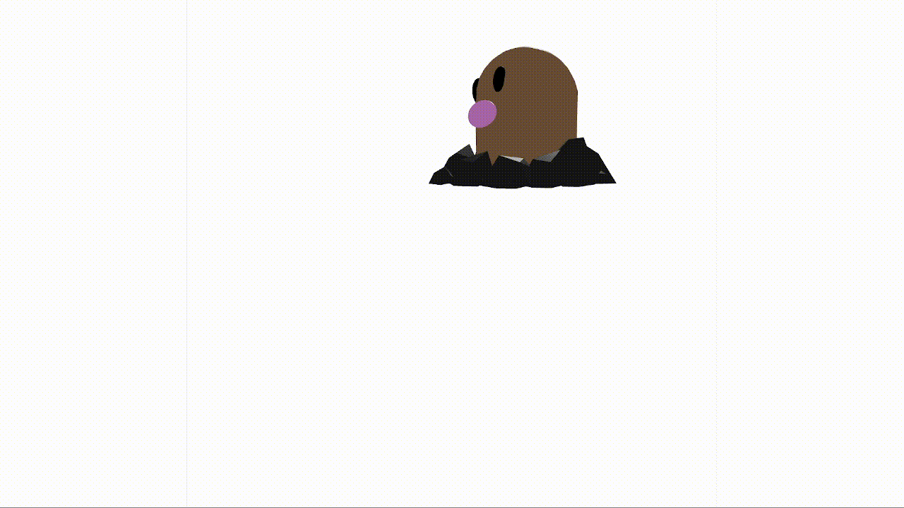
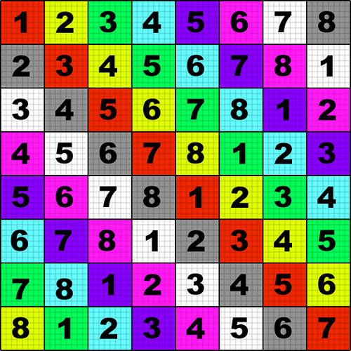
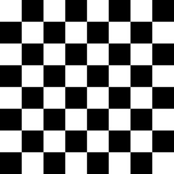
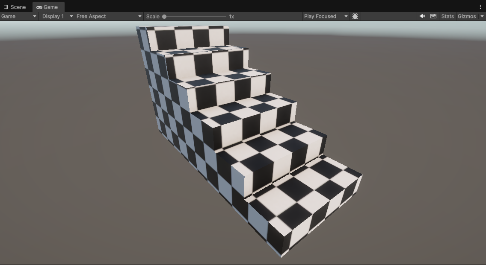

# Modelos Reflexion pbr

### Nombres:

- Joan Sebastian Roberto Puerto
- Baruj Vladimir Ramírez Escalante
- Diego Alberto Romero Olmos
- Maicol Sebastian Olarte Ramirez
- Jorge Isaac Alandete Díaz

### Fecha de entrega: 28/03/2026

### Descripción del tema:
Explorar el mapeo UV como técnica fundamental para aplicar correctamente texturas 2D sobre modelos 3D sin distorsión. El objetivo es entender cómo se proyectan las texturas y cómo se pueden ajustar las coordenadas UV para mejorar el resultado visual.

### Descripción de la implementación: 

#### Threejs:

Se carga un modelo .GLB  de nombre *diglett_cgtrader_glb*

Debido a la estructuracion de 3 mesh del modelo te toma el Mesh en la posicion 0 que corresponde al cuerpo.

La textura a aplicar sobre el modelo es *test_texture* que divide la imagen con colores y numeros diferentes para identificar de manera correcta la aplicacion de la textura y su pocicion en la Mesh.

Se aplica la textura sobre la malla numero 0 del modelo y se hacen modificacion de la aplicación de la Malla sobne el modelo usando *repeat*, *offset*, *wrapS*, y *wrapT*

#### Unity:

Con la herramienta ProBuilder se crea un modelo y se le asigna y mapa UV, sobre este modelo se aplica la textura *chess* modificando la posición y rotación de los elementos de su textura mediante la herramienta ProBuilder

### Resultados visuales: 

#### Threejs:

El resultado de aplicar la textura *test_texture* sobre *diglett_cgtrader_glb*

Se modifica la forma como se aplica la textura sobre el modelo mediante las instrucciones:

    texture.wrapS = THREE.RepeatWrapping
    texture.wrapT = THREE.RepeatWrapping

    texture.repeat.set(2, 2)   
    texture.offset.set(0.1, 0.1)

Lo cual repite la textura sobre el modelo de forma uniforme

Se asigna un centro a la tectura para despues rotarla con respecto a lcentro mediaten el siguiente codigo:

    texture.center.set(0.5, 0.5)
    texture.rotation = Math.PI / 4

#### Unity:

Se aplica la textura *chess* sobre el modelo creado en ProBuilder

Se aplican movimientos sobre el textura UV usando ProBuilder

Se aplican rotacion sobre el textura UV usando ProBuilder

Se muestra lado a lado la ventana de resultados y la ventana de modificacion del mapa UV

