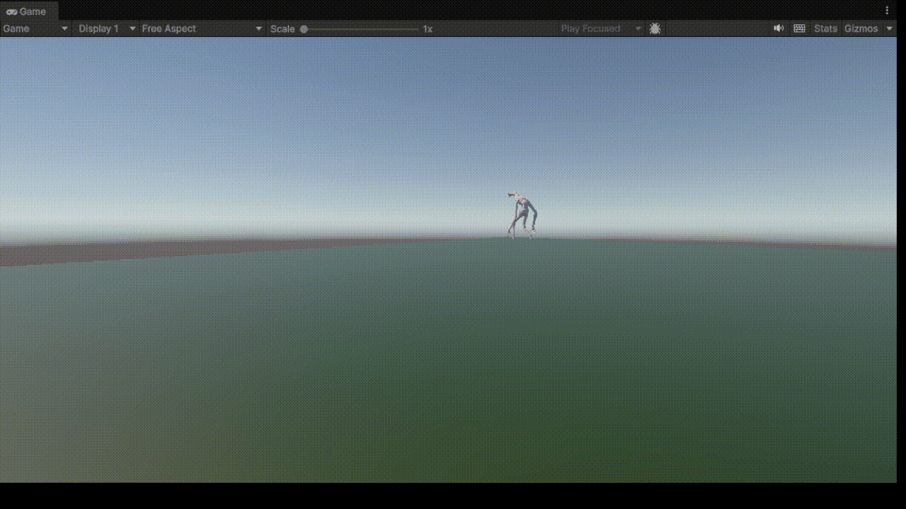
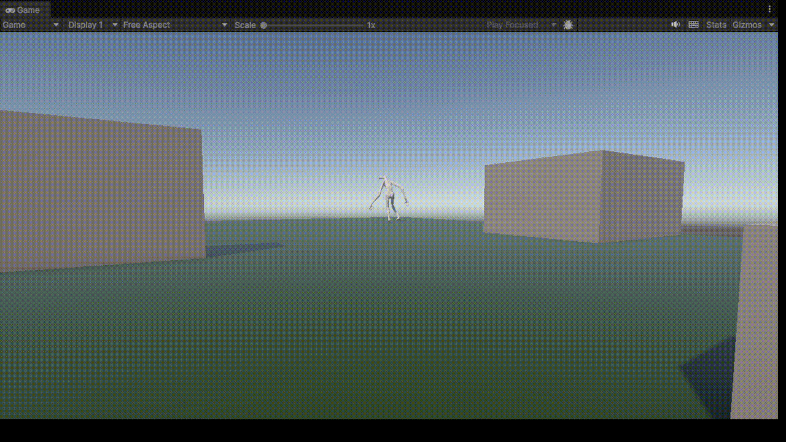

# Animación con IA en Unity para Personajes Autónomos

### Nombres:

- Joan Sebastian Roberto Puerto
- Baruj Vladimir Ramírez Escalante
- Diego Alberto Romero Olmos
- Maicol Sebastian Olarte Ramirez
- Jorge Isaac Alandete Díaz

### Fecha de entrega: 15/04/2026

### Descripción del tema:
Desarrollar comportamientos autónomos para NPCs en Unity utilizando NavMesh y máquinas de estados finitos con control de animaciones dinámicas.

### Descripción de la implementación: 

#### Unity:

Debido al uso de un archivo de extension *.gbl* se usa la libreria de Unity de nombre *com.unity.cloud.gltfast* que corresponde a un modelo 3D de *SirenHead* (accesible mediante el enlace https://www.cgtrader.com/items/3419881/download-page) con tres animaciones para dicho modelo.

Se prepara el suelo y los obstaculos, creando un plano en unity asignandole un *NavMesh* al plano simulando un suelo y agregando los obstaculos como *Static* para al final hacer un *Bake* sobre el plano resgitrandose el plano con los obstaculos.

Se configula el personaje autonomo poniendo el modelo de *sirenHead* sobre *NavMesh* y asignadolo como un *navMesh Aggent* a la vez que se ajusta su caja de colision.

Se crea el script principal del agente autonomo, donde se controla su comportamiento, regulando su estado actual y entre *Idle* que refiere a que no esta haciendo nada o esta esperando, *Patrol* donde el agente autonomo sigue una ruta para ir entre los puntos de patrullaje y *chassing* donde el agente sigue al jugador.

Se crean 4 puntos de patrullaje, cada uno en una esquina del plano *navMesh* añadiendolos al script.

Se configura el cambio de animaciones, mediante un animation controller que basa su comportamiento en la velocidad del agente y los datos que le da el script que controla su comportamiento.

Por ultimo se crea el jugador, creado un script para el control del movimiento (movimiento tanto de la camara con el mouse, como en el espacio mediante el teclado) y valiendose de un Character controller.

### Resultados visuales: 

#### Threejs:

Se muestra el cambio de estado del agente autonomo *Idle* a *Patrol*

Se muestra el cambio de estado del agente autonomo *Patrol* a *Idle*

Se muestra el cambio de estado del agente autonomo *Patrol* a *Chase*

Por ultimo se muetra varios cambios de estado.

### Código relevante

#### Threejs:

Funciones para el manejo de estado del agente Autonomo

    void HandleIdleState(float distance) {
        agent.isStopped = true;
        agent.speed = 0f;
        idleTimer += Time.deltaTime;
        if (idleTimer > 3f) {
            currentState = AIState.Patrol;
            idleTimer = 0f;
            agent.isStopped = false;
        }
        if (distance < detectionRadius) currentState = AIState.Chase;
    }

    void HandlePatrolState(float distance) {
        if (waypoints.Length == 0) return;

        agent.SetDestination(waypoints[currentWaypointIndex].position);
        agent.speed = 2f;

        if (!agent.pathPending && agent.remainingDistance < 0.5f) {
            currentWaypointIndex = (currentWaypointIndex + 1) % waypoints.Length;
            currentState = AIState.Idle; // Descansa un momento al llegar a cada punto
        }

        if (distance < detectionRadius) currentState = AIState.Chase;
    }

    void HandleChaseState(float distance) {
        agent.SetDestination(player.position);
        agent.speed = 4f; // Aumentamos la velocidad al perseguir
        if (distance > loseRadius) currentState = AIState.Patrol;
    }

### Aprendizajes y dificultades

Se tuvieron grandes aprendizajes relevante en la animación de IA en Unity, un tema especialemtne relevante en nuestro proyecto planteado, se profundizo mucho en los cambios de estado y los controladores de animación en Unity, ademas de alternativas para el Rigged de modelos. Al principio se tuvieron algubnas dificultades con el tipo de archivo ya que al ser .gbl no era soportado nativamente por unity, pero despues de la implementacion de la herramienta de *gltfast* funciono (aunque presento algunos fallos en las animaciones que posterioremente se arreglaron).
