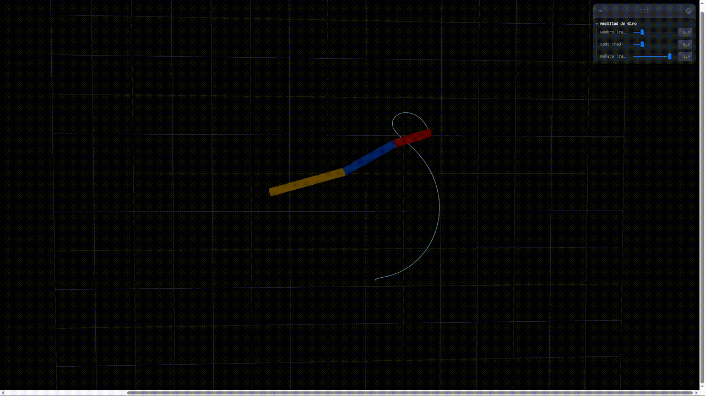
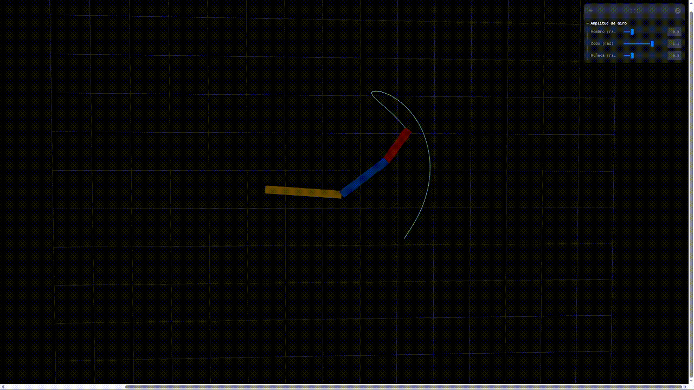
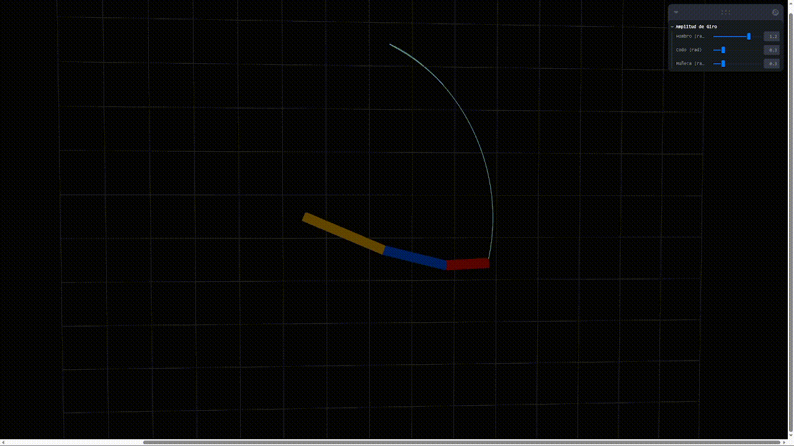
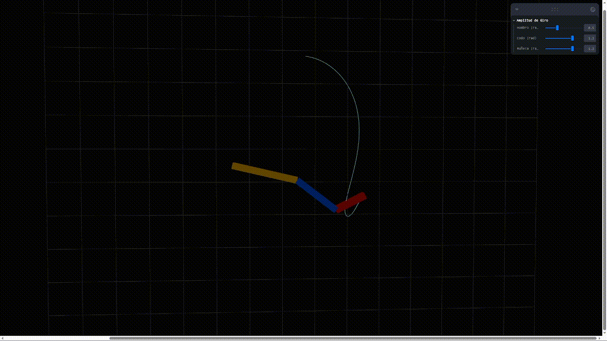
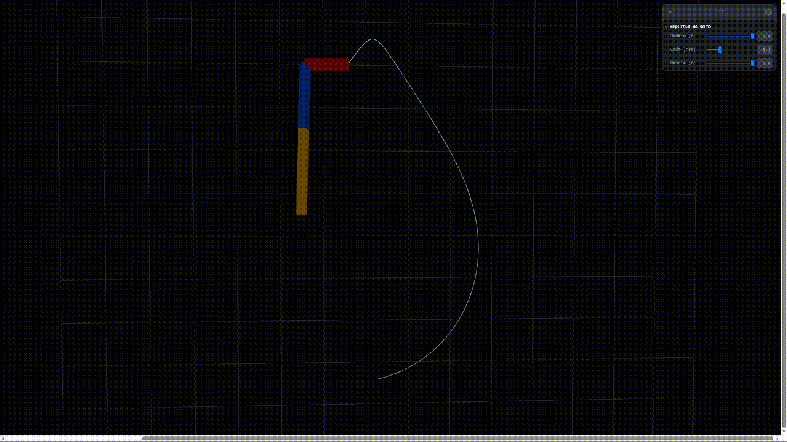
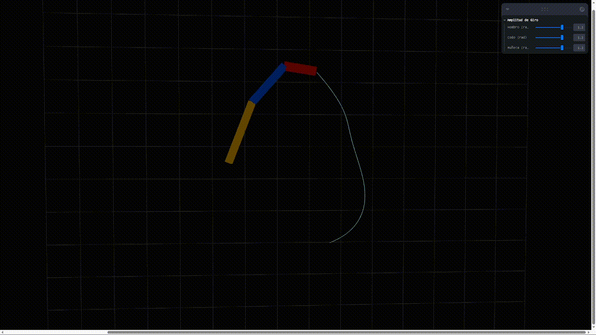
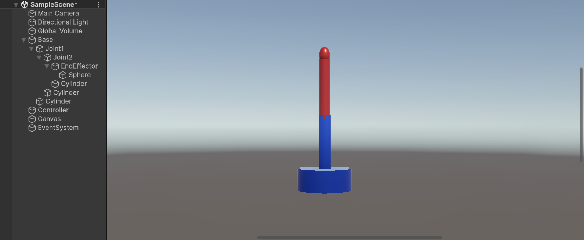
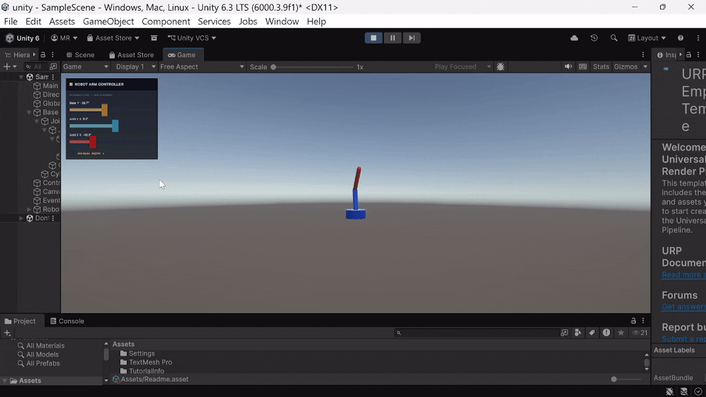
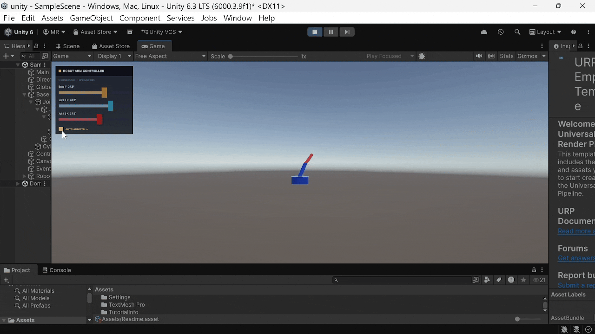
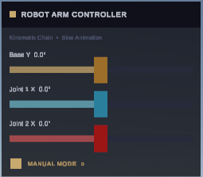

# Cinemática Directa: Animando Brazos Robóticos o Cadenas Articuladas

### Nombres:

- Joan Sebastian Roberto Puerto
- Baruj Vladimir Ramírez Escalante
- Diego Alberto Romero Olmos
- Maicol Sebastian Olarte Ramirez
- Jorge Isaac Alandete Díaz

### Fecha de entrega: 15/04/2026

### Descripción del tema:
Aplicar conceptos de cinemática directa (Forward Kinematics) para animar objetos enlazados como brazos robóticos, cadenas de huesos o criaturas segmentadas. El objetivo es comprender cómo rotaciones encadenadas afectan el movimiento y la posición de cada parte en una estructura jerárquica.

### Descripción de la implementación: 

#### Threejs:

Se crea una funcion para la creacion de segmentos de brazo, un generico para la creacion de cuantos fragmentos de brazo se quiera, esta funcion es la encargada de manejar el movimiento del brazo en el tiempo mediante UseFrame, moviendose en un rango de amplitud, que puede ser modificado mediante los controles de uso. Dentro de la funcion se crea un punto de conexion del segmento de brazo con su hijo.

Para el trazo del la linea correspondiente a la posicion del brazo se dibujan los ultimos 150 puntos del trazo.

En la función principal se crean tres segmentos de brazo, identificados jerarquicamente por su rotacion en Hombro, Codo y Muñeca, siendo Muñeca hijo de Codo y Codo hijo de Hombro.

#### Unity:

Se implementa un brazo robótico articulado con tres eslabones jerárquicos: Base (rotación en Y), Joint1 (rotación en X) y Joint2 (rotación en X), con un EndEffector en el extremo final. Cada articulación es hijo de la anterior, formando una cadena cinemática donde la rotación de un nodo padre afecta directamente la posición y orientación de todos sus descendientes.

El controlador `RobotArmController` maneja dos modos de operación: **automático**, donde las articulaciones oscilan mediante funciones seno desfasadas en el tiempo (`Time.time * speed`), y **manual**, donde el usuario puede controlar cada ángulo independientemente mediante sliders en la interfaz. La interfaz gráfica se construye completamente por código, sin uso de prefabs, incluyendo sliders con rango de -90° a 90°, etiquetas con los ángulos actuales y un toggle para alternar entre modos.

Adicionalmente, se implementa un sistema de trayectoria que registra las últimas 100 posiciones del EndEffector y las dibuja en pantalla usando `Debug.DrawLine`, permitiendo visualizar el rastro del extremo del brazo en tiempo real.

### Resultados visuales: 

#### Threejs:

Al aumentar el rango de movimientos de la *Muñeca* restringiendo el rango de movimiento del *Codo* y el *Hombro* se obtiene:

Al aumentar el rango de movimientos del *Codo* restringiendo el rango de movimiento de la *Muñeca* y el *Hombro* se obtiene:

Al aumentar el rango de movimientos del *Hombro* restringiendo el rango de movimiento de la *Muñeca* y el *Codo* se obtiene:

Al aumentar el rango de movimientos del *Codo* y de la *Muñeca* restringiendo el rango de movimiento del *Hombro* se obtiene:

Al aumentar el rango de movimientos del *Hombro* y de la *Muñeca* restringiendo el rango de movimiento del *Codo* se obtiene:

Al aumentar el rango de movimientos del *Codo*, la *Muñeca* y del *Hombro* se obtiene:

#### Unity:

Vista general del diseño del brazo robótico con la interfaz de control en la esquina inferior:

Demostración del modo manual, donde cada articulación es controlada individualmente mediante sliders:

Animación automática del brazo con las tres articulaciones oscilando mediante funciones seno desfasadas:

Detalle del panel de control con los sliders de cada articulación y el toggle de modo:

### Código relevante

#### Threejs:

Codigo del resultado de la funcion para crear segmentos de brazo

    const ArmSegment = ({ length, amplitude, speed, offset, color, children }) => {
    const groupRef = useRef()
    
    useFrame((state) => {
        const t = state.clock.getElapsedTime()
        // La amplitud define el rango máximo de rotación en radianes
        // Math.sin oscila entre -1 y 1, por lo que el ángulo final será [-amplitude, amplitude]
        groupRef.current.rotation.z = Math.sin(t * speed + offset) * amplitude
    })

    return (
        <group ref={groupRef}>
        {/* Visualización del eslabón */}
        <Box args={[length, 0.2, 0.2]} position={[length / 2, 0, 0]}>
            <meshStandardMaterial color={color} />
        </Box>
        {/* Punto de conexión para el hijo al final del eslabón */}
        <group position={[length, 0, 0]}>
            {children}
        </group>
        </group>
    )
    }

#### Unity:

Lógica principal del modo automático y aplicación de ángulos a las articulaciones:

    void Update()
    {
        if (autoAnimate)
        {
            float t = Time.time * speed;
            currentBase = Mathf.Sin(t)         * 45f;
            currentJ1   = Mathf.Sin(t + 1.0f)  * 45f;
            currentJ2   = Mathf.Sin(t + 2.0f)  * 30f;

            baseSlider.SetValueWithoutNotify(currentBase);
            joint1Slider.SetValueWithoutNotify(currentJ1);
            joint2Slider.SetValueWithoutNotify(currentJ2);

            ApplyAngles();
        }
    }

    void ApplyAngles()
    {
        if (baseJoint) baseJoint.localRotation = Quaternion.Euler(0f,        currentBase, 0f);
        if (joint1)    joint1.localRotation    = Quaternion.Euler(currentJ1, 0f,          0f);
        if (joint2)    joint2.localRotation    = Quaternion.Euler(currentJ2, 0f,          0f);
    }

Sistema de registro y dibujo de la trayectoria del EndEffector:

    void RecordTrail()
    {
        if (endEffector == null) return;
        trail[trailIdx] = endEffector.position;
        trailIdx = (trailIdx + 1) % trail.Length;
        if (trailIdx == 0) trailFull = true;
    }

    void DrawTrail()
    {
        int count = trailFull ? trail.Length : trailIdx;
        for (int i = 1; i < count; i++)
        {
            int   a     = (trailIdx - i     + trail.Length) % trail.Length;
            int   b     = (trailIdx - i - 1 + trail.Length) % trail.Length;
            float alpha = 1f - (float)i / count;
            Debug.DrawLine(trail[a], trail[b], new Color(0f, 1f, 1f, alpha));
        }
    }

### Aprendizajes y dificultades

Se tuvieron varios aprendizajer relevante en la animación de objetos con hijos y padre en el tiempo.

#### Unity:

- **Jerarquía de transformaciones:** Se comprendió cómo Unity propaga las rotaciones locales a través de la cadena padre-hijo. Aplicar `localRotation` en cada nodo es suficiente para que toda la cadena cinemática se actualice correctamente, ya que Unity resuelve automáticamente las transformaciones acumuladas.

- **Separación de modos automático y manual:** Una dificultad fue mantener los sliders sincronizados con los ángulos reales sin disparar el evento `onValueChanged` durante la animación automática. Se resolvió usando `SetValueWithoutNotify()` para actualizar el valor visual del slider sin ejecutar el listener.

- **Construcción de UI por código:** Crear todos los componentes de interfaz (Canvas, Sliders, Toggles, Labels) completamente por código sin prefabs requirió un entendimiento detallado del sistema de `RectTransform` y los anclas de Unity, especialmente para lograr que el panel se posicionara correctamente en pantalla.

- **Visualización de la trayectoria:** El uso de `Debug.DrawLine` para dibujar el rastro del EndEffector es solo visible en la vista de escena durante el modo Play, no en la vista de juego final. Esto representó una limitación a considerar para una visualización más completa.
