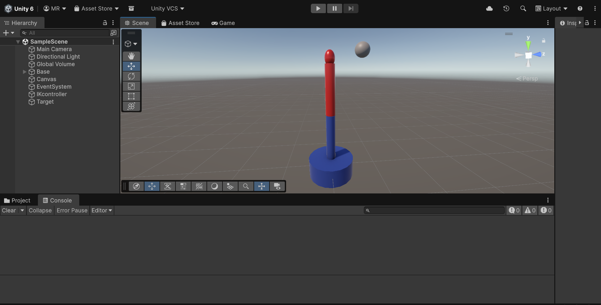
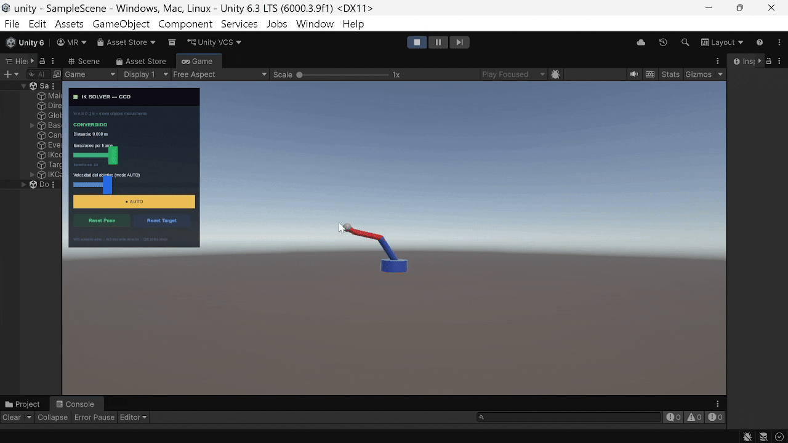
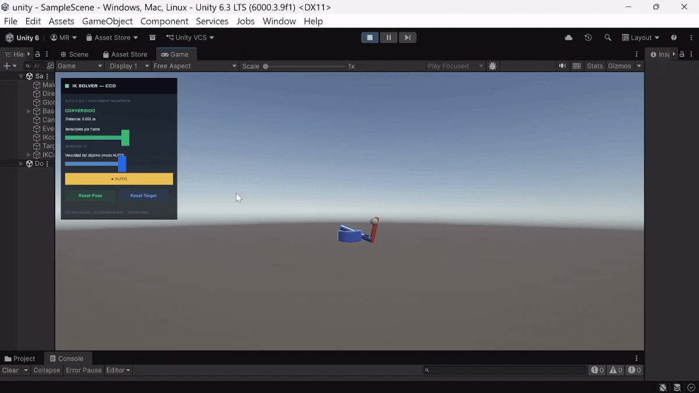
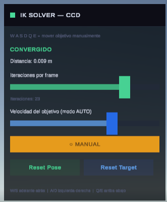
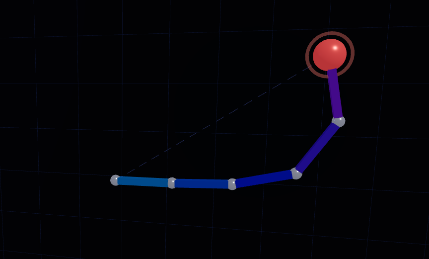
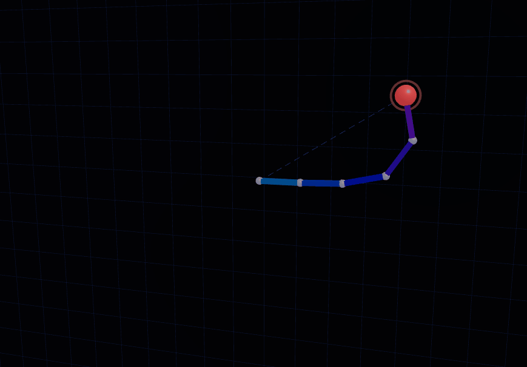

# Cinemática Inversa: Haciendo que el Modelo Persiga Objetivos

### Nombres:

- Joan Sebastian Roberto Puerto
- Baruj Vladimir Ramírez Escalante
- Diego Alberto Romero Olmos
- Maicol Sebastian Olarte Ramirez
- Jorge Isaac Alandete Díaz

### Fecha de entrega: 15/04/2026

### Descripción del tema:
Aplicar cinemática inversa (IK, Inverse Kinematics) para que un modelo 3D alcance un punto objetivo dinámico. El ejercicio permite comprender cómo una cadena de articulaciones puede ajustarse automáticamente para alcanzar una posición deseada usando el algoritmo CCD (Cyclic Coordinate Descent).

---

### Descripción de la implementación

#### Unity:

Se implementa un solver de cinemática inversa basado en el algoritmo **CCD (Cyclic Coordinate Descent)**. La cadena IK está compuesta por un arreglo de `Transform` (`joints`) con un `EndEffector` en el extremo y un objetivo (`target`) que puede moverse en tiempo real.

El script `IKSolverCCD` maneja dos aspectos principales:

**Solver CCD:** En cada frame, el algoritmo itera desde la articulación más cercana al efector final hasta la base. Para cada articulación calcula el vector hacia el efector y el vector hacia el objetivo, obtiene el eje y ángulo de rotación necesarios mediante producto cruzado y `Vector3.Angle`, y aplica la rotación incremental. El número de iteraciones por frame es configurable en tiempo real mediante un slider en la interfaz.

**Movimiento del objetivo:** El target puede controlarse en dos modos: **automático**, donde se mueve en una trayectoria senoidal tridimensional usando `Time.time`, y **manual**, donde el usuario lo desplaza con las teclas W/A/S/D/Q/E. El modo se alterna mediante un botón en la interfaz.

La interfaz gráfica se construye completamente por código sin prefabs, incluyendo un panel con sliders para iteraciones y velocidad, etiquetas de estado (CONVERGIDO / RESOLVIENDO / FUERA DE ALCANCE), y botones de Reset Pose y Reset Target. Se utiliza `Debug.DrawLine` para visualizar la cadena de articulaciones, la línea entre el efector y el objetivo, y un gizmo de ejes en la posición del efector final.

#### Three.js

Se implementó una escena en la que hay un plano de fondo junto con una serie de eslabones que forman un brazo. en un extremo del brazo hay una esfera arrastrable con el mouse. Esta implementación hace uso de "inverse kinematics" (IK) en tiempo real para su funcionamiento.

---

### Resultados visuales

#### Unity:

Vista general del diseño del brazo robótico y la escena con el objetivo y la cadena IK:



Demostración de la animación automática del solver CCD persiguiendo el objetivo en su trayectoria senoidal:



Demostración del modo manual, donde el usuario mueve el objetivo con teclado y el solver IK responde en tiempo real:



Detalle del panel de control con los sliders de iteraciones, velocidad, el toggle de modo y los botones de reset:



#### Three.js:

Muestra del espacio generado con los componentes requeridos del plano y las esferas conectadas que forman un brazo, esfera naranja en la punta para arrastrar la cadena de esferas.



Demostración del funcionamiento del arrastrado y como la cadena de esferas reubica su posicion.



---

### Código relevante

#### Unity:

Núcleo del algoritmo CCD — rotación iterativa de cada articulación hacia el objetivo:

```csharp
void SolveIK()
{
    if (target == null || joints == null || joints.Length == 0 || endEffector == null)
        return;

    int maxIter = sliderIterations != null ? (int)sliderIterations.value : iterations;

    for (int iter = 0; iter < maxIter; iter++)
    {
        if (Vector3.Distance(endEffector.position, target.position) < threshold)
            break;

        for (int i = joints.Length - 1; i >= 0; i--)
        {
            Transform joint    = joints[i];
            Vector3   toEnd    = (endEffector.position - joint.position).normalized;
            Vector3   toTarget = (target.position      - joint.position).normalized;
            Vector3   axis     = Vector3.Cross(toEnd, toTarget);
            float     angle    = Vector3.Angle(toEnd, toTarget);

            if (axis.magnitude > 0.001f && angle > 0.01f)
                joint.rotation = Quaternion.AngleAxis(angle, axis.normalized) * joint.rotation;
        }
    }
}
```

Lógica de movimiento del objetivo — modo automático con trayectoria senoidal y modo manual con teclado:

```csharp
void MoveTarget()
{
    if (target == null) return;

    float   spd   = targetSpeed * Time.deltaTime;
    Vector3 input = Vector3.zero;

    if (Input.GetKey(KeyCode.W)) input += Vector3.forward;
    if (Input.GetKey(KeyCode.S)) input += Vector3.back;
    if (Input.GetKey(KeyCode.A)) input += Vector3.left;
    if (Input.GetKey(KeyCode.D)) input += Vector3.right;
    if (Input.GetKey(KeyCode.Q)) input += Vector3.up;
    if (Input.GetKey(KeyCode.E)) input += Vector3.down;

    if (input != Vector3.zero)
    {
        target.position += input * spd;
    }
    else if (autoMove)
    {
        target.position = new Vector3(
            Mathf.Sin(Time.time * 0.8f) * 1.5f,
            1.0f + Mathf.Cos(Time.time * 0.5f) * 0.4f,
            Mathf.Cos(Time.time * 0.6f) * 0.8f
        );
    }
}
```

Verificación de alcance y actualización del estado visual en la UI:

```csharp
void CheckReach()
{
    if (joints == null || joints.Length == 0 || target == null) return;
    outOfReach = Vector3.Distance(joints[0].position, target.position) > totalArmLength;
}

void RefreshLabels()
{
    if (labelStatus != null)
    {
        if (outOfReach)
        {
            labelStatus.text  = "OBJETIVO FUERA DE ALCANCE";
            labelStatus.color = accentRed;
        }
        else
        {
            float dist      = (endEffector != null && target != null)
                ? Vector3.Distance(endEffector.position, target.position) : 0f;
            bool  converged = dist < threshold;
            labelStatus.text  = converged ? "CONVERGIDO" : "RESOLVIENDO...";
            labelStatus.color = converged ? accent : accentBlue;
        }
    }
}
```

#### Three.js

Fragmento del funcionamiento principal del "brazo" usando FABRIK, propagación del movimiento entre el arreglo de segmentos:

```jsx
for (let iter = 0; iter < ITERATIONS; iter++) {
    // Forward pass (tip → base)
    positions[n - 1].copy(target);
    for (let i = n - 2; i >= 0; i--) {
      const r = positions[i + 1].distanceTo(positions[i]);
      const lambda = lens[i] / r;
      positions[i].lerpVectors(positions[i + 1], positions[i], lambda);
    }

    // Backward pass (base → tip)
    positions[0].copy(origBase);
    for (let i = 0; i < n - 1; i++) {
      const r = positions[i].distanceTo(positions[i + 1]);
      const lambda = lens[i] / r;
      positions[i + 1].lerpVectors(positions[i], positions[i + 1], lambda);
    }

    if (positions[n - 1].distanceTo(target) < TOLERANCE) break;
  }
```

Funcionamiento del arrastrado de la punta del brazo.

```jsx
  const onPointerMove = useCallback(
    (e) => {
      if (!dragging.current) return;
      const rect = gl.domElement.getBoundingClientRect();
      const nx = ((e.clientX - rect.left) / rect.width) * 2 - 1;
      const ny = -((e.clientY - rect.top) / rect.height) * 2 + 1;
      raycaster.current.setFromCamera({ x: nx, y: ny }, camera);
      if (
        raycaster.current.ray.intersectPlane(
          planeRef.current,
          intersection.current
        )
      ) {
        setTargetPos(
          new THREE.Vector3(
            intersection.current.x,
            intersection.current.y,
            0
          )
        );
      }
    },
    [camera, gl, setTargetPos]
  );
```
---

### Aprendizajes y dificultades

#### Unity:

- **Comprensión del algoritmo CCD:** Se entendió la lógica del recorrido desde el extremo hacia la base: cada articulación solo "ve" hacia el objetivo de forma local, y la convergencia global emerge de repetir el proceso en múltiples iteraciones. El uso del producto cruzado para obtener el eje de rotación y `Vector3.Angle` para el ángulo fue clave para implementar la rotación incremental correctamente.

- **Condición de fuera de alcance:** Una dificultad fue determinar cuándo el objetivo está fuera del alcance del brazo. Se resolvió calculando la longitud total de la cadena (`totalArmLength`) en `Start()` comparándola con la distancia desde la base hasta el objetivo en cada frame. Esto permite retroalimentar al usuario visualmente sin interrumpir el solver.

- **Estabilidad numérica del solver:** En algunos casos con articulaciones casi alineadas, el eje resultante del producto cruzado tenía magnitud cercana a cero, causando rotaciones erráticas. Se corrigió añadiendo la condición `axis.magnitude > 0.001f` antes de aplicar la rotación.

- **Construcción de UI por código:** Al igual que en el taller anterior, crear toda la interfaz (Canvas, Sliders, Botones, Labels) sin prefabs requirió manejo detallado del sistema `RectTransform` de Unity. El uso de `ConstantPixelSize` en el `CanvasScaler` garantizó que el panel fuera visible independientemente de la resolución.

- **Visualización con Debug.DrawLine:** El rastro y los gizmos del efector final solo son visibles en la vista de escena durante el modo Play, no en la Game View. Esto fue una limitación para mostrar los resultados directamente en pantalla, y en una versión más completa se reemplazaría por un `LineRenderer`.

#### Three.js

Se logró aplicar cinematica inversa para que un objeto 3D (en este caso un arreglo de esferas formando un brazo), responda a interacciones del usuario, logrando moverse al punto donde el usuario arrastre la esfera conectada a la punta del objeto, las posiciones conectadas de los eslabones se ajustan automaticamente usando FABRIK.
