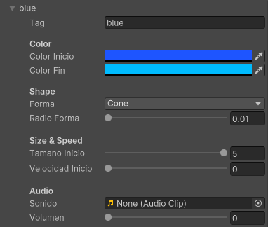
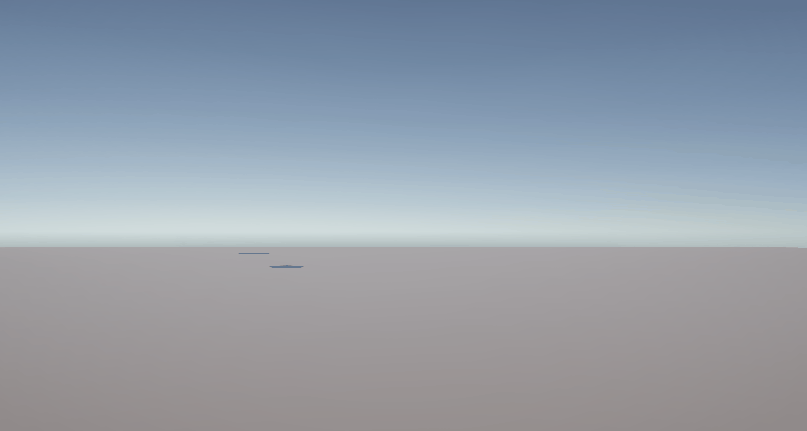

# Titulo

Nombres:

- Joan Sebastian Roberto Puerto
- Baruj Vladimir Ramírez Escalante
- Diego Alberto Romero Olmos
- Maicol Sebastian Olarte Ramirez
- Jorge Isaac Alandete Díaz

Fecha de entrega: 15/5/2026
Descripción breve:

**Implementaciones:**

- **Unity**:

Se implentó una escena sencilla en la que hay 3 objetos con distintas formas que caen en un plano ya que cuentan con un rigidbody. Sobre la superficie del plano se encuentra un box collider en modo trigger que invoca un efecto de partículas dependiendo del objeto que entre en contacto con este.

Dependiendo del tipo de objeto diferenciado por el "tag" que tenga, se puede configurar distintos efectos, entre ellos color, velocidad y forma de las partículas. Adicionalmente se puede añadir un clip de audio que se reproduce dependiendo del tipo de objeto.

**Resultados visuales:**

- **Unity**:

La siguiente imagen muestra todas las configuraciones posibles dentro del editor para un determinado tipo de objeto. Si el objeto no cuenta con ningun tag o no hay uno con correspondiente efecto, se reproduce el efecto de partículas como se encuentra.



Muestra del funcionamiento del trigger con tres objetos, una esfera sin tag, un cubo con el tag "blue" y un cilindro con el tag "red", se generan distintas particulas dependiendo de cada uno.



**Código relevante:**

- **Unity**:

Funcionamiento base del trigger con filtro de tags y aplicacion de fectos dependiendo del tipo de objeto.

```Csharp
    private void OnTriggerEnter(Collider other)
    {
        // Find the configuration that matches the colliding object's tag
        TagConfig cfg = BuscarConfig(other.tag);

        if (efecto != null)
        {
            // Position at the closest surface point of the collider
            Vector3 puntoContacto = other.ClosestPoint(transform.position);
            efecto.transform.position = puntoContacto;

            // Apply tag-specific settings before playing
            if (cfg != null)
            {
                AplicarColor(cfg);
                AplicarForma(cfg);
                AplicarTamanoVelocidad(cfg);
            }

            // Stop any current playback and restart
            efecto.Stop(true, ParticleSystemStopBehavior.StopEmittingAndClear);
            efecto.Play();
        }

        // Play sound
        if (cfg != null && cfg.sonido != null && fuenteAudio != null)
        {
            fuenteAudio.PlayOneShot(cfg.sonido, cfg.volumen);
        }
    }
```

Aplicación del color al sistema de particulas generado según tipo de objet, teniendo en cuenta la configuaración dada desde el editor

```Csharp
    private void AplicarColor(TagConfig cfg)
    {
        var main = efecto.main;

        // Build a two-color gradient from colorInicio to colorFin
        Gradient gradiente = new Gradient();
        gradiente.SetKeys(
            new GradientColorKey[]
            {
                new GradientColorKey(cfg.colorInicio, 0f),
                new GradientColorKey(cfg.colorFin,    1f)
            },
            new GradientAlphaKey[]
            {
                new GradientAlphaKey(1f, 0f),
                new GradientAlphaKey(0f, 1f)   // fade out at end of lifetime
            }
        );

        main.startColor = new ParticleSystem.MinMaxGradient(gradiente);
    }
```

**Prompts utilizados:**

- **Unity**: Se utilizó el siguiente prompt en claude para generar el funcionamiento del trigger:

```plaintext
Hi, I need to créate a Unity URP script for créate collision on particles and that achieves the following:
-Change the color or shape of the particles depending of the object type (could be using tags)
-Use OnTriggerEnter with isTrigger activated for collisions without real physics.
-Add sound on collision.
I have this script that could be used as base:
using UnityEngine;
public class ColisionParticulas : MonoBehaviour
{
 public ParticleSystem efecto;
 private void OnCollisionEnter(Collision collision)
 {
 if (efecto != null)
 {
 efecto.transform.position = collision.contacts[0].point;
 efecto.Play();
 }
 }
}
Could you assist me in this task?
```

**Aprendizajes y dificultades:**

Se comprendió el funcionamiento base de como hacer un trigger en Unity haciendo uso de colliders, los componentes necesarios para que se pueda dar la interaccion correctamente y adicionalmente como hacer uso y llamado de un sistema de particulas dado, así como modificar la apriencia de este mismo.
