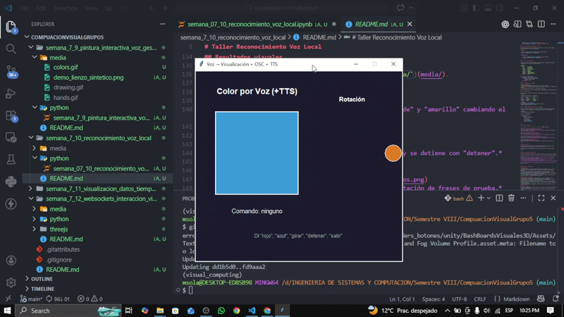
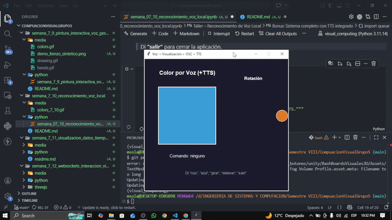
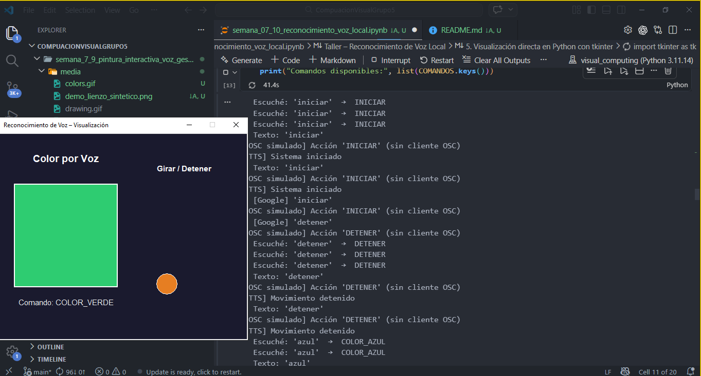
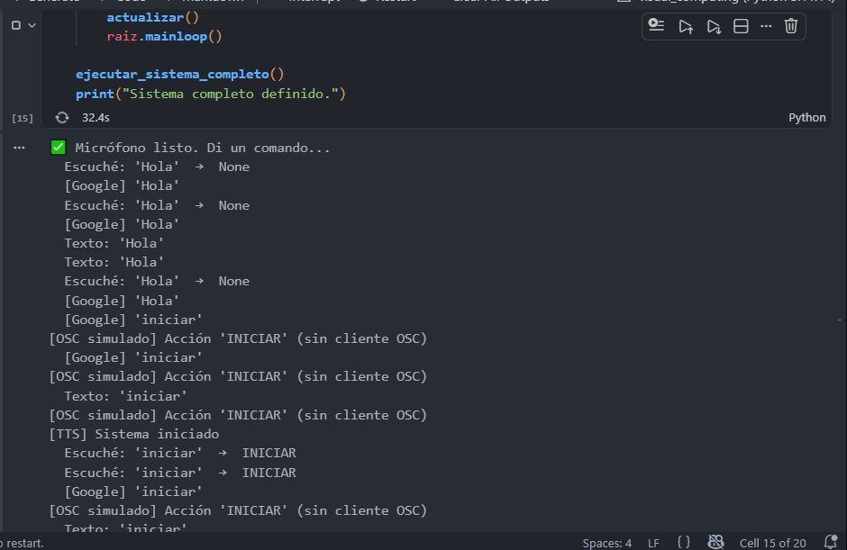

# Taller Reconocimiento Voz Local

**Integrantes:**
- Joan Sebastian Roberto Puerto
- Baruj Vladimir Ramírez Escalante
- Diego Alberto Romero Olmos
- Maicol Sebastian Olarte Ramirez
- Jorge Isaac Alandete Díaz

**Fecha de entrega:** 24 de abril de 2026

---

## Descripción breve

Este taller implementa una interfaz de voz local en Python capaz de operar **sin conexión a internet** (con Google como fallback opcional). Se captura audio desde el micrófono con `speech_recognition`, se interpreta mediante un diccionario de comandos básicos en español y la salida se conecta a:

1. **Una visualización directa en Python** usando `tkinter`: un cuadrado que cambia de color y un círculo que rota, ambos controlados por voz.
2. **Una escena externa** (Processing / Unity) mediante mensajes **OSC** enviados con `python-osc`.
3. *(Bonus)* **Retroalimentación por voz** offline con `pyttsx3` que confirma en audio el comando ejecutado.

---

## Implementaciones

### Python — Reconocimiento de voz y visualización local

**Herramientas:** `speech_recognition`, `pyaudio`, `pyttsx3`, `python-osc`, `tkinter`

**Archivo:** [`python/semana_07_10_reconocimiento_voz_local.ipynb`](python/semana_07_10_reconocimiento_voz_local.ipynb)

#### 1. Captura de audio

Se usa `speech_recognition.Microphone` como fuente de entrada y `Recognizer.listen()` con `adjust_for_ambient_noise()` para calibrar el umbral de silencio antes de cada sesión de escucha.

```python
recognizer = sr.Recognizer()
with sr.Microphone() as fuente:
    recognizer.adjust_for_ambient_noise(fuente, duration=1)
    audio = recognizer.listen(fuente, timeout=5, phrase_time_limit=4)
```

#### 2. Reconocimiento de voz (offline + online)

Se intenta primero el motor **CMU Sphinx** (offline) y, si falla, se usa **Google Speech Recognition** (online) como fallback:

```python
try:
    texto = recognizer.recognize_sphinx(audio, language="es-ES")
except (sr.UnknownValueError, sr.RequestError):
    pass

if texto is None:
    try:
        texto = recognizer.recognize_google(audio, language="es-ES")
    except (sr.UnknownValueError, sr.RequestError):
        pass
```

#### 3. Diccionario de comandos

Las palabras clave se mapean a códigos de acción internos. La búsqueda se hace por subcadena para tolerar errores de transcripción:

```python
COMANDOS = {
    "rojo"    : "COLOR_ROJO",
    "azul"    : "COLOR_AZUL",
    "verde"   : "COLOR_VERDE",
    "amarillo": "COLOR_AMARILLO",
    "girar"   : "GIRAR",
    "iniciar" : "INICIAR",
    "detener" : "DETENER",
    "grande"  : "TAMANIO_GRANDE",
    "pequeño" : "TAMANIO_PEQUENIO",
    "salir"   : "SALIR",
}

def interpretar_comando(texto):
    texto_lower = texto.lower().strip()
    for palabra, accion in COMANDOS.items():
        if palabra in texto_lower:
            return accion
    return None
```

#### 4. Visualización con `tkinter`

Se abre una ventana con:
- Un **cuadrado** que cambia de color (rojo, azul, verde, amarillo).
- Un **círculo naranja** que orbita cuando se dice "girar" o "iniciar" y se detiene con "detener".
- Una **etiqueta** que muestra el último comando reconocido.

El reconocimiento corre en un `threading.Thread` independiente para no bloquear la GUI.

#### 5. Comunicación OSC

Con `python-osc` se envían mensajes UDP al puerto 7000 (configurable). El protocolo de mensajes es:

| Comando | Dirección OSC   | Argumento   |
|---------|----------------|-------------|
| rojo    | `/color`       | `"rojo"`    |
| azul    | `/color`       | `"azul"`    |
| girar   | `/movimiento`  | `"girar"`   |
| detener | `/control`     | `"detener"` |
| grande  | `/tamanio`     | `"grande"`  |

```python
from pythonosc import udp_client
cliente = udp_client.SimpleUDPClient("127.0.0.1", 7000)
cliente.send_message("/color", "rojo")
```

#### 6. *(Bonus)* Retroalimentación TTS con `pyttsx3`

`pyttsx3` confirma por audio (sin internet) el comando ejecutado. Corre en un hilo consumidor de una `queue.Queue` para no bloquear la GUI ni el reconocimiento:

```python
import pyttsx3, queue, threading

_cola_tts = queue.Queue()

def _worker_tts(motor):
    while True:
        msg = _cola_tts.get()
        if msg is None:
            break
        motor.say(msg)
        motor.runAndWait()
        _cola_tts.task_done()
```

---

## Resultados visuales

> Las capturas y GIFs se encuentran en la carpeta [`media/`](media/).

### 1. Ventana tkinter – cambio de color por voz

*La ventana responde a los comandos "rojo", "azul", "verde" y "amarillo" cambiando el color del cuadrado en tiempo real.*

### 2. Ventana tkinter – rotación del círculo

*El círculo naranja orbita al decir "girar" o "iniciar" y se detiene con "detener".*

### 3. Demostración del diccionario de comandos

*Salida de la celda 5 del notebook mostrando la interpretación de frases de prueba.*

### 4. Simulación de mensajes OSC

*Salida de la celda 7 mostrando los mensajes OSC enviados durante la simulación.*

---

## Código relevante

El código completo se encuentra en [`python/semana_07_10_reconocimiento_voz_local.ipynb`](python/semana_07_10_reconocimiento_voz_local.ipynb).

Los fragmentos más representativos se incluyen en la sección **Implementaciones** arriba.

---

## Prompts utilizados (IA generativa)

Durante el desarrollo se emplearon los siguientes prompts con GitHub Copilot y ChatGPT:

1. *"Cómo usar speech_recognition con un motor offline en español usando CMU Sphinx en Python."*
2. *"Crea una función que interprete comandos de voz a partir de un diccionario de palabras clave usando búsqueda por subcadena."*
3. *"Genera una ventana tkinter que muestre un cuadrado de color configurable y un círculo en órbita, controlados desde un hilo secundario."*
4. *"Cómo enviar mensajes OSC desde Python con python-osc a una escena Unity/Processing."*
5. *"Configurar pyttsx3 para retroalimentación de voz offline en un hilo separado sin bloquear la GUI."*

---

## Aprendizajes y dificultades

### Aprendizajes
- `speech_recognition` abstrae múltiples motores (Sphinx, Google, Wit, etc.) con la misma interfaz, lo que facilita cambiar el backend sin modificar la lógica de la aplicación.
- El patrón productor-consumidor con `queue.Queue` es esencial cuando se combinan varios hilos (micrófono, GUI, TTS) para evitar condiciones de carrera.
- OSC (Open Sound Control) es un protocolo ligero y eficaz para comunicar aplicaciones Python con entornos como Unity o Processing en tiempo real.
- `pyttsx3` permite TTS completamente offline, lo cual es valioso en escenarios sin acceso a internet o con restricciones de privacidad.

### Dificultades encontradas
- **pyaudio en Linux** requiere `portaudio19-dev`; sin él la instalación falla silenciosamente. Se documentó el comando de instalación en el notebook.
- **pocketsphinx** (CMU Sphinx) tiene un modelo en español limitado; en la práctica Google ofreció mejores resultados para frases cortas.
- Gestionar el ciclo de vida de los hilos (voz + TTS) al cerrar la ventana tkinter requirió una señal de cierre explícita (`None` en la cola TTS) y el flag `corriendo` en el estado compartido.
- La latencia de `pyttsx3.runAndWait()` bloqueaba el hilo si no se movía a un hilo dedicado con cola.

### Mejoras futuras
- Entrenar un modelo Vosk o Whisper (offline y más preciso) con vocabulario reducido al diccionario de comandos.
- Añadir confianza mínima al reconocimiento para descartar transcripciones de baja calidad.
- Crear el receptor OSC en Unity con extOSC para controlar materiales, luces o animaciones.
- Sustituir tkinter por una visualización 3D con `matplotlib` o `vispy`.

---

## Checklist de entrega

- [x] Carpeta con formato `semana_7_10_reconocimiento_voz_local`
- [x] `README.md` completo con toda la información requerida
- [x] Implementación Python en `python/semana_07_10_reconocimiento_voz_local.ipynb`
- [x] Carpeta `media/` preparada para imágenes y GIFs
- [x] Commits descriptivos en inglés
- [x] Nombre de carpeta correcto: `semana_7_10_reconocimiento_voz_local`

---
