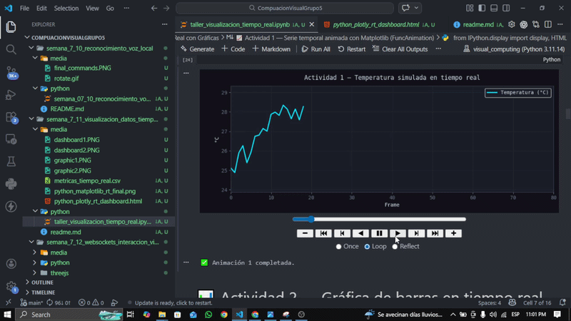
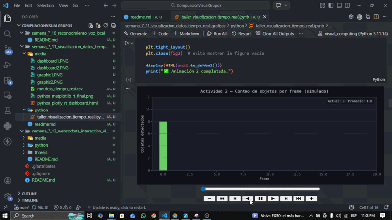
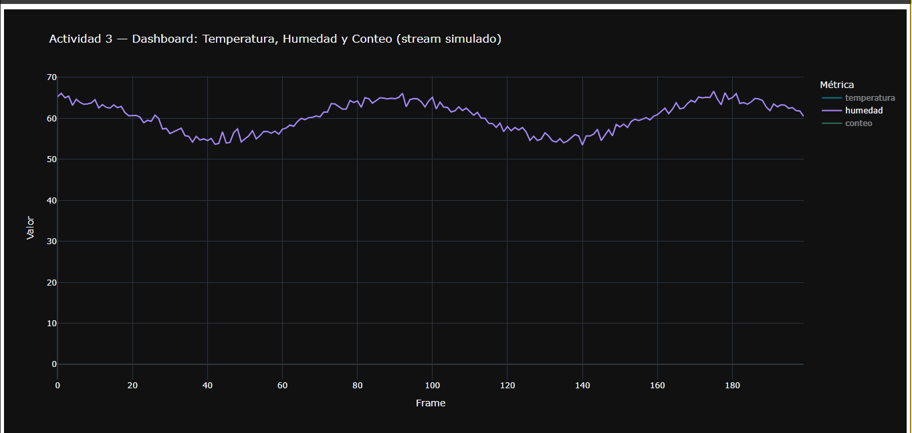
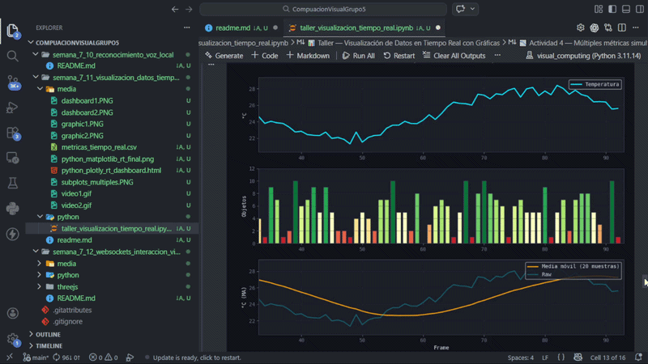
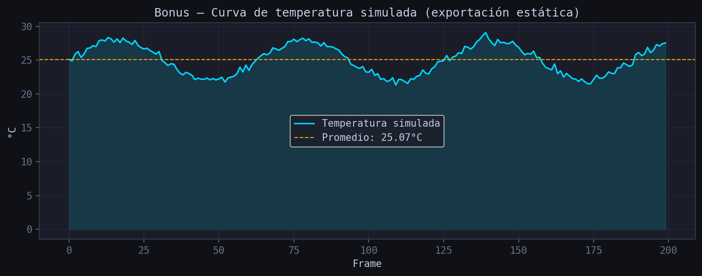

# Taller — Visualización de Datos en Tiempo Real con Gráficas

**Nombre del estudiante:** 
- Joan Sebastian Roberto Puerto
- Baruj Vladimir Ramírez Escalante
- Diego Alberto Romero Olmos
- Maicol Sebastian Olarte Ramirez
- Jorge Isaac Alandete Díaz

**Fecha de entrega:** 22/04/2026

---

## Descripción breve

Este taller tiene como objetivo simular datos que cambian en el tiempo y visualizarlos en tiempo real mediante gráficas animadas e interactivas. La implementación se realiza exclusivamente en **Python** usando `matplotlib` (animaciones con `FuncAnimation`) y `plotly` (dashboard interactivo). Se simulan métricas como temperatura (señal senoidal + ruido) y conteo de objetos por frame (señal aleatoria entera), construyendo desde una curva simple hasta un panel con tres subgráficas simultáneas. El bonus exporta la curva final a CSV y PNG, e imprime métricas de rendimiento (FPS teórico, promedio, máximo, mínimo).

> Notebook principal: [`python/taller_visualizacion_tiempo_real.ipynb`](python/taller_visualizacion_tiempo_real.ipynb)

---

## Implementaciones realizadas

### Actividad 1 — Serie temporal animada con Matplotlib (`FuncAnimation`)

Se construye una serie temporal que simula una señal de temperatura:

$$temperatura(t) = 25 + 3 \cdot \sin(0.1\,t) + \mathcal{N}(0,\,0.4)$$

Una **ventana deslizante** de 80 puntos mantiene el eje X móvil. En cada frame se agrega un punto y se actualiza la curva en vivo con `blit=True`.

| Parámetro | Valor |
|-----------|-------|
| Frames totales | 200 |
| Ventana visible | 80 pts |
| Intervalo | 80 ms |

---

### Actividad 2 — Gráfica de barras en tiempo real (conteo de objetos simulado)

Se simula el **número de objetos detectados** por frame (valor entero aleatorio 0–10, como produciría YOLO). Las barras se colorean dinámicamente con la paleta `RdYlGn` según la cantidad. Se muestra en cada frame el valor actual y el promedio de la ventana visible.

| Parámetro | Valor |
|-----------|-------|
| Frames totales | 60 |
| Ventana visible | 20 barras |
| Intervalo | 150 ms |

---

### Actividad 3 — Dashboard interactivo con Plotly y Pandas

Se genera un `DataFrame` con 200 muestras de tres métricas simultáneas:

| Métrica | Señal |
|---------|-------|
| `temperatura` | `25 + 3·sin(0.1t) + N(0, 0.4)` |
| `humedad` | `60 + 5·cos(0.07t) + N(0, 0.8)` |
| `conteo` | entero aleatorio 0–10 |

La gráfica resultante (Plotly Dark) es interactiva: zoom, pan, hover unificado y exportación PNG desde la interfaz.

---

### Actividad 4 — Múltiples métricas simultáneas en subplots (Matplotlib)

Tres subgráficas animadas en paralelo con un solo `FuncAnimation`:
1. **Temperatura** — curva de línea con ventana deslizante
2. **Conteo de objetos** — barras coloreadas por valor
3. **Media móvil** — promedio de las últimas 20 muestras superpuesta sobre la señal cruda

| Parámetro | Valor |
|-----------|-------|
| Frames totales | 150 |
| Ventana visible | 60 pts |
| Ventana MA | 20 muestras |

---

### Bonus — Exportar curva a CSV e imagen PNG + métricas de rendimiento

Se reconstruyen los datos de la Actividad 1 en un `DataFrame` y se:
- Guarda la curva en `media/metricas_tiempo_real.csv`
- Guarda imagen estática en `media/python_matplotlib_rt_final.png` (con línea de promedio)
- Imprime estadísticas: promedio, máximo, mínimo, desviación estándar y FPS teórico

---

## Resultados visuales

> Las evidencias deben colocarse en `media/` y las rutas actualizarse aquí luego de ejecutar el notebook.

### Actividad 1 — Temperatura animada (Matplotlib)

| Captura 1 | Captura 2 |
|-----------|-----------|
|  |  |

### Actividad 2 — Barras de conteo (Matplotlib)

| Captura 1 | Captura 2 |
|-----------|-----------|
|  |  |

### Actividad 3 — Dashboard interactivo (Plotly)

| Captura 1 | Captura 2 |
|-----------|-----------|
|  |  |

### Actividad 4 — Subplots múltiples (Matplotlib)

| Captura 1 | Captura 2 |
|-----------|-----------|
|  |  |

### Bonus — Curva exportada con promedio

| PNG generado automáticamente |
|------------------------------|
|  |

> Mínimo requerido: 2 capturas o GIFs por implementación.

---

## Código relevante

### Actividad 1 — Ventana deslizante con `FuncAnimation`

```python
xs_act1, ys_act1 = [], []

def update_act1(frame):
    xs_act1.append(frame)
    y = 25 + 3 * np.sin(0.1 * frame) + rng.normal(0, 0.4)
    ys_act1.append(y)

    xs_vis = xs_act1[-N_WINDOW:]
    ys_vis = ys_act1[-N_WINDOW:]
    line1.set_data(xs_vis, ys_vis)

    ax1.set_xlim(xs_vis[0], xs_vis[0] + N_WINDOW)
    ax1.set_ylim(min(ys_vis) - 1, max(ys_vis) + 1)
    return (line1,)

ani1 = animation.FuncAnimation(
    fig1, update_act1, frames=200, interval=80, blit=True
)
```

### Actividad 3 — DataFrame y gráfica interactiva con Plotly

```python
df = pd.DataFrame({
    "frame":       t,
    "temperatura": 25 + 3 * np.sin(0.1 * t) + rng.normal(0, 0.4, N),
    "humedad":     60 + 5 * np.cos(0.07 * t) + rng.normal(0, 0.8, N),
    "conteo":      rng.integers(0, 11, N).astype(float),
})

fig_px = px.line(
    df.melt(id_vars="frame", var_name="métrica", value_name="valor"),
    x="frame", y="valor", color="métrica",
    template="plotly_dark", hovermode="x unified",
)
fig_px.show()
```

### Bonus — Exportación a CSV y PNG

```python
df_export.to_csv("media/metricas_tiempo_real.csv", index=False)
fig_b.savefig("media/python_matplotlib_rt_final.png", dpi=150, bbox_inches="tight")
```

---

## Prompts utilizados

Prompts empleados con asistencia de IA generativa durante el desarrollo:

1. *"Genera un ejemplo en Python con `FuncAnimation` para graficar una señal senoidal en tiempo real con ventana deslizante."*
2. *"¿Cómo animar barras en tiempo real con `FuncAnimation` coloreando cada barra según su valor?"*
3. *"Crea un DataFrame con tres señales simuladas y grafícalas en Plotly con `hovermode='x unified'`."*
4. *"¿Cómo calcular y mostrar la media móvil de los últimos N puntos en una gráfica de Matplotlib animada?"*
5. *"Dame el código para guardar estadísticas (promedio, máximo, FPS teórico) y exportar la curva a CSV y PNG."*

---

## Aprendizajes y dificultades

### Aprendizajes
- `FuncAnimation` necesita que la variable de animación persista (`ani = ...`) para que el garbage collector no la elimine antes de terminar.
- `blit=True` acelera las animaciones, pero es incompatible con `ax.clear()` (se requiere `blit=False` cuando se redibuja el eje completo, como en las barras).
- La ventana deslizante (`xs[-N:]`) es esencial para mantener la animación legible y evitar acumulación excesiva de puntos.
- `plotly.express` genera gráficas interactivas con muy poco código cuando los datos ya están en un `DataFrame` en formato largo (`melt`).

### Dificultades
- Sincronizar el límite dinámico del eje X con la ventana de puntos visibles sin que haya "saltos".
- En Jupyter, las animaciones de Matplotlib requieren el backend `%matplotlib notebook` o `%matplotlib widget` para verse en vivo dentro del notebook.
- `plt.cm.get_cmap()` está deprecado en Matplotlib ≥ 3.7; se reemplaza con `matplotlib.colormaps["RdYlGn"]`.

### Soluciones aplicadas
- Usar `ax.set_xlim(xv[0], xv[0] + WIN)` en cada frame para simular desplazamiento horizontal.
- Separar la lógica de datos (buffers de listas) de la lógica de dibujo (artistas de Matplotlib).
- Para entornos sin backend interactivo, guardar la animación como GIF: `ani.save("salida.gif", writer="pillow")`.

---

## Checklist de entrega

- [ ] README completo con todas las secciones solicitadas.
- [ ] Notebook `python/taller_visualizacion_tiempo_real.ipynb` ejecutado correctamente.
- [ ] Carpeta `media/` con mínimo 2 evidencias por implementación.
- [ ] CSV exportado: `media/metricas_tiempo_real.csv`.
- [ ] PNG exportado: `media/python_matplotlib_rt_final.png`.
- [ ] Estadísticas de rendimiento impresas (FPS, promedio, máximo, mínimo).
