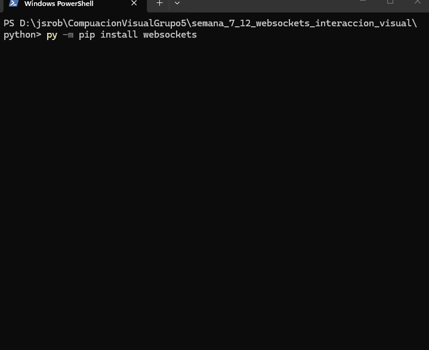
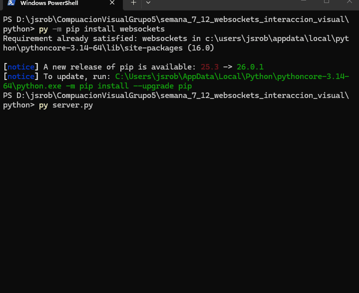
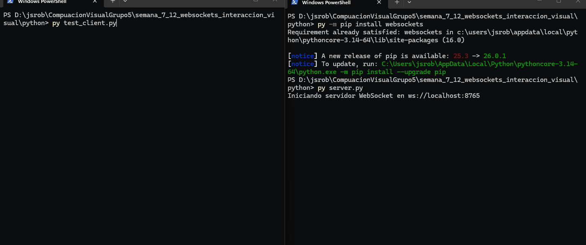

# Taller 58 – WebSockets e Interacción Visual en Tiempo Real

**Integrantes:**  
- Joan Sebastian Roberto Puerto  
- Baruj Vladimir Ramírez Escalante  
- Diego Alberto Romero Olmos  
- Maicol Sebastian Olarte Ramirez  
- Jorge Isaac Alandete Díaz  

**Fecha de entrega:** 25 de abril de 2026  

---

## Descripción breve

Este taller explora la comunicación **en tiempo real** entre un cliente gráfico y un servidor utilizando **WebSockets**. En esta entrega se desarrolla el **servidor en Python** que transmite periódicamente datos simulados (coordenadas y color) listos para ser consumidos por cualquier cliente de visualización.

---

## Implementación – Python (Servidor WebSocket)

### Objetivo

Crear un servidor WebSocket que envíe, cada 0.5 segundos, un mensaje JSON con la posición (`x`, `y`) y un color, simulando una señal dinámica que más tarde podrá modificar una escena 3D.

### Estructura del código

El servidor sigue una arquitectura asíncrona con `asyncio` y `websockets`. Se destacan los siguientes componentes:

- **`Payload`**: dataclass inmutable que representa el mensaje a enviar (`x`, `y`, `color`, `t`).
- **`handler()`**: función que gestiona cada cliente conectado, generando datos con una caminata aleatoria suave para que la animación sea natural.
- **`main()`**: inicia el servidor en `ws://localhost:8765` y lo mantiene activo indefinidamente.

#### Código relevante (fragmento del handler)

```python
async def handler(websocket: websockets.WebSocketServerProtocol) -> None:
    tick = 0
    current_x, current_y = 0.0, 0.0

    while True:
        current_x += random.uniform(-0.9, 0.9)
        current_y += random.uniform(-0.9, 0.9)

        current_x = max(-5.0, min(5.0, current_x))
        current_y = max(-5.0, min(5.0, current_y))

        message = Payload(
            x=round(current_x, 3),
            y=round(current_y, 3),
            color=next(COLOR_SEQUENCE),
            t=tick,
        )
        await websocket.send(json.dumps(asdict(message)))
        tick += 1
        await asyncio.sleep(SEND_INTERVAL_SECONDS)
```

#### Cliente de prueba

Un script independente (`test_client.py`) confirma que el servidor entrega los paquetes correctamente:

```python
async def test():
    async with websockets.connect("ws://localhost:8765") as ws:
        while True:
            msg = await ws.recv()
            print(json.loads(msg))
```

---

## Resultados visuales

Los siguientes GIFs muestran el servidor en funcionamiento y la recepción de datos desde el cliente de prueba.

### Instalación de dependencias



### Servidor en ejecución



### Cliente de prueba recibiendo datos




---

## Prompts de IA utilizados (Chatgpt)

1. Cómo funcionan los WebSockets y qué necesito para implementarlos en Python

2. Por qué no funciona la conexión con el cliente

---

## Aprendizajes y dificultades

### Aprendizajes

- Entender cómo funciona el protocolo **WebSocket** frente al modelo request‑response de HTTP.
- Manejar múltiples clientes simultáneos de forma asíncrona con `asyncio`.
- Elegir una estructura de datos clara (`dataclass`) para los mensajes y seriarlos a JSON.
- Simular señales suaves mediante caminatas aleatorias para que la posterior animación 3D luzca natural.

### Dificultades

- Corregir el error tipográfico del taller original (`websockets` → `websockets`).
- Asegurar que el servidor no se cayera ante desconexiones abruptas de los clientes (manejo de `ConnectionClosed`).
- Limitar el rango de los valores para que el objeto permanezca dentro del área visible de la futura escena.

---

## Cómo ejecutar el servidor

1. Instalar dependencias:
   ```bash
   py -m pip install websockets
   ```
2. Ejecutar el servidor:
   ```bash
   py server.py
   ```
3. (Opcional) Probar con el cliente de prueba:
   ```bash
   py test_client.py
   ```

---
