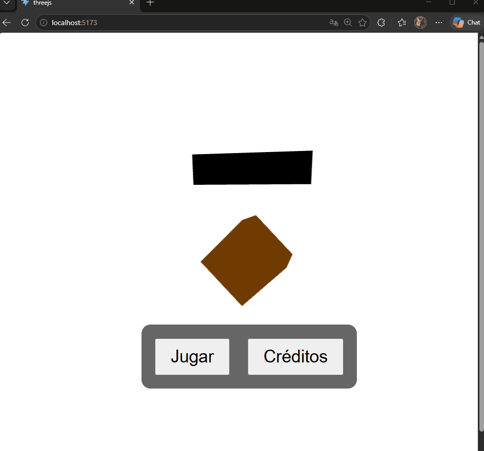
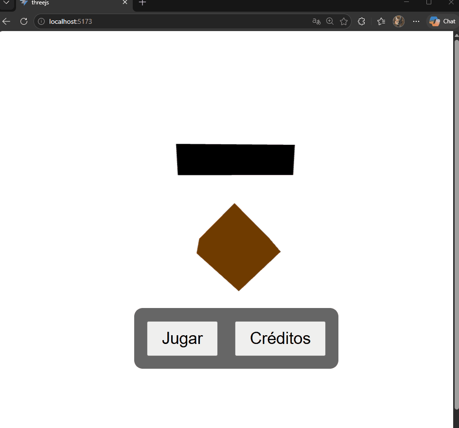
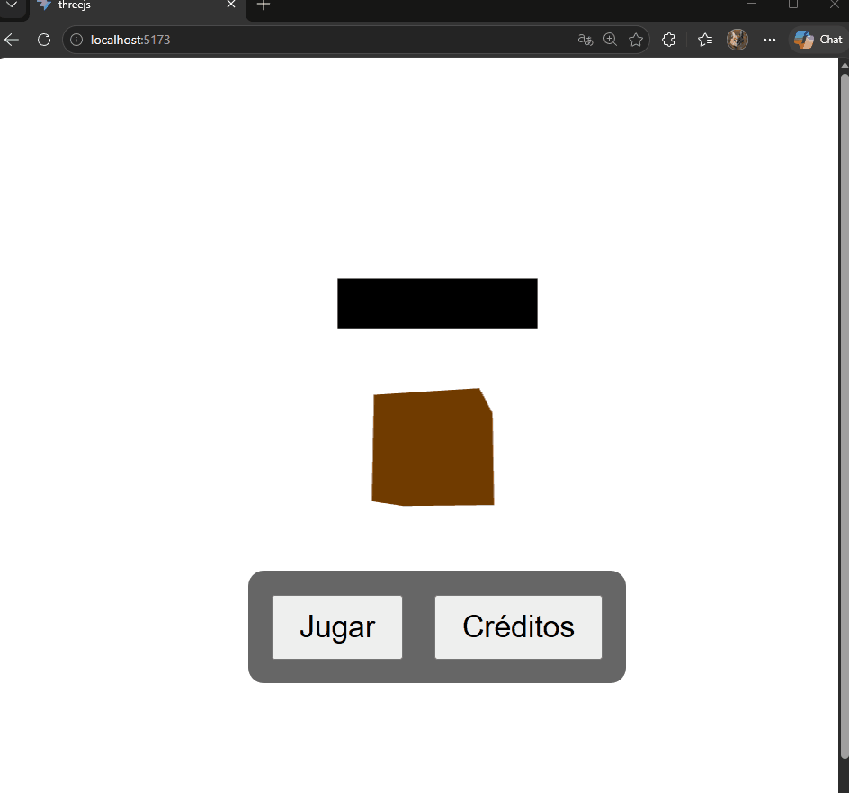
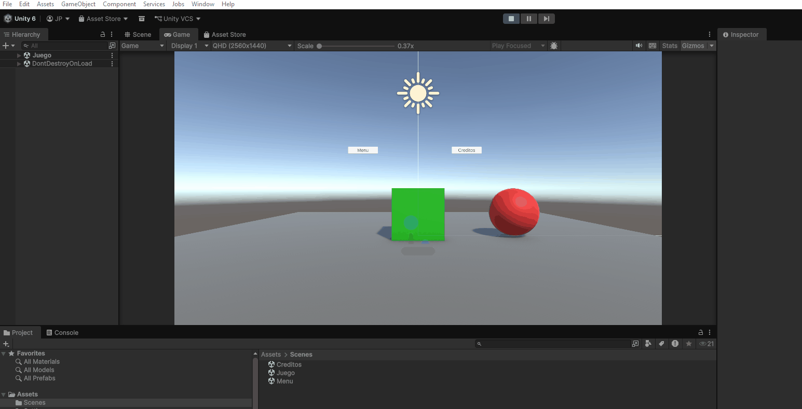
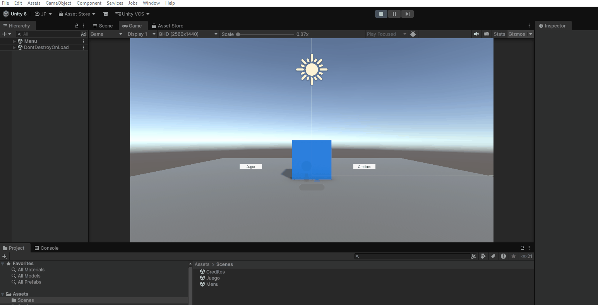

# Taller 62 – Arquitectura de Escenas y Navegación (Unity y Three.js)

**Integrantes:**  
- Joan Sebastian Roberto Puerto  
- Baruj Vladimir Ramírez Escalante  
- Diego Alberto Romero Olmos  
- Maicol Sebastian Olarte Ramirez  
- Jorge Isaac Alandete Díaz  

**Fecha de entrega:** 22 de abril de 2026  

---

## Descripción breve

El objetivo del taller es diseñar una estructura escalable para una aplicación interactiva con múltiples escenas (pantallas) que permita moverse entre menús, niveles o etapas. Se implementa en dos entornos:

- **Three.js + React**: tres escenas independientes (**Menú principal**, **Juego** y **Créditos**) con navegación usando `react-router-dom`. Cada escena contiene elementos 3D básicos (cubos, esferas, planos, estrellas) y botones superpuestos.
- **Unity**: tres escenas (**Menu**, **Juego**, **Creditos**) con navegación mediante `SceneManager.LoadScene` y botones UI. Cada escena incluye elementos visuales simples (planos, cubos, textos 3D o UI) para diferenciarlas.

---

## Implementaciones

### Three.js con React

#### Tecnologías utilizadas
- `@react-three/fiber` – Renderizador de Three.js en React.
- `@react-three/drei` – Componentes auxiliares (`OrbitControls`, `Stars`).
- `react-router-dom` – Enrutamiento para cambiar entre escenas.
- Vite – Entorno de desarrollo.

#### Estructura de componentes
- `Menu.jsx` – Escena principal con un cubo naranja rotante y botones para iniciar juego o ver créditos.
- `Juego.jsx` – Escena de juego con suelo, personaje (esfera azul), obstáculo (cubo rojo) y coleccionable (cubo dorado). Botones para volver al menú o ir a créditos.
- `Creditos.jsx` – Escena con fondo de estrellas (`<Stars>`) y un toroide decorativo. Botones para regresar al menú o al juego.

#### Navegación
- **Rutas definidas en `App.jsx`**:
  - `/` → Menú principal
  - `/juego` → Escena de juego
  - `/creditos` → Pantalla de créditos
- **Enlaces**: Se usan `<Link to="...">` en el menú y `useNavigate()` en los botones de las otras escenas.

#### Características de cada escena (Three.js)

| Escena | Elementos 3D | Interacción |
|--------|--------------|--------------|
| Menú | Cubo naranja con rotación automática, plano negro simulando cartel | Botones "Jugar" y "Créditos" |
| Juego | Suelo verde, esfera azul (personaje), cubo rojo (obstáculo), cubo dorado (coleccionable) | Cámara controlable con `OrbitControls`, botones "Menú" y "Créditos" |
| Créditos | Fondo de estrellas, toroide cyan con wireframe | Botones "Menú" y "Juego" |

---

### Unity (versión LTS)

#### Estructura de Assets
```
Assets/
├── Scenes/
│   ├── Menu.unity
│   ├── Juego.unity
│   └── Creditos.unity
├── Scripts/
│   └── Navegacion.cs
└── (Materiales, luces, etc.)
```

#### Componentes de cada escena

| Escena | Elementos visuales | Botones |
|--------|--------------------|---------|
| **Menu** | Plano de suelo, cubo decorativo azul, luz direccional | "Jugar" (a Juego), "Créditos" |
| **Juego** | Suelo (plane), cubo jugador (verde), cubo obstáculo (rojo) | "Menú", "Créditos" |
| **Creditos** | Plano oscuro, texto con información del taller | "Volver al Menú" |

#### Navegación en Unity
- Se creó un GameObject vacío llamado `ManagerNavegacion` con el script `Navegacion.cs`.
- Cada botón UI enlaza al método correspondiente mediante el evento `OnClick`.
- Se configuró el **Build Settings** con las tres escenas en orden: Menu (índice 0), Juego (1), Creditos (2).

#### Código del script `Navegacion.cs`

```csharp
using UnityEngine;
using UnityEngine.SceneManagement;

public class Navegacion : MonoBehaviour
{
    public void IrAlMenu()
    {
        SceneManager.LoadScene("Menu");
    }

    public void IrAlJuego()
    {
        SceneManager.LoadScene("Juego");
    }

    public void IrACreditos()
    {
        SceneManager.LoadScene("Creditos");
    }
}
```

#### Configuración de los botones
1. Crear un GameObject vacío (`ManagerNavegacion`) y asignarle el script.
2. En cada botón, en el evento `OnClick`:
   - Arrastrar `ManagerNavegacion` al campo `None (Object)`.
   - Seleccionar el método correspondiente (`IrAlJuego`, `IrAlMenu`, `IrACreditos`).
3. Asegurar que el `EventSystem` existe en cada escena (se crea automáticamente al añadir un botón UI).

---

## Resultados visuales

### Three.js

| Escena | GIF demostrativo |
|--------|------------------|
| **Menú principal** – Cubo rotante y botones de navegación |  |
| **Escena de juego** – Personaje, obstáculo, coleccionable y controles de cámara |  |
| **Pantalla de créditos** – Fondo estrellado y toroide decorativo |  |

### Unity

| Transición | GIF demostrativo |
|------------|------------------|
| **Menú → Créditos** |  |
| **Juego → Menú** |  |
| **Juego → Créditos** |  |

> Los archivos GIF se encuentran en la carpeta `media/` del repositorio.

---

## Código relevante

### Three.js – Enrutamiento con React Router (`App.jsx`)

```jsx
import { Routes, Route } from 'react-router-dom';
import Menu from './assets/Menu';
import Juego from './assets/Juego';
import Creditos from './assets/Creditos';

function App() {
  return (
    <Routes>
      <Route path="/" element={<Menu />} />
      <Route path="/juego" element={<Juego />} />
      <Route path="/creditos" element={<Creditos />} />
    </Routes>
  );
}
```

### Three.js – Navegación con `useNavigate`

```jsx
import { useNavigate } from 'react-router-dom';
const navigate = useNavigate();
// ...
<button onClick={() => navigate('/')}>Menú</button>
```

### Unity – Script de navegación completo

```csharp
using UnityEngine;
using UnityEngine.SceneManagement;

public class Navegacion : MonoBehaviour
{
    public void IrAlMenu()
    {
        SceneManager.LoadScene("Menu");
    }

    public void IrAlJuego()
    {
        SceneManager.LoadScene("Juego");
    }

    public void IrACreditos()
    {
        SceneManager.LoadScene("Creditos");
    }
}
```

### Unity – Configuración de Build Settings
Para que `LoadScene` funcione, las escenas deben estar incluidas en **File → Build Settings → Scenes in Build**. Se recomienda el siguiente orden:
- Índice 0: `Menu`
- Índice 1: `Juego`
- Índice 2: `Creditos`

---

## Prompts utilizados (IA generativa)

Durante el desarrollo se emplearon los siguientes prompts:

**Three.js:**
1. *“Agrega un cubo que rote en el menú, una escena de juego con suelo, personaje y obstáculo, y créditos con estrellas de fondo.”*
2. *“Soluciona el error de importación cuando los componentes están en la carpeta assets en lugar de components.”*

**Unity:**

3. *“¿Por qué los botones no ejecutan el script aunque tienen feedback visual? La solución fue crear un GameObject vacío y asignar allí el script.”*
4. *“Ayúdame a depurar el evento OnClick en Unity: no aparecían los métodos a pesar de tener el script correcto.”*

---

## Aprendizajes y dificultades

### Aprendizajes clave (ambos entornos)
- **Importancia de la estructura modular** – Separar escenas o componentes facilita el mantenimiento.
- **Navegación declarativa vs imperativa** – React Router usa enlaces declarativos; Unity usa métodos imperativos asociados a botones.
- **Configuración de Build Settings** – En Unity es obligatorio registrar las escenas para que `LoadScene` funcione.
- **El GameObject vacío como contenedor de scripts** – En Unity, cualquier script debe estar en un GameObject activo; un objeto vacío es ideal para lógica global.

### Dificultades encontradas

**Three.js:**
- **Fondos de escena** – El canvas no ocupaba toda la pantalla; se solucionó con `width: '100vw', height: '100vh'`.
- **Rotación automática** – Se implementó usando `Date.now()` directamente en la propiedad `rotation`.
- **Visibilidad de botones** – Se usó `position: 'absolute'` para superponerlos sobre el canvas.

**Unity:**
- **Botones sin respuesta** – Aunque tenían feedback visual, no ejecutaban el script. La causa fue que el script `Navegacion` no estaba en un GameObject activo. Se solucionó creando un objeto vacío `ManagerNavegacion` y asignándolo en los `OnClick`.
- **Asignación de métodos en OnClick** – Al principio no aparecían los métodos; era necesario arrastrar el GameObject con el script y luego seleccionar el método en el dropdown.
- **Build Settings** – Olvidar añadir las escenas causaba errores silenciosos; se resolvió incluyéndolas en el orden correcto.

---

## Checklist final

- [x] Carpeta con formato `semana_7_1_arquitectura_escenas_navegacion_unity_threejs/`
- [x] Subcarpetas `threejs/`, `unity/` y `media/`
- [x] `README.md` completo con ambas implementaciones
- [x] Carpeta `media/` con 6 GIFs (3 de Three.js, 3 de Unity)
- [x] `.gitignore` configurado para Node.js (Three.js) y Unity (Library/, Temp/, etc.)
- [x] Commits descriptivos en inglés (ej: “Add Three.js scenes with React Router”, “Fix Unity navigation with empty GameObject”)
- [x] Repositorio público verificado
- [x] Proyecto grupal entregado individualmente – cada integrante subió su repositorio con los aportes descritos

---

