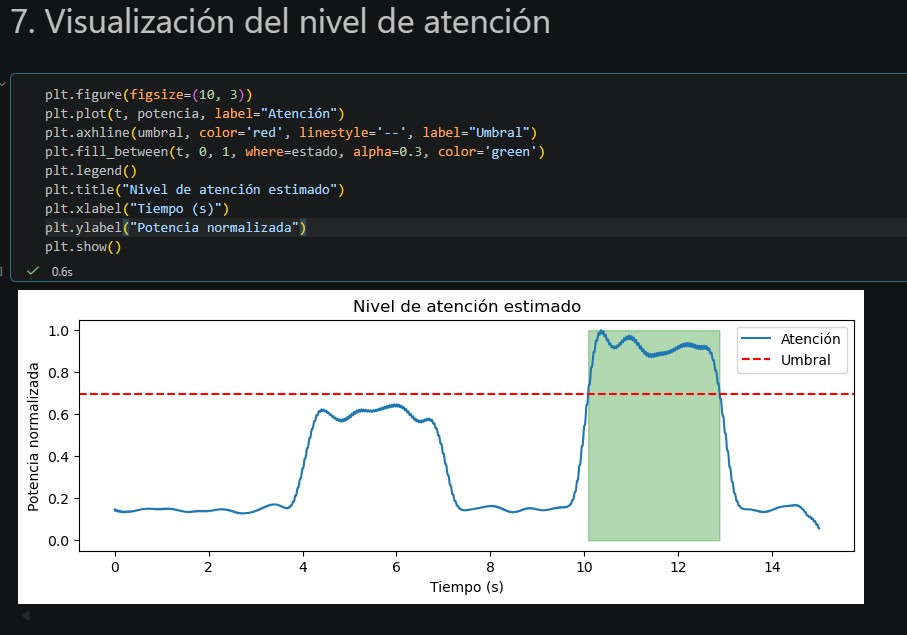
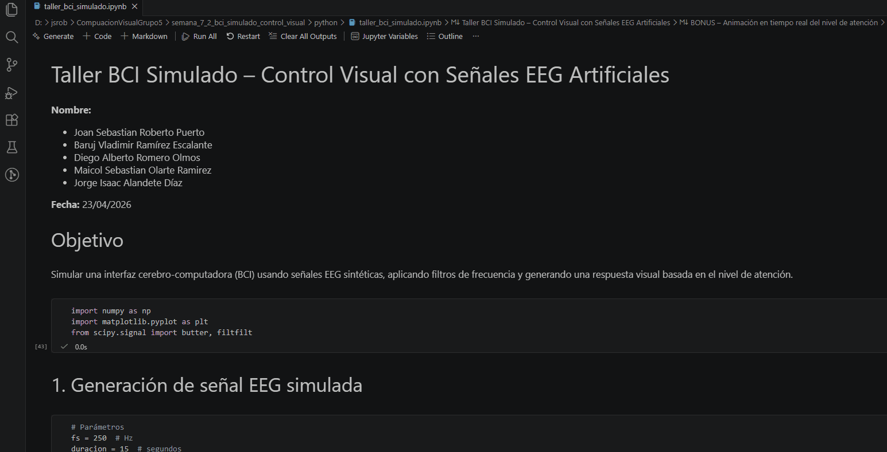
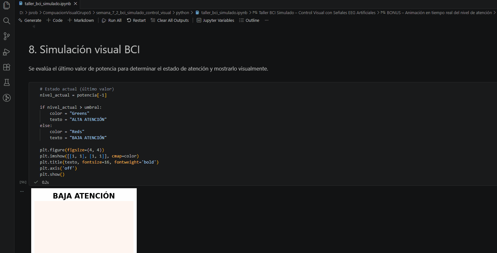

# Taller BCI Simulado – Control Visual con Señales EEG Artificiales

**Integrantes:**  
- Joan Sebastian Roberto Puerto  
- Baruj Vladimir Ramírez Escalante  
- Diego Alberto Romero Olmos  
- Maicol Sebastian Olarte Ramirez  
- Jorge Isaac Alandete Díaz  

**Fecha de entrega:** 23 de abril de 2026  

---

## Descripción breve

Este taller simula el comportamiento de una interfaz cerebro-computadora (BCI) utilizando señales EEG artificiales generadas en Python. Se aplican filtros digitales para aislar la banda de frecuencia **Alpha (8–12 Hz)** asociada con estados de relajación/atención. A partir de la potencia de esta banda se calcula un índice de “atención” y se define un umbral dinámico para activar una respuesta visual: un cuadrado que cambia de color (verde = alta atención, rojo = baja atención). Además, se incluye una animación que muestra la evolución del nivel de atención en el tiempo.

---

## Implementaciones

El desarrollo se realizó íntegramente en **Python** usando Jupyter Notebook. Las librerías empleadas fueron:

- `numpy` – generación de señales y operaciones matemáticas.
- `matplotlib` – visualización de señales y creación de la animación.
- `scipy.signal` – diseño e implementación de filtros Butterworth (filtfilt).

### Pasos principales del código:

1. **Generación de señal EEG simulada**  
   - Señal base Alpha (10 Hz) y Beta (20 Hz) con amplitudes 0.5 y 0.3 respectivamente.
   - Ruido blanco gaussiano (σ=0.2).
   - Aumento artificial de la amplitud Alpha en los intervalos 4‑7 s (x2) y 10‑13 s (x2.5) para simular cambios en la atención.

2. **Filtrado pasa banda**  
   - Diseño de un filtro Butterworth de orden 4 con frecuencia de muestreo 250 Hz.
   - Aplicación del filtro para extraer la banda Alpha (8‑12 Hz).

3. **Cálculo del nivel de atención**  
   - Potencia instantánea mediante energía cuadrática media en ventanas deslizantes de 0.5 segundos.
   - Normalización de la potencia en el rango [0,1].

4. **Umbral y condición BCI**  
   - Umbral adaptativo = media + desviación estándar de la potencia.
   - Estado binario (atención alta/baja) según si la supera.

5. **Respuesta visual**  
   - Cuadro de color verde (alta atención) o rojo (baja atención) mostrado al final del procesamiento.
   - Animación complementaria que grafica la evolución de la potencia en el tiempo.

---

## Resultados visuales

Todas las imágenes y GIFs se encuentran en la carpeta [`media/`](media/). A continuación se muestran los principales resultados:

### 1. Señal filtrada (banda Alpha)
  
*Señal EEG tras aplicar el filtro pasa banda 8‑12 Hz. Se observa la limpieza de frecuencias no deseadas.*

### 2. Nivel de atención y umbral
  
*Gráfica de la potencia normalizada (atención), línea discontinua roja (umbral) y área sombreada en verde cuando se supera el umbral.*

### 3. Simulación visual (respuesta BCI final)
  
*Cuadro que cambia a verde cuando la atención es alta (último instante de la simulación). Este GIF también muestra la generación del cuadrado estático de colores.*

### 4. Animación de la evolución de la atención (Bonus)
  
*Animación que dibuja la potencia a lo largo del tiempo, demostrando cómo el nivel de atención supera el umbral en los intervalos programados.*

---

## Código relevante

El código completo se encuentra en el archivo [`python/taller_bci_simulado.ipynb`](python/taller_bci_simulado.ipynb). A continuación se incluyen los fragmentos más importantes:

### Filtro pasa banda
```python
def filtro_pasabanda(signal, low, high, fs, order=4):
    nyq = 0.5 * fs
    low = low / nyq
    high = high / nyq
    b, a = butter(order, [low, high], btype='band')
    return filtfilt(b, a, signal)
```

### Cálculo de potencia en ventanas
```python
ventana = int(0.5 * fs)
potencia = np.zeros_like(alpha_filtrada)
for i in range(len(alpha_filtrada)):
    inicio = max(0, i - ventana//2)
    fin = min(len(alpha_filtrada), i + ventana//2)
    potencia[i] = np.mean(alpha_filtrada[inicio:fin]**2)
potencia /= np.max(potencia)
```

### Condición BCI y respuesta visual
```python
umbral = np.mean(potencia) + np.std(potencia)
nivel_actual = potencia[-1]
color = "green" if nivel_actual > umbral else "red"
texto = "ALTA ATENCIÓN" if nivel_actual > umbral else "BAJA ATENCIÓN"
plt.imshow([[1,1],[1,1]], cmap=color)
plt.title(texto)
```

---

## Prompts utilizados (IA generativa)

Durante el desarrollo se emplearon los siguientes prompts con ChatGPT y Gemini:

1. *“Explícame paso a paso cómo diseñar un filtro pasa banda en Python con scipy.signal para señales EEG.”*
2. *“Genera código para calcular la potencia RMS de una señal en ventanas deslizantes y normalizarla entre 0 y 1.”*
3. *“Crea una animación con matplotlib que muestre la evolución de una señal en el tiempo.”*

Además se consultó la documentación oficial de `scipy.signal` y `matplotlib.animation`.

---

## Aprendizajes y dificultades

### Aprendizajes
- Comprensión práctica del filtrado digital de señales y su aplicación en entornos BCI simulados.
- Relación entre bandas de frecuencia EEG (Alpha) y estados cognitivos (atención/relajación).
- Implementación de un umbral dinámico basado en estadísticas de la propia señal, más robusto que un valor fijo.
- Uso de animaciones en matplotlib para representar fenómenos temporales.

### Dificultades encontradas
- Al principio se calculaba la potencia sobre toda la señal, perdiendo la variabilidad temporal. Se solucionó usando ventanas deslizantes.
- La elección del tamaño de ventana (0.5 s) fue crítica para equilibrar suavizado y respuesta rápida.
- La exportación del GIF de la animación falló por falta de la carpeta `media/` y permisos; finalmente se capturó manualmente la pantalla para generar los GIFs mostrados.

### Mejoras futuras
- Utilizar una base de datos real de EEG (p.ej., EEG Eye State) en lugar de señal sintética.
- Incorporar aprendizaje automático para clasificar la intención en lugar de un umbral simple.
- Conectar la salida a una interfaz en Unity o Three.js para retroalimentación visual más inmersiva.

---

## Checklist de entrega

- [x] Carpeta con formato `semana_7_2_bci_simulado_control_visual`
- [x] `README.md` explicando cada actividad
- [x] Carpeta `media/` con imágenes, GIFs (4 archivos)
- [x] `.gitignore` configurado (se excluyeron carpetas temporales de Python)
- [x] Commits descriptivos en inglés (ej.: *Add EEG simulation and bandpass filter*, *Add attention level visualization and BCI condition*)
- [x] Repositorio público verificado
---