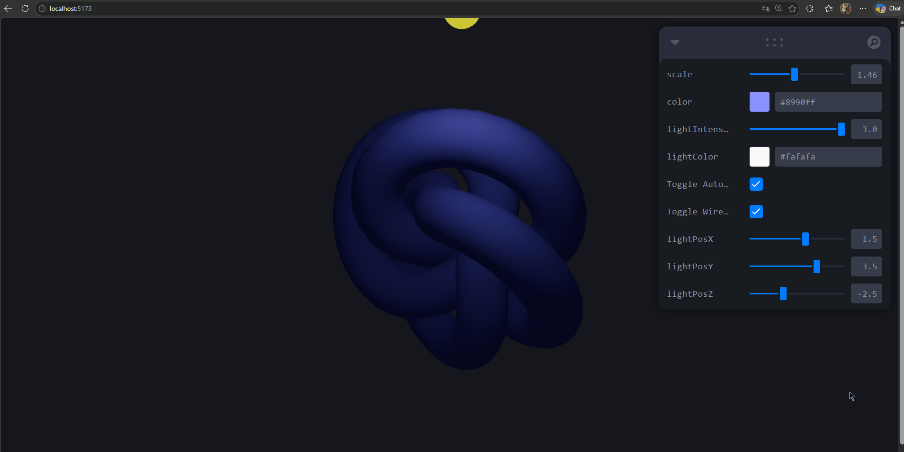
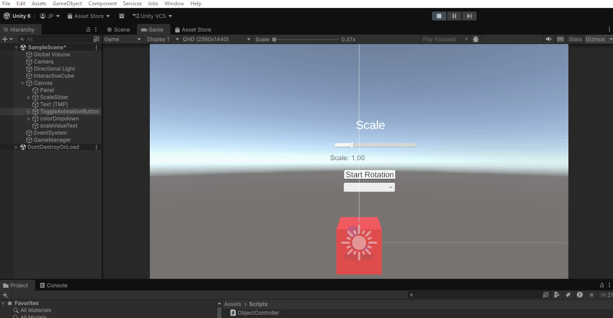
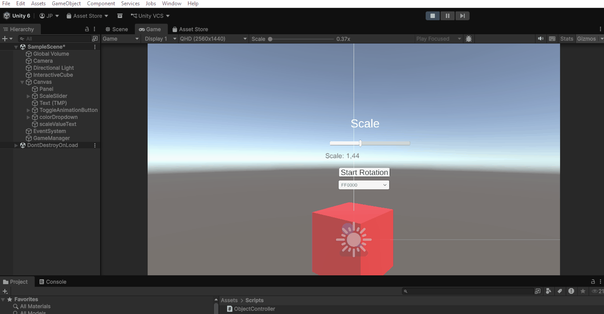

# Taller Dashboards Visuales 3D: Sliders y Botones para Controlar Escenas

**Integrantes:**  
- Joan Sebastian Roberto Puerto  
- Baruj Vladimir Ramírez Escalante  
- Diego Alberto Romero Olmos  
- Maicol Sebastian Olarte Ramirez  
- Jorge Isaac Alandete Díaz  

**Fecha de entrega:** 23 de abril de 2026  

---

## Descripción breve

Este taller implementa un **dashboard visual 3D interactivo** en dos entornos: **React Three Fiber** (web) y **Unity** (motor de juegos). En ambos casos se crean escenas con objetos 3D que pueden modificarse en tiempo real mediante controles deslizantes (sliders), selectores de color y botones. Además, se incluyen bonuses como control avanzado de iluminación (posición, intensidad, color) en Three.js, y un texto informativo en Unity.

---

## Implementaciones realizadas

### Three.js (React Three Fiber + Leva)

#### 1. Objeto 3D y controles básicos
- **Objeto:** TorusKnot (geometría compleja con nudos).
- **Controles Leva:**
  - `scale` (slider): modifica la escala del objeto (0.1 – 3).
  - `color` (selector de color): cambia el color del material.
  - `Toggle Auto-rotate` (botón): activa/desactiva la rotación automática.
  - `Toggle Wireframe` (botón): alterna entre modo sólido y modo alambre.

#### 2. Control de luz (Bonus)
- **Luz ambiente** muy baja (`intensity = 0.1`) para que la luz puntual sea protagonista.
- **Luz puntual** con controles:
  - `lightIntensity` (slider): 0 – 3.
  - `lightColor` (selector de color).
  - `lightPosX`, `lightPosY`, `lightPosZ` (sliders): posición de la luz en el espacio (-8 a 8).
- **Esfera amarilla** que indica la posición exacta de la luz, facilitando la visualización de los cambios.

#### 3. Interacción adicional
- **OrbitControls** permite mover la cámara (zoom, rotación, paneo).
- La escena responde en tiempo real a todos los ajustes.

---

### Unity (versión LTS – Canvas UI)

#### 1. Escena y objetos
- **Objeto 3D:** Cubo (`Cube`) con un material personalizable.
- **Luz direccional** para iluminación básica.
- **Cámara** posicionada para una vista frontal del cubo.

#### 2. Controles UI (Canvas)
- **Slider** – Controla la **escala uniforme** del cubo (rango 0.5 a 3).
- **Dropdown** – Selector de **color** del material (opciones: rojo, verde, azul, amarillo, cian).
- **Button** – Activa/desactiva una **rotación automática** del cubo sobre el eje Y.
- **Text (bonus)** – Muestra en tiempo real el valor actual de la escala (`Scale: X.XX`).

#### 3. Script en C# (`ObjectController`)
El script conecta todos los elementos UI con el cubo:
- Escucha los eventos `onValueChanged` del Slider y del Dropdown.
- Aplica la nueva escala y color al material del cubo.
- Controla la rotación en `Update()` según el estado del botón.
- Actualiza el texto del bonus.

#### 4. Flujo de uso
- Al mover el slider → el cubo cambia de tamaño y el texto se actualiza.
- Al seleccionar una opción del dropdown → el cubo cambia de color.
- Al pulsar el botón → el cubo comienza a rotar (el botón cambia a "Stop Rotation"); al pulsar de nuevo, se detiene.

---

## Resultados visuales

Todos los archivos multimedia se encuentran en la carpeta `media/`.

### Three.js – Demostraciones

#### Control de color del objeto, auto‑rotación y modo wireframe


*Se observa el cambio de color del toro, la activación/desactivación de la rotación automática y la alternancia al modo wireframe.*

#### Control de posición de la luz (X, Y, Z)


*La fuente de luz se mueve en los tres ejes. La esfera amarilla marca su ubicación, y se aprecia cómo la iluminación del toro cambia drásticamente.*

#### Control de escala, color del objeto e intensidad de la luz


*El slider de escala agranda/reduce el toro, el selector de color modifica el material, y el slider de intensidad de luz aumenta o disminuye el brillo general.*

---

### Unity – Demostraciones

#### Slider de escala y texto informativo (bonus)


*Al mover el slider, el cubo cambia su tamaño de forma uniforme y el texto "Scale: X.XX" se actualiza en tiempo real.*

#### Dropdown para selección de color


*Al elegir un color del desplegable (rojo, verde, azul, amarillo, cian), el material del cubo cambia instantáneamente.*

#### Botón para iniciar/detener rotación automática


*Al presionar "Start Rotation", el cubo comienza a girar sobre su eje Y; el botón cambia a "Stop Rotation" y al presionarlo de nuevo se detiene.*

---

## Código relevante

### Three.js – Fragmento central (App.jsx)

```jsx
// Controles de luz (posición, intensidad, color)
const { lightIntensity, lightColor, lightPosX, lightPosY, lightPosZ } = useControls({
  lightIntensity: { value: 1.5, min: 0, max: 3, step: 0.1 },
  lightColor: '#ffffff',
  lightPosX: { value: 5, min: -8, max: 8, step: 0.5 },
  lightPosY: { value: 5, min: -8, max: 8, step: 0.5 },
  lightPosZ: { value: 5, min: -8, max: 8, step: 0.5 },
});

<pointLight
  position={[lightPosX, lightPosY, lightPosZ]}
  intensity={lightIntensity}
  color={lightColor}
/>

<mesh position={[lightPosX, lightPosY, lightPosZ]}>
  <sphereGeometry args={[0.2, 16, 16]} />
  <meshStandardMaterial color="yellow" emissive="yellow" emissiveIntensity={0.5} />
</mesh>
```

Para ejecutar el proyecto Three.js:
```bash
cd threejs
npm install
npm run dev
```

### Unity – Script C# completo (`ObjectController.cs`)

```csharp
using UnityEngine;
using UnityEngine.UI;

public class ObjectController : MonoBehaviour
{
    public Slider scaleSlider;
    public Dropdown colorDropdown;
    public Button actionButton;
    public Text scaleValueText;   // Bonus
    public GameObject targetObject;

    private Material targetMaterial;
    private bool isRotating = false;

    private Color[] colors = {
        Color.red, Color.green, Color.blue, Color.yellow, Color.cyan
    };

    void Start()
    {
        targetMaterial = targetObject.GetComponent<Renderer>().material;

        scaleSlider.value = targetObject.transform.localScale.x;
        scaleSlider.onValueChanged.AddListener(OnScaleChanged);

        colorDropdown.ClearOptions();
        foreach (Color col in colors)
            colorDropdown.options.Add(new Dropdown.OptionData(ColorUtility.ToHtmlStringRGB(col)));
        targetMaterial.color = colors[0];
        colorDropdown.value = 0;
        colorDropdown.onValueChanged.AddListener(OnColorChanged);

        actionButton.onClick.AddListener(ToggleRotation);
        UpdateScaleText(scaleSlider.value);
    }

    void OnScaleChanged(float newScale)
    {
        targetObject.transform.localScale = new Vector3(newScale, newScale, newScale);
        UpdateScaleText(newScale);
    }

    void OnColorChanged(int index)
    {
        if (index >= 0 && index < colors.Length)
            targetMaterial.color = colors[index];
    }

    void ToggleRotation()
    {
        isRotating = !isRotating;
        actionButton.GetComponentInChildren<Text>().text = isRotating ? "Stop Rotation" : "Start Rotation";
    }

    void Update()
    {
        if (isRotating)
            targetObject.transform.Rotate(Vector3.up, 90 * Time.deltaTime);
    }

    void UpdateScaleText(float value)
    {
        if (scaleValueText != null)
            scaleValueText.text = "Scale: " + value.ToString("F2");
    }
}
```

El script se asigna a un GameObject (por ejemplo, el Canvas) y se enlazan las referencias en el Inspector de Unity.

---

## Prompts utilizados

Se utilizó la IA **ChatGPT** con los siguientes prompts:

1. *"Cómo hacer una escena en React Three Fiber con un TorusKnot."*
2. *"Cómo controlar la luz puntual (intensidad, color y posición). Incluye una esfera que marque la ubicación de la luz."*
3. *"Cómo funciona la interacción de Slider con un C#."*

---

## Aprendizajes y dificultades

### Three.js
**Aprendizajes:**
- Integración fluida de React Three Fiber con Leva para dashboards 3D.
- Comprender cómo la posición de una luz puntual afecta sombras y brillos.
- Uso de una esfera auxiliar como “marcador visual” de la luz.

**Dificultades:**
- Al principio el control de luz no se notaba porque la luz ambiente tenía intensidad alta (0.5). Se redujo a 0.1.
- Coordinar la rotación automática con `useFrame` sin afectar el rendimiento.
- Capturar GIFs claros (se usó ScreenToGif a 15 FPS).

### Unity
**Aprendizajes:**
- Manejo del sistema de UI Canvas y eventos (`onValueChanged`, `onClick`).
- Modificación de materiales y transformaciones desde código.
- Uso de un `Dropdown` para selección de colores y cambio en tiempo real.
- Implementación de un bonus funcional (texto dinámico).

**Dificultades:**
- Asegurar que el material del cubo no se volviera una instancia no editable (se accede al material compartido o se crea una instancia; en el código se usa el material directamente, lo que funciona si el objeto tiene un material asignado).
- Sincronizar el texto del botón al alternar la rotación.
- Configurar correctamente el `EventSystem` para que los clics funcionaran.

---

## Checklist de cumplimiento

- [x] Carpeta con formato `semana_7_3_dashboards_visuales_3d_sliders_botones`
- [x] `README.md` explicando cada actividad (Three.js y Unity)
- [x] Carpeta `media/` con 6 GIFs (3 para Three.js, 3 para Unity) y referencias en el README
- [x] `.gitignore` configurado para Node.js/Three.js y para Unity (ignora `Library/`, `Temp/`, etc.)
- [x] Commits descriptivos en inglés
- [x] Repositorio público verificado
