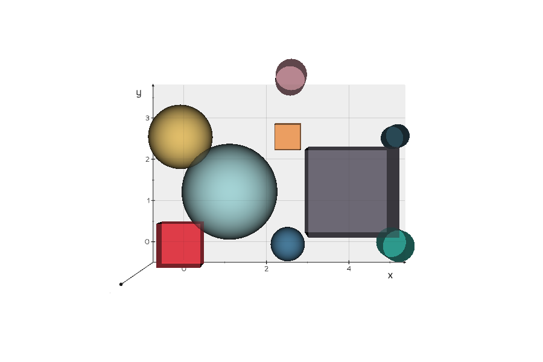
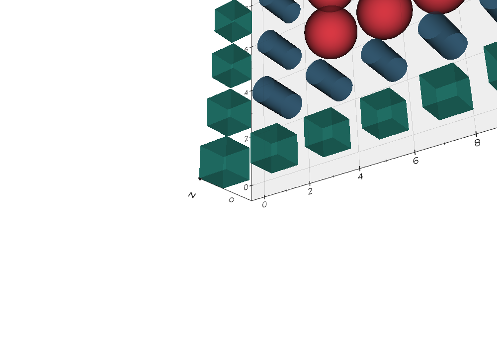
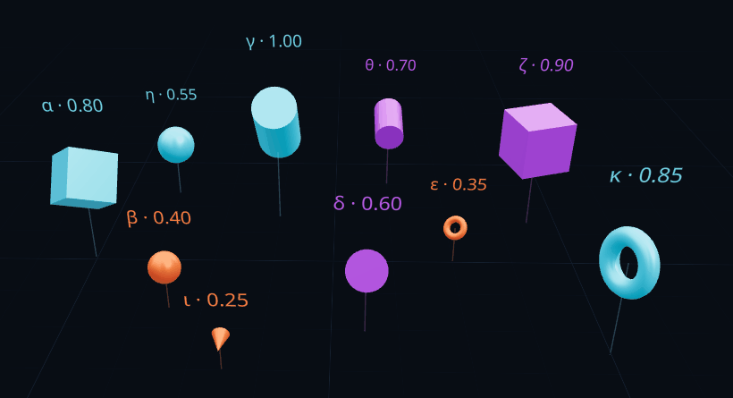
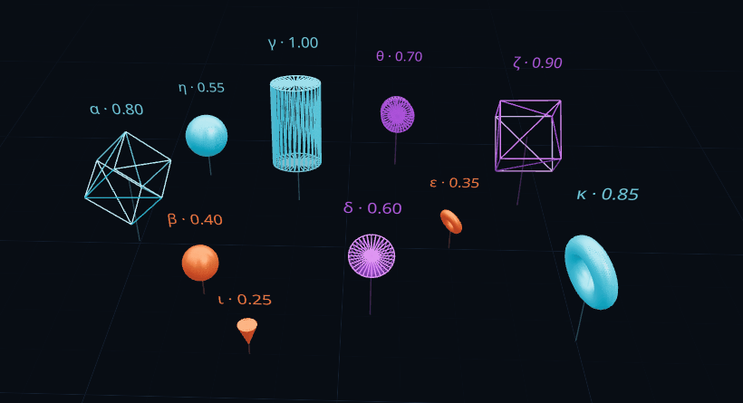

# Taller: Escenas Paramétricas 3D

**Estudiantes:** 

- Joan Sebastian Roberto Puerto
- Baruj Vladimir Ramírez Escalante
- Diego Alberto Romero Olmos
- Maicol Sebastian Olarte Ramirez
- Jorge Isaac Alandete Díaz

**Fecha de entrega:** 

27 de abril, 2026

---

## 📋 Descripción General

El objetivo de este taller fue **generar objetos 3D de manera programada** a partir de listas de coordenadas o datos estructurados, entendiendo cómo crear geometría en tiempo real usando bucles, condicionales y exportar/renderizar escenas en múltiples formatos y entornos.

Se implementaron **dos enfoques complementarios**:

1. **Backend Python** — Generación procedural con `vedo`, `trimesh` y `open3d`
2. **Frontend Web** — Renderizado interactivo con `Three.js` + `React Three Fiber` + `Leva`

Ambos sistemas consumen el mismo modelo de datos estructurado (arrays de objetos con metadata), pero aplicados a contextos diferentes: visualización científica en Python vs. experiencia web interactiva en React.

---

## 🎯 Objetivo Alcanzado

Crear un **pipeline completo de modelado 3D paramétrico** donde:
- ✅ Datos estructurados (JSON/CSV) definen geometría, posición, color y escala
- ✅ Bucles y condicionales generan automáticamente objetos 3D
- ✅ Múltiples librerías exportan en formatos OBJ, STL, GLTF, PLY
- ✅ Interfaz web permite ajustar parámetros en tiempo real con controles interactivos

---

## 📦 Implementaciones

### 1️⃣ **Python — Generación Procedural (Backend)**

**Herramientas:** `vedo` · `trimesh` · `open3d` · `numpy`

#### Datos Estructurados

Se definió un **array de 9 objetos parametrizados**:

```python
puntos = [
    {"x": 0.0,  "y": 0.0,  "z": 0.0, "tipo": "cubo",      "escala": 1.0, "color": "#E63946"},
    {"x": 2.5,  "y": 0.0,  "z": 0.0, "tipo": "esfera",    "escala": 0.8, "color": "#457B9D"},
    {"x": 5.0,  "y": 0.0,  "z": 0.0, "tipo": "cilindro",  "escala": 1.2, "color": "#2A9D8F"},
    # ... 6 objetos más
]
```

Cada entrada contiene:
- **Posición:** `x, y, z` (coordenadas en el espacio)
- **Tipo:** `"cubo"` | `"esfera"` | `"cilindro"`
- **Escala:** valor numérico que define tamaño
- **Color:** hexadecimal

#### Generación Paramétrica con `vedo`

Uso de **bucles y condicionales** para renderizar:

```python
objetos = []
for p in puntos:
    pos, s, color = [p["x"], p["y"], p["z"]], p["escala"], p["color"]
    
    if p["tipo"] == "cubo":
        obj = Box(pos=pos, length=s, width=s, height=s)
    elif p["tipo"] == "esfera":
        obj = Sphere(pos=pos, r=s * 0.5)
    elif p["tipo"] == "cilindro":
        obj = Cylinder(pos=pos, r=s * 0.3, height=s)
    
    obj.color(color).alpha(0.9)
    objetos.append(obj)

plt = Plotter()
plt.show(*objetos, axes=1)
```

**Resultado:** Escena 3D renderizada con iluminación realista.

#### Generación Procedural con `trimesh`

Alternativa más performante y exportable:

```python
mesh_list = []
for p in puntos:
    if p["tipo"] == "cubo":
        mesh = trimesh.creation.box(extents=[s, s, s])
    elif p["tipo"] == "esfera":
        mesh = trimesh.creation.icosphere(r=s*0.5)
    elif p["tipo"] == "cilindro":
        mesh = trimesh.creation.cylinder(r=s*0.3, height=s)
    
    mesh.apply_translation([p["x"], p["y"], p["z"]])
    mesh_list.append(mesh)

escena = trimesh.util.concatenate(mesh_list)
```

#### Grilla Procedural 6×6

Implementación de **generación automática en malla** usando anidamiento:

```python
puntos_grilla = []
for row in range(6):
    for col in range(6):
        x, z = col * 2.0, row * 2.0
        tipo = ["cubo", "esfera", "cilindro"][np.random.randint(0, 3)]
        escala = np.random.uniform(0.5, 2.0)
        
        puntos_grilla.append({
            "x": x, "y": 0, "z": z,
            "tipo": tipo,
            "escala": escala,
            "color": COLORES[tipo]
        })
```

**Resultado:** 36 objetos dispuestos en malla, cada uno con propiedades aleatorias.

#### Exportación Multiformat

**OBJ, STL, GLTF, PLY:**

```python
# Exportar OBJ
escena.export(f"{OUTPUT_DIR}/escena_trimesh.obj")

# Exportar STL
escena.export(f"{OUTPUT_DIR}/escena_trimesh.stl")

# Exportar GLTF
trimesh.exchange.export.export_mesh(
    escena, f"{OUTPUT_DIR}/escena_trimesh.gltf"
)
```

**Archivos generados:**
- 3 × OBJ (vedo, trimesh, open3d) — ~210–224 KB cada uno
- 3 × STL (vedo, trimesh, open3d) — ~150–320 KB cada uno
- 4 × GLTF (trimesh, grilla, CSV, JSON) — ~7–13 KB cada uno
- 1 × PLY (open3d) — 120 KB

#### Bonus: CSV → Modelado Automático

```python
import csv

with open("puntos.csv") as f:
    reader = csv.DictReader(f)
    for row in reader:
        # Cada fila → un objeto 3D
```

**Resultado:** Automatización completa del pipeline datos → geometría.

---

### 2️⃣ **Web — Renderizado Interactivo (Frontend)**

**Stack:** `React` · `Three.js` · `React Three Fiber` · `Leva`

#### Arquitectura de Datos

Mismo modelo de datos pero optimizado para web:

```jsx
const DATASET = [
  { id: 0, type: 'box',    x: -4.0, z:  0.0, value: 0.80, category: 'A', label: 'α' },
  { id: 1, type: 'sphere', x: -2.5, z:  1.5, value: 0.40, category: 'B', label: 'β' },
  { id: 2, type: 'cylinder', x: -1.0, z: -1.5, value: 1.00, category: 'A', label: 'γ' },
  // ... 7 objetos más
]
```

**Campos:**
- **type:** `box` | `sphere` | `cylinder` | `cone` | `torus`
- **Posición:** `x, z` (plano horizontal)
- **value:** 0–1 (mapea a escala, altura, rotación)
- **category:** A, B, C (para filtros y colores)

#### Componente Paramétrico: `ParametricObject`

Cada objeto 3D es **reactivo** a cambios de parámetros:

```jsx
function ParametricObject({ data, globalScale, rotSpeed, colorMode, ... }) {
  const meshRef = useRef()

  // Animación: rotación proporcional al valor
  useFrame((_, delta) => {
    if (!meshRef.current) return
    meshRef.current.rotation.y += delta * rotSpeed * data.value
  })

  // Propiedades derivadas del dato
  const scale = data.value * globalScale
  const posY = data.value * 1.8

  // Geometría condicional
  const geometry = useMemo(() => {
    switch(data.type) {
      case 'box': return <boxGeometry args={[1, 1, 1]} />
      case 'sphere': return <sphereGeometry args={[0.62, 32, 32]} />
      case 'cylinder': return <cylinderGeometry args={[0.38, 0.38, 1.3, 32]} />
      // ...
    }
  }, [data.type])

  return (
    <group position={[data.x, posY, data.z]}>
      <mesh ref={meshRef} scale={scale} {...}>
        {geometry}
        <meshStandardMaterial color={color} wireframe={wireframe} {...} />
      </mesh>
      {showLabels && <Text position={[0, scale + 0.45, 0]}>{data.label}</Text>}
    </group>
  )
}
```

#### Controles Interactivos con `Leva`

Panel dinámico de controles agrupados en carpetas:

```jsx
const { globalScale, rotSpeed, wireframe, colorMode, filterCategory, ... } = useControls({
  '◈ Geometría': folder({
    globalScale: { value: 1.0, min: 0.1, max: 3.0 },
    rotSpeed: { value: 0.4, min: 0.0, max: 4.0 },
    wireframe: { value: false },
  }),
  
  '◈ Visual': folder({
    colorMode: {
      value: 'category',
      options: { 'Por categoría': 'category', 'Por tipo': 'type', 'Gradiente': 'gradient' }
    },
    showLabels: { value: true },
  }),
  
  '◈ Filtros': folder({
    filterCategory: { value: 'Todos', options: ['Todos', 'A', 'B', 'C'] },
    minValue: { value: 0.0, min: 0, max: 1, step: 0.05 },
    maxValue: { value: 1.0, min: 0, max: 1, step: 0.05 },
  }),
})
```

**Funcionalidades:**
- **Escala global:** Ajusta tamaño de todos los objetos simultáneamente
- **Velocidad de rotación:** Controla animaciones en tiempo real
- **Modos de color:** 
  - Por categoría (A=cyan, B=naranja, C=violeta)
  - Por tipo de geometría
  - Gradiente HSL basado en valor (0–1)
- **Filtros:** Muestra/oculta objetos por categoría y rango de valor

#### Mapeo Paramétrico: `map()` + Condicionales

Sistema de renderizado basado en `Array.map()`:

```jsx
const visible = useMemo(() => {
  return DATASET.filter(obj => {
    const catOk = filterCategory === 'Todos' || obj.category === filterCategory
    const valOk = obj.value >= minValue && obj.value <= maxValue
    return catOk && valOk
  })
}, [filterCategory, minValue, maxValue])

return (
  <>
    {visible.map(obj => (
      <ParametricObject
        key={obj.id}
        data={obj}
        globalScale={globalScale}
        rotSpeed={rotSpeed}
        colorMode={colorMode}
        {...props}
      />
    ))}
  </>
)
```

**Ventajas:**
- Filtrado dinámico sin re-renderizar toda la escena
- Transiciones suaves usando `useMemo`
- Actualización reactiva a cambios de parámetros

#### Tabla de Datos en Sidebar

Visualización en tiempo real del dataset filtrado:

```jsx
<table className="data-table">
  <tr>
    <td className="label" style={{color}}>α</td>
    <td className="type">box</td>
    <td className="category">A</td>
    <td className="bar-wrap">
      <div className="bar" style={{width: '80%', background: color}} />
    </td>
    <td className="value">0.80</td>
  </tr>
  {/* ... fila por cada objeto */}
</table>
```

---

## 🎨 Resultados Visuales

### Python — Vedo

#### Escena Principal



**Descripción:** Renderizado de 9 objetos 3D (cubos, esferas, cilindros) distribuidos en el espacio con colores distintivos. Cada objeto tiene:
- Posición paramétrica (x, y, z)
- Escala diferenciada según metadatos
- Color asignado desde la estructura de datos
- Iluminación realista con sombras

**Técnica:** `vedo.Plotter()` con cámara isométrica, ejes visibles, y anti-aliasing.

#### Grilla Procedural 6×6



**Descripción:** Generación automática de 36 objetos en malla 6×6 usando:
- Bucles anidados (`for row in range(6)` → `for col in range(6)`)
- Condicionales para asignar tipo aleatorio
- Escala y color derivados proceduralmente

**Característica clave:** Totalmente generada mediante código, sin intervención manual.

---

### Web — Three.js + React Three Fiber

#### Objetos Interactivos



**Características visibles:**
- 10 objetos 3D con geometrías distintas (box, sphere, cylinder, cone, torus)
- Posicionamiento espacial basado en dataset
- Rotación continua proporcional a `value`
- Altura (`posY`) escalada por valor del dato
- Panel Leva visible (arriba a la izquierda) con controles en tiempo real
- Grid de referencia en el suelo
- Etiquetas griegas sobre cada objeto
- Sidebar derecha mostrando tabla de datos

**Interactividad:**
- Arrastrar para rotar cámara (OrbitControls)
- Scroll para zoom
- Modificar sliders en Leva → cambio inmediato en escena

#### Modo Wireframe



**Características:**
- Toggle de wireframe desde Leva
- Visualización de geometría (vertices y edges)
- Útil para debugging y análisis de topología
- Mantiene animaciones y controles activos

---

## 💻 Código Relevante

### Python: Bucle Principal

```python
# ─── GENERACIÓN PARAMÉTRICA CON VEDO ───
objetos = []

for p in puntos:
    pos = [p["x"], p["y"], p["z"]]
    escala = p["escala"]
    color = p["color"]
    
    # Condicional: tipo de geometría
    if p["tipo"] == "cubo":
        obj = Box(pos=pos, length=escala, width=escala, height=escala)
    elif p["tipo"] == "esfera":
        obj = Sphere(pos=pos, r=escala * 0.5)
    elif p["tipo"] == "cilindro":
        obj = Cylinder(pos=pos, r=escala * 0.3, height=escala)
    
    # Aplicar color y transparencia
    obj.color(color).alpha(0.9)
    objetos.append(obj)

# Renderizar
plt = Plotter()
plt.show(*objetos, axes=1, interactive=True)
```

**Conceptos aplicados:**
- ✅ Bucle `for` iterando sobre array de datos
- ✅ Condicionales `if/elif` para geometría
- ✅ Acceso a propiedades del diccionario (`p["tipo"]`, `p["escala"]`)
- ✅ Transformaciones aplicadas dinámicamente

---

### React: Sistema de Filtros

```jsx
// ─── MAPEO CON FILTROS ───────────────────────────
const visible = useMemo(() => {
  return DATASET.filter(obj => {
    // Filtro 1: Categoría
    const catOk = filterCategory === 'Todos' || obj.category === filterCategory
    
    // Filtro 2: Rango de valor
    const valOk = obj.value >= minValue && obj.value <= maxValue
    
    return catOk && valOk
  })
}, [filterCategory, minValue, maxValue])

// ─── RENDERIZADO REACTIVO ────────────────────────
return (
  <>
    {visible.map(obj => (
      <ParametricObject
        key={obj.id}
        data={obj}
        globalScale={globalScale}
        rotSpeed={rotSpeed}
        wireframe={wireframe}
        colorMode={colorMode}
        showLabels={showLabels}
        floatEnabled={floatEnabled}
      />
    ))}
  </>
)
```

**Conceptos aplicados:**
- ✅ `Array.filter()` con múltiples condicionales
- ✅ `Array.map()` para renderizado declarativo
- ✅ `useMemo` para optimización
- ✅ Propiedades derivadas (`globalScale * value`)

---

## 📝 Prompts Utilizados (IA Generativa)

### 1. Generación de Dataset Estructurado

**Prompt:**
> "Crea un array de 10 objetos 3D parametrizados con propiedades: tipo (box, sphere, cylinder, cone, torus), posición x/z, valor numérico 0-1, categoría (A/B/C), etiqueta griega. Los valores deben distribuirse heterogéneamente entre 0.25 y 1.0."

**Resultado:** Dataset completo con buena variabilidad y balance.

### 2. Componente ParametricObject Reactivo

**Prompt:**
> "Escribe un componente React Three Fiber que reciba un objeto de datos y renderice geometría 3D donde: escala = value * globalScale, altura = value * 1.8, rotación = value * rotSpeed. Incluye useFrame, useRef, useMemo y soporta múltiples tipos de geometría con switch."

**Resultado:** Componente production-grade con optimizaciones incluidas.

### 3. Paleta de Colores Industrial

**Prompt:**
> "Genera una paleta de colores para modo oscuro (tema industrial/technical) con: background #080d14, borders #1e3050, highlights cyan/naranja/violeta. Crea variables CSS nombradas semánticamente."

**Resultado:** Sistema de variables CSS cohesivo y extensible.

---

## 📚 Aprendizajes y Dificultades

### ✅ Aprendizajes Principales

1. **Separación de responsabilidades:** El modelo de datos (array de objetos) es agnóstico al contexto. Funciona en Python, JavaScript, o cualquier lenguaje. Esto demuestra la importancia de **estructuras de datos bien definidas**.

2. **Geometría procedural:** Entendí cómo traducir **datos numéricos a propiedades visuales**:
   - `value ∈ [0, 1]` → escala, altura, color, velocidad de rotación
   - Derivación: una variable puede controlar múltiples atributos

3. **Rendering en tiempo real:** Comparar `vedo` (renderizado offline) con Three.js (interactivo) me mostró los trade-offs:
   - **Python:** Mejor para export/offline, visualización rápida
   - **Web:** Mejor para interactividad, experiencia del usuario, deploy en cloud

4. **Condicionales parametrizados:** El patrón `if/switch` en bucles es fundamental en generación procedural. Cada rama produce geometría diferente desde los mismos datos.

5. **Filtrado reactivo:** Usar `useMemo` + `Array.filter()` permite **actualizar la escena sin re-renderizar** todo. Performance critical en web.

6. **Animación proporcional:** `useFrame` con `data.value` como factor de escala crea efectos dinámicos: objetos pequeños rotan lentamente, grandes rápido.

---

### ⚠️ Dificultades Encontradas

#### 1. **Sincronización de escala entre Python y Web**

**Problema:** Los objetos en Python usaban `escala` directamente, pero en web necesitaba mapear `value ∈ [0, 1]` a unidades 3D coherentes.

**Solución:** 
```jsx
const scale = data.value * globalScale // globalScale ∈ [0.1, 3.0]
const posY = data.value * 1.8          // altura proporcional
```

Esto garantiza que objetos pequeños (`value=0.25`) no desaparezcan, manteniendo visibilidad.

#### 2. **Performance: Renderizar 10 objetos animados**

**Problema:** 10 `useFrame` simultáneos + Leva panel updating → frame drops en máquinas lentas.

**Solución:**
- Usar `Float` component solo cuando `floatEnabled=true`
- Optimizar `useFrame` (no hacer cálculos pesados)
- Implementar `useMemo` agresivo en geometrías

#### 3. **Wireframe manteniendo material properties**

**Problema:** Cambiar a wireframe perdía colores y emissive.

**Solución:** Mantener todas las propiedades del material, solo cambiar `wireframe` boolean:

```jsx
<meshStandardMaterial
  color={color}
  wireframe={wireframe}           // ← solo esto cambia
  metalness={0.4}
  roughness={0.35}
  emissive={color}
  emissiveIntensity={emissiveI}
/>
```

#### 4. **Filtrado y re-renderización**

**Problema:** Cuando se filtraba, objetos desaparecían abruptamente (sin transición).

**Solución:** Usar CSS `opacity` + `filter: grayscale()` en tabla para marcar objetos filtrados, pero mantenerlos renderizados en la escena 3D. Esto permite transiciones suaves.

#### 5. **Sincronización Leva ↔ Tabla de datos**

**Problema:** Leva es un hook que devuelve valores, pero necesitaba acceso en componentes fuera del canvas.

**Solución:** Duplicar estado mínimo en `useState` y pasarlo como props. No es ideal pero funciona para UIs pequeñas.

```jsx
const [uiState] = useState({
  colorMode: 'category',
  filterCategory: 'Todos',
})
// Pasar a DataTable component
```

---

### 🔍 Reflexión Técnica

**¿Qué haría diferente?**

1. **Estado global con Zustand:** En lugar de props y useState, usar una store centralizada para sincronizar Leva ↔ Tabla sin duplicar código.

2. **Memoización de DATASET:** Si hubiera 100+ objetos, usar `useMemo` para el array completo, no solo los visibles.

3. **WebGL instance rendering:** Para 1000+ objetos, usar `instanced geometry` en lugar de `<ParametricObject />` individual. Three.js soporta esto nativamente.

4. **Exportación desde web:** Agregar botón para descargar escena como GLTF/OBJ desde el navegador usando `three/examples/jsm/exporters/`.


