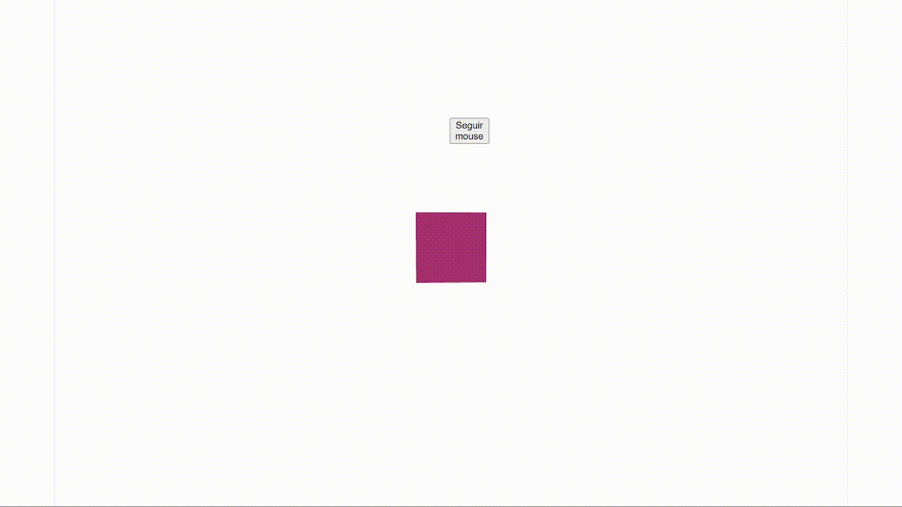
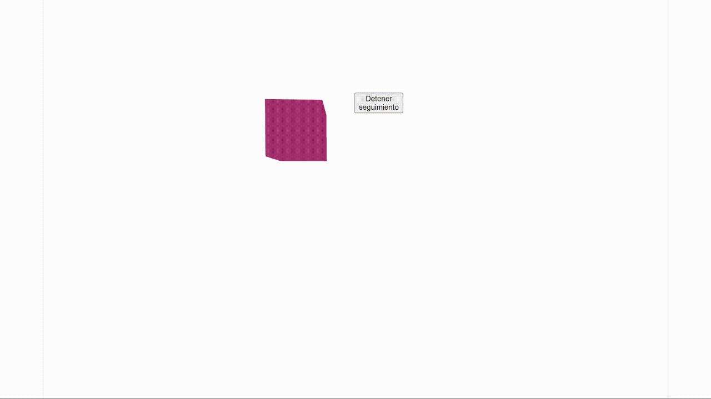

# Entrada del Usuario e Interfaz UI en Unity y Three.js

### Nombres:

- Joan Sebastian Roberto Puerto
- Baruj Vladimir Ramírez Escalante
- Diego Alberto Romero Olmos
- Maicol Sebastian Olarte Ramirez
- Jorge Isaac Alandete Díaz

### Fecha de entrega: 25/04/2026

### Descripción del tema:
Aprender a capturar y procesar entradas del usuario (mouse, teclado, touch) e implementar interfaces visuales (UI) que permitan interacción dinámica en Unity y Three.js con React. Este taller es clave para desarrollar aplicaciones interactivas, videojuegos o experiencias XR.

### Descripción de la implementación: 

#### Unity:

Para el desarrollo de sta actividad se siguio los siguiente pasos

- Se crea un plano y se importa un modelo 3D (que funcionara como personaje)

- Sobre el plano se crea un *NavMesh surface* y sobre el personaje un *Character Controller* con su respectiva Hitbox que choca con el palno impidiendo que lo traspace.

- Se agrega un modelo 3D de una *linterna de aceite* y se agrega un *Point Light* para la emision de luz.

- Se hace la captura la entrada *W A S D*¨del movimiento sobre el plano del Jugador mediante las instrucciones:

        float x = Input.GetAxis("Horizontal");
        float z = Input.GetAxis("Vertical");

    Haciendo el movimiento mediante trasformaciones en la posicion del Jugador 

- Para el movimiento del *Mouse* y por ende la camara se hace primero mediante la deteccion y extraccion de los cambios en las cordenadas *X* y *Y* del mouse mediante el codigo:

        Vector2 mouseDelta = Mouse.current.delta.ReadValue() * mouseSensitivity * Time.deltaTime;

        float mouseX = mouseDelta.x;
        float mouseY = mouseDelta.y

    Aplicando roteciones sobre la camara en base a los cambios de cordenadas.

- Se crea dos animaciones para la *linterna de aceite* una correspondiente al *encendido* y una correspodiente al *apagado*.

- Se crea un script que regula la *intensidad* de la luz estableciendo una intensidad baja correspondiente a un estado de *apagado* y una intensidad alta correspondiente a un estado de *encendido*, para despues agregar las animaciones correspondientes como transiciones de los estados.

- Al oprimir *Click derecho* la linterna cambia entre estado de *encendido* y *apagado*.

- Se crea un *Canvas* para la interfaz grafica

     - Sobre el *Canvas* se agrega una *Barra de vida* con una vida inicial de *100 unidades*, bajando una cantidad de *5 unidades* cada vez que se cambia el estado de la linterna.

     - Sobre el *Canvas* se agraga un texto que especifica el estado actual de la linterna entre *apagado* y *encendido*.

#### Threejs

En Threejs se contruyo un cubo asignadole como parametros su *posicion*, *active* y *color*.

El parametro *posicion* es el que determina la posicion del cubo en el espacio.

El parametro *active* es el que regula si el objeto cubo debe seguir la posicion del *Mouse* o debe ir a su posicion inicial.

El parametro *color* es el encargado de cambiar el color del cubo cuando se da click sobre el, cambiando entre rosado y naranja.

Si el parametro *active* es *true* el cubo sigue la posición del mouse mediante la linea

    setPosition([x, y, 0]);

Donde *X* y *Y* son las posiciones en cada eje del mouse.

Se el parametro *active* es *false* entonces el cubo va a su posicion inicial, y si se oprime la latra *R* en el teclado el obejto se dirije a las cordenadas *[0,0,0]*.

Hay un boton que es el que rigue al parametro *active* y al oprimir ese boton *active* cambia de estado de *True* a *False* o de *False* a *True*

### Resultados visuales: 

#### Unity

Se muestra el movimiento del personaje, donde se observa el movimiento sobre el plano (mediante la captura de las letras *W A S D*) y la rotacion de la camra guiada por el mouse.

Se muestra la interaccion con la *linterna de aceite*, donde cada vez que se oprime *click derecho* se muestra una *animación* de cambio de estado (entre baja intensidad de luz y alta intensidad de luz) y la *barra de vida* disminuye en 5 unidades.

Por ultimo se muestra un vista general de la implementación

#### Threejs:

Se muestra el movimiento del objeto cubo.

So muestar el cambio de color del cubo.

Se muetra la interaccion genereal del sistema.

### Código relevante

#### Unity

Funcion para el control de la rotación del mouse en Unity

        Vector2 mouseDelta = Mouse.current.delta.ReadValue() * mouseSensitivity * Time.deltaTime;

        float mouseX = mouseDelta.x;
        float mouseY = mouseDelta.y;

        xRotation -= mouseY;
        xRotation = Mathf.Clamp(xRotation, -90f, 90f);

        transform.localRotation = Quaternion.Euler(xRotation, 0f, 0f);
        playerBody.Rotate(Vector3.up * mouseX);

#### Threejs:

Función para el cambio de color

    const handleClick = () => {
        setColor(color === "orange" ? "hotpink" : "orange");
    };

### Aprendizajes y dificultades

...

...

...