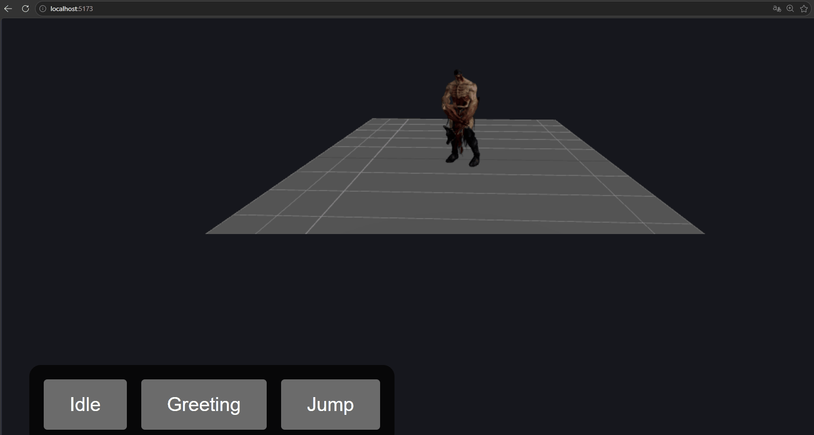
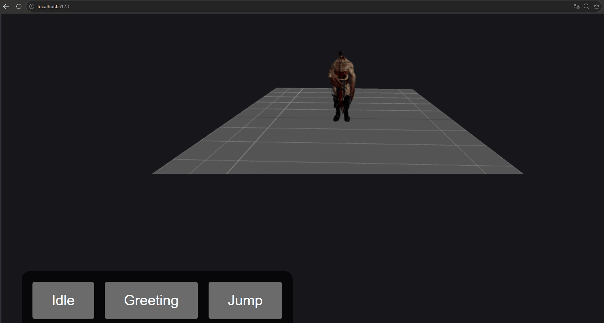
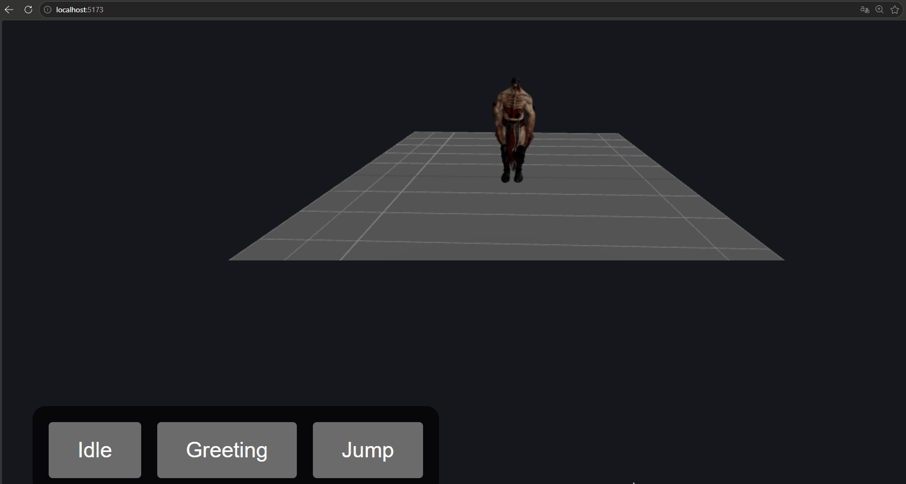

# Taller Motion Design Interactivo Eventos

**Integrantes:**  
- Joan Sebastian Roberto Puerto  
- Baruj Vladimir Ramírez Escalante  
- Diego Alberto Romero Olmos  
- Maicol Sebastian Olarte Ramirez  
- Jorge Isaac Alandete Díaz  

**Fecha de entrega:** 25 de abril de 2026  

---

## Descripción breve

Este proyecto implementa un personaje 3D interactivo utilizando **React Three Fiber** y **Three.js**. El modelo fue descargado desde Mixamo con múltiples animaciones (Idle, Greeting, Jump) cargadas por separado en formato FBX y vinculadas al esqueleto del modelo GLB. Se desarrollaron eventos de usuario que disparan transiciones suaves entre animaciones usando `.fadeIn()` y `.fadeOut()`, evitando cortes bruscos.

El objetivo es demostrar control de motion design en tiempo real mediante interacciones como clic, hover y teclado.

---

## Implementaciones (Three.js)

### 1. Carga y corrección del modelo
- Modelo GLB cargado con `useGLTF`.
- Rotación y posición ajustadas directamente sobre la escena (`scene.rotation.x = -PI/2`, `scene.position.y = -1.2`) para corregir la orientación inicial (personaje acostado) de forma permanente, eliminando saltos visuales.

### 2. Gestión de animaciones externas
- Animaciones descargadas desde Mixamo como FBX (Idle, Greeting, Jump).
- Cada archivo FBX se carga con `useFBX`. Debido a que todos los clips internos se llamaban "mixamo.com", se renombraron manualmente a "Idle", "Greeting" y "Jump" para poder referenciarlos de forma única.
- Se unificaron los clips en un solo array y se pasaron a `useAnimations` junto al modelo ya corregido.

### 3. Sistema de transiciones
- Función `playAnimation` que usando `fadeOut` sobre la animación actual y `fadeIn` sobre la nueva, con un tiempo de 0.2 segundos.
- Prevención de reinicio de la misma animación (evita que hacer doble clic sobre el mismo botón cause el "salto al suelo").
- Flag `isTransitioning` opcional para evitar múltiples disparos rápidos (implementado pero no estrictamente necesario tras la corrección final).

### 4. Eventos de usuario
- **Click sobre el modelo** → reproduce animación `Greeting`.
- **PointerOver (hover)** → vuelve a `Idle`.
- **Teclado**:
  - `G` → Greeting
  - `J` → Jump
  - `I` → Idle
- **Botones en pantalla** (React puro) que muestran dinámicamente los nombres reales de las animaciones y permiten dispararlas.

### 5. Entorno visual
- Cámara con `OrbitControls` para rotar/zoom.
- Luz ambiente + luz direccional.
- GridHelper y un plano semitransparente como suelo de referencia.

---

## Resultados visuales

#### Transición Idle → Greeting


*El personaje comienza en reposo (Idle) y al hacer clic sobre él o presionar la tecla `G`, realiza la animación de saludo (Greeting) con una transición suave mediante fade.*

#### Transición Greeting → Jump


*Desde el saludo, al presionar la tecla `J` o el botón en pantalla, el personaje ejecuta la animación de salto (Jump). Se aprecia la fluidez del cambio gracias a `.fadeOut()` y `.fadeIn()`.*

#### Transición Jump → Idle (mouse hover)


*Mientras el personaje está saltando, si se pasa el mouse sobre él o se presiona la tecla `I`, regresa a la animación Idle. El retorno también es gradual y no se interrumpe bruscamente, eliminando el efecto de “salto al suelo”.*

> **Nota:** Los GIFs capturan la fluidez de las transiciones y la respuesta inmediata a eventos de mouse y teclado.

---

## Código relevante

El código completo se encuentra en `threejs/src/App.jsx`. A continuación se muestran los fragmentos más importantes:

### Corrección de orientación del modelo
```jsx
useEffect(() => {
  if (scene) {
    scene.rotation.x = -Math.PI / 2;
    scene.position.y = -1.2;
  }
}, [scene]);
```

### Renombrado de clips de animación
```jsx
const allAnimations = useMemo(() => {
  const clips = [];
  if (idleFBX.animations?.[0]) {
    const clip = idleFBX.animations[0];
    clip.name = "Idle";
    clips.push(clip);
  }
  // ... similar para Greeting y Jump
  return clips;
}, [idleFBX, greetingFBX, jumpFBX]);
```

### Sistema de reproducción con prevención de reinicio
```jsx
const playAnimation = useCallback((animName, fadeTime = 0.2) => {
  if (!animName || !actions[animName]) return;
  if (currentAnimRef.current === animName) return; // evita reiniciar la misma animación
  if (currentAnimRef.current && actions[currentAnimRef.current]) {
    actions[currentAnimRef.current].fadeOut(fadeTime);
  }
  actions[animName].reset().fadeIn(fadeTime).play();
  currentAnimRef.current = animName;
}, [actions]);
```

### Eventos de usuario
```jsx
const handleClick = () => {
  if (actions["Greeting"]) playAnimation("Greeting");
};
const handlePointerOver = () => {
  if (actions["Idle"]) playAnimation("Idle");
};
// Teclado: switch basado en e.code
```

---

## Prompts utilizados (IA generativa)

Durante el desarrollo se utilizaron los siguientes prompts con asistentes de IA (ChatGPT, Gemini):

1. *"¿Cómo descargar un modelo de Mixamo con animaciones para Three.js cuando solo aparece formato FBX?"*  
2. *"Mi modelo GLB aparece acostado en React Three Fiber. ¿Cómo rotarlo permanentemente sin que las animaciones lo desconfiguren?"*  


Estas consultas ayudaron a resolver problemas específicos de carga, orientación y transiciones.

---

## Aprendizajes y dificultades

### Aprendizajes
- Uso avanzado de `useGLTF`, `useFBX` y `useAnimations` para combinar modelo y animaciones desde fuentes separadas.
- Importancia de normalizar los nombres de los clips de animación para un control predecible.
- Aplicación de transformaciones (rotación, posición) directamente sobre el objeto `scene` antes de vincular animaciones, en lugar de hacerlo en el JSX, para evitar parpadeos.
- Estrategias para prevenir reinicios no deseados de la misma animación (comparación del nombre actual).

### Dificultades superadas
1. **Modelo acostado:** Inicialmente el personaje aparecía tumbado. Se resolvió aplicando `rotation.x = -PI/2` dentro de un `useEffect` que se ejecuta al cargar el modelo.
2. **Animaciones con nombres duplicados:** Los tres archivos FBX tenían el mismo nombre interno (`mixamo.com`), lo que causaba que solo la última se reprodujera. Se solucionó renombrando cada clip antes de pasarlo a `useAnimations`.
3. **Salto al suelo al hacer doble clic:** Ocurría porque cada clic reiniciaba la misma animación, volviendo al fotograma original. Se arregló con una condición que ignora la llamada si la animación solicitada ya está activa.
4. **Transiciones bruscas:** Implementar `.fadeOut()` y `.fadeIn()` con tiempos adecuados (0.2s) hizo que los cambios fueran suaves y profesionales.

---

## Checklist de cumplimiento

- [x] Carpeta `semana_7_8_motion_design_interactivo_eventos/threejs/` con código funcional.
- [x] Modelo GLB cargado + animaciones FBX por separado.
- [x] Eventos: click, hover, teclado (G, J, I) y botones en pantalla.
- [x] Transiciones suaves con fade.
- [x] Carpeta `media/` con 3 GIFs demostrativos.
- [x] README completo con todas las secciones requeridas.
- [x] Commits en inglés.
- [x] Repositorio público verificado.

---
