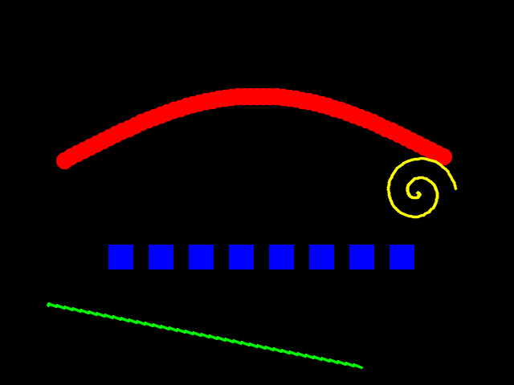

# Taller Pintura Interactiva Voz Gestos

**Integrantes:**
- Joan Sebastian Roberto Puerto
- Baruj Vladimir Ramírez Escalante
- Diego Alberto Romero Olmos
- Maicol Sebastian Olarte Ramirez
- Jorge Isaac Alandete Díaz

**Fecha de entrega:** 25 de abril de 2026

---

## Descripción breve

Este taller crea una **obra artística digital interactiva** controlada sin mouse ni teclado, usando el cuerpo como interfaz.

Se integran dos fuentes de entrada natural:
1. **Gestos de la mano** detectados con **MediaPipe Hands** a través de la webcam: el dedo índice actúa como pincel sobre el lienzo; la palma abierta cambia la forma del trazo; el puño cierra la escritura.
2. **Comandos de voz** reconocidos con **speech_recognition** (Google Speech API): palabras como "rojo", "limpiar" o "guardar" cambian el color, borran el lienzo o exportan la obra como imagen PNG.

La visualización se realiza en tiempo real con **OpenCV**, mostrando las pinceladas superpuestas sobre el video de la cámara y un HUD con retroalimentación del estado actual.

---

## Implementaciones

### Python – Pintura interactiva con MediaPipe + speech_recognition

**Herramientas:** `mediapipe`, `opencv-python`, `SpeechRecognition`, `pyaudio`, `numpy`, `matplotlib`

**Archivo:** [`python/semana_7_9_pintura_interactiva_voz_gestos.ipynb`](python/semana_7_9_pintura_interactiva_voz_gestos.ipynb)

---

#### 1. Detección de manos con MediaPipe

Se usa `mediapipe.solutions.hands` con un máximo de una mano, confianza de detección del 70 % y de seguimiento del 60 %. Se extraen 21 landmarks por fotograma.

```python
hands = mp_hands.Hands(
    static_image_mode=False,
    max_num_hands=1,
    min_detection_confidence=0.7,
    min_tracking_confidence=0.6,
)
```

Para determinar qué dedos están extendidos se compara la coordenada Y de la punta (`TIP`) con el nudo intermedio (`PIP`):

```python
def contar_dedos_extendidos(landmarks, ancho, alto):
    extendidos = 0
    for tip_id, pip_id in zip(TIP_IDS, PIP_IDS):
        tip_y = landmarks[tip_id].y * alto
        pip_y = landmarks[pip_id].y * alto
        if tip_y < pip_y:   # tip más arriba → extendido
            extendidos += 1
    return extendidos
```

| Dedos extendidos | Gesto | Acción |
|---|---|---|
| 1 | Índice | Dibuja con el pincel activo |
| ≥ 4 | Palma abierta | Cambia a pincel cuadrado y dibuja |
| 0 | Puño | Pausa el dibujo |

---

#### 2. Reconocimiento de voz en hilo paralelo

El hilo productor escucha el micrófono continuamente con `speech_recognition.Recognizer.listen()` y deposita los comandos en una `queue.Queue` para que el hilo de video los consume sin bloqueos:

```python
def _hilo_voz():
    recognizer = sr.Recognizer()
    recognizer.pause_threshold = 0.6
    while _escucha_activa.is_set():
        with sr.Microphone() as fuente:
            recognizer.adjust_for_ambient_noise(fuente, duration=0.5)
            audio = recognizer.listen(fuente, timeout=5, phrase_time_limit=4)
        texto = recognizer.recognize_google(audio, language="es-ES")
        cmd = interpretar_texto(texto)
        if cmd:
            cola_voz.put(cmd)
```

El intérprete de texto usa un diccionario de palabras clave con búsqueda por subcadena para tolerar errores de transcripción:

```python
MAPA_COMANDOS = {
    "rojo":    ("COLOR",  "rojo"),
    "verde":   ("COLOR",  "verde"),
    "azul":    ("COLOR",  "azul"),
    "limpiar": ("ACCION", "limpiar"),
    "guardar": ("ACCION", "guardar"),
    "salir":   ("ACCION", "salir"),
    "cuadrado":("PINCEL", BRUSH_SQUARE),
    "grande":  ("TAMANIO", 20),
    # ... más entradas
}

def interpretar_texto(texto):
    t = texto.lower().strip()
    for palabra, accion in MAPA_COMANDOS.items():
        if palabra in t:
            return accion
    return None
```

---

#### 3. Lienzo digital con OpenCV

El lienzo es un array NumPy negro (`zeros`) de igual resolución que el fotograma de la cámara. Se superpone sobre el video con `cv2.addWeighted` usando una máscara binaria para conservar la transparencia del fondo:

```python
def componer_frame(frame, lienzo, alpha=0.75):
    mascara = cv2.cvtColor(lienzo, cv2.COLOR_BGR2GRAY)
    _, mascara = cv2.threshold(mascara, 1, 255, cv2.THRESH_BINARY)
    resultado = frame.copy()
    resultado[mascara > 0] = cv2.addWeighted(
        frame, 1 - alpha, lienzo, alpha, 0
    )[mascara > 0]
    return resultado
```

---

#### 4. Tres tipos de pincel (bonus – gestos)

La forma del trazo se controla por gesto o por voz:

```python
def dibujar_punto(lienzo, pos, color, grosor, tipo_pincel, pos_anterior=None):
    x, y = pos
    if tipo_pincel == BRUSH_CIRCLE:
        cv2.circle(lienzo, (x, y), grosor, color, -1, cv2.LINE_AA)
    elif tipo_pincel == BRUSH_SQUARE:
        half = grosor
        cv2.rectangle(lienzo, (x-half, y-half), (x+half, y+half), color, -1)
    elif tipo_pincel == BRUSH_LINE:
        if pos_anterior:
            cv2.line(lienzo, pos_anterior, (x, y), color, max(2, grosor//3), cv2.LINE_AA)
```

| Pincel | Forma | Activación |
|---|---|---|
| `circle` | Círculo relleno | Por defecto |
| `square` | Cuadrado relleno | Palma abierta o voz "cuadrado" |
| `line` | Trazo fino continuo | Voz "línea" |

---

#### 5. HUD con retroalimentación visual (bonus)

Se superpone sobre el frame compuesto un panel semitransparente con:
- Muestra del color activo (rectángulo de color).
- Nombre del color, tipo y tamaño del pincel.
- Último comando de voz reconocido (desaparece gradualmente tras 2 s).
- Mini-paleta de los 8 colores disponibles.
- Instrucciones rápidas de gestos.

```python
cv2.putText(frame, f"[VOZ] {est['feedback']}",
            (10, h - 15), FONT, 0.8, (0, 255, 100), 2, cv2.LINE_AA)
```

---

#### 6. Guardar la obra como imagen PNG

```python
def guardar_obra(lienzo, frame, carpeta):
    ts = time.strftime("%Y%m%d_%H%M%S")
    cv2.imwrite(str(carpeta / f"obra_{ts}_lienzo.png"),      lienzo)
    cv2.imwrite(str(carpeta / f"obra_{ts}_composicion.png"), componer_frame(frame, lienzo))
```

Los archivos se guardan en `media/` con marca de tiempo para evitar sobreescrituras.

---

#### 7. Prueba del intérprete de comandos (sin hardware)

La celda 8 del notebook prueba el intérprete de texto con frases ejemplo, sin necesitar micrófono ni cámara:

```
=== Prueba del intérprete de comandos ===
  'quiero el color rojo por favor'    → ('COLOR',  'rojo')
  'limpiar el lienzo ahora'           → ('ACCION', 'limpiar')
  'guardar obra'                      → ('ACCION', 'guardar')
  'azul brillante'                    → ('COLOR',  'azul')
  'pincel cuadrado'                   → ('PINCEL', 'square')
  'tamaño grande'                     → ('TAMANIO', 20)
  'salir de la aplicación'            → ('ACCION', 'salir')
  'ninguna coincidencia aquí'         → None
```

---

#### 8. Demostración del lienzo sin cámara (celda 9)

La celda 9 genera un lienzo de demostración con trazos sintéticos para mostrar los tres tipos de pincel y las distintas paletas de colores sin necesitar ningún hardware:

```python
demo_lienzo_sintetico()  # genera y muestra el lienzo + lo guarda en media/
```

---

## Resultados visuales

> Las capturas y GIFs se encuentran en la carpeta [`media/`](media/).

### 1. Lienzo de demostración (trazos sintéticos)

*Lienzo generado sin cámara mostrando los tres tipos de pincel: círculo (rojo), cuadrado (azul), línea (verde) y espiral (amarillo).*

### 2. Aplicación en ejecución – dibujo con dedo índice

*El dedo índice extendido detectado por MediaPipe controla la posición del pincel sobre el lienzo en tiempo real.*

### 3. Cambio de color por voz

*El HUD muestra `[VOZ] Color: azul` tras reconocer el comando de voz. La mini-paleta inferior resalta el color activo.*

### 4. Palma abierta – pincel cuadrado

*Con la palma abierta (≥ 4 dedos extendidos) el sistema cambia automáticamente al pincel cuadrado.*

---

## Código relevante

El código completo se encuentra en [`python/semana_7_9_pintura_interactiva_voz_gestos.ipynb`](python/semana_7_9_pintura_interactiva_voz_gestos.ipynb).

Los fragmentos más representativos se incluyen en la sección **Implementaciones** arriba.

---

## Prompts utilizados (IA generativa)

Durante el desarrollo se emplearon los siguientes prompts con GitHub Copilot:

1. *"Cómo usar mediapipe.solutions.hands para detectar cuántos dedos están extendidos comparando las coordenadas Y de TIP y PIP."*
2. *"Crea una función que dibuje en un lienzo OpenCV con tres modos: círculo relleno, cuadrado y línea continua entre fotogramas consecutivos."*
3. *"Genera un hilo de escucha de micrófono con speech_recognition que deposite los comandos interpretados en una queue.Queue sin bloquear el bucle principal de video."*
4. *"Cómo superponer un array NumPy de pinceladas sobre el fotograma de la cámara usando una máscara binaria con cv2.addWeighted."*
5. *"Diseña un HUD en OpenCV con panel semitransparente, mini-paleta de colores y texto de retroalimentación de voz que se desvanece gradualmente."*

---

## Aprendizajes y dificultades

### Aprendizajes
- **MediaPipe Hands** provee coordenadas normalizadas (0–1) que deben multiplicarse por el ancho/alto del frame para obtener píxeles; esto facilita la independencia de resolución.
- El patrón **productor-consumidor** con `queue.Queue` y el `threading.Event` `_escucha_activa` permite combinar el hilo de voz y el bucle de video sin condiciones de carrera.
- Usar una **máscara binaria** para la composición del lienzo en lugar de `addWeighted` global preserva correctamente el fondo de la cámara en las zonas no pintadas.
- El parámetro `pause_threshold` de `speech_recognition` controla cuánto silencio se espera al final de una frase; reducirlo a 0.6 s hace los comandos más responsivos.
- El espejo horizontal (`cv2.flip(frame, 1)`) mejora la experiencia porque el movimiento de la mano coincide con la dirección visual esperada.

### Dificultades encontradas
- **pyaudio en Linux** requiere `portaudio19-dev` instalado a nivel de sistema; sin él la instalación de pyaudio falla con un error críptico de compilación.
- La **latencia de Google Speech API** (~1-2 s) hace que los cambios de color no sean instantáneos; en entornos sin internet sería necesario un motor offline como Vosk.
- **MediaPipe** puede perder el seguimiento de la mano si se mueve muy rápido o sale del cuadro, generando saltos en el trazo; se resolvió reiniciando `pos_anterior` a `None` cuando no hay landmarks.
- La superposición del HUD sobre el lienzo composicionado requirió dos pasos (`componer_frame` primero, luego `dibujar_hud`) para que el texto no quedara oculto por las pinceladas.
- Gestionar correctamente el cierre del hilo de voz al salir (`_escucha_activa.clear()` + `join` con `timeout`) evita que el proceso quede colgado esperando audio.

### Mejoras futuras
- Integrar **Vosk** o **Whisper** (offline) para eliminar la dependencia de internet y reducir la latencia.
- Añadir soporte **multi-mano** (una mano pinta, la otra controla acciones).
- Implementar un **modo de selección** de color directamente con la mano apuntando a la mini-paleta en pantalla.
- Exportar la obra como **GIF animado** que muestre el proceso de creación cuadro a cuadro.
- Agregar **efectos de partículas** al pincel (dispersión aleatoria) controlados por gestos de velocidad.

---

## Checklist de entrega

- [x] Carpeta con formato `semana_7_9_pintura_interactiva_voz_gestos`
- [x] Subcarpeta `python/` con el notebook
- [x] Subcarpeta `media/` con imágenes de resultado
- [x] `README.md` completo con todos los apartados requeridos
- [x] Commits descriptivos en inglés
