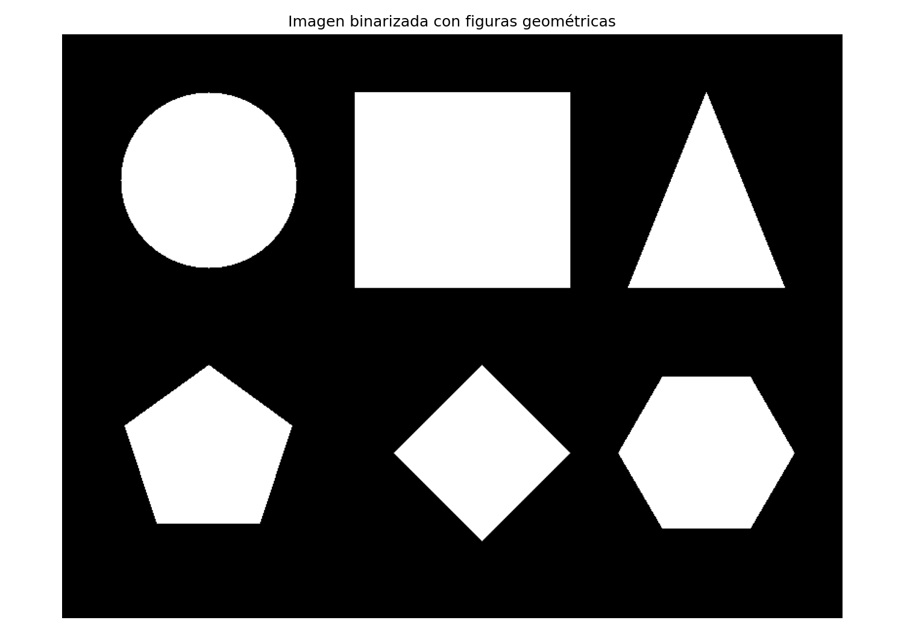
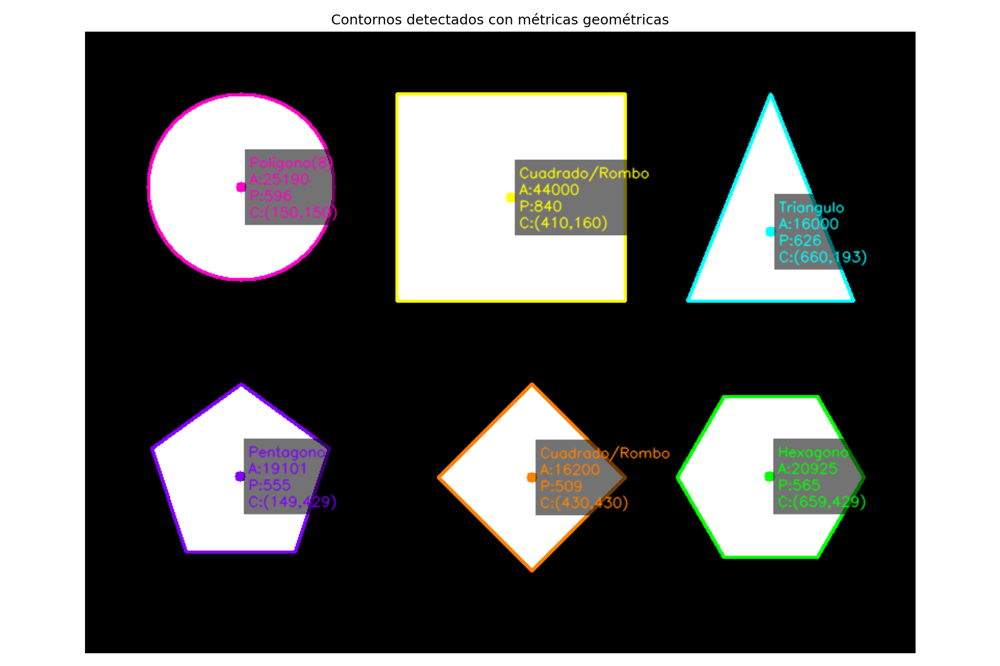
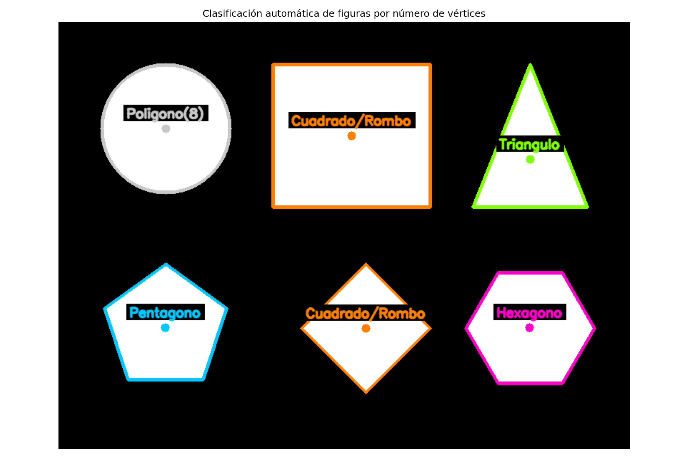
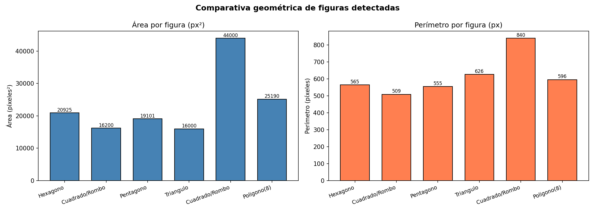

# Taller Analisis Figuras Geometricas

**Nombre del estudiante:** 
- Joan Sebastian Roberto Puerto  
- Baruj Vladimir Ramírez Escalante  
- Diego Alberto Romero Olmos  
- Maicol Sebastian Olarte Ramirez  
- Jorge Isaac Alandete Díaz  
  
**Fecha de entrega:** 11 de mayo de 2026  

---

## Descripción breve

Este taller tiene como objetivo detectar formas simples (círculos, cuadrados, triángulos, pentágonos, rombos y hexágonos) en imágenes binarizadas y calcular sus propiedades geométricas: **área**, **perímetro** y **centroide**. Adicionalmente, se implementa la clasificación automática de figuras mediante aproximación poligonal con `cv2.approxPolyDP()`.

---

## Implementaciones

### Python — OpenCV + NumPy + Matplotlib

**Herramientas:** `opencv-python`, `numpy`, `matplotlib`  
**Entorno:** conda `visual_computing` | Jupyter Notebook

El notebook `analisis_figuras_geometricas.ipynb` cubre las siguientes etapas:

| Paso | Descripción |
|------|-------------|
| 1 | Importar librerías y configurar directorio de salida |
| 2 | Generar imagen sintética binarizada con 6 figuras geométricas |
| 3 | Detectar contornos con `cv2.findContours()` (RETR_EXTERNAL) |
| 4 | Calcular área (`cv2.contourArea`), perímetro (`cv2.arcLength`) y centroide (`cv2.moments`) |
| 5 | Dibujar contornos y etiquetar cada figura con sus métricas |
| 6 | **Bonus:** Clasificar figuras automáticamente por número de vértices (`cv2.approxPolyDP`) |
| 7 | Comparativa visual con gráfica de barras (área y perímetro) |

---

## Resultados visuales

### 1. Imagen binarizada con figuras geométricas



> Imagen en escala de grises con 6 figuras rellenas: círculo, cuadrado, triángulo, pentágono, rombo y hexágono.

---

### 2. Contornos detectados con métricas geométricas



> Cada contorno está dibujado en color diferente. Se muestran etiquetas con: nombre de la figura, área (px²), perímetro (px) y coordenadas del centroide.

---

### 3. Clasificación automática de figuras



> Clasificación por número de vértices: Triángulo (3), Cuadrado/Rombo (4), Pentágono (5), Hexágono (6), Círculo (≥8).

---

### 4. Comparativa geométrica — área y perímetro



> Gráfica de barras comparando el área (px²) y el perímetro (px) de cada figura detectada.

---

## Código relevante

### Detección de contornos

```python
contours, hierarchy = cv2.findContours(
    binary_img, cv2.RETR_EXTERNAL, cv2.CHAIN_APPROX_SIMPLE
)
```

### Cálculo de propiedades geométricas

```python
def compute_properties(contour):
    area = cv2.contourArea(contour)
    perimeter = cv2.arcLength(contour, True)
    M = cv2.moments(contour)
    cx = int(M['m10'] / M['m00']) if M['m00'] != 0 else 0
    cy = int(M['m01'] / M['m00']) if M['m00'] != 0 else 0
    return {'area': area, 'perimeter': perimeter, 'centroid': (cx, cy)}
```

### Clasificación automática de figuras (Bonus)

```python
def classify_shape(contour):
    epsilon = 0.04 * cv2.arcLength(contour, True)
    approx = cv2.approxPolyDP(contour, epsilon, True)
    v = len(approx)
    labels = {3: 'Triangulo', 4: 'Cuadrado/Rombo', 5: 'Pentagono', 6: 'Hexagono'}
    return labels.get(v, 'Circulo' if v >= 8 else f'Poligono({v})')
```

---

## Prompts utilizados

Se utilizó IA generativa (GitHub Copilot) para:
- Generar la estructura base del notebook con las secciones requeridas.
- Depurar el umbral de clasificación de círculos en `cv2.approxPolyDP` (`v >= 8`).
- Diseñar la visualización con etiquetas superpuestas y fondo semitransparente.

---

## Aprendizajes y dificultades

**Aprendizajes:**
- `cv2.findContours` con `RETR_EXTERNAL` devuelve únicamente los contornos externos, lo que es ideal para figuras no anidadas.
- El centroide se obtiene de los momentos de imagen: $c_x = M_{10}/M_{00}$, $c_y = M_{01}/M_{00}$.
- `cv2.approxPolyDP` reduce el número de vértices de un contorno usando el algoritmo Ramer-Douglas-Peucker; el parámetro `epsilon` controla la precisión de la aproximación.
- Para círculos, la cantidad de vértices devuelta depende del radio: radios mayores producen más vértices. Usar `v >= 8` en lugar de `v > 8` permite clasificar correctamente.

**Dificultades:**
- Determinar el valor correcto de `epsilon` para que `approxPolyDP` clasifique bien todas las figuras sin confundir, p.ej., un cuadrado con un rombo.
- Gestionar posicionamiento de etiquetas para que no se solapen cuando las figuras están cercanas.

---

## Estructura del repositorio

```
semana_9_1_analisis_figuras_geometricas/
├── python/
│   └── analisis_figuras_geometricas.ipynb
├── media/
│   ├── 01_imagen_binarizada.png
│   ├── 02_contornos_con_metricas.png
│   ├── 03_clasificacion_figuras.png
│   └── 04_comparativa_geometrica.png
└── README.md
```
